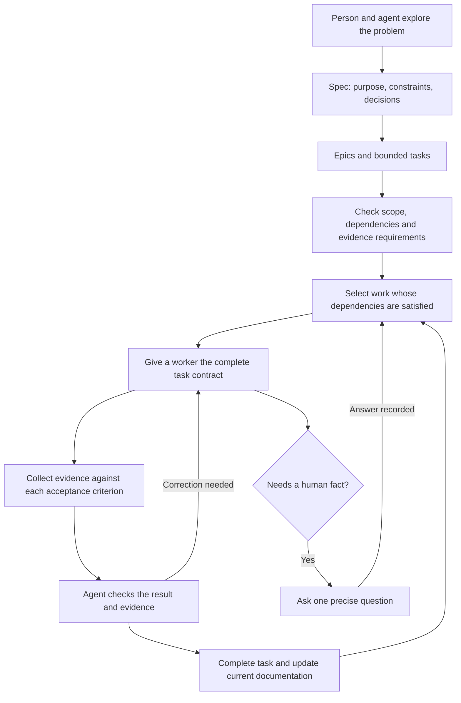

# From product intent to proven work

Tusker helps a person turn a clear product decision into work that agents can
finish and prove. The person spends time with customers, chooses tradeoffs,
and resolves decisions. They should not need to read every code change or
operate a scheduler by hand.

This page captures the product direction requested on 5 September 2026.
It is the intended behavior, not a claim that every part works today.

## The flow

An interactive session does the work requested by its user. Unattended
execution belongs to an independently running, enabled daemon. Planning
does not start workers.

## What Tusker owns

Tusker owns contracts, discovery, dependencies, execution records, and proof.
Grilling, Wayfinder, and domain modeling skills own the conversation that
produces the spec. Tusker accepts their result; it does not need another
chat framework.

The core workflow must work through the CLI before the Mac interface is
redesigned. The interface displays and operates the same records and rules.

Task execution follows [[runner-execution-boundary]]: a reusable installed-harness
module, explicit policy admission, shared onboarding/conformance checks, and separate
execution and verified task outcomes. FLW-T-0030 owns this planned capability; its
spec defines the release evidence and unsupported-provider behavior.

## Start with product constraints

Every substantial spec begins with the problem, who has it, the outcome,
why it matters, and the constraints. Describe the experience before naming
implementation technology.

| Constraint | What to record | Why it changes the design |
| --- | --- | --- |
| Cost | Expected usage and affordable cost per operation or customer | A free tier may need cheaper storage or deferred processing. |
| Latency | How long the user can wait; whether work is asynchronous | Background work may tolerate seconds instead of milliseconds. |
| Scale | Data volume, concurrency, growth assumptions | Size the first implementation for a stated workload. |
| Reliability | Acceptable loss, retry behavior, recovery needs | Determines durability and idempotence requirements. |
| Access | Who may read, change, or approve which data | Defines trust boundaries and credential needs. |
| Delivery | Available hardware, disk, providers, existing systems | Prevents an architecture that cannot run on the actual setup. |

For example, a free asynchronous lead-generation feature might exchange
longer response time for lower storage cost. This is an example of a
decision process, not a Tusker requirement to use object storage.

Record a decision with the constraint that caused it, alternatives considered,
and the condition that would justify revisiting it. Unknown facts stay explicit.

## Read in layers

1. Everyone: what this is, why it exists, what success looks like, and a diagram.
2. Product and domain readers: terminology, behavior, constraints, and decisions.
3. Builders: interfaces, state changes, ownership, failure cases, and exact checks.

Use ordinary language and Markdown links or Obsidian links. A diagram should
explain a relationship; it should not merely list every file.

Documents expose short discovery metadata: title, subject or summary, when to
read, and when to skip. Aim for roughly 40–50 tokens of routing information per
document, not compressed prose that requires repeated guessing. A folder-level
listing should return those facts and paths without requiring every document
body. Current documentation gets updated in place; task history stays separate.

## Turn the spec into work

An epic groups related outcomes. A task owns one finishable change. Neither
needs a fixed ceremony or a sprint calendar. A wave groups authorized work;
dependencies determine which tasks can run now.

Each task must carry:

- Its outcome and governing spec or decision links.
- Relevant constraints and explicit non-goals.
- Owned paths and any shared resource, generated output, or migration conflict.
- Acceptance criteria with stable identifiers and exact verification methods.
- The expected human-readable artifact and which criteria it proves.
- Dependencies, selected execution profile when needed, and current next action.

Worker and reviewer packets preserve the full task contract, including late
acceptance rows, non-goals, artifact requirements, and command formatting.
Progressive disclosure may summarize discovery information; it must not
silently remove instructions needed to complete the assigned work.

## Run independent work together

Schedule tasks whose required dependencies are satisfied. When one completes,
reevaluate its dependents. A failed or blocked task does not block an unrelated
branch of work. Report the actual blocker and the action that would clear it.

Prefer a shared checkout when ownership is independent. Serialize conflicting
writes and shared Git operations. Use a worktree when isolation is necessary,
with an explicit disk and concurrency budget. A worktree does not require a
separate copy of every build cache. Do not trade data integrity for speed.

The handoff works across providers. Use an available ACP adapter for structured
events and a command-line adapter where ACP is unavailable. The task contract,
proof requirements, and lifecycle do not change with the provider. Missing
telemetry is reported as unavailable; a final response is not invented progress.

## Make completion easy to inspect

| Change | Minimum useful evidence |
| --- | --- |
| Visual change | Before and after screenshots of the same state; after only for a new feature. Include the exercised flow and relevant accessibility checks. |
| Behavior or API | An observable scenario, expected result, and a runnable check including meaningful failure behavior. |
| Database migration | Representative data, migration result, preservation checks, and rollback or recovery behavior where required. |
| Performance | Before and after values, units, workload, environment, and the same measurement method. |
| Documentation | The changed explanation, valid discovery and links, and the source or behavior checked. |

Video is useful when a screenshot cannot show the interaction. Browser
automation and recording tools can supply evidence without becoming a mandatory
dependency for every task. One meaningful check may cover several criteria.

An artifact must exist, match the claimed type, and cover the relevant outcome.
A path, successful process exit, or model claim alone is insufficient. Preserve
durable evidence before temporary scratch is removed.

Independent agent review is the normal review path. A human can quickly inspect
the outcome and evidence; routine code approval is not a compulsory human gate.

## Ask a person only for what a person must supply

A human gate records missing intent, an external credential, spending authority,
or another decision the agent cannot make. State the question, affected task,
and what will unblock it. Do not label routine tests or agent-capable review as
human work.

A clear verbal answer can resolve the gate through the acting assistant. Record
who answered and what they authorized. Do not require the person to type CLI
commands, and do not let an agent manufacture a human answer.

## Acceptance for the core workflow

- A product constraint and decision survive spec → task → worker → reviewer.
- The CLI refuses incomplete contracts and reports the exact missing facts.
- Independent tasks can proceed while a sibling waits; conflicts stay serialized.
- The same task can be handed to different supported providers without losing scope.
- Completion shows evidence for each criterion, including the required artifact.
- A human answer unblocks the named decision without waiving unrelated checks.
- A document can be found from concise metadata and read without stale competing copies.
- A representative temporary-project test exercises the whole flow, including a
  failed check, correction, and dependency release. Live provider and visual
  acceptance remain separate from offline tests.

## Execution decisions from 6 September 2026

This section extends the draft contract. It does not claim implementation or
authorize dispatch. Reconcile it with the existing trust-and-efficiency delivery
tasks before importing additional work; do not create duplicate tasks.

### Acceptance methods, not separate task types

Keep one task contract. Each acceptance row identifies its outcome, evaluation
method, required evidence and evaluator. A task may combine methods:

- **Executable check:** a declared command and assertions establish the result.
  The execution system records the real exit status, tested source identity,
  environment/profile and required artifacts. A worker-written `pass` alone
  cannot satisfy an execution requirement. A zero-test run is not test proof.
- **Judgment review:** an independent reviewer evaluates a specific outcome
  against a rubric and the bound implementation/evidence. The result identifies
  the acceptance rows it addresses and explains failures or uncertainty.
- **Human decision:** use the existing human gate for unresolved intent,
  authority or subjective acceptance that requires the person. Do not turn
  routine checks into human gates.

These are evaluation methods, not replacements for existing evidence categories
such as performance or visual. Reuse current acceptance, proof and review records
where possible; avoid parallel completion state machines. Code review checks the
implementation; acceptance review checks the promised outcome. One review may
cover both when its explicit scope does so, without mandatory duplicate reviews.

Fixing a bug requires its behavioral regression check, not merely compilation.
Missing data or an unavailable evaluator remains unsatisfied. Changes to relevant
source, criteria or artifacts invalidate affected results. Preserve valid results
on unchanged inputs rather than rerunning every check.

### Task-local discovery

Capture decisions and draft tasks during the planning conversation. Before wave
authorization, reconcile dependencies, acceptance, ownership and unresolved
decisions against the final spec. Drafting does not make a task runnable.

Use existing document search and read/skip metadata for a bounded shortlist.
The packet preserves the complete assigned contract and links exact governing
sections. It supplies known entry files, symbols, relevant callers and existing
helpers so each worker need not rediscover the subsystem. Those code pointers
are navigation hints: validate them against the current source before editing.

Start with declared paths and existing text/structural search. Assess the existing
code-index tooling before adding an index. Introduce an incremental symbol index
only if a measured cold-start task cannot meet its discovery budget otherwise;
stale/missing index data must fall back to source search, never omit relevant code.
Record discovery calls and context separately from implementation work.

### Provider-neutral execution profiles

Tasks select a capability class rather than a permanent provider/model name:
routine, implementation, or advanced. These are routing intentions, not assertions
that a named model is competent. Resolve classes through existing runner profiles
before wave authorization, recording the actual harness, provider, model, effort,
permissions and allowed fallback. Preserve provenance if a later attempt changes
profile; never silently switch to a more expensive model.

Resolve implementation and review independently. Prefer an independent provider
when configured, with a separate reviewer context and attempt in all cases.
Different providers do not establish correctness. If only one provider is
available, an explicitly permitted same-provider reviewer is valid. Identify the
actual model provider rather than assuming the CLI/harness name is the provider.

ACP is used where a compatible adapter exists. A CLI without ACP needs a supported
command adapter with truthful process, cancellation, result and usage behavior;
ACP support does not make arbitrary CLIs interchangeable automatically.

### Default model roles and cost boundary

The task contract selects a named role; project policy resolves that role to an
installed runner and records the actual result. The initial default routing is:

| Role | Default profile | Current model intent |
| --- | --- | --- |
| Fast, bounded scripts and log triage | `execute-fast` | Luna, low effort |
| Normal implementation and repair | `execute-standard` | Terra, medium effort |
| Complex implementation and review | `execute-complex` / `repair-complex` | Terra, high effort |
| Planning and genuinely frontier work | `planner` / `execute-frontier` | Sol, medium or xhigh only where explicitly authorized |

Muse, Claude Code, Codex and future runners are transport choices, not roles.
An unavailable or unauthenticated runner fails visibly; policy never silently
falls back to a more expensive model. Every task attempt records profile,
harness, actual provider/model, effort and permission preset. The UI must show
the resolved choice before wave execution, but it may not claim profile editing
until that setting persists through the service API. Configuration is currently
project-local in `.tusker/config.yaml`; the future central store must preserve
the same named-role contract rather than hard-coding model names into tasks.

### Mechanical wave advancement and bounded exceptions

The daemon schedules eligible tasks, observes processes, validates required
results and unlocks dependents without coordinator-model calls for ordinary state
transitions. Worker completion is a submission; the accepted result and current
policy determine closure. Keep implementation, review and retry inference costs
visible rather than counting them as free orchestration.

A wave declares whether completion advances to an already authorized next wave,
requires model outcome review, or requires a human decision. Automatic advancement
does not authorize new scope, waive checks or spend through an unapproved profile.
Do not require an extra model review solely because a wave exists.

Retries and escalation are bounded. An unresolved failure produces a compact
exception packet with the attempted changes, failed criteria, evidence and next
decision; it does not wake a premium coordinator for unchanged status. Measure
cost per accepted task including failed attempts and reviews, separating cached,
uncached and output usage. Missing provider usage stays unavailable, not zero.

### Pilot acceptance

The first dogfood milestone is manually initiated, wave-scoped execution. The
person starts one reviewed wave from the existing UI; the enabled resident
runtime executes that wave's eligible tasks. Completion never automatically
starts another wave in this first release. Do not confuse manual initiation
with manually supervising each child process. Keep ACP and direct CLI adapters.

The initial operator view must expose task/run identity, chosen runner, actual
state, last meaningful event and accessible redacted logs. Distinguish queued,
running, awaiting verification/review, succeeded, failed, cancelled and unknown
or stale observations. Refresh is acceptable initially; reuse the existing event
stream where wired. Do not invent percentage completion or require model-written
progress messages. Process exit alone is not task acceptance.

The first UI simplification follows the operator's job rather than the internal
record taxonomy: choose a project, choose/start a wave, inspect its tasks and
results. Keep project-level Work, Documents and Settings as the primary mental
model; task detail opens progress, logs and acceptance evidence in context.
Plans, attempts, executions, integration machinery and diagnostics remain
available as secondary details rather than competing navigation destinations.
Show the current outcome, next action and blocker first; collapse technical
identifiers and explanations. Never hide failures or remove actionable authority
checks merely to make a screen look simpler. Qualify the actual rendered path
with the person before claiming the UX is accepted.

Project identity and workspace identity must be distinct. A branch change or
linked worktree must not silently create another user-facing project. Preserve
workspace-specific execution and review identity. Inventory and reconcile any
existing duplicate registrations without deleting user work, task history or
independent projects based on names or remote URLs alone. Inspect current
registration/resolution behavior before choosing the smallest repair.

The project home is the authoritative planning location, not a code checkout.
The centralized-service decision below supersedes earlier proposals that made
a designated Git checkout the planning authority. See the
[project vocabulary](../../CONTEXT.md).

The shared-home policy is now main by default. Independent tasks and separately
started waves may edit that checkout concurrently only under disjoint ownership;
shared files and Git mutations serialize. Prefer serializing conflicts before
creating another workspace. Keep one persistent build location per host and avoid
per-task build caches. Integrated verification uses a frozen source boundary;
do not accept a result from a tree changing during the check. A checkpoint commit
provides a restore reference without another clone, but never authorizes discarding
subsequent user work. Isolated-workspace support remains an exception, not a
requirement to qualify the solo-user pilot.

Wave completion means accepted work is integrated into the designated shared
development branch with required integrated checks, not merely a worker report
or an unintegrated reviewed branch.

For the initial UI, several manually started waves may appear together by name,
each showing its running tasks and meaningful state. Wave detail should expose
dependency relationships using existing graph/rendering primitives, with concise
task titles and task-detail drill-down. Keep existing documentation viewing and
editing. A board/list/graph is a view of the same work, never another lifecycle.
Detailed log streams and percentage estimates are not prerequisites for this
navigation; accessible logs and honest task status remain required.

Documentation views identify the authoritative document revision they display.
Workers consume the governing revision bound to their task; local Markdown
packets are snapshots, not competing editable authorities. Code remains in Git.

Use the existing notification surface from the first live pilot. Notify on wave
completion, terminal failure or an actionable human blocker, with a link to the
affected task/run and an explicit next action. Deduplicate unchanged alerts and
show notification-delivery failure in the UI. Do not notify for every heartbeat
or transient retry. Defer live conversational intervention; retain cancellation
and existing human-gate answer/resume flows where already supported.

Qualify incrementally, targeting a first RZN workflow in one to two days rather
than promising a date before validating the installed runner:

1. **Current-state reconciliation:** map existing tasks to actual source and
   current executable evidence. Classify implemented/verified, implemented but
   unverified, broken, or absent. Stale backlog is not evidence of missing code;
   old test reports are not current proof. Preserve IDs and close only proven work.
2. **One visible task:** manually start one task through an authorized wave using
   the installed selected CLI/provider. Observe its identity, logs, exit,
   verification and review. Exercise failure/cancellation and a human alert.
3. **One complete wave:** two independent tasks plus one dependent task demonstrate
   safe parallelism, failed-check repair, accepted-result dependency release and
   a terminal notification. The next wave remains stopped. Repeat the lifecycle
   contract with a supported ACP adapter; report unsupported capabilities honestly.
4. **RZN pilot:** run the bounded existing indexing patch/verification/benchmark
   workflow through the same installed surfaces and persistent build slots.
   Report correctness, timing and usage; do not require achieving 100 documents
   per minute to claim the scheduler pilot works, or confuse a working scheduler
   with meeting RZN's separate performance goal.

Every milestone must produce an inspectable result before expanding scope. No
new dashboard, knowledge index or multi-provider platform is a prerequisite for
the first visible task. Reuse existing delivery, execution and notification UI.

Use the existing full-journey and fresh-agent work to prove one small branching
wave: independent tasks run, a real check fails, correction passes, stale evidence
is rejected, required review completes and the dependent task becomes eligible.
Exercise automatic advancement and a configured review stop separately. Report
model invocations by purpose; routine scheduling and process observation require
zero coordinator-model invocations. Include a fresh worker that reaches its
assigned code/spec through shipped discovery interfaces without maintainer help.

## Immediate delivery override — local pilot first

The subsequent user decision defers the cloud migration below. Ship surgical
repairs to the existing local Markdown-backed workflow first: stable project
identity across branches/worktrees, one manually started task, then one manually
started branching wave with observable results and acceptance-based dependency
release. Target a first task on day one and a wave on day two, not a guaranteed
date. Do not make central storage, multi-machine scheduling or a new UI framework
prerequisites. Keep existing task/document structure and lifecycle rules.

For this pilot, one designated existing planning vault remains authoritative;
worktrees resolve that project rather than registering duplicate project nodes.
Task-bound document revisions and local snapshots must be distinguished from
the current planning view. The future centralized-document rules below apply
only when that migration is separately implemented and qualified.

Run bounded disjoint repair lanes, with one shared Go validation stream and no
overlapping writers. Reconcile stale task statuses against actual code/proof;
never bypass a real dependency or gate just to launch the pilot. Retain the
branching-wave acceptance test as the later migration's regression contract.

## Centralized service decision — deferred destination

Approved direction: retain Go and use one service-owned SQLite database on one
Hetzner VM for authoritative projects, Markdown document revisions, tasks, waves,
dependencies and execution state. This is a migration of the existing Tusker,
not permission to rebuild its scheduler or delete existing data. No D1 adapter,
peer-to-peer sync, CRDT, second planning Git repository or offline multi-writer
mode in the first release. Deployment and spending still require authorization.

The service owns planning and scheduling; machine-local workers own process
execution. Browsers and CLI clients use the service API. Workers connect outbound
over authenticated HTTPS, obtain bounded task packets and report results. They
never share or synchronize the SQLite file. Provider credentials stay on the
execution machine. Repository paths and build slots belong to workers, not global
project identity. Initially the operator assigns a wave to a worker; automatic
cross-machine placement is out of scope.

Reuse existing dependency, proof, review and resource-lease rules. Claiming must
be atomic. Duplicate submissions are idempotent; stale attempts cannot close
newer work. A disconnected worker becomes visibly unknown and blocks unsafe
reassignment of its owned resources until reconciled; lease expiry alone must
not authorize a second process to edit the same checkout. Cancellation records
both requested and confirmed state. Restart recovery must not silently redispatch
work whose process status is unknown.

Keep Markdown bodies, stable document identities and revision history centrally.
Provide explicit Markdown export and task-local snapshots for sandboxed agents
and reading in Obsidian. Local changes are submitted explicitly against an
expected revision; reject conflicting updates rather than silently overwriting.
Do not implement transparent bidirectional folder synchronization. Raw transcripts
and large evidence are files with durable references, not one database write per
token. Required artifacts must reach durable storage before accepting completion.

Running work retains its original contract. Record amendments separately and
reconcile them before acceptance; changed criteria invalidate affected proof.
Cancel immediately when continuing would be unsafe or the work is obsolete.
Preflight blocks dirty files overlapping wave ownership, not unrelated dirt.
Never automatically commit all files, reset a checkout or discard changes.

### Migration and qualification sequence

1. **Preserve and reconcile:** inventory documents/decisions and the selected RZN
   tasks; export originals with source paths and stable IDs. Report conflicting
   versions for selection. Do not infer that stale backlog is incomplete code.
2. **Central authority:** move current file-backed planning reads/writes behind
   the service while reusing lifecycle rules and SQLite runtime records. Import
   one project idempotently, preserve links and compare document contents/task
   dependencies. Keep originals read-only after explicit cutover. No dual writes.
3. **One remote worker:** extract the existing local process boundary behind a
   small claim/report/cancel protocol. Prove one real selected-provider task,
   failed check, cancellation, disconnect and service/worker restart behavior.
4. **One visible wave:** wire existing CLI/UI to the same API and run two
   independent tasks followed by a dependent task, with review, integration,
   notification and the next wave stopped. Preserve persistent build locations.
5. **Second machine and RZN:** verify the same lifecycle on the other host, then
   run the selected RZN workflow. No distributed merge train is required: use a
   designated integration checkout and serialize integration.

Before cloud access, require authenticated users/workers, project-scoped access,
credential redaction and revocation. Before cutover, run a database-and-artifact
backup/restore drill and test migration retry without duplicates. Retain original
exports; rollback after new writes requires reconciliation, not restoring an old
snapshot over newer work. Start with one private workspace and invited users;
public signup, billing and enterprise role systems are deferred.

This is the approved product/architecture boundary, not a completed implementation
contract. Next reconcile existing delivery tasks with these migration slices and
specify API/schema changes and runnable acceptance rows before authorization.
Update affected system runbooks as each slice lands; current system documentation
continues to describe the installed behavior until then.

## Delivery contracts

The current delivery plans hold the executable contracts. Stable source keys
identify work across tracker resets; task and wave IDs remain managed records.

- `complete-handoff` — [delivery plan](../../docs/delivery/spec-to-proof.yaml)
- `typed-evidence`, `workspace-failure`, and `document-discovery` —
  [hardening plan](../../docs/delivery/spec-to-proof-hardening.yaml)

## Read next

- [Current system behavior](../../docs/system/00-overview.md)
- [Task and proof rules](../../docs/system/tasks-and-proof.md)
- [Delivery and waves](../../docs/system/delivery-and-waves.md)
- [Orchestration](../../docs/system/orchestration.md)

<!-- tusker:delivery-import:e0397a6e6035736d:begin -->

## Work streams

- `[[FLW-T-0001]]` implements delivery source `complete-handoff`.

- `[[W-0002]]` is the imported delivery wave.

<!-- tusker:delivery-import:e0397a6e6035736d:end -->

<!-- tusker:delivery-import:86506cd70d5076d2:begin -->

- `[[FLW-T-0004]]` implements delivery source `document-discovery`.
- `[[FLW-T-0002]]` implements delivery source `typed-evidence`.
- `[[FLW-T-0003]]` implements delivery source `workspace-failure`.

- `[[W-0003]]` is the imported delivery wave.

<!-- tusker:delivery-import:86506cd70d5076d2:end -->
