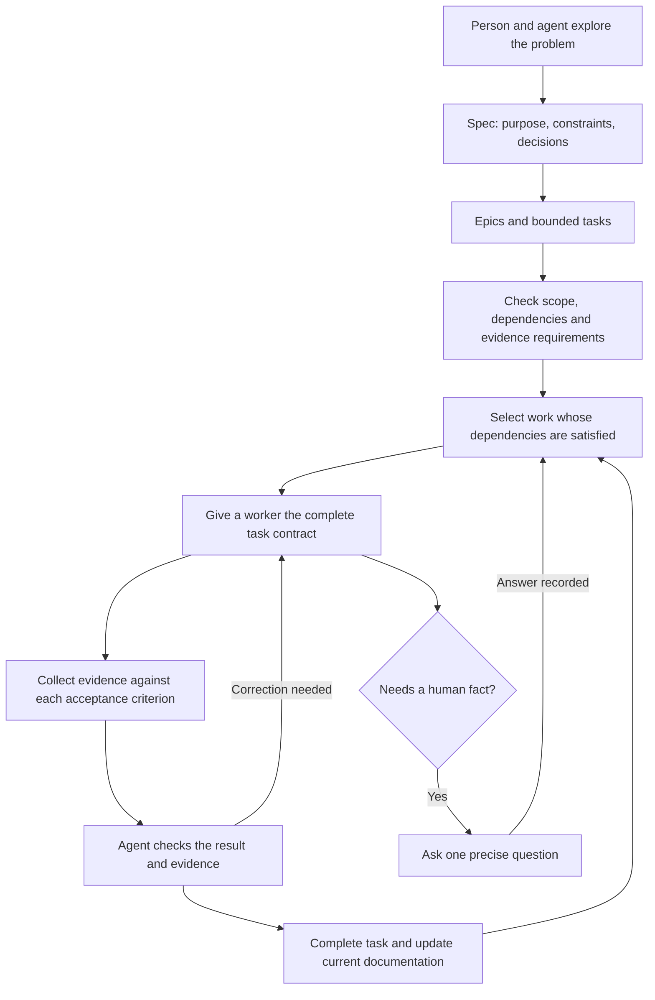

# From product intent to proven work

Tusker helps a person turn a clear product decision into work that agents can
finish and prove. The person spends time with customers, chooses tradeoffs,
and resolves decisions. They should not need to read every code change or
operate a scheduler by hand.

This page captures the product direction requested on 5 September 2026.
It is the intended behavior, not a claim that every part works today.

## The flow

An interactive session does the work requested by its user. Unattended
execution belongs to an independently running, enabled daemon. Planning
does not start workers.

## What Tusker owns

Tusker owns contracts, discovery, dependencies, execution records, and proof.
Grilling, Wayfinder, and domain modeling skills own the conversation that
produces the spec. Tusker accepts their result; it does not need another
chat framework.

The core workflow must work through the CLI before the Mac interface is
redesigned. The interface displays and operates the same records and rules.

## Start with product constraints

Every substantial spec begins with the problem, who has it, the outcome,
why it matters, and the constraints. Describe the experience before naming
implementation technology.

| Constraint | What to record | Why it changes the design |
| --- | --- | --- |
| Cost | Expected usage and affordable cost per operation or customer | A free tier may need cheaper storage or deferred processing. |
| Latency | How long the user can wait; whether work is asynchronous | Background work may tolerate seconds instead of milliseconds. |
| Scale | Data volume, concurrency, growth assumptions | Size the first implementation for a stated workload. |
| Reliability | Acceptable loss, retry behavior, recovery needs | Determines durability and idempotence requirements. |
| Access | Who may read, change, or approve which data | Defines trust boundaries and credential needs. |
| Delivery | Available hardware, disk, providers, existing systems | Prevents an architecture that cannot run on the actual setup. |

For example, a free asynchronous lead-generation feature might exchange
longer response time for lower storage cost. This is an example of a
decision process, not a Tusker requirement to use object storage.

Record a decision with the constraint that caused it, alternatives considered,
and the condition that would justify revisiting it. Unknown facts stay explicit.

## Read in layers

1. Everyone: what this is, why it exists, what success looks like, and a diagram.
2. Product and domain readers: terminology, behavior, constraints, and decisions.
3. Builders: interfaces, state changes, ownership, failure cases, and exact checks.

Use ordinary language and Markdown links or Obsidian links. A diagram should
explain a relationship; it should not merely list every file.

Documents expose short discovery metadata: title, subject or summary, when to
read, and when to skip. Aim for roughly 40–50 tokens of routing information per
document, not compressed prose that requires repeated guessing. A folder-level
listing should return those facts and paths without requiring every document
body. Current documentation gets updated in place; task history stays separate.

## Turn the spec into work

An epic groups related outcomes. A task owns one finishable change. Neither
needs a fixed ceremony or a sprint calendar. A wave groups authorized work;
dependencies determine which tasks can run now.

Each task must carry:

- Its outcome and governing spec or decision links.
- Relevant constraints and explicit non-goals.
- Owned paths and any shared resource, generated output, or migration conflict.
- Acceptance criteria with stable identifiers and exact verification methods.
- The expected human-readable artifact and which criteria it proves.
- Dependencies, selected execution profile when needed, and current next action.

Worker and reviewer packets preserve the full task contract, including late
acceptance rows, non-goals, artifact requirements, and command formatting.
Progressive disclosure may summarize discovery information; it must not
silently remove instructions needed to complete the assigned work.

## Run independent work together

Schedule tasks whose required dependencies are satisfied. When one completes,
reevaluate its dependents. A failed or blocked task does not block an unrelated
branch of work. Report the actual blocker and the action that would clear it.

Prefer a shared checkout when ownership is independent. Serialize conflicting
writes and shared Git operations. Use a worktree when isolation is necessary,
with an explicit disk and concurrency budget. A worktree does not require a
separate copy of every build cache. Do not trade data integrity for speed.

The handoff works across providers. Use an available ACP adapter for structured
events and a command-line adapter where ACP is unavailable. The task contract,
proof requirements, and lifecycle do not change with the provider. Missing
telemetry is reported as unavailable; a final response is not invented progress.

## Make completion easy to inspect

| Change | Minimum useful evidence |
| --- | --- |
| Visual change | Before and after screenshots of the same state; after only for a new feature. Include the exercised flow and relevant accessibility checks. |
| Behavior or API | An observable scenario, expected result, and a runnable check including meaningful failure behavior. |
| Database migration | Representative data, migration result, preservation checks, and rollback or recovery behavior where required. |
| Performance | Before and after values, units, workload, environment, and the same measurement method. |
| Documentation | The changed explanation, valid discovery and links, and the source or behavior checked. |

Video is useful when a screenshot cannot show the interaction. Browser
automation and recording tools can supply evidence without becoming a mandatory
dependency for every task. One meaningful check may cover several criteria.

An artifact must exist, match the claimed type, and cover the relevant outcome.
A path, successful process exit, or model claim alone is insufficient. Preserve
durable evidence before temporary scratch is removed.

Independent agent review is the normal review path. A human can quickly inspect
the outcome and evidence; routine code approval is not a compulsory human gate.

## Ask a person only for what a person must supply

A human gate records missing intent, an external credential, spending authority,
or another decision the agent cannot make. State the question, affected task,
and what will unblock it. Do not label routine tests or agent-capable review as
human work.

A clear verbal answer can resolve the gate through the acting assistant. Record
who answered and what they authorized. Do not require the person to type CLI
commands, and do not let an agent manufacture a human answer.

## Acceptance for the core workflow

- A product constraint and decision survive spec → task → worker → reviewer.
- The CLI refuses incomplete contracts and reports the exact missing facts.
- Independent tasks can proceed while a sibling waits; conflicts stay serialized.
- The same task can be handed to different supported providers without losing scope.
- Completion shows evidence for each criterion, including the required artifact.
- A human answer unblocks the named decision without waiving unrelated checks.
- A document can be found from concise metadata and read without stale competing copies.
- A representative temporary-project test exercises the whole flow, including a
  failed check, correction, and dependency release. Live provider and visual
  acceptance remain separate from offline tests.

## Delivery contracts

The current delivery plans hold the executable contracts. Stable source keys
identify work across tracker resets; task and wave IDs remain managed records.

- `complete-handoff` — [delivery plan](../../docs/delivery/spec-to-proof.yaml)
- `typed-evidence`, `workspace-failure`, and `document-discovery` —
  [hardening plan](../../docs/delivery/spec-to-proof-hardening.yaml)

## Read next

- [Current system behavior](../../docs/system/00-overview.md)
- [Task and proof rules](../../docs/system/tasks-and-proof.md)
- [Delivery and waves](../../docs/system/delivery-and-waves.md)
- [Orchestration](../../docs/system/orchestration.md)

<!-- tusker:delivery-import:e0397a6e6035736d:begin -->

## Work streams

- `[[FLW-T-0001]]` implements delivery source `complete-handoff`.

- `[[W-0002]]` is the imported delivery wave.

<!-- tusker:delivery-import:e0397a6e6035736d:end -->

<!-- tusker:delivery-import:86506cd70d5076d2:begin -->

- `[[FLW-T-0004]]` implements delivery source `document-discovery`.
- `[[FLW-T-0002]]` implements delivery source `typed-evidence`.
- `[[FLW-T-0003]]` implements delivery source `workspace-failure`.

- `[[W-0003]]` is the imported delivery wave.

<!-- tusker:delivery-import:86506cd70d5076d2:end -->
