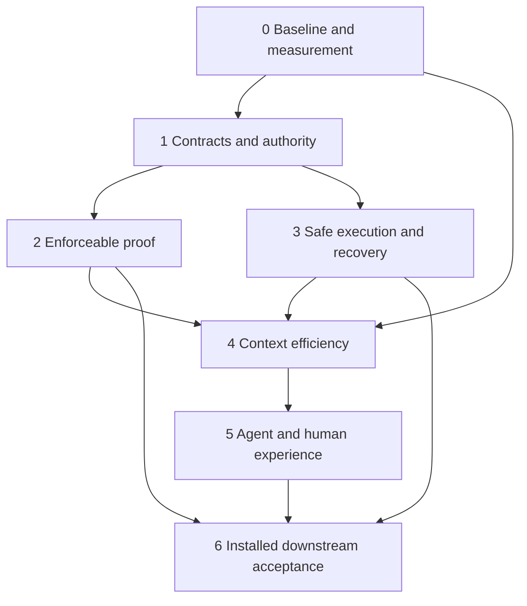

# Trustworthy Tusker with efficient agent workflows

The goal is a control plane we can trust to turn a clear product contract into safely executed, independently reviewed work, while keeping the human focused on decisions and the agent focused on implementation. Token efficiency is part of that goal: **minimize total context and retries per correctly completed job, subject to complete contracts and honest proof**.

This is an authored implementation plan, not a statement that these capabilities pass today. It builds on the [product contract](spec-to-proof.md) and [source-backed audit](../../docs/reports/spec-to-proof-audit.md), dated 5 September 2026. The audit's nine baseline failures and remaining installed/live acceptance gaps are release blockers until resolved. Existing baseline, immutable-delivery-context, and current-only work remain keyed by stable source keys and the current delivery plans below.

## Delivery rules

- Seven new delivery scopes are imported into FLW as backlog/held, disarmed work. Writing and importing plans never authorizes execution. Before starting a wave, review current source ownership, proof, integration base and context; use supported replan/rebase when material changed. Imported plans may be frozen and must not be hand-edited as a shortcut.
- Logical wave numbers express milestones. Hard task dependencies express actual prerequisites; they do not force every unrelated task to wait for a whole earlier wave. Initially cap each imported wave at one worker. After scheduling and ownership proof passes, raise concurrency only through an explicit reviewed plan change; shared-file/resource collisions still serialize across waves.
- Each task below has acceptance, bounded ownership, dependency and proof contracts in its linked delivery plan. Ownership paths are starting contracts, not permission to modify all matching files: resolve the actual production callers and current dirty owners before implementation, and replan when the repair belongs elsewhere. Shared test ownership in the baseline task requires coordination with the state task.
- Do not build a new orchestration engine, interview framework, evidence hierarchy, cache service or token-accounting platform. Reuse the existing CLI, DAG, records, capsules, adapters and doc graph. Conversation skills own elicitation; Tusker owns durable handoff and enforcement.
- Proof commands in these new plans are future verification contracts. Named new regression tests must actually exist and execute; a successful `go test -run` matching zero tests is failure. Each task also needs the scenario/artifact described below. No planning validation is implementation proof.
- Use one focused regression set per change, then broader integration at milestone exits. Keep exact command, revision, host, result and artifact identity; put noisy logs in scratch and promote durable proof before task close. Never hide baseline failures by skipping or weakening assertions.
- Human gates represent real missing authority, credentials, intent or subjective acceptance. Do not pre-create generic approval gates. No live spending, dispatch, installation or publication is performed by this planning work.

## One workflow across all surfaces

| Surface | Owns | Required behavior | Bureaucracy to remove |
| --- | --- | --- | --- |
| CLI | Commands and compact current state | Deterministic result/reason/next action; same invariant at preview and mutation | Guessing commands, repeated broad status reads, success-shaped refusals |
| Resident daemon | Authorized scheduling and reconciliation | Opt-in only; bounded retries; independent work progresses; quiet idle state | Prompting agents or humans while nothing actionable changed |
| Worker/process | Claimed execution, cancellation and recovery | Correct process/session identity, child cleanup, durable handoff, truthful usage | Orphan workers, duplicate execution, unnecessary cold restart |
| Skills and instructions | Conditional navigation and operating guidance | One source per rule, installed provenance, runnable examples, preserved user customization | Duplicated mechanics across root instructions, skills and task packets |
| Enforcement and lint | Trust boundaries and useful diagnostics | Hard-block unsafe/invalid actions; scoped warnings for advisory quality | Style gates, generic approvals, empty mandatory reports, unrelated warning debt blocking work |
| Documentation | Intent, constraints, decisions and durable knowledge | Compatible roots, backlinks, diagrams, supersession, evidence-based freshness | Full-tree reads, mechanically updated timestamps, docs changes with no changed knowledge |

The enforcement-lint task owns this rule boundary. A new blocking rule must name the concrete invalid action it prevents, its authoritative input and a negative test; otherwise it stays advisory or is removed. Routine work should record its outcome once and derive status, progress and closeout from that record.

## Milestones and dependencies

The diagram shows milestone convergence, not a global barrier scheduler. The task DAG below is authoritative for early independent work.

## Token and usability acceptance

These are proposed engineering targets, **not measured results**. Wave 0 freezes them against reproducible inputs; any revision is written down before optimization. Sizes refer to the declared tokenizer, or bytes when no tokenizer is available; bytes must never be presented as exact tokens.

| Measure | Candidate target | Guardrail |
| --- | --- | --- |
| Routine Tusker workflow context | At least 30% lower median context tokens than W0 | Same job, full contract, all retries and reads included; report each scenario and worst regression |
| Warm agent bootstrap | At most 1,200 tokens | Required task material accounted separately and retrieved before work |
| Routine next/status; capsule | At most 350; 500 tokens | Stable IDs, revision, blockers and useful next action retained |
| Document routing | Average at most 50 tokens/node; initial shortlist at most 800 | No full 100/1,000-document dump; all required reference documents found in curated cases |
| Extra tool calls and latency | No more than 10% p95 regression on comparable deterministic workloads | No fragmentation that shifts tokens into repeated calls; at least 20 samples for p95 claims |
| Contract/evidence correctness | Zero missing mandatory requirements or false closes | Safety outranks every size target |
| Downstream completion | All defined cold-start scenarios complete without maintainer coaching | Real gates are recorded as gates, not faked success |

Track cached input, uncached input, output, tools, turns, retries, duration and successful outcomes separately. Do not equate fixture packet reductions with provider-billed savings. Live provider usage is nullable; unreachable budget enforcement remains explicitly unavailable. Use deterministic CI fixtures for cheap regression gates and live trials at release checkpoints.

## Detailed task waves

### Wave 0: Establish a trustworthy baseline

**Exit:** Every known failure has a reproduced cause and disposition; state corruption is repaired; the token benchmark has an immutable baseline.

[Delivery contract](../../docs/delivery/trust-0-foundation.yaml).

#### baseline: Reconcile current work and repair the nine baseline failures

Depends on: state-integrity. Risk: high. Size: l.

- A1: Reproduce all nine failures named in the audit; classify obsolete assertions separately from production defects, with no weakened product invariant or silent skip. Assign production repairs to state-integrity or the relevant owned task before changing its files.
- A2: Inventory FLW-T-0002 through FLW-T-0005 and CFX-T-0001; retain their IDs and proof obligations. Confirm existing repairs with fresh focused proof and record the actual CFX contract before preflight work; do not create a second immutable-base implementation.
- A3: Produce a command/host/revision/PASS-FAIL matrix for the complete suite and focused cases; remaining failures have an explicit blocking owner. Shared dirty changes remain intact.

**Proof:** Existing nine named regressions from the audit, then the complete Go suite through scripts/with-validation-lock.sh; record executed tests, not only exit status.

**Token impact:** Separates flaky/redundant validation from required checks; baseline commands are reused at wave exits.

#### state-integrity: Make state revisions, reconciliation and snapshot invalidation reliable

Depends on: none; can begin with measurement/triage. Risk: high. Size: l.

- A1: Stale body edits fail compare-and-swap; successful mutations recompute revisions under lock and publish exactly the state actually saved.
- A2: Targeted reconciliation changes only the selected record; dry-run reports stale terminal records without writes; stale attempts repair once; identical refresh emits no event and changed snapshots do.
- A3: Interrupted writes and competing mutations preserve the last committed state, fail visibly and recover idempotently; no unrelated task or user file is lost.

**Proof:** Reproduce the seven state/snapshot failures listed in the audit and add the smallest adversarial interleaving regression at the shared mutation boundary. Resolve actual source owner paths before editing.

**Token impact:** Prevents repeat reads, unnecessary refresh events and recovery loops.

#### token-baseline: Measure total downstream workflow context and token cost

Depends on: none; can begin with measurement/triage. Risk: low. Size: m.

- A1: Capture versioned fixtures for small/medium/large task contracts and 10/100/1000-document repositories, including a long contract, branching DAG, blocked gate, failed proof and resumed job.
- A2: Measure cold and warm bootstrap, discovery, next, packet, verification, review, recovery and completion: input/output bytes, declared tokenizer counts when available, tool calls, turns, elapsed time and repeated context. Store raw bounded transcripts or hashes plus reproducible extraction.
- A3: Report real provider usage separately as cached input, uncached input and output when supplied; absent usage remains unknown. Offline fixture size is never labelled billed cost. Use at least five identical-condition repetitions for latency medians and record variance.
- A4: Freeze the candidate budgets in this roadmap against the measured baseline before optimization. Document any necessary revision and rationale; do not lower a target merely to pass.

**Proof:** A deterministic stdlib measurement script with fixture self-checks and a versioned JSON/Markdown baseline; no external calls required for this task.

**Token impact:** This task supplies the denominator for every savings claim.

### Wave 1: Unify contracts, authority and command behavior

**Exit:** A valid contract survives every handoff; previews and writes agree; human authority cannot be forged; an unfamiliar agent has one completion route.

[Delivery contract](../../docs/delivery/trust-1-contracts.yaml).

#### preflight: Use consistent validity and readiness checks across entry points

Depends on: baseline, state-integrity. Risk: high. Size: m.

- A1: Creation, status-ready, next, dispatch and delivery preview/write agree on malformed contracts and frozen-plan refusals, with stable reason codes and a next action.
- A2: A complete dependent task remains valid while waiting on dependencies; contract validity is not conflated with readiness or wave authorization.
- A3: Race a preview against material edits and require mutation-time revalidation. Exercise current CFX immutable-base behavior without duplicating or weakening it.

**Proof:** Table-driven public CLI walkthrough for valid, malformed, dependency-blocked, frozen and changed-since-preview contracts; assert read-only commands write nothing.

**Token impact:** One compact actionable refusal replaces trial-and-error commands.

#### human-receipts: Accept conversational human decisions with verifiable authority

Depends on: state-integrity, preflight. Risk: high. Size: l.

- A1: Use one authority rule for every human-owned gate. An agent actor or arbitrary human: string cannot satisfy a human decision, including generic signoff gates.
- A2: Reuse a trusted interaction receipt mechanism if one exists; otherwise implement the smallest receipt producer and verifier bound to the specific gate, material revision, action and human answer, with replay protection and revocation/expiry rules documented.
- A3: Exercise an actual supported human interaction surface: a human answers yes once and the assistant records it without asking them to run CLI commands. Altered, stale, cross-task and replayed receipts fail. If no trusted producer is available, retain an explicit unsupported state and do not claim conversational approval shipped.

**Proof:** Forged/stale/replayed receipt negative tests plus one end-to-end trusted-producer interaction; capture a redacted receipt and visible gate result.

**Token impact:** Settled decisions are reused at their exact scope; genuine new material still requires a new answer.

#### handoff: Preserve the complete contract and exact execution identity

Depends on: baseline. Risk: medium. Size: m.

- A1: Verify the existing FLW-T-0002 repair across agent, reviewer, work-session, daemon and integrator consumers with long acceptance lists, indentation, non-goals and artifact obligations.
- A2: Keep stable task context separate from attempt identity; every execution handoff identifies task revision, runner, model when known, workspace, branch/base, attempt and resume capability without fabricating unsupported fields.
- A3: No normative material is truncated to hit a budget. Oversized contracts use explicit complete retrieval before execution, with revision binding and a visible incomplete state until retrieved.

**Proof:** Public packet and adapter fixtures compare canonical mandatory content at every consumer; include a contract exceeding current historical truncation limits.

**Token impact:** Deduplicate wrapper content only after contract completeness assertions pass.

#### cli-guide: Ship one accurate low-friction agent completion workflow

Depends on: preflight, handoff. Risk: medium. Size: m.

- A1: Capabilities, help and installed skill examples agree on verified syntax, executor-recorded proof, imported-plan amendment limits and real human boundaries.
- A2: A fresh agent can create/import, inspect, implement, run verification, submit review and close using shipped guidance alone; every deliberate refusal supplies the next useful command.
- A3: Replace brittle obsolete wording/word-count expectations with checks for runnable examples and mandatory guidance plus measured size budgets; preserve progressive disclosure and interactive no-dispatch rules.

**Proof:** Execute documented examples against a temporary vault, including executor-only verification, frozen import and a missing gate; rerun skill contract/convergence checks.

**Token impact:** Read one route once; avoid dumping every skill reference or capabilities payload each turn.

#### enforcement-lint: Enforce real boundaries without becoming a bureaucratic middleman

Depends on: preflight, cli-guide. Risk: high. Size: m.

- A1: Publish one rule inventory with owner, rationale, severity and enforcement point. Hard failures are limited to malformed execution contracts, invalid authority, unsafe ownership/state and unmet explicit completion requirements; prose style and advisory quality suggestions remain warnings.
- A2: CLI, daemon, process handoff and closeout call the same applicable checks. A worker cannot bypass a hard invariant by choosing another entry point, and read-only discovery is not blocked by unrelated warning debt.
- A3: Lint supports scoped deterministic findings, stable codes, source locations and a repair action. Repeated unchanged warnings are summarized once; no blanket full-repo lint, report, approval or documentation ceremony is required for a routine low-risk change.
- A4: Compare routine success and failure journeys before/after: no duplicated state reporting, no mandatory empty fields or speculative gates, no extra human intervention, and no safety regression. Provide a documented narrow exception only for advisory rules; never a universal bypass for authority or data safety.

**Proof:** Cross-entry-point invariant tests plus a tiny valid change with existing unrelated warning debt; count mandatory commands and human interventions.

**Token impact:** Lint saves troubleshooting turns and remains scoped; metadata and warnings do not become repetitive prompt payloads.

### Wave 2: Make completion claims enforceable

**Exit:** Completion requires current, criterion-covered artifacts and an independent review; wrong, missing or stale proof cannot close a task.

[Delivery contract](../../docs/delivery/trust-2-proof.yaml).

#### artifact-contract: Bind proof to the promised artifact and current task

Depends on: preflight, handoff. Risk: high. Size: m.

- A1: Enforce the existing artifact contract: required kind, acceptance coverage, path policy, readable durable artifact and applicable task/code revision. Unrelated artifact-bearing evidence cannot satisfy it.
- A2: Reject unknown proof requirement classes when authored with an actionable error; legacy handling is explicit and never quietly treated as passing.
- A3: Missing, replaced, stale, mismatched-type and out-of-scope artifacts fail completion; successful evidence survives scratch cleanup and records a hash or equivalent immutable identity.

**Proof:** Public close attempts with each invalid artifact and one valid artifact; preserve evidence ordering and CAS recovery invariants.

**Token impact:** Return missing criterion IDs and exact repair actions rather than replaying all evidence.

#### proof-categories: Define useful visual, performance, backend and migration proof

Depends on: artifact-contract. Risk: medium. Size: m.

- A1: Visual changes require comparable before/after views; new UI needs an after view plus stated absence of a baseline. Performance proof includes before/after workload, units, method, environment and revision.
- A2: Backend proof covers observable behavior and relevant negative cases; migration proof checks preservation, interruption and recovery/rollback expectations using realistic data.
- A3: Use existing artifact/evidence records with only fields needed to validate these requirements; automated checks establish structure and provenance, while subjective quality remains an explicit acceptance decision.

**Proof:** One passing and one materially misleading failing fixture for each category, including a benchmark whose workload changed and a migration losing data.

**Token impact:** Small typed summaries link to full evidence; avoid screenshot/log dumps in every agent context.

#### review-closeout: Require fresh independent review and readable completion receipts

Depends on: artifact-contract, human-receipts, proof-categories. Risk: high. Size: m.

- A1: A review is bound to the reviewed material and evidence; subsequent meaningful changes invalidate it, and the implementing attempt cannot masquerade as independent review.
- A2: A reviewer sees full relevant acceptance and proof without unrelated history; unresolved findings prevent close and rework clears the obsolete approval.
- A3: The final human receipt lists outcomes, exact checks, artifact links, remaining limitations and human gates; wave totals never relabel or inflate proof.

**Proof:** Implement-review-edit-close and reject-rework-review-close walkthroughs, plus rendered/readable completion receipt inspection.

**Token impact:** Review packets contain current relevant evidence once, with drilldown for logs.

### Wave 3: Prove scheduling, recovery and workspace safety

**Exit:** Offline adverse scenarios pass across supported adapters; leases prevent conflicting work; recovery neither loses work nor duplicates execution.

[Delivery contract](../../docs/delivery/trust-3-execution.yaml).

#### dag-leases: Execute only safe authorized DAG frontiers

Depends on: preflight, state-integrity. Risk: high. Size: l.

- A1: Independent ready branches can progress while a sibling waits or fails; dependent work cannot start early and nothing launches outside the armed scope.
- A2: Two workers racing for a task or shared capacity yield at most one valid claim; expired leases cannot commit results after reassignment.
- A3: Owned paths, generated outputs, migration keys and named resources constrain concurrency across waves; collisions serialize without globally serializing unrelated tasks.

**Proof:** Deterministic scheduler fixtures with a branching DAG, races, failure and lease expiry; assert actual starts and blocked reasons.

**Token impact:** A bounded frontier/next response replaces full graph reloads and polling loops.

#### workspace-recovery: Preserve work through crashes, caps and shared Git activity

Depends on: dag-leases, baseline. Risk: high. Size: l.

- A1: Reverify FLW-T-0004 and active-owner pruning fixes; failed Git setup never launches a worker and corrupt runtime state never authorizes deletion.
- A2: Crash/restart retains unlanded work, checkpoints and task ownership; cleanup requires established ownership and safe disposal. Test dirty, active, orphaned and missing workspaces.
- A3: Shared-checkout Git mutations serialize while disjoint source edits remain possible; worktree/disk caps account for active work and preserve reuse of existing build caches without inventing a new cache service.

**Proof:** Temporary real Git repositories, killed/restarted worker fixtures, cap pressure and conflicting Git operations; inspect preserved files and durable records.

**Token impact:** Reuse workspaces and resumable context safely; avoid full reimplementation after restart.

#### adapter-contract: Make ACP and CLI adapter capabilities and usage truthful

Depends on: handoff, state-integrity. Risk: high. Size: l.

- A1: For every supported installed adapter, publish and test actual start, stream, cancel, resume, permission and usage behavior; unsupported actions return explicit unsupported results.
- A2: Fake-provider fixtures cover disconnect, timeout, malformed output, cancellation and duplicate final events; attempt/session/model identity is preserved across supported resumes.
- A3: Turn caps, retries and token/cost policy have reachable behavior or are marked unavailable. Unknown usage never means zero; no capability flag is enabled merely because a field or helper exists.

**Proof:** Offline conformance table and fake adapters before any live calls; name the two real harnesses available for the release pilot without assuming missing credentials.

**Token impact:** Reliable usage telemetry and supported resume prevent false savings and repeated cold starts.

#### daemon-process: Make resident daemon and worker lifecycle observable and recoverable

Depends on: dag-leases, adapter-contract, enforcement-lint. Risk: high. Size: l.

- A1: Interactive commands never spawn a resident daemon or nested worker implicitly. Only enabled automation with a valid authorized claim dispatches; read-only plan, doctor and status remain inert.
- A2: Test start, stop, graceful shutdown, forced termination, restart and stale PID/process identity. Cancellation reaches owned child processes; unrelated processes survive; stopped work cannot later report success.
- A3: Recover durable attempts after restart without duplicate launches; use bounded retry/backoff and a terminal actionable failure. A failed task does not cause daemon-wide busy loops or starve independent work.
- A4: Expose one compact health/status view joining daemon identity, queue/frontier, active attempts, last meaningful failure and next action. Idle unchanged operation emits no repetitive agent prompts or human notifications; logs are bounded and on demand.

**Proof:** Process-level temporary-project test with real child process termination/restart and fake providers; assert process ownership, launch counts, durable outcomes and idle polling/event volume.

**Token impact:** Bound idle wakeups, retry context and log tails; no repeated full snapshots while nothing changed.

### Wave 4: Reduce context cost without losing meaning

**Exit:** Measured routine workflow overhead falls materially; cold, warm and recovery paths retain complete contracts and useful error handling.

[Delivery contract](../../docs/delivery/trust-4-efficiency.yaml).

#### compact-cli: Make routine CLI reads bounded and directly actionable

Depends on: token-baseline, cli-guide, dag-leases. Risk: medium. Size: m.

- A1: Reuse current capsule, next, proof-status and structured output before adding switches. Default agent reads contain stable IDs, revision, state/reason, next action and only relevant routing links.
- A2: Lists are bounded with explicit truncation and complete follow-up navigation; a single routine status call does not dump bodies, logs, whole waves or repeated global instructions.
- A3: Meet the frozen routine-output budgets against small and large fixtures; errors stay parseable and actionable with matching human-readable meaning.

**Proof:** Golden semantic field assertions plus measured output budgets; large-vault fixture proves bounded response and navigable remainder.

**Token impact:** Candidate ceilings: routine next/status <=350 tokens, capsule <=500 tokens; mandatory contract packets are excluded.

#### document-routing: Unify spec discovery and progressively disclose knowledge

Depends on: token-baseline, baseline. Risk: medium. Size: m.

- A1: Adopt one spec/decision resolver and compatible scaffolds across skills, docs commands and traceability; retain existing paths/aliases and do not silently bless arbitrary source files as governing specs.
- A2: For 100/1000 documents, return a small relevant shortlist with read/skip guidance and stable links; selected nodes reveal details on demand. Preserve constraints, decisions and supersession relations.
- A3: Verify FLW-T-0005 metadata search and measure routing relevance as well as size; the right mandatory spec/decision is found in all curated regression scenarios without listing the entire tree.

**Proof:** Mixed old/new-root fixture, renamed/superseded documents, broken links and measured 100/1000-document discovery journeys.

**Token impact:** Candidate routing metadata average <=50 tokens/document and initial shortlist <=800 tokens; full documents remain retrievable.

#### context-reuse: Avoid resending unchanged context across harness calls

Depends on: compact-cli, handoff, adapter-contract. Risk: medium. Size: m.

- A1: Identify repeated content in measured traces; first remove duplication and reuse existing packet/revision machinery. Add cache/delta logic only where those changes cannot meet the frozen workflow budget.
- A2: Reuse stable content only under task/spec/capability revision identity. Material edits, stale cursors, lost sessions and changed authority force a complete safe refresh; a fresh harness never receives an unexplained delta.
- A3: Use native prompt caching only for adapters that actually support it. Record cached versus uncached usage where available; maintain a full-content fallback and cap retrieval round trips.

**Proof:** Cold/warm/edited/restarted session equivalence checks on complete mandatory content, plus workflow token/tool-call comparisons.

**Token impact:** Candidate >=30% reduction in median routine Tusker context tokens versus W0; no higher tool-call count solely to hide context.

#### efficiency-gate: Enforce total workflow cost and completeness regression budgets

Depends on: compact-cli, document-routing, context-reuse, proof-categories, review-closeout. Risk: medium. Size: m.

- A1: Run the same baseline corpus through the new workflow: onboarding, discovery, success, proof failure, gate and resume. Publish before/after input, output, calls, turns, latency and completeness, with exact versions.
- A2: Meet frozen targets; require zero omitted normative requirements and zero false closes. Large mandatory contracts may exceed size targets only with an explicit report; never truncate them.
- A3: Add a cheap deterministic CI regression gate for fixture context size and semantics; reserve billed/live runs for release checkpoints. Detect repeated context regressions and tokenizer/version changes.

**Proof:** Reproduce baseline and candidate from saved fixture inputs and run one intentional oversize/missing-contract failure to prove the gate detects regressions.

**Token impact:** Candidate warm bootstrap <=1200 tokens; p95 tools/latency no >10% regression on deterministic comparable workloads; report total agent-job cost separately.

### Wave 5: Make the human and agent workflow easy to understand

**Exit:** Specs, decisions, progress and proof are discoverable; an unfamiliar agent completes representative work using only shipped interfaces.

[Delivery contract](../../docs/delivery/trust-5-experience.yaml).

#### graph-ui: Show consistent diagrams, backlinks and proof in the Mac interface

Depends on: document-routing, review-closeout. Risk: medium. Size: l.

- A1: Expose the same defined relationships in CLI graph JSON, Mermaid and UI; unresolved links are visible and navigation preserves the selected task/spec context.
- A2: Render Mermaid safely and provide a readable fallback; task detail connects intent, blockers, current attempt and evidence without exposing implementation jargon in routine flows.
- A3: Capture before/after screenshots of changed flows and inspect keyboard navigation, focus, contrast and error states. Preserve unrelated current UI edits by confirming file ownership first.

**Proof:** Graph fixture equivalence, rendering/security checks and actual UI walkthrough with saved screenshot evidence.

**Token impact:** Humans inspect artifacts directly; agents fetch concise structured state instead of screenshotting the entire UI.

#### fresh-agent: Pass a cold-start downstream agent usability trial

Depends on: cli-guide, efficiency-gate, workspace-recovery, enforcement-lint. Risk: medium. Size: l.

- A1: A fresh agent with only shipped bootstrap guidance completes one routine task, one blocked/recovered task and one evidence-rejected/reworked task in a temporary downstream repo.
- A2: No source excavation, private commands, maintainer coaching, forged approval or unauthorized daemon launch is needed. Record any intervention as failure, with the first misleading instruction.
- A3: Compare at least two supported harnesses and cold/warm sessions; report task success, human interventions, calls, tokens when measurable and time. Product uncertainty prompts one targeted question, not a generic approval loop.

**Proof:** Offline/scripted walkthrough first, then actual available harness trials with redacted transcripts and evidence; unavailable live harness remains an explicit release gate.

**Token impact:** The acceptance metric is correct jobs completed per total context/cost, not smallest individual response.

#### docs-lifecycle: Keep the complete documentation and instruction chain authoritative

Depends on: document-routing, cli-guide, enforcement-lint. Risk: medium. Size: l.

- A1: Define the ownership chain for root bootstrap instructions, installed operator skill, project skill/canon, product specs, decisions, runbooks and evidence. Each meaning has one owning source and conditional links; shipped/generated copies expose provenance and update safely without overwriting user-owned instructions.
- A2: Scaffold readable what/why/constraints before technical detail; support durable decisions, diagrams, sources and Obsidian links. Search, backlinks, supersession and generated maps agree with actual files and share the resolver from document-routing.
- A3: Change one public behavior and show exactly which owning doc and shipped example need updating. Freshness reflects checked source/version evidence rather than mass timestamp updates; deprecations retain discoverable replacement routes.
- A4: A routine code-only fix requires a doc change only when its public behavior, contract or operating knowledge changed. Broken mandatory routes fail the affected contract; unrelated old/style warnings stay advisory. Prune duplicated/no-op instructions and verify installed examples from a fresh downstream workspace.

**Proof:** Source-to-installed provenance and user-customization preservation fixtures; rename/supersede/broken-route tests; a documentation-required change and a documentation-not-needed change.

**Token impact:** Measure the full bootstrap-to-canon route including tool calls; avoid both giant manuals and tiny-file fetch chains.

### Wave 6: Demonstrate trust in an installed downstream pilot

**Exit:** The installed CLI, skills and UI pass the declared support matrix, including failure/recovery and measured cost; release limitations are explicit.

[Delivery contract](../../docs/delivery/trust-6-release.yaml).

#### full-journey: Prove spec-to-task-to-execution-to-reviewed-proof end to end

Depends on: human-receipts, proof-categories, review-closeout, workspace-recovery, adapter-contract, fresh-agent, daemon-process, enforcement-lint, docs-lifecycle. Risk: high. Size: l.

- A1: Run a representative project from constraints and a locked decision through imported DAG, safe parallel work, a real failure, recovery, independent review, evidence, closeout and documentation update.
- A2: Inject stale plans, false artifacts, revoked authority, provider interruption and overlapping ownership. Require zero unauthorized starts, lost changes, false completions or stale-review acceptance.
- A3: Make every failure actionable and resumable; publish an outcome/evidence matrix and distinguish deterministic fixtures, compiled tests, live harness proof and human acceptance.

**Proof:** Reproducible offline integration journey plus the supported live-provider journey; the full Go suite must be green or the release fails.

**Token impact:** Report all retries and recovery context in the same cost ledger as the happy path.

#### installed-pilot: Validate installation, upgrades and a real downstream pilot

Depends on: full-journey, graph-ui. Risk: high. Size: l.

- A1: Validate shipped binary, installed skill and Mac bundle versions together from a fresh install and an existing-project upgrade; preserve task/spec/proof identities and data with a tested recovery path.
- A2: Run at least one real downstream repository with bounded concurrency and explicit supported harness/version matrix. Any missing credentials, spend authorization or subjective acceptance becomes a specific real gate when encountered.
- A3: Publish go/no-go evidence: all required tests pass, no unresolved trust/data-loss defect, no hidden unavailable capability, fresh-agent journey succeeds, token targets pass and human proof is inspectable. Repeat the affected gate after a fix; do not rerun unrelated expensive suites.

**Proof:** Installed-runtime smoke and upgrade preservation checks, pilot transcripts, artifact inspection and a signed-off release checklist tied to exact versions.

**Token impact:** Compare actual pilot context/usage with W0 fixtures and retain uncertainty where provider accounting is absent.

## Release decision

Ship only when the declared support matrix has current proof for contract preservation, authority, false-evidence rejection, review freshness, safe concurrency, recovery, installed compatibility and downstream usability. Source-only tests cannot substitute for a working human-answer surface, an installed app walkthrough or live supported-harness acceptance. Missing external access leaves that gate pending while independent offline work continues.

No separate feature expansion is required for this roadmap. If a proposed change cannot name a failing scenario or a measured context cost it improves, remove it from the implementation rather than inventing another subsystem.

## Delivery contracts

The wave sections above are keyed by stable delivery source keys and link each
current plan. Task and wave IDs remain managed tracker records; they are
omitted here so a tracker reset cannot silently change this spec's meaning.

- Wave 0 — `baseline`, `state-integrity`, `token-baseline`: [trust-0 foundation](../../docs/delivery/trust-0-foundation.yaml)
- Wave 1 — `preflight`, `human-receipts`, `handoff`, `cli-guide`, `enforcement-lint`: [trust-1 contracts](../../docs/delivery/trust-1-contracts.yaml)
- Wave 2 — `artifact-contract`, `proof-categories`, `review-closeout`: [trust-2 proof](../../docs/delivery/trust-2-proof.yaml)
- Wave 3 — `dag-leases`, `workspace-recovery`, `adapter-contract`, `daemon-process`: [trust-3 execution](../../docs/delivery/trust-3-execution.yaml)
- Wave 4 — `compact-cli`, `document-routing`, `context-reuse`, `efficiency-gate`: [trust-4 efficiency](../../docs/delivery/trust-4-efficiency.yaml)
- Wave 5 — `graph-ui`, `fresh-agent`, `docs-lifecycle`: [trust-5 experience](../../docs/delivery/trust-5-experience.yaml)
- Wave 6 — `full-journey`, `installed-pilot`: [trust-6 release](../../docs/delivery/trust-6-release.yaml)
- `immutable-delivery-context`: [CFX delivery plan](../../docs/delivery/cfx-immutable-context.yaml)
- `current-only-cleanup`: [current-only cleanup plan](../../docs/delivery/current-only-cleanup.yaml)

<!-- tusker:delivery-import:f543dad06714c066:begin -->

## Work streams

- `[[CFX-T-0001]]` implements delivery source `immutable-delivery-context`.

- `[[W-0001]]` is the imported delivery wave.

<!-- tusker:delivery-import:f543dad06714c066:end -->

<!-- tusker:delivery-import:269b4f58b3898d35:begin -->

- `[[FLW-T-0005]]` implements delivery source `baseline`.
- `[[FLW-T-0006]]` implements delivery source `state-integrity`.
- `[[FLW-T-0007]]` implements delivery source `token-baseline`.

- `[[W-0004]]` is the imported delivery wave.

<!-- tusker:delivery-import:269b4f58b3898d35:end -->

<!-- tusker:delivery-import:be82e4765b2eaa21:begin -->

- `[[FLW-T-0011]]` implements delivery source `cli-guide`.
- `[[FLW-T-0012]]` implements delivery source `enforcement-lint`.
- `[[FLW-T-0010]]` implements delivery source `handoff`.
- `[[FLW-T-0009]]` implements delivery source `human-receipts`.
- `[[FLW-T-0008]]` implements delivery source `preflight`.

- `[[W-0005]]` is the imported delivery wave.

<!-- tusker:delivery-import:be82e4765b2eaa21:end -->

<!-- tusker:delivery-import:b50cf53e9021e68c:begin -->

- `[[FLW-T-0013]]` implements delivery source `artifact-contract`.
- `[[FLW-T-0014]]` implements delivery source `proof-categories`.
- `[[FLW-T-0015]]` implements delivery source `review-closeout`.

- `[[W-0006]]` is the imported delivery wave.

<!-- tusker:delivery-import:b50cf53e9021e68c:end -->

<!-- tusker:delivery-import:a830a449fddcc342:begin -->

- `[[FLW-T-0018]]` implements delivery source `adapter-contract`.
- `[[FLW-T-0019]]` implements delivery source `daemon-process`.
- `[[FLW-T-0016]]` implements delivery source `dag-leases`.
- `[[FLW-T-0017]]` implements delivery source `workspace-recovery`.

- `[[W-0007]]` is the imported delivery wave.

<!-- tusker:delivery-import:a830a449fddcc342:end -->

<!-- tusker:delivery-import:2017dc6048b3da3b:begin -->

- `[[FLW-T-0020]]` implements delivery source `compact-cli`.
- `[[FLW-T-0022]]` implements delivery source `context-reuse`.
- `[[FLW-T-0021]]` implements delivery source `document-routing`.
- `[[FLW-T-0023]]` implements delivery source `efficiency-gate`.

- `[[W-0008]]` is the imported delivery wave.

<!-- tusker:delivery-import:2017dc6048b3da3b:end -->

<!-- tusker:delivery-import:311cbd10aaf1e997:begin -->

- `[[FLW-T-0026]]` implements delivery source `docs-lifecycle`.
- `[[FLW-T-0025]]` implements delivery source `fresh-agent`.
- `[[FLW-T-0024]]` implements delivery source `graph-ui`.

- `[[W-0009]]` is the imported delivery wave.

<!-- tusker:delivery-import:311cbd10aaf1e997:end -->

<!-- tusker:delivery-import:a5a3f0a58be610a2:begin -->

- `[[FLW-T-0027]]` implements delivery source `full-journey`.
- `[[FLW-T-0028]]` implements delivery source `installed-pilot`.

- `[[W-0010]]` is the imported delivery wave.

<!-- tusker:delivery-import:a5a3f0a58be610a2:end -->

<!-- tusker:delivery-import:973028357b661391:begin -->

- `[[FLW-T-0029]]` implements delivery source `current-only-cleanup`.

- `[[W-0011]]` is the imported delivery wave.

<!-- tusker:delivery-import:973028357b661391:end -->
