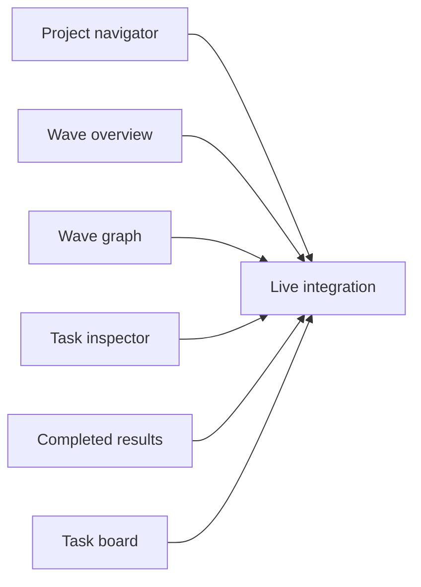

# Parallel UI build packets

## September 10 compact navigation handoff

Current implementation authority: [[work-area-redesign]] section 4. The user approved icon-only search/settings controls, no repeated project label beside Work/Documents, and all projects directly reachable in one horizontal scrolling strip. The older expanded-sidebar packet below is superseded for navigation only.

Imported inert wave: [[W-0016]], Compact project navigation with direct horizontal scrolling. It remains disarmed; the user will assign implementation separately. The ordered tasks use Standard work/review levels and require no prerequisite from the older sidebar wave.

| Task | Outcome | Depends on |
|---|---|---|
| [[WUX-T-0015]] Preserve project pins, recent order and return locations | Backward-compatible local state, stable mounted order and correct restoration | None |
| [[WUX-T-0016]] Replace the project sidebar with a scrolling strip | Actual routed shell, icon scopes, direct overflow access and browser screenshots | WUX-T-0015 |
| [[WUX-T-0017]] Qualify the compact navigation and update the user reference | Built-browser proof, read-only live checks, final evidence and current system docs | WUX-T-0016 |

Canonical input: the authored wave W-0016 and its three task records (the original plan input was removed after migration; the wave record carries the import receipt). Its NAV1–NAV7 requirements map to acceptance in the three allocated tasks. Do not create duplicate tickets or execute WUX-T-0003/WUX-T-0009 to restore the old sidebar. Their unrelated historical lifecycle and other component work are preserved.

Copyable assignment:

> Implement WUX-T-0015, WUX-T-0016 and WUX-T-0017 in that order. Start with `tusker show WUX-T-0015 --capsule` and `tusker packet WUX-T-0015 --for agent`, then read `.tusker/specs/work-area-redesign.md` section 4 and this handoff. Use the supported interactive work claim protocol and each task's current owned paths. The September 10 contract supersedes the expandable sidebar: icon-only search and both settings controls; one highlighted project chip supplying identity; one Work/Documents row; all projects in one horizontally scrolling strip with pins, stable click targets and saved return locations. Preserve project/checkout identity, existing actions, accessibility, old saved navigation and unrelated dirty work. Capture the actual shell before changing it, implement the state and shell, then run the named focused/browser checks and build once after changes settle. Complete the current Serve UI documentation and acceptance report, distinguishing fixtures, live service and installed Mac proof. Follow normal independent review and closeout; never call a missing check PASS. Keep automation disarmed; do not start a daemon, nested worker, real task execution or install/restart a shared runtime as a side effect.

Planning validation: delivery doctor and dry-run/import passed on September 10; reimport retained the same task/wave IDs. Scoped documentation checks pass. Full validation still reports the same 52 errors and 102 warnings as the planning baseline, with no new findings and none on these tasks. Documentation map generation remains blocked by the pre-existing software-factory references in execution-observability documents. This records authored-contract validity only, not implemented UI behavior.

Read-only W-0016 preflight confirms disarmed authorization, valid task contracts/artifacts/spec DAG, and the three ordered task frontiers. Unattended launch is blocked by existing daemon/reconciliation, workspace isolation, disabled project automation, runner/approval-policy and workflow-version checks. Those are not permission to activate or reconfigure the resident system; this handoff is for separately assigned interactive work. Preserve any actual claim/lifecycle refusal and report its exact cause rather than changing policy to force a start.

## How to assign work

September 10 navigation revision: [[work-area-redesign]] section 4 supersedes the expanded-sidebar requirements and navigation/integration shell placement below. The compact-project-navigation wave tasks are the current handoff for that replacement; older WUX-T-0003/WUX-T-0009 contracts remain historical records and must not be used to rebuild the sidebar. Other Work component scope remains unchanged. See the compact navigation handoff at the end of this document.

Six leaf tickets can run concurrently through user-directed external subagents after each receives its own owned checkout/paths. This is independent of the imported resident-runner plan, whose concurrency is intentionally one and whose wave remains disarmed; starting that plan unchanged would serialize execution, not run six workers. The integration ticket has hard dependencies on all six. If compute or review capacity is limited, run navigation + overview first, then flow + inspector, then results + board. This is a scheduling convenience, not extra dependency edges.

Tickets are imported as backlog/held in an inert plan. This user asked for contracts, not dispatch. Use the task packet for instructions; do not start the daemon, arm a wave or launch nested workers from an interactive implementation session. The current tracker still requires an epic; WUX is bookkeeping while the product redesign removes user-facing epics.

Model suggestions below are advisory. Tasks record provider-neutral complexity, not permanent provider/model names. Resolve through configured profiles; do not guess a Muse or Grok adapter or silently escalate cost. A user can assign Luna, Terra or a configured Muse worker without changing the task's acceptance. Each builder gets independent review.

## Imported ticket index

All seven records belong to the inert **Build the everyday Tusker work experience** wave. The first six have no task prerequisites; integration depends on all six. The wave is disarmed and the daemon concurrency setting remains unchanged. External user-directed subagents may be assigned leaf contracts independently; this document is not an instruction to activate the resident runner.

| Ticket | Suggested builder | Prerequisite |
|---|---|---|
| [Build the persistent project and wave navigator](../work/tasks/WUX-T-0003.md) | Terra; Luna for a tightly reviewed implementation | None |
| [Build the grouped wave overview](../work/tasks/WUX-T-0004.md) | Luna with independent review | None |
| [Build the readable interactive wave graph](../work/tasks/WUX-T-0005.md) | Terra with independent review | None |
| [Build contextual task inspection](../work/tasks/WUX-T-0006.md) | Luna or Terra with independent review | None |
| [Build the completed wave result reader](../work/tasks/WUX-T-0007.md) | Luna with independent review | None |
| [Simplify the task board and preview tag filters](../work/tasks/WUX-T-0008.md) | Luna with independent review | None |
| [Integrate the work experience with live data and navigation](../work/tasks/WUX-T-0009.md) | Terra; frontier review only for unresolved contract decisions | All six UI components |

### Copyable assignment template

> Implement **TASK TITLE** using `tusker packet TASK-ID --for agent` and the matching section of `.tusker/specs/work-area-build-packets.md`. Read the referenced UX specification and applicable AGENTS.md. Own only the paths assigned to this ticket; preserve dirty and concurrent work. Build the actual component and its isolated sample-data preview, exercise the acceptance scenarios in headless Playwright, run the named checks, and capture the required screenshots and fresh screenshot-only critique. Report changed files, exact proof, unavailable contracts and remaining integration work. Do not enable automation, arm a wave, start a daemon, deploy, or edit backend/other workers' files. Do not spawn nested workers unless the assigning user separately authorizes that. Use the explicitly assigned model/profile and report an unavailable profile rather than substituting a more expensive one.

For Muse, use the installed Muse worker skill and configured external-worker route; its availability is not implied by a label in this table. Direct workers should report task proof without representing a disarmed resident wave as running.

## Shared contract and parallel safety

- Root spec sections 1–3 and 10–13 apply to every ticket. Read only the named screen section plus the exact existing sources listed in the packet; expand when implementation requires it.
- Component files use existing TypeScript domain types imported read-only from types/domain.ts. Their data and action callbacks are supplied by a parent. No new shared service/store/framework is required.
- Each leaf creates real reusable component code under its owned directory and a clearly sample-data preview under previews/wux/<key>/. The preview has index.html and an entry module importing the real component and current app styles. Add data-wux-ready="true" after render. No production mock data or unreviewed changes to shared routes.
- Reuse current primitives/tokens. Local styles remain in owned component directories. No leaf changes dependencies, package manifests, global styles, shared types, router, current production screens, generated dist or backend code.
- Payload contracts below are fixed interfaces for the first parallel pass. Export each component's Props type locally. The integration owner performs adaptation; a leaf reports missing facts instead of reaching into another worker's files.
- Preview ports are unique. Run Vite only on localhost in the assigned checkout. Do not use the user's desktop browser or an existing browser session. Browser interaction and screenshots use isolated headless Playwright.
- Every preview fixture uses stable IDs and clearly labeled sample data. Include normal, empty, stale/error and narrow-screen cases. Production data remains a separate integration requirement.
- User subjective acceptance follows screenshot review; routine code/behavior checks are performed by agents. No fake human gates for code review.

## Evidence and runnable checks

From internal/serve/ui in the assigned checkout, run the per-ticket Bun test file and bun run typecheck. Tests must exercise behavior, not source strings. Every named test below must actually run; missing or zero-match tests are failures. Browser scenarios require recorded interactions in addition to static images.

Start the owned preview with `bun run dev -- --host 127.0.0.1 --port PORT --strictPort`. On a host with Chrome and Node, capture with `npx --yes playwright screenshot --channel=chrome --viewport-size=1440,1000 --wait-for-selector='[data-wux-ready="true"]' http://127.0.0.1:PORT/previews/wux/KEY/index.html ../../../docs/reports/wux/KEY/desktop.png`. Create the owned output directory first. Use Playwright interaction APIs to execute the ticket's scenarios; record commands/steps and observed assertions in report.md. At 1024×768 and 390×844 save tablet.png and narrow.png. If this host lacks browser/runtime support, record the exact blocker; do not claim screenshots or live proof.

For each rendered iteration send only its screenshot to a fresh critic with: infer intended aesthetic; compare top studio execution; examine composition and fine detail; penalize overdone/obviously generated elements; give specific bold feedback and a score /10. Save critique.md with the screenshot identifier. No source or previous critique goes to that context. The score is not a substitute for interaction proof.

All reports distinguish fixture preview, focused behavior tests, live API integration and installed Mac relaunch proof. No leaf claims the app is integrated. No worker refreshes the installed bundle or daemon.

## Build the persistent project and wave navigator

Source key: `navigation`. Suggested assignment: Terra; Luna for a tightly reviewed implementation. Complexity: `standard`.

### What and why

People can reorder projects, move directly into recent work and return to the same place without repeated navigation. Done means a usable rendered result, exercised interactions and an honest evidence report.

### Acceptance

| ID | Observable outcome | Proof |
|---|---|---|
| A1 | Project order and multiple expanded projects persist; drag and keyboard reorder produce identical ordering and restore focus. | Focused behavior check plus rendered scenario evidence |
| A2 | Switching projects restores each last screen; explicit deep links win; removed entities and unavailable storage fall back without loops. | Focused behavior check plus rendered scenario evidence |
| A3 | Up to five active or recent wave links appear per project with Show more and Add project; empty, loading and failed reads remain distinct, with no nested ticket inventory or repeated refresh clutter. | Focused behavior check plus rendered scenario evidence |
| A4 | The rendered navigator is readable with eighteen projects, long names, narrow screens and keyboard-only operation. | Focused behavior check plus rendered scenario evidence |

### Non-goals

Do not implement execution orchestration, invent missing data, expand other screens, or change another worker's owned files.

### Implementation notes

Read spec section(s) 4. Create navigationState.ts and ProjectNavigation.tsx in the owned directory. Read Sidebar.tsx and features/panel/projectSelection.ts before coding. Reuse existing project presentation and registration behavior; do not import the embedded Panel as a drawer.

Contract: `ProjectNavigation`: projects: ProjectSummary[]; waveLinks: Record<string, Array<{id:string; title:string; href:string; active:boolean}>>; waveReads:Record<string,{state:"loading"|"ready"|"error"; error?:string}>; currentPath:string; onNavigate:(href:string)=>void; onAddProject:()=>void; onExpandedProjectsChange:(ids:string[])=>void. Export NavigationState and read/write/resolve helpers from navigationState.ts in the owned directory. State contains orderedProjectIds, expandedProjectIds, activeProjectId, lastPathByProject and viewStateByProject (opaque per-project state written by integration through the exported store helper); ignore external/invalid paths. Integration supplies graph/view state in this same record, not a second competing navigation store. Emit expanded-project changes so integration can request/cache that bounded subset; missing waveLinks is not proof of an empty project.

Owned paths (new paths are intentional proposals; verify existing paths):

- `internal/serve/ui/src/features/workbench/navigation/`
- `internal/serve/ui/previews/wux/navigation/`
- `internal/serve/ui/test/wux-navigation.test.ts`
- `docs/reports/wux/navigation/`

Dependencies: None; independent leaf.

Required behavioral test names:

- `navigation order survives reload`
- `navigation deep link wins`
- `navigation missing project fallback`
- `navigation wave loading differs from empty`

Exact checks, from `internal/serve/ui`:

- `bun test test/wux-navigation.test.ts`
- `bun run typecheck`
- Start preview: `bun run dev -- --host 127.0.0.1 --port 5181 --strictPort`
- Browser URL: `http://127.0.0.1:5181/previews/wux/navigation/index.html`

Exercise all four acceptance rows in headless browser interaction, capture desktop/tablet/narrow images, then obtain the fresh screenshot-only critique. Record exact commands, host, PASS/FAIL and first actionable failure in `docs/reports/wux/navigation/report.md`.

### Verification ledger

| Covers | Check | Result |
|---|---|---|
| A1,A2,A3,A4 | command: cd internal/serve/ui && bun test test/wux-navigation.test.ts | pending |
| A1,A2,A3,A4 | command: cd internal/serve/ui && bun run typecheck | pending |
| A1,A2,A3,A4 | manual proof: use the isolated headless browser on the named preview; exercise each acceptance scenario; save the three viewport screenshots and fresh critique in docs/reports/wux/navigation/ | pending |

## Build the grouped wave overview

Source key: `overview`. Suggested assignment: Luna with independent review. Complexity: `standard`.

### What and why

People can see what needs attention, what is moving and what is ready without reading a second inventory of tickets. Done means a usable rendered result, exercised interactions and an honest evidence report.

### Acceptance

| ID | Observable outcome | Proof |
|---|---|---|
| A1 | Every wave appears once in Needs you, Running, Ready to start, Planned, completed history or the exceptional Status unavailable section; uncertain and stale facts never become ready or successful. | Focused behavior check plus rendered scenario evidence |
| A2 | Rows show a linked title, supplied description, meaningful state and compact progress; there is no separate Open column or repeated all-task list. | Focused behavior check plus rendered scenario evidence |
| A3 | Search and completed filtering retain selection through callbacks; unassigned tasks have a direct board entry when present. | Focused behavior check plus rendered scenario evidence |
| A4 | A mixed-state rendered preview demonstrates compact usable hierarchy, empty/error states and long descriptions at desktop and narrow widths. | Focused behavior check plus rendered scenario evidence |

### Non-goals

Do not implement execution orchestration, invent missing data, expand other screens, or change another worker's owned files.

### Implementation notes

Read spec section(s) 5. Read deriveWaveTasks, wavePhase and ticketStatus in DeliveryScreens.tsx. Reuse the concepts but do not blindly inherit unsafe completion/readiness conflation. Keep pure grouping logic in this directory; no shared screen edits.

Contract: `WaveOverview`: waves:WaveSummary[]; tasks:TaskCapsule[]; runs:RunSummary[]; startability:Record<string,{state:"ready"|"blocked"|"unknown"; reason?:string}>; descriptions?:Record<string,string>; query:string; showCompleted:boolean; onQueryChange; onShowCompletedChange; onOpenWave:(id:string)=>void; onOpenUnassigned:()=>void; loading?:boolean; error?:string. Export groupWaves from this directory for the integration owner. Callbacks take the corresponding string/boolean value. Do not derive true startability from armed/open alone.

Owned paths (new paths are intentional proposals; verify existing paths):

- `internal/serve/ui/src/features/workbench/overview/`
- `internal/serve/ui/previews/wux/overview/`
- `internal/serve/ui/test/wux-overview.test.ts`
- `docs/reports/wux/overview/`

Dependencies: None; independent leaf.

Required behavioral test names:

- `overview partitions mixed states`
- `overview unknown is not ready`
- `overview unavailable section preserves every wave`
- `overview completed is not drained`

Exact checks, from `internal/serve/ui`:

- `bun test test/wux-overview.test.ts`
- `bun run typecheck`
- Start preview: `bun run dev -- --host 127.0.0.1 --port 5182 --strictPort`
- Browser URL: `http://127.0.0.1:5182/previews/wux/overview/index.html`

Exercise all four acceptance rows in headless browser interaction, capture desktop/tablet/narrow images, then obtain the fresh screenshot-only critique. Record exact commands, host, PASS/FAIL and first actionable failure in `docs/reports/wux/overview/report.md`.

### Verification ledger

| Covers | Check | Result |
|---|---|---|
| A1,A2,A3,A4 | command: cd internal/serve/ui && bun test test/wux-overview.test.ts | pending |
| A1,A2,A3,A4 | command: cd internal/serve/ui && bun run typecheck | pending |
| A1,A2,A3,A4 | manual proof: use the isolated headless browser on the named preview; exercise each acceptance scenario; save the three viewport screenshots and fresh critique in docs/reports/wux/overview/ | pending |

## Build the readable interactive wave graph

Source key: `flow`. Suggested assignment: Terra with independent review. Complexity: `complex`.

### What and why

People can understand task dependencies and current progress, and inspect a task without losing their position. Done means a usable rendered result, exercised interactions and an honest evidence report.

### Acceptance

| ID | Observable outcome | Proof |
|---|---|---|
| A1 | Real dependencies render as directed readable nodes and edges, with truthful task states and active model labels where provided. | Focused behavior check plus rendered scenario evidence |
| A2 | Pan, zoom, fit, reset and keyboard/list access work; opening a task and live state updates preserve the graph position. | Focused behavior check plus rendered scenario evidence |
| A3 | Outside-wave references, cycles and unavailable member details remain inspectable; unconfirmed dependency existence is labeled unresolved, not claimed as a missing or valid external task. | Focused behavior check plus rendered scenario evidence |
| A4 | Rendered evidence covers a chain, parallel branches, a join, external dependency, cycle and thirty long-title tasks; render measurements at thirty and one hundred nodes identify the host and browser. | Focused behavior check plus rendered scenario evidence |

### Non-goals

Do not implement execution orchestration, invent missing data, expand other screens, or change another worker's owned files.

### Implementation notes

Read spec section(s) 6. Read DeliveryScreens.tsx DependencyDag and features/editor/mermaid.ts. Reuse installed Mermaid layout/rendering if it holds; do not add a graph package or reimplement a graph framework without a measured failure. Preserve complete readable titles via accessible labels.

Contract: `WaveFlow`: memberIds:string[]; tasks:TaskDetail[]; runs:RunSummary[]; dependencyFacts?:Record<string,{kind:"external"|"missing"|"unavailable"; title?:string}>; selectedTaskId?:string; viewport?:{x:number;y:number;scale:number}; onSelectTask:(id:string)=>void; onViewportChange:(value:{x:number;y:number;scale:number})=>void; loading?:boolean; error?:string. Dependency references come from TaskDetail.deps. memberIds distinguishes unloaded members from outside-wave references; dependencyFacts carries caller-confirmed existence information if available. Without that fact, show Unresolved dependency rather than pretending to know missing versus external. Do not manufacture full task contracts. Model labels use supplied facts, never role-to-model guesses.

Owned paths (new paths are intentional proposals; verify existing paths):

- `internal/serve/ui/src/features/workbench/flow/`
- `internal/serve/ui/previews/wux/flow/`
- `internal/serve/ui/test/wux-flow.test.ts`
- `docs/reports/wux/flow/`

Dependencies: None; independent leaf.

Required behavioral test names:

- `flow preserves selected viewport`
- `flow external and cyclic dependencies`
- `flow live update preserves topology`

Exact checks, from `internal/serve/ui`:

- `bun test test/wux-flow.test.ts`
- `bun run typecheck`
- Start preview: `bun run dev -- --host 127.0.0.1 --port 5183 --strictPort`
- Browser URL: `http://127.0.0.1:5183/previews/wux/flow/index.html`

Exercise all four acceptance rows in headless browser interaction, capture desktop/tablet/narrow images, then obtain the fresh screenshot-only critique. Record exact commands, host, PASS/FAIL and first actionable failure in `docs/reports/wux/flow/report.md`.

### Verification ledger

| Covers | Check | Result |
|---|---|---|
| A1,A2,A3,A4 | command: cd internal/serve/ui && bun test test/wux-flow.test.ts | pending |
| A1,A2,A3,A4 | command: cd internal/serve/ui && bun run typecheck | pending |
| A1,A2,A3,A4 | manual proof: use the isolated headless browser on the named preview; exercise each acceptance scenario; save the three viewport screenshots and fresh critique in docs/reports/wux/flow/ | pending |

## Build contextual task inspection

Source key: `inspector`. Suggested assignment: Luna or Terra with independent review. Complexity: `standard`.

### What and why

People can inspect what a task achieves, its actual execution stage and its relevant results without leaving the current work. Done means a usable rendered result, exercised interactions and an honest evidence report.

### Acceptance

| ID | Observable outcome | Proof |
|---|---|---|
| A1 | Selecting a task shows its intent, actual stage, current decision or failure and available result before full technical metadata. | Focused behavior check plus rendered scenario evidence |
| A2 | Active execution identity is stage-specific; unavailable provider or transport is labeled unavailable, and a past worker is not shown as the current reviewer. | Focused behavior check plus rendered scenario evidence |
| A3 | Closing restores origin focus and context; full-task navigation is available; narrow screens use a usable full-width panel and rapid selection cannot show another task data. | Focused behavior check plus rendered scenario evidence |
| A4 | Keyboard, loading, unavailable data, long contract text and accepted versus unaccepted evidence are demonstrated in rendered previews. | Focused behavior check plus rendered scenario evidence |

### Non-goals

Do not implement execution orchestration, invent missing data, expand other screens, or change another worker's owned files.

### Implementation notes

Read spec section(s) 7. Read TaskScreens.tsx TaskDetail, RunDetail.tsx and HumanActionCard.tsx. Reuse sanitized Markdown and evidence handling. Do not use features/panel/Panel.tsx, which is the separate native triage surface.

Contract: `TaskInspector`: task:TaskDetail|null; run:RunDetail|null; selectedTaskId:string|null; loading:boolean; error?:string; executionIdentity?:{provider?:string; model?:string; transport?:"ACP"|"CLI exec"; stage?:string; observed:boolean}; onClose:()=>void; onOpenTask:(id:string)=>void. Mount only for selection; caller cancels/keys requests. Use the existing human-action component where its contract fits. Host controls prior focus and graph state, panel reports close.

Owned paths (new paths are intentional proposals; verify existing paths):

- `internal/serve/ui/src/features/workbench/inspector/`
- `internal/serve/ui/previews/wux/inspector/`
- `internal/serve/ui/test/wux-inspector.test.ts`
- `docs/reports/wux/inspector/`

Dependencies: None; independent leaf.

Required behavioral test names:

- `inspector late task response rejected`
- `inspector missing identity is unavailable`
- `inspector evidence keeps acceptance`

Exact checks, from `internal/serve/ui`:

- `bun test test/wux-inspector.test.ts`
- `bun run typecheck`
- Start preview: `bun run dev -- --host 127.0.0.1 --port 5184 --strictPort`
- Browser URL: `http://127.0.0.1:5184/previews/wux/inspector/index.html`

Exercise all four acceptance rows in headless browser interaction, capture desktop/tablet/narrow images, then obtain the fresh screenshot-only critique. Record exact commands, host, PASS/FAIL and first actionable failure in `docs/reports/wux/inspector/report.md`.

### Verification ledger

| Covers | Check | Result |
|---|---|---|
| A1,A2,A3,A4 | command: cd internal/serve/ui && bun test test/wux-inspector.test.ts | pending |
| A1,A2,A3,A4 | command: cd internal/serve/ui && bun run typecheck | pending |
| A1,A2,A3,A4 | manual proof: use the isolated headless browser on the named preview; exercise each acceptance scenario; save the three viewport screenshots and fresh critique in docs/reports/wux/inspector/ | pending |

## Build the completed wave result reader

Source key: `results`. Suggested assignment: Luna with independent review. Complexity: `standard`.

### What and why

People can judge what a completed wave delivered through its evidence rather than reading execution logs. Done means a usable rendered result, exercised interactions and an honest evidence report.

### Acceptance

| ID | Observable outcome | Proof |
|---|---|---|
| A1 | Results show delivered intent, acceptance and independent review facts, with the flow available through a clear action. | Focused behavior check plus rendered scenario evidence |
| A2 | Images are labeled before/after only when paired evidence actually exists; missing assets and unsupported types remain explicit. | Focused behavior check plus rendered scenario evidence |
| A3 | Performance and backend results retain supplied units, scenario and environment; missing measurement context is not inferred. | Focused behavior check plus rendered scenario evidence |
| A4 | A completed record without accepted evidence exposes the gap; drained work, successful processes and uploaded artifacts are not automatically verified. | Focused behavior check plus rendered scenario evidence |

### Non-goals

Do not implement execution orchestration, invent missing data, expand other screens, or change another worker's owned files.

### Implementation notes

Read spec section(s) 8. Read WaveBrief/TaskDetail evidence contracts and current WaveDetail outcome rendering. Use safe existing artifact links. No remote media proxy, artifact-store migration or invented comparison payload.

Contract: `WaveResults`: wave:WaveSummary; tasks:TaskDetail[]; onOpenFlow:()=>void; onOpenTask:(id:string)=>void. Reuse canonical WaveBrief.seeIt and outcome.tasks for eligibility and task.evidence for available renderable assets. Do not infer before/after pairs or performance metrics from filenames; without structured provenance display honest individual evidence links.

Owned paths (new paths are intentional proposals; verify existing paths):

- `internal/serve/ui/src/features/workbench/results/`
- `internal/serve/ui/previews/wux/results/`
- `internal/serve/ui/test/wux-results.test.ts`
- `docs/reports/wux/results/`

Dependencies: None; independent leaf.

Required behavioral test names:

- `results drained does not prove success`
- `results unpaired image stays single`
- `results missing evidence remains visible`

Exact checks, from `internal/serve/ui`:

- `bun test test/wux-results.test.ts`
- `bun run typecheck`
- Start preview: `bun run dev -- --host 127.0.0.1 --port 5185 --strictPort`
- Browser URL: `http://127.0.0.1:5185/previews/wux/results/index.html`

Exercise all four acceptance rows in headless browser interaction, capture desktop/tablet/narrow images, then obtain the fresh screenshot-only critique. Record exact commands, host, PASS/FAIL and first actionable failure in `docs/reports/wux/results/report.md`.

### Verification ledger

| Covers | Check | Result |
|---|---|---|
| A1,A2,A3,A4 | command: cd internal/serve/ui && bun test test/wux-results.test.ts | pending |
| A1,A2,A3,A4 | command: cd internal/serve/ui && bun run typecheck | pending |
| A1,A2,A3,A4 | manual proof: use the isolated headless browser on the named preview; exercise each acceptance scenario; save the three viewport screenshots and fresh critique in docs/reports/wux/results/ | pending |

## Simplify the task board and preview tag filters

Source key: `board`. Suggested assignment: Luna with independent review. Complexity: `standard`.

### What and why

People can browse bounded tasks in board or list form and filter related topics without maintaining epics. Done means a usable rendered result, exercised interactions and an honest evidence report.

### Acceptance

| ID | Observable outcome | Proof |
|---|---|---|
| A1 | The existing useful board/list interaction is retained with fewer repeated badges; no Epic selector or mandatory topic grouping remains. | Focused behavior check plus rendered scenario evidence |
| A2 | Selecting a task uses the same contextual inspection contract, and status-changing actions retain caller-provided server guards. | Focused behavior check plus rendered scenario evidence |
| A3 | Optional multiple tags support clear all-selected matching and reset in the preview; absent durable capability disables production tag editing rather than saving private local truth. | Focused behavior check plus rendered scenario evidence |
| A4 | Unassigned, blocked, reviewing, completed and active tasks remain discoverable, including keyboard and narrow-screen list use. | Focused behavior check plus rendered scenario evidence |

### Non-goals

Do not implement execution orchestration, invent missing data, expand other screens, or change another worker's owned files.

### Implementation notes

Read spec section(s) 9. Read TaskScreens.tsx board/list and WaveReview.tsx. Reuse useful layout and behavior; omit legacy epic filtering. Runtime domains must not silently become user tags. Tags are sample fixture data until a live contract exists.

Contract: `TaskBoard`: tasks:TaskCapsule[]; runs:RunSummary[]; mode:"board"|"list"; onModeChange:(value:"board"|"list")=>void; onSelectTask:(id:string)=>void; tagsByTaskId?:Record<string,string[]>; selectedTags:string[]; onSelectedTagsChange:(tags:string[])=>void; tagsAvailable:boolean. Existing guarded mutations, if retained, are callbacks supplied by integration; do not introduce a new status endpoint or local-only durable state.

Owned paths (new paths are intentional proposals; verify existing paths):

- `internal/serve/ui/src/features/workbench/board/`
- `internal/serve/ui/previews/wux/board/`
- `internal/serve/ui/test/wux-board.test.ts`
- `docs/reports/wux/board/`

Dependencies: None; independent leaf.

Required behavioral test names:

- `board all selected tags match`
- `board missing tags capability`
- `board live state preserves durable status`

Exact checks, from `internal/serve/ui`:

- `bun test test/wux-board.test.ts`
- `bun run typecheck`
- Start preview: `bun run dev -- --host 127.0.0.1 --port 5186 --strictPort`
- Browser URL: `http://127.0.0.1:5186/previews/wux/board/index.html`

Exercise all four acceptance rows in headless browser interaction, capture desktop/tablet/narrow images, then obtain the fresh screenshot-only critique. Record exact commands, host, PASS/FAIL and first actionable failure in `docs/reports/wux/board/report.md`.

### Verification ledger

| Covers | Check | Result |
|---|---|---|
| A1,A2,A3,A4 | command: cd internal/serve/ui && bun test test/wux-board.test.ts | pending |
| A1,A2,A3,A4 | command: cd internal/serve/ui && bun run typecheck | pending |
| A1,A2,A3,A4 | manual proof: use the isolated headless browser on the named preview; exercise each acceptance scenario; save the three viewport screenshots and fresh critique in docs/reports/wux/board/ | pending |

## Integrate the work experience with live data and navigation

Source key: `integration`. Suggested assignment: Terra; frontier review only for unresolved contract decisions. Complexity: `complex`.

### What and why

The agreed screens form one coherent live project experience, preserving truthful state and existing guarded actions. Done means a usable rendered result, exercised interactions and an honest evidence report.

### Acceptance

| ID | Observable outcome | Proof |
|---|---|---|
| A1 | The six components are integrated with real projects, queries and links; explicit deep links, per-project restore, task inspection and browser back preserve context. | Focused behavior check plus rendered scenario evidence |
| A2 | Work uses Waves and Board; running waves open Flow and completed waves open Results without interrupting an active graph; duplicate Open links, Epics navigation and factory Operations surfaces are removed. | Focused behavior check plus rendered scenario evidence |
| A3 | Missing readiness, transport, tags or completion facts stay unavailable and are listed in a concrete backend handoff; no fake runtime, local-only durable data or unsupported setting editor ships. | Focused behavior check plus rendered scenario evidence |
| A4 | Real read-only browser flows and accessibility checks pass, production assets build in an isolated checkout, current UI documentation is updated, and a fresh screenshot-only critic reviews the composed screens. | Focused behavior check plus rendered scenario evidence |

### Non-goals

Do not implement execution orchestration, invent missing data, expand other screens, or change another worker's owned files.

### Implementation notes

Read spec section(s) 4–13. Re-inventory dirty shared files before editing. Existing changes in Sidebar.tsx, DeliveryScreens.tsx, TaskScreens.tsx, api.ts, queries.ts and domain.ts belong to concurrent work; compose against their current semantics. Do not overwrite them with an older copy. No Go, daemon, runner, schema or Mac shell edits. Native relaunch proof is a separate handoff if an existing persistent webview cannot be exercised without disturbing the user.

Contract: Integration owns routing, live query adaptation and shared visual composition. Import the six exported components exactly as documented. Keep leaf interfaces stable; any change requires updating all affected packets before parallel workers depend on it.

Owned paths (new paths are intentional proposals; verify existing paths):

- `internal/serve/ui/src/features/workbench/integration/`
- `internal/serve/ui/src/components/Sidebar.tsx`
- `internal/serve/ui/src/routes/__root.tsx`
- `internal/serve/ui/src/router.tsx`
- `internal/serve/ui/src/features/product/DeliveryScreens.tsx`
- `internal/serve/ui/src/features/product/TaskScreens.tsx`
- `internal/serve/ui/src/features/product/shared.tsx`
- `internal/serve/ui/src/lib/api.ts`
- `internal/serve/ui/src/lib/queries.ts`
- `internal/serve/ui/src/types/domain.ts`
- `internal/serve/ui/src/styles/app.css`
- `internal/serve/ui/test/wux-integration.test.ts`
- `internal/serve/ui/previews/wux/integration/`
- `docs/system/serve-ui.md`
- `docs/reports/wux/integration/`

Dependencies: Build the persistent project and wave navigator, Build the grouped wave overview, Build the readable interactive wave graph, Build contextual task inspection, Build the completed wave result reader, Simplify the task board and preview tag filters

Required behavioral test names:

- `integration explicit deep link wins restore`
- `integration completed entry shows results`
- `integration unavailable data never enables start`

Exact checks, from `internal/serve/ui`:

- `bun test test/wux-integration.test.ts`
- `bun run typecheck`
- Start preview: `bun run dev -- --host 127.0.0.1 --port 5187 --strictPort`
- Browser URL: `http://127.0.0.1:5187/previews/wux/integration/index.html`

Exercise all four acceptance rows in headless browser interaction, capture desktop/tablet/narrow images, then obtain the fresh screenshot-only critique. Record exact commands, host, PASS/FAIL and first actionable failure in `docs/reports/wux/integration/report.md`.

### Verification ledger

| Covers | Check | Result |
|---|---|---|
| A1,A2,A3,A4 | command: cd internal/serve/ui && bun test test/wux-integration.test.ts | pending |
| A1,A2,A3,A4 | command: cd internal/serve/ui && bun run typecheck | pending |
| A1,A2,A3,A4 | manual proof: use the isolated headless browser on the named preview; exercise each acceptance scenario; save the three viewport screenshots and fresh critique in docs/reports/wux/integration/ | pending |

## Integration additions

Only integration builds the production bundle: `cd internal/serve/ui && bun run build`, in an isolated checkout. Generated dist is a build artifact; do not overwrite or stage the user's current dist. Run the relevant existing UI suite once after wiring, report unrelated failures without broad repairs. Integration also exercises a live read-only project, document link, wave, task, result and unavailable backend response. Never execute real tasks to make a demo look alive.

Cross-component interfaces and shared files have exactly one integrator. It may edit leaf files only after an explicit ownership handoff if adaptation requires it; otherwise report the conflict. Link the actual backend handoff with unavailable fields in docs/reports/wux/integration/report.md. Update docs/system/serve-ui.md to the behavior that actually shipped, not to every future requirement in the spec.

## Snapshot versus continuing design

The imported task's acceptance is the dispatch contract. Later discussion may amend backlog/disarmed contracts through supported plan re-import. Once a worker starts, do not silently change its spec interpretation: send an explicit delta or create follow-up work. Keep source keys and task IDs stable. Design discussion about Documents, settings, durable tags and onboarding continues separately.

<!-- tusker:delivery-import:02edf868de8ca802:begin -->

- `[[WUX-T-0008]]` implements delivery source `board`.
- `[[WUX-T-0005]]` implements delivery source `flow`.
- `[[WUX-T-0006]]` implements delivery source `inspector`.
- `[[WUX-T-0009]]` implements delivery source `integration`.
- `[[WUX-T-0003]]` implements delivery source `navigation`.
- `[[WUX-T-0004]]` implements delivery source `overview`.
- `[[WUX-T-0007]]` implements delivery source `results`.

- `[[W-0013]]` is the imported delivery wave.

<!-- tusker:delivery-import:02edf868de8ca802:end -->
