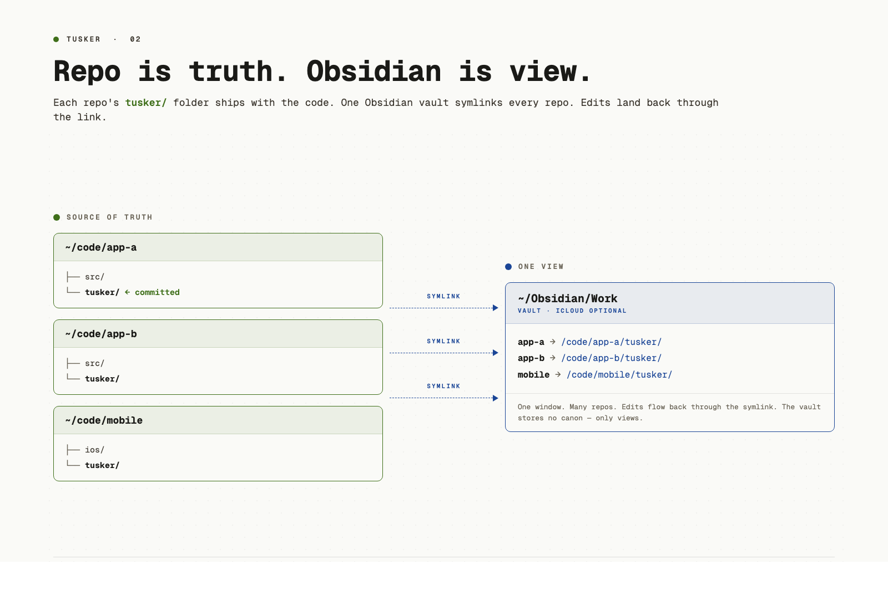

# Tusker

A task tracker that lives inside your git repo as plain markdown, and reads cleanly in Obsidian. Built for a single developer working with coding agents.

Each ticket is one markdown file. It serves two purposes at the same time:

1. **A detailed instruction set for an agent.** Frontmatter carries the structured fields the agent needs — risk, size, change type, surfaces, dependencies, AI tools — and the body holds the plan, acceptance criteria, verification steps, and code anchors the agent reads before it starts work.
2. **A human-readable spec.** The same file, opened in Obsidian, reads like a normal design note. Headings, links, embedded diagrams, dataview queries. You write the intent and the acceptance criteria; the agent fills in the plan and the evidence.

The vault is a folder in your repo. Task state is committed alongside the code it describes.

```
your-repo/
├── src/
└── tusker/
    ├── epics/
    │   └── MEM/
    │       ├── MEM.md           # epic + canon
    │       ├── MEM-S-0001.md    # story
    │       └── MEM-B-0002.md    # bug
    ├── _system/
    └── Dashboard.md
```


## Why this exists

Linear and Jira live outside the repo. GitHub Issues are thin and not great for specs. [Beads](https://github.com/steveyegge/beads) gets the git-native idea right but is not built around reading the work in Obsidian.

When the person doing the implementation is a coding agent, the specification is what matters. Acceptance criteria, risk level, evidence after the fact, an attestation trail. Tusker tries to make that the default shape of a ticket.

The design borrows from two things worth reading: the OpenAI harness engineering writeup, and the Symphony multi-agent demo. Tusker is not a clone of either. It is the smallest thing that lets one person manage several repos this way.

|                                       | Linear / Jira | GitHub Issues | Beads | Tusker |
| ------------------------------------- | :-----------: | :-----------: | :---: | :----: |
| Lives in your repo                    |       no      |    partial    |  yes  |   yes  |
| Plain markdown                        |       no      |      yes      | partial |  yes  |
| Renders in Obsidian without plugins   |       no      |       no      |   no  |   yes  |
| Risk-scaled spec and evidence layout  |    partial    |       no      |   no  |   yes  |
| CLI for agents                        |       no      |    partial    |  yes  |   yes  |
| Installable agent skill               |       no      |       no      |   no  |   yes  |
| One Obsidian window, many repos       |      n/a      |      n/a      |   no  |   yes  |
| Reads on a phone over iCloud          |       no      |       no      |   no  |   yes  |

Linear and Jira are overkill for an independent developer or a team of two or three. The setup, the seats, the rituals, the clicking around — it is more overhead than the work it tracks. Tusker is built for that scale. If you have a sprint, a product manager, and 30 engineers, use Linear.

## What it is

There are four pieces. You can use any subset. The skill alone is enough for most cases.

**A skill bundle.** This is the core. Install into Claude Code, Codex CLI, or any harness that loads `SKILL.md`. The skill teaches the agent the file layout, the frontmatter, and the lifecycle. With just the skill installed, an agent can create and update tickets as plain markdown in your repo, and you can read and edit them in Obsidian. No CLI required.

**A Go CLI (`tusker`).** A helper. Single binary, no runtime. It makes the same operations easier and safer: init a vault, mount it into the workspace, create stories with validated frontmatter, run the validator, hand off to agents, attach evidence, attest. If you skip the CLI, the agent will do the equivalent edits directly on the markdown.

**An Obsidian vault layout.** Bases views, dashboards, dataview-friendly frontmatter, snippets, templates. Open the folder as a vault and it works.

**A symlink workspace.** One central Obsidian vault that symlinks every repo's `tusker/` folder. The repo stays the source of truth. The Obsidian vault is just where you read and edit.

There is also an experimental daemon that picks up ready stories and dispatches Claude or Codex sessions, with concurrency caps. It is opt-in. The markdown layer works without it.

## The data model

```
Vault = one repo
  └── Epic (3-letter acronym, e.g. MEM)
        ├── Story  MEM-S-0001
        ├── Bug    MEM-B-0002
        └── Doc    MEM-D-0003
```

No project layer. No task layer. Sub-work inside a story is the agent's own todo list.

Stories carry `risk`, `size`, `change_type`, `priority`, `delegation`, `ai_assistance`, `ai_tools`. Risk drives ceremony, not size. A typo at `risk: low` needs one line of evidence. A feature flag flip at `risk: high` needs a rollout plan and a human signoff.


## Two surfaces, one set of files

The repo is the source of truth. `tusker/` is committed with the code. Branches, blame, PRs — the same git tools you already use for code now apply to task state.

Obsidian is the view. One central vault, with a symlink for each repo:

```
~/Obsidian/Work/
├── app-a    -> /repos/app-a/tusker/
├── app-b    -> /repos/app-b/tusker/
└── mobile   -> /repos/client/mobile/tusker/
```

Edits in Obsidian go through the symlink and land in the repo. Put `~/Obsidian/Work/` in iCloud Drive, Syncthing, or Dropbox if you want to read the backlog on a phone. Code stays out of the sync folder.



## Install

> The skill alone is enough for most users. Install it into your agent, open the `tusker/` folder in Obsidian, and read and edit specs there. The CLI makes things easier (validation, mounting, evidence handling, atomic status changes) and the agent will use it when it is available, but the commands below are written for the agent, not for you. As a human user, your job is to open the Obsidian vault that gets created, read the specs, edit the acceptance criteria, and watch the Bases views to see what is in flight and what is done.

macOS and Linux:

```sh
curl -fsSL https://raw.githubusercontent.com/srv1n/tusker/main/scripts/install.sh | sh
```

With the agent skill for Claude Code and Codex:

```sh
curl -fsSL https://raw.githubusercontent.com/srv1n/tusker/main/scripts/install.sh | sh -s -- --codex-user --claude-user
```

After pulling or rebuilding Tusker, refresh the installed binary link and installed skill bundle:

```sh
tusker update
```

Set the workspace once:

```sh
tusker vault set --path "$HOME/Obsidian/Work"
```

In any repo, create the tracker and mount it:

```sh
cd ~/code/my-app
tusker init --yes --mount
```

You now have `~/code/my-app/tusker/` (committed) and `~/Obsidian/Work/my-app/` (symlink).

## Working with an agent

With the skill installed, ask Claude Code or Codex to log a story. The agent is instructed to:

1. Run `tusker epics` to see what already exists.
2. Pick the right epic, or propose a new one if nothing fits.
3. Create the story with sensible defaults.
4. Print the ID and a one-line reason for the epic choice.

When the agent picks the work up:

```sh
tusker handoff --id MEM-S-0007 --for worker
tusker set-status --id MEM-S-0007 --status active
# work happens
tusker attach-evidence --id MEM-S-0007 --kind pr --path https://github.com/.../pull/42
tusker review verify --id MEM-S-0007 --by claude
tusker attest --id MEM-S-0007 --by sarav --role human
tusker set-status --id MEM-S-0007 --status done
tusker validate
```

You can do every step by hand in Obsidian. The CLI and the markdown stay in sync because the markdown is the data.


## Working without an agent

Skip the daemon:

```sh
cd ~/code/my-app
tusker projects disable
```

You still get the schema, the validator, the Obsidian views, the dashboards, and the CLI.

## The dispatcher (experimental)

A small daemon watches registered trackers, picks up stories that are ready, dispatches Claude or Codex with the right context, enforces concurrency caps, and writes results back as evidence.

```sh
tusker daemon limits --max-active-runs 2
cd ~/code/my-app
tusker projects limits --max-active-runs 1
```

This is a first pass, not the whole Symphony idea. The markdown, the CLI, and the skill are the stable core. The dispatcher is the part still moving.

## What the skill gives the agent

When the agent loads `SKILL.md`:

- Three rules. Every story has a parent epic. Evidence scales with risk. Every active epic declares canon and has at least one story.
- Quick mode for routine work. One command, sane defaults, low ceremony.
- Formal intake for `risk >= medium`. Considered-and-rejected, decision, rollout, human attestation at high and critical.
- Docs publishing guidance. Agents know when to create D-notes, when to edit repo docs, and how to read the schema-versioned `canon-manifest.json` with explicit `canonical_status` instead of guessing from tags.
- A routing table so the agent loads `references/SCHEMA.md` only when editing frontmatter, `references/REPO_CONTRACT.md` only when wiring AGENTS.md, and so on.

See [`skill/SKILL.md`](skill/SKILL.md) for the full contract.

## Design principles

- Markdown is the source of truth. Frontmatter is the machine layer. Generated JSON is a cache.
- Risk drives ceremony. Blast radius, not lines of code.
- Agents act, humans gate. Agents create, execute, and attach evidence. Humans sign off on `risk >= high`.
- Evidence is artifacts, not plans. `## Evidence` is filled after execution.
- The vault is both operating surface and spec archive. Canon lives in epic Design, a canonical D-note, or a `spec_source` file in the repo. Stories cite canon by link, never by copy-paste.
- Progressive disclosure. The skill entry stays short. Reference files are loaded on demand.

## Status

Early. The schema is settled, the validator catches what it should, and I use it on my own work every day. The dispatcher is the unsettled part. Bug reports and PRs are welcome. If you try it on a real project, I would like to hear what worked and what did not.

## Read next

- [`skill/SKILL.md`](skill/SKILL.md) — agent contract
- [`skill/references/COMMANDS.md`](skill/references/COMMANDS.md) — full CLI
- [`skill/references/DOCS_PUBLICATION.md`](skill/references/DOCS_PUBLICATION.md) — docs site, canon manifests, and publication flow
- [`skill/references/SCHEMA.md`](skill/references/SCHEMA.md) — frontmatter
- [`skill/references/WORKFLOW.md`](skill/references/WORKFLOW.md) — lifecycle
- [`skill/references/RISK_AND_EVIDENCE.md`](skill/references/RISK_AND_EVIDENCE.md) — risk tiers
- [`skill/references/PREREQUISITES.md`](skill/references/PREREQUISITES.md) — install and sync setup

## On the roadmap

Things being worked on or sketched out. None of these are required to use Tusker today.

- **Auto task orchestration.** A more complete dispatcher: stories pick themselves up in dependency order, the daemon reads `blocked_by` and `blocks` to schedule a graph of work across multiple repos, with budget and concurrency caps per project.
- **Auto document generation.** Generate release notes, changelogs, and per-epic status reports straight from closed stories and their evidence. Same source of truth, no second place to update.
- **Spec-driven test scaffolding.** Take the acceptance criteria and verification plan from a story and emit a test skeleton in the right place in the repo, so the agent's first commit is the failing test.
- **Cross-repo views.** A workspace-level dashboard that aggregates active work, blockers, and risk distribution across every mounted tracker.
- **Better Obsidian Bases.** Pre-built Bases for triage, in-flight work, awaiting review, and risk audit. Drop-in, no plugin gymnastics.
- **Lightweight web view.** Read-only HTML render of the vault, so a non-Obsidian collaborator can still see the spec and the evidence.
- **Import from existing trackers.** One-shot import from Linear, GitHub Issues, and Beads, so adopting Tusker does not mean retyping the backlog.

If one of these matters to you, open an issue and say so. It will help me pick what to build next.

## Build from source

```sh
make build
make install
make check
```

## License

MIT. See [LICENSE](LICENSE).
