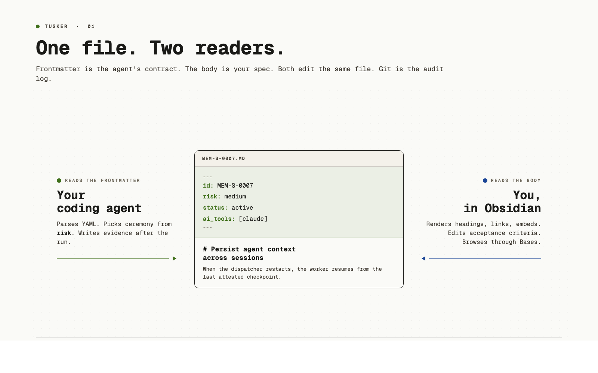
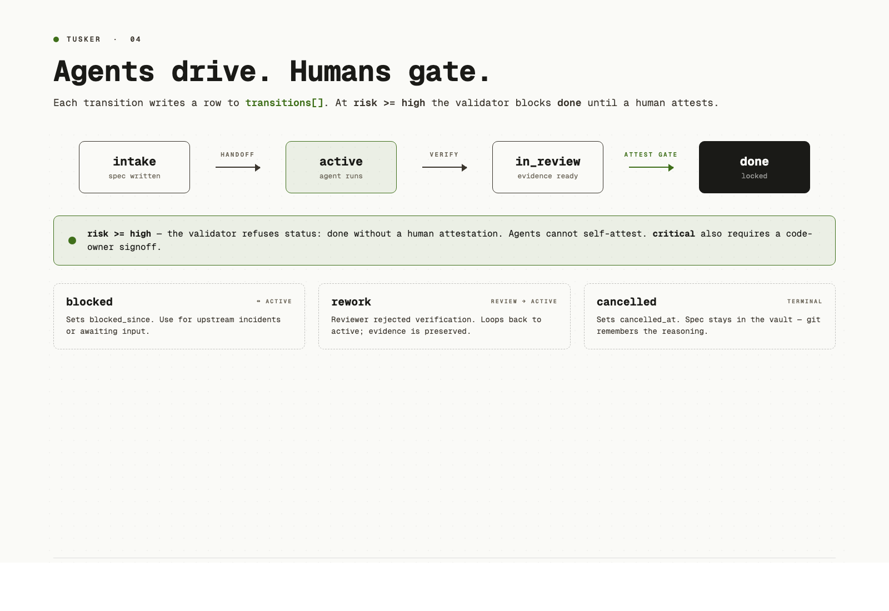

# Tusker

Tusker is a markdown-first task tracker that lives inside your git repo and reads cleanly in Obsidian. It is built for one developer, or a very small team, working with coding agents.

Each task is one markdown file. It is both:

1. **An executable contract for an agent.** Frontmatter carries the machine fields: risk, kind, domains, doc targets, dependencies, AI tools, and lifecycle state. The body carries intent, scope, acceptance, verification, deliverables, evidence, and knowledge delta.
2. **A human-readable work record.** Open it in Obsidian and it reads like a normal spec plus execution log. Humans define intent and accept evidence; agents implement and leave proof.

```text
your-repo/
├── src/
└── tusker/
    ├── epics/
    │   └── MEM/
    │       ├── MEM.md          # epic + canon
    │       ├── MEM-T-0001.md   # task
    │       └── MEM-T-0002.md   # task, kind: bug
    ├── docs/
    │   ├── spec/
    │   └── reference/
    ├── _config/
    └── _system/
```



## Why this exists

Linear and Jira live outside the repo. GitHub Issues are thin. Beads gets the git-native idea right but is not designed around Obsidian-readable executable specs for coding agents.

When an agent does the implementation, the spec is the control plane. Tusker makes the ticket carry the acceptance contract, the verification plan, the evidence, and the durable knowledge change. That last part matters: if implementation changes what future readers need to know, the task must say which docs changed or why they did not.

|                                       | Linear / Jira | GitHub Issues | Beads | Tusker |
| ------------------------------------- | :-----------: | :-----------: | :---: | :----: |
| Lives in your repo                    |       no      |    partial    |  yes  |   yes  |
| Plain markdown                        |       no      |      yes      | partial |  yes  |
| Renders in Obsidian without plugins   |       no      |       no      |   no  |   yes  |
| Risk-scaled spec and evidence layout  |    partial    |       no      |   no  |   yes  |
| Docs impact as part of the task       |       no      |       no      |   no  |   yes  |
| CLI for agents                        |       no      |    partial    |  yes  |   yes  |
| Installable agent skill               |       no      |       no      |   no  |   yes  |

If you have a sprint, a product manager, and 30 engineers, use Linear. Tusker is for the smaller, sharper setup where the repo is the source of truth.

## The V5 model

```text
Epic = workstream boundary + canon + success metrics
Task = executable change contract
Bug  = task(kind: bug)
Doc  = durable knowledge page under tusker/docs
```

The task contract separates five things that should not be blurred:

| Section | Job |
|---|---|
| Acceptance contract | What must be true |
| Deliverables | What artifacts or changes must exist |
| Verification plan | How truth will be checked |
| Evidence | Proof produced after execution |
| Knowledge delta | What durable understanding changed |

Tasks carry `risk`, `size`, `kind`, `priority`, `domains`, `doc_nodes`, `delegation`, `ai_assistance`, and `ai_tools`. Risk drives ceremony, not file count. A typo at `risk: low` needs one useful evidence line. A risky migration needs rollout, rollback, verification, and human review.

`domains` are broad human-facing areas like `schema`, `cli`, `docs`, or `runtime`. `doc_nodes` are exact documentation targets from `_config/docs-map.yaml`. If `doc_nodes` is non-empty, the docs close gate runs. For high-risk work, the task must include a `## Knowledge delta` table:

| Topic | Before | After | Audience | Target doc nodes |
|---|---|---|---|---|


## Pieces

**A skill bundle.** Install it into Claude Code, Codex, or any harness that loads `SKILL.md`. The skill teaches the agent the layout, lightweight workflow lanes, lifecycle, evidence rules, and docs close gate. It also tells agents not to read attachments, generated indexes, or raw logs by default. The skill alone is enough for most users.

**A Go CLI (`tusker`).** A helper binary for init, bounded tracker search, progressive epic/task listing, capsule-first note reading, task creation, status changes, evidence, verification, docs checks, closing, validation, reindexing, docs publishing, and updates. If the CLI is unavailable, the agent can still edit the markdown directly, but the CLI is safer.

**An Obsidian vault layout.** Repo-local markdown, Bases views, dashboards, templates, and generated indexes. Open `tusker/` as a vault and it works.

**A symlink workspace.** One central Obsidian vault can symlink multiple repo-local `tusker/` folders. The repo remains authoritative; Obsidian is the reading and editing surface.

**An operator runtime.** The runtime is local/operator-facing. It can pick up `active` and `rework` tasks for the configured runner, keep leases and transcripts out of task frontmatter, and write review packets. Codex is the default live runner today; the lifecycle and runtime lanes are runner-neutral.

**A reviewer lane.** When `WORKFLOW.md` enables `reviewer`, a task in `review` can get an independent review run. The default actor is `agent-reviewer`: low/medium risk work may be verified and closed by that reviewer after the normal gates pass, while high/critical work stays human-gated.

## Current status

As of 2026-05-08, this repo is on the V5 tracker model with the following default policy:

| Surface | Status | Current setting |
|---|---|---|
| Tracker schema | Shipped | `tracker_schema_version: 5` |
| Agent skill bundle | Shipped | Source skill plus repo-local `.agents/skills/tusker` and `.claude/skills/tusker` installs |
| Obsidian vault | Shipped | `Dashboard.md`, Bases views, `README.md`, `Docs.md`, and `CHEATSHEET.md` |
| Worker dispatch | Operator-ready | runnable states are `active` and `rework` |
| Default runner | Codex-first | `agents.default: codex`, `codex.command: codex app-server` |
| Reviewer lane | Enabled by default | `reviewer.runner: codex`, `reviewer.actor: agent-reviewer` |
| Reviewer auto-close | Enabled for low/medium | evidence, docs impact, verification, and validation gates still apply |
| Human gate | Required for high/critical | reviewer output is advisory; humans verify and close |

## Install

The skill alone is enough for most users. The CLI makes operations easier and gives agents atomic status changes, validation, evidence handling, and docs checks.

```sh
curl -fsSL https://raw.githubusercontent.com/srv1n/tusker/main/scripts/install.sh | sh
```

Install the agent skill for Claude Code and Codex:

```sh
curl -fsSL https://raw.githubusercontent.com/srv1n/tusker/main/scripts/install.sh | sh -s -- --codex-user --claude-user
```

After pulling or rebuilding Tusker, refresh the installed binary link and skill bundle:

```sh
tusker update
```

In any repo:

```sh
cd ~/code/my-app
tusker init --yes
```

You now have `~/code/my-app/tusker/` committed with the repo.

## Working with an agent

Ask Claude Code or Codex to log a task. The agent should:

1. Run `tusker list --type epic` to see existing workstreams.
2. Run `tusker search "<duplicate clue>" --type task` before creating work that may already exist.
3. Run `tusker list --epic <ACR> --type task --open` only for the likely epic.
4. Run `tusker show <ID> --capsule` before opening a full task file.
5. Run `tusker compact <ID>` first when an old note still carries scaffolding or empty optional fields.
6. Pick the right epic, or propose a new one if nothing fits.
7. Create a task with sensible defaults.
8. Print the ID and a one-line reason for the epic choice.

Primary V5 CLI:

```sh
tusker search "cache invalidation" --type task
tusker list --epic MEM --type task --open
tusker show MEM-T-0007 --capsule
tusker compact MEM-T-0007
tusker new task --epic MEM --title "Add cache invalidation" \
  --kind feature --size m --risk medium --domains runtime,docs \
  --doc-nodes reference/cache

tusker status MEM-T-0007 active
# work happens
tusker evidence MEM-T-0007 pr https://github.com/.../pull/42
tusker status MEM-T-0007 review
tusker verify MEM-T-0007 --by codex
tusker close MEM-T-0007 --by sarav
tusker validate
```

With the reviewer lane enabled, `review` is not automatically the last human stop. A later daemon tick may run the configured reviewer. For low/medium work the reviewer can verify and close; for high/critical work the reviewer leaves advisory evidence and the task stays in `review` for a human.



## Documentation

V5 docs live in `tusker/docs/`, not inside epic folders. They are durable knowledge pages with `schema: tusker.doc/v5`, `node`, `domains`, `audience`, `kind`, and publication metadata.

The full model is documented in [`docs/documentation-model.md`](docs/documentation-model.md). Read that when you need the philosophy, Diátaxis mapping, docs-map contract, freshness model, generated catalog, and publication flow.

Authoring flow:

1. Pick or create the epic that owns the workstream.
2. Create tasks that name impacted `domains` and exact `doc_nodes`.
3. Put durable doc changes in `tusker/docs/**`.
4. Fill `## Knowledge delta` before close when the task changes how future readers should understand the system.
5. Run the docs close gate before closing.

```sh
tusker docs model
tusker docs map
tusker docs catalog
tusker docs freshness --stale
tusker docs check MEM-T-0007
tusker docs apply MEM-T-0007 --node reference/cache --reason "Updated cache docs"
# or, when the no-op is intentional:
tusker docs waive MEM-T-0007 reference/cache --reason "No public behavior changed"
```

The static site remains generated output. Do not author in `site/src/content/docs/**`. Export/build with:

```sh
tusker docs export --site ./site
tusker docs build --site ./site
```

## Working without an agent

Use the tracker by hand:

```sh
cd ~/code/my-app
tusker list --type task
tusker status MEM-T-0007 active
```

You still get markdown tasks, docs, schema validation, Obsidian views, dashboards, and the CLI.

## Design principles

- Markdown is the source of truth. Frontmatter is the machine layer. Generated JSON is a cache.
- A task is an executable contract. A bug is `kind: bug`.
- Risk drives ceremony. Blast radius, not lines of code.
- Agents act, humans gate. Agents create, execute, and attach evidence. Humans verify `risk >= high`.
- Evidence is artifacts, not promises.
- Docs are part of done. Use `domains`, `doc_nodes`, and knowledge delta; do not let stale docs quietly survive.
- Progressive disclosure. The skill entry stays short. Reference files load only when needed.

## Read next

- [`skill/SKILL.md`](skill/SKILL.md) — agent contract
- [`skill/references/COMMANDS.md`](skill/references/COMMANDS.md) — CLI surface
- [`skill/references/SCHEMA.md`](skill/references/SCHEMA.md) — V5 frontmatter
- [`skill/references/WORKFLOW.md`](skill/references/WORKFLOW.md) — lifecycle
- [`skill/references/DOCS_PUBLICATION.md`](skill/references/DOCS_PUBLICATION.md) — docs nodes, close gate, and publication flow
- [`skill/references/RISK_AND_EVIDENCE.md`](skill/references/RISK_AND_EVIDENCE.md) — risk tiers and evidence
- [`docs/documentation-model.md`](docs/documentation-model.md) — docs philosophy, layout, Diátaxis, freshness, and publication model
