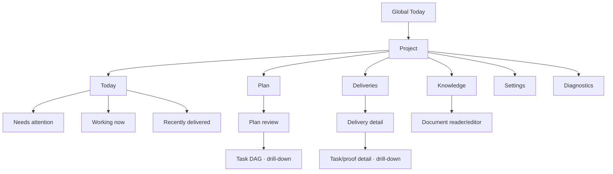

# Tusker PM factory experience

> [!important] Status and authority
> This is a **proposed normative product contract** for the next Tusker
> experience. It is the handoff source for product and interaction design, but
> it does not claim that the current app implements these screens. Executable
> code and schemas remain authoritative for current behavior. Accepted specs
> remain authoritative for safety and automation semantics.

## The product in one sentence

Tusker lets a product owner approve requirements and delivery boundaries, then
quietly coordinates planning, implementation, proof, review, integration, and
promotion until it can show what shipped or name the one decision that needs a
human.

The interface must feel like a calm release manager, not a database browser for
the control plane.

## The primary user

The primary user is a founder, PM, designer, or technical product owner who can
judge requirements and outcomes but should not need to manage task IDs,
worktrees, runner paths, leases, fingerprints, gates, or merge mechanics.

Technical operators remain supported through progressive disclosure and
Diagnostics. There is no separate “PM mode.” PM-first is the default product.

## Non-negotiable design direction

- Swiss grid: strong alignment, restrained typography, generous negative space,
  and repeatable geometry.
- One obvious next action per screen.
- Outcome language first; control-plane identifiers second.
- Three visible content groups at most before the user asks for more.
- Red and amber are scarce attention resources, never decoration.
- Empty sections disappear unless the emptiness itself is meaningful.
- Guardrails remain strict, but routine cryptographic or lifecycle mechanics are
  performed by the system.
- YAML paths, hashes, refs, command lines, and raw logs never appear in the
  default PM path.
- The user authorizes a reviewed delivery boundary once. They do not approve
  every task, proof row, review pass, or successor unlock.
- Automation, scheduled promotion, release, paid triage, and spending authority
  remain independent and opt-in.

## Canonical information architecture

Project navigation contains exactly four primary destinations:

1. **Today** — what needs attention, what is moving, and what just landed.
2. **Plan** — proposed deliveries, requirements, acceptance, DAGs, and one-time
   authorization.
3. **Deliveries** — active and historical delivery outcomes.
4. **Knowledge** — canonical product and engineering knowledge.

Settings and Diagnostics are utilities, not peers of the daily workflow.

## Document map

| Document | Question it answers |
|---|---|
| [[01-product-model-and-information-architecture]] | What mental model, objects, routes, and language does the product use? |
| [[02-swiss-design-system-and-attention]] | What visual system, hierarchy, color, density, and component rules apply? |
| [[03-shell-and-today]] | What does the user see on launch and during normal daily operation? |
| [[04-plan-and-authorization]] | How does a plan appear, get reviewed, and start without YAML or SHA ceremony? |
| [[05-deliveries-and-delivery-detail]] | How are active, failed, promoted, and completed deliveries understood? |
| [[06-knowledge-and-editing]] | How are specs, decisions, backlinks, and edits presented? |
| [[07-settings-and-runner-policy]] | What is every global/project setting, default, source, and interaction? |
| [[08-daemon-diagnostics-and-recovery]] | How does the resident daemon work, and how does a user diagnose divergence? |
| [[09-api-and-state-contracts]] | What current and target APIs, events, errors, and projections support the UX? |
| [[10-guardrails-authority-and-confirmations]] | What can each actor do, and what confirmation is proportionate? |
| [[11-responsive-accessibility-and-content]] | How does the experience stay legible, accessible, and humane? |
| [[12-implementation-and-acceptance]] | How should the redesign be sequenced, tested, and handed off? |
| [[13-claude-design-handoff-prompt]] | What can I copy into Claude Design to begin the design engagement? |

## Screen inventory

This is the complete target screen set. A designer may combine responsive
variants but must not create additional top-level concepts without changing
this contract.

| Surface | Screens and overlays |
|---|---|
| App | Global Today; global search; project switcher; add project; app settings; notification center |
| Today | Project Today; attention detail; working-item detail; delivered-item detail |
| Plan | Plan inbox; plan review; requirement detail; DAG view; authorization sheet; plan history |
| Deliveries | Delivery list; delivery detail; task detail; proof/artifact viewer; failure/repair detail; promotion/release detail |
| Knowledge | Knowledge index; document reader; backlinks; graph explorer; editor; conflict resolution |
| Settings | Project Basic; Model policy; Automation; Delivery & promotion; Workspace; Permissions; Notifications; Advanced; app-level equivalents |
| Diagnostics | Health overview; daemon detail; runner health; queue/capacity; run detail; workspaces/worktrees; capability report; doctor results; audit receipt |

## Current-to-target route map

| Current route/surface | Target disposition |
|---|---|
| `/` Needs me | `/` Global Today |
| `/p/:project/` Overview | `/p/:project/today` |
| `/p/:project/work` | DAG and task drill-down under Plan/Delivery |
| `/p/:project/delivery` | `/p/:project/plan` for plan review and `/deliveries` for runtime |
| `/p/:project/ops` | `/p/:project/diagnostics`; outcome cards move to Today |
| `/p/:project/docs` and `/knowledge` | `/p/:project/knowledge` |
| `/runs/:taskId` | Delivery/task detail; technical run view under Diagnostics |
| Project Details/Settings | Simplified Settings with Basic/Advanced disclosure |
| App Settings | Global defaults and machine policy, using the same settings grammar |

Old routes should redirect and preserve deep-link intent.

## Source and precedence matrix

| Source | Use in this pack | Precedence |
|---|---|---|
| Executable handlers, schemas, and UI types | Current endpoint and state reality | Current behavior |
| `docs/specs/11-spec-to-wave-autonomous-delivery.md` | Spec-to-DAG, authorization, proof, brief | Binding |
| `docs/specs/12-opt-in-scheduled-promotion.md` | Promotion, release, red-night, operability | Accepted planning direction |
| `docs/specs/14-opt-in-factory-execution-control.md` | Daemon, reconciliation, review, human surface | Binding |
| `docs/specs/22-pm-first-runner-setup.md` | Semantic model roles and route preview | Accepted planning direction |
| Existing Serve UX packets | Historical constraints and data lessons | Informative; UX direction is replaced here |
| This pack | Proposed screen, content, and interaction contract | Normative after approval |

The existing
`docs/design/tusker-serve-ux-packet.md`,
`docs/design/serve-ui-supplement.md`, and
`docs/design/serve-settings-ux-addendum.md` remain historical inputs. This pack
does not mutate or silently supersede them. Ratification should add explicit
supersession metadata.

## Handoff brief for Claude Design

Design the complete desktop experience from this pack. Deliver:

1. information architecture and end-to-end journey map;
2. low-fidelity wireflows for every screen in the inventory;
3. high-fidelity desktop frames at 1440 px and compact frames at 1024 px;
4. responsive behavior for 768 px and a narrow notification/decision surface;
5. component inventory and variants;
6. attention, empty, loading, stale, offline, partial, permission-refused, and
   destructive-confirmation states;
7. prototype flows for:
   - review and start a new plan;
   - inspect an active delivery;
   - resolve a genuine human decision;
   - diagnose a broken runner;
   - enable automation safely;
8. annotated behavior showing which content is default, drill-down, or
   Diagnostics-only;
9. accessibility notes, keyboard order, and copy for every destructive or
   authority-changing action.

The designer may challenge layout and component choices. They may not weaken
the authority boundaries in [[10-guardrails-authority-and-confirmations]] or
invent new durable states outside [[09-api-and-state-contracts]] without an
explicit product decision.

## Success test

A first-time PM should be able to answer these within ten seconds:

- Is anything asking for me?
- What is Tusker doing now?
- What shipped recently?
- What happens if I approve this plan?
- Is automation on, and what exactly is it allowed to do?

They should be able to start a reviewed plan without seeing or copying a path,
hash, task ID, branch, gate ID, or command.

## Explicit non-goals

- A generic IDE, Git client, log viewer, or infrastructure dashboard.
- Runtime scope invention by the daemon.
- Arbitrary per-task lifecycle scripts.
- A “cheapest model wins” router.
- Conflating implementation automation, promotion, release, and spend.
- Hiding real risk behind reassuring language.
- Replacing Markdown task/spec truth with a UI-only database.

## Navigation

Start with [[01-product-model-and-information-architecture]], then
[[02-swiss-design-system-and-attention]]. Designers should read all screen
specs before drawing the shell. Engineers should begin with
[[09-api-and-state-contracts]] and [[12-implementation-and-acceptance]].

For a direct design handoff, copy [[13-claude-design-handoff-prompt]].
