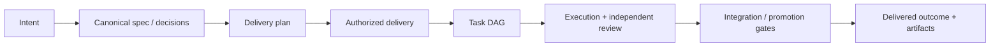

# Product model and information architecture

## Product promise

Tusker is an automatic software factory with a human product owner. The human
owns intent, acceptance, subjective judgment, external authority, and explicit
permission boundaries. Tusker owns routine decomposition, scheduling,
execution, proof collection, independent review, integration, and reporting.

The interface must continuously answer:

1. What outcome are we pursuing?
2. What is happening without me?
3. What genuinely needs me?
4. What happened, and how was it proven?

## Thought experiment: what should survive abstraction?

Imagine the task graph has 80 nodes, seven worktrees, four runners, and two
promotion windows. The PM still needs three facts: the approved outcome, the
current delivery state, and any decision they own. Therefore:

- task and runtime volume cannot determine page density;
- status summaries must be projections, not raw lists;
- internal complexity belongs behind the relevant outcome;
- a red delivery may expand, but a healthy delivery should compress;
- identifiers are useful for support and audit, not navigation.

## Primary jobs

| Job | User statement | Product response |
|---|---|---|
| Orient | “Tell me if the factory is okay.” | Today shows health, attention, motion, and delivery. |
| Approve intent | “Show me what you plan to build and how we’ll know.” | Plan presents requirements, exclusions, proof, and dependency shape. |
| Delegate | “Take this reviewed scope to completion.” | One explicit Start authorizes the exact reviewed boundary. |
| Decide | “Ask me only when judgment or authority is truly mine.” | Needs attention contains typed human actions, not routine failures. |
| Inspect | “Prove the outcome without making me read logs.” | Delivery detail leads with artifacts and acceptance coverage. |
| Recover | “Tell me what broke and what I can do.” | Diagnostics distinguishes product failure from infrastructure divergence. |
| Configure | “Use sensible models and limits for this project.” | Settings exposes semantic roles and safe defaults before exact harnesses. |

## Canonical object model

### Objects the PM sees

| Product noun | Meaning |
|---|---|
| Project | One registered repository and its local operating policy. |
| Plan | A proposed, reviewable delivery boundary derived from approved intent. |
| Delivery | An authorized plan being executed, integrated, or completed. |
| Requirement | An observable outcome with acceptance and proof. |
| Decision | A genuine unresolved product or authority choice owned by a human. |
| Artifact | Compact evidence that makes an outcome understandable. |
| Health issue | A divergence between recorded intent and runtime reality. |

### Objects hidden by default

Task, epic, wave, gate, attempt, lease, run, fingerprint, ref, state revision,
runner executable, worktree, resource lease, departure, boarding receipt, and
raw evidence row. These remain searchable and linkable in technical detail.

## Delivery lifecycle

Product language and durable state are related but not identical.

| Product phase | Typical durable states | Default copy |
|---|---|---|
| Proposed | plan discovered, not imported | Ready for review |
| Reviewed | valid plan, exact identity known | Ready to start |
| Authorized | imported and armed | Starting |
| Building | ready, claimed, active, rework | Building |
| Reviewing | review attempt / proof evaluation | Checking the work |
| Integrating | landing, staging, full gate | Verifying together |
| Scheduled | staged and waiting for window | Scheduled for promotion |
| Delivered | accepted, landed, promoted as policy requires | Delivered |
| Waiting on user | typed human gate | Needs your decision |
| Repairing | bounded automatic recovery/rework | Repairing |
| Blocked | terminal infrastructure or unresolved boundary | Blocked |
| Paused | explicit operator pause | Paused |

Do not flatten every durable state into “in progress.” The distinction between
Building, Checking, Integrating, Waiting, and Repairing builds trust.

## Top-level information architecture

### Global scope

- **Today** — cross-project attention, active outcomes, recent delivery.
- **Search** — product-first search with technical filters available.
- **Projects** — switcher and registration.
- **Notifications** — only delivered attention events.
- **Settings** — machine-wide defaults.

### Project scope

- **Today**
- **Plan**
- **Deliveries**
- **Knowledge**
- utility menu: Settings, Diagnostics, Project details

Do not place Work, Runs, Ops, Waves, Gates, or Docs beside these.

## Navigation rules

1. Opening Tusker returns to the last project if it has attention; otherwise
   Global Today.
2. Project selection preserves the current concept when possible: switching
   from Deliveries in project A opens Deliveries in project B.
3. A notification deep-links to the exact decision or failed delivery, not a
   generic dashboard.
4. Breadcrumbs appear only below three levels and use product nouns.
5. Every drawer/detail has a copyable permanent link.
6. Browser back restores filter, scroll, selected tab, and open detail.
7. Search is global by default; project scope is a visible chip when inherited.

## Product-language translation

| Avoid by default | Say instead |
|---|---|
| Arm wave | Start delivery |
| Disarm fingerprint | Plan changed; review again |
| Run/attempt claimed | Work started |
| Parked no progress | Stopped making progress |
| Infrastructure blocked | Runner unavailable / workspace unavailable |
| Gate unsatisfied | Waiting for proof / waiting for your approval |
| Dispatch scope | What automation may pick up |
| Integration ref | Delivery branch |
| Promotion departure | Scheduled promotion |
| Redrive | Try again |
| Break-glass close | Human override |
| Board census | Ready-to-integrate check |

Technical names may appear in an “Exact details” disclosure and API payloads.

## Attention model

An item appears in Needs attention only when:

- the user owns a typed decision or external action;
- a delivery is terminally blocked and automation cannot continue;
- a destructive or authority-changing action awaits confirmation;
- a notification-class failure occurred: promotion red, release failed, or a
  spending/paid-launch hold.

Review-ready code, ordinary rework, healthy waits, completed proofs, empty
queues, and routine daemon operation are not attention.

## Sorting and grouping

- Needs attention: severity, then blast radius, then age.
- Working now: delivery, then current phase; never one card per attempt.
- Recently delivered: recency, grouped by delivery.
- Plan inbox: ready for review, changed since review, then drafts.
- Deliveries: active first, then attention, then recent history.
- Knowledge: canonicality and relevance before filesystem order.

## Global health

The shell shows one state:

| State | Meaning |
|---|---|
| Healthy | App runtime and resident daemon are connected; enabled projects reconcile. |
| Limited | The app works, but some enabled project or runner is degraded. |
| Offline | The app cannot reach its bundled runtime. |
| Paused | The operator explicitly paused automation. |

Clicking it opens a concise popover. “Open Diagnostics” is the final action.
Do not expose address, stream state, PID, last event, or heartbeat in the shell.

## Empty-state doctrine

Healthy emptiness is success:

- Today with no attention says “Nothing needs you.”
- Plan with no proposals offers “Create a plan from a spec” and explains where
  generated plans appear.
- Deliveries with no history explains the first delivery journey.
- Diagnostics with no failures says “Everything is healthy” and collapses
  detailed checks.

Do not render empty kanban columns, zero stat cards, or blank bordered boxes.

## Cross-links

The shell and daily surfaces are specified in [[03-shell-and-today]]. Plan and
authorization live in [[04-plan-and-authorization]]. Runtime outcomes live in
[[05-deliveries-and-delivery-detail]]. Exact authority rules live in
[[10-guardrails-authority-and-confirmations]].
