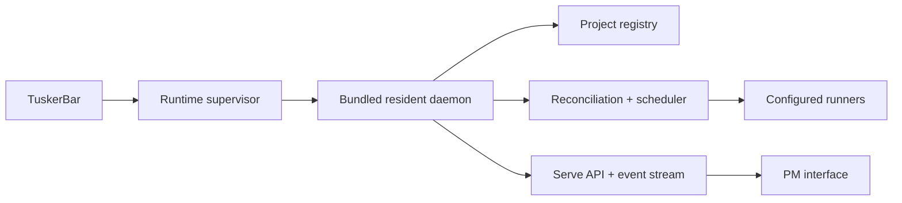

# Daemon, diagnostics, and recovery

## Runtime ownership

For the Mac product, TuskerBar is the normal supervisor:

Opening/reusing TuskerBar starts or reconnects to its bundled runtime. The user
should not run a separate `tusker daemon service start` for the normal desktop
workflow. A host service manager may keep another deployment alive, but it does
not own repository scheduling.

## Authority boundaries

- Daemon existence does not authorize a project.
- Registration does not enable project automation.
- Automation does not authorize a plan/wave.
- Plan authorization does not enable scheduled promotion.
- Promotion does not enable release.
- Release does not grant runner secrets to a model.

The daemon is the sole background dispatcher for enabled, authorized work. An
interactive user session implements its own explicitly requested work and never
starts nested workers or another daemon.

## Reconciliation model

The daemon:

1. receives targeted wakeups from Tusker CLI/API mutations;
2. incrementally reads the affected project and dependency closure;
3. reconstructs the runnable frontier from canonical task/dependency records;
4. checks project and wave authority;
5. resolves and health-checks the runner before claim;
6. enforces global/project/resource capacity fairly;
7. claims atomically;
8. launches the exact configured runner in an isolated workspace;
9. records typed progress, review, landing, completion, and successor unlock;
10. falls back to adaptive polling for raw edits, restart, or missed events.

Expected adaptive polling may use a hot/viewed/backoff cadence such as 5 s,
20 s, 60 s, 5 min, 10 min, and 30 min. This is an implementation detail shown
only in Diagnostics. Correctness cannot rely solely on UI presence or events.

## Health model

One project can be degraded without poisoning the whole factory.

| Health | Meaning | User surface |
|---|---|---|
| Healthy | Runtime connected; enabled project reconciles; required runners available | Quiet |
| Limited | One project/runner/capacity source degraded; unrelated work continues | Shell health + project attention if action needed |
| Offline | App cannot reach runtime | Persistent reconnect banner |
| Paused | Explicit operator pause | Neutral/blue state |
| Incompatible | Binary/schema/skill mismatch prevents requested capability | Named upgrade/fallback remedy |

## Run liveness

The system must not use “parked” as a bucket.

| State | Required facts | Behavior |
|---|---|---|
| Live | renewable lease, heartbeat, progress deadline | Healthy running |
| Intentional wait | reason, `next_wake_at`, wake source, deadline | Quiet until deadline |
| Human wait | gate, actor/action, affected closure | Needs attention |
| Infrastructure blocked | terminal attempt, failed dependency, bounded remedy | Loud once; no blind retry |
| Stalled/no progress | progress deadline exceeded | Escalate and stop/recover by policy |
| Retry scheduled | failure class, attempt/budget, next retry | Visible in detail |
| Exhausted | max attempts/TTL reached | Terminal, acknowledged repair required |
| Completed | typed result and receipt | Historical |

Heartbeats prove process liveness, not productive progress. An intentional wait
that misses its wake becomes stalled. An infrastructure-blocked attempt cannot
emit heartbeats forever to look healthy.

## Runner health before claim

Before creating a claim/attempt:

- resolve exact configured executable;
- inspect effective daemon PATH and explicit PATH policy;
- execute a safe version/capability probe;
- verify command shape, permissions, and required adapter features;
- compare installed capability manifest to task/plan need;
- report discovered alternatives without silently substituting them.

Failure produces:

- `infrastructure_blocked`;
- runner/profile;
- requested executable and provenance;
- effective PATH source;
- version/capability defect;
- one bounded remedy, such as “Use discovered Codex at …”;
- no modifying worker claim.

## Canonical worktree registration

Task records created from a linked worktree must be visible to the primary
control plane before boarding.

Normal behavior:

- one canonical control writer;
- write-through registration when automation is active;
- explicit interactive control path otherwise;
- atomic identity/state receipt;
- refusal before creating branch-local-only identity if canonical write is
  unavailable.

Diagnostic fallback may sweep known worktrees and report pending registrations.
It must not silently choose between conflicting identities.

## Retry, TTL, and discoverability

Every attempt/retrier has:

- owner/run ID;
- process identity where applicable;
- target command/script;
- start and last-progress time;
- max attempts and absolute TTL;
- backoff;
- next wake;
- terminal state;
- operator remedy.

A missing script is infrastructure failure. It does not recreate scratch space
and retry forever. `runs inspect`, Diagnostics, and `doctor` must identify the
owner/process and cancellation action.

## Scheduled departures

The resident daemon owns timetable evaluation and departure execution because
platform service managers may be unable to access repositories under protected
locations such as macOS `~/Downloads`.

It must provide:

- durable departure identity;
- deduplicated scheduled windows;
- candidate and expected main revision;
- boarding census with per-candidate readiness/reasons;
- atomic boarding/completion receipt bound to merge commit;
- gate/promotion/release timeline;
- crash/replay safety.

macOS privacy/TCC failure is a typed repository-access defect with instructions;
it is not “no cargo.”

## Diagnostics information architecture

Diagnostics is reached from project utility navigation or the health indicator.

### Health overview

Show only failed/degraded checks first:

- runtime;
- project reconciliation;
- runners;
- repository/workspaces;
- task registration;
- queue/capacity;
- delivery/promotion;
- configuration/capabilities;
- disk/network/platform permission.

If healthy:

> Everything required for this project is healthy.

Then a collapsed “All checks” list.

### Daemon detail

- ownership: TuskerBar, managed service, or manual;
- version/build/capabilities;
- connected since, last reconciliation, event freshness;
- pause/resume/restart;
- registry and state-root exact detail;
- effective global capacity;
- recent typed daemon events;
- no default raw logs.

Do not provide Start/Stop controls when TuskerBar owns lifecycle unless the app
can safely perform them and read back process identity. “Restart runtime” is the
normal repair.

### Runner health

Table:

- profile/role;
- harness/model/effort;
- executable source;
- version;
- permission mode;
- health;
- last probe;
- affected queued work;
- repair.

### Queue and capacity

- runnable deliveries/tasks;
- why each waits: dependency, project/global capacity, resource, paused,
  unauthorized, runner unhealthy;
- fair-share order/reason;
- active resource leases;
- retry/exhaustion.

This is a diagnostic projection, not a drag-and-drop scheduler.

### Run detail

- product outcome and task;
- claimed identity and workspace;
- liveness/progress;
- attempt timeline;
- typed events;
- bounded log excerpts;
- retry budget;
- interrupt/acknowledge/retry actions;
- exact process/lease data.

### Workspaces and worktrees

- canonical workspace;
- branch/base/head;
- clean/dirty/frozen;
- lease owner;
- disk use and retention;
- task registration visibility;
- safe cleanup preview.

### Capabilities

Render `tusker capabilities --json`:

- binary version/build;
- commands/subcommands/flags;
- schemas;
- runner adapters;
- optional compiled capabilities;
- deprecations/replacements.

Installed manifest is authoritative for callable behavior; documentation
describes intent.

### Doctor

`doctor` is a read-only divergence sweep covering:

- runner executable/PATH/version;
- stale attempts/missing targets;
- wait/heartbeat/progress deadlines;
- worktree-invisible task records;
- schema/binary/docs/skill skew;
- pending registration conflicts;
- boarding readiness;
- daemon ownership/process duplication;
- repository/TCC access;
- disk/resource floors;
- stale plan authorization and configured authority;
- notification delivery.

Each result has:

- stable code;
- scope/object;
- severity;
- observed versus expected;
- evidence summary;
- safe repair command/action;
- whether repair needs authority;
- last checked.

“Repair all” may batch only independently safe, previewed repairs. It never
enables automation, rewrites tasks, moves refs, waives gates, releases, or
changes permissions.

### Audit receipts

Searchable append-only receipts for:

- plan authorization;
- automation/promotion/release policy changes;
- task claims/completion;
- integration/promotion/release;
- human gates and overrides;
- destructive cleanup;
- configuration changes.

Default display is a human summary. Exact fingerprints and record IDs are
technical detail.

## Recovery actions

| Problem | Default repair |
|---|---|
| Runtime offline | Restart/reconnect bundled runtime |
| Duplicate daemon | Identify owners; stop only selected redundant process |
| Runner missing | Select explicit discovered executable or install/upgrade |
| Capability skew | Upgrade or choose supported fallback |
| Stalled run | Interrupt safely, preserve evidence, retry within budget |
| Missing script | Park terminally; update policy/task target before retry |
| Invisible task registration | Preview and register through canonical writer |
| Dirty/stale worktree | Preserve user changes; create clean workspace or guided cleanup |
| TCC denied | Explain exact macOS Full Disk Access/app permission path |
| Stale plan authorization | Review semantic diff and reauthorize |
| Impossible evidence gate | Dedicated human override if actor has authority |

## Acceptance

- Healthy runtime facts do not clutter normal navigation.
- Every divergence is typed and machine-readable.
- One broken repository or runner does not block healthy siblings.
- No attempt retries forever.
- Runner failure happens before claim.
- Worktree registration cannot be silently invisible.
- Diagnostics offers bounded remedies without weakening opt-in authority.
