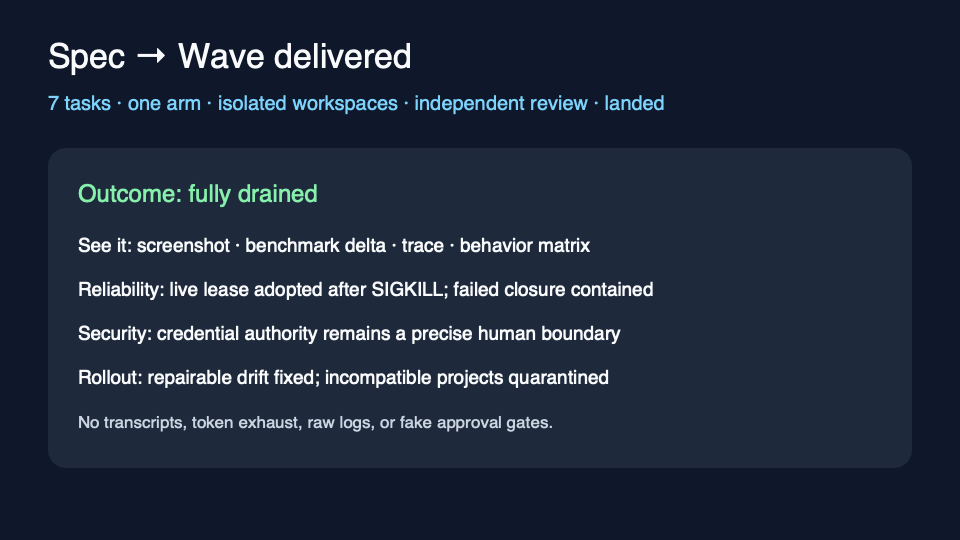

# Spec-to-wave delivery dogfood

The disposable process fixture imports seven tasks from one approved spec, arms
the wave once, drains serial and parallel frontiers in isolated worktrees,
dispatches independent review, lands through the integration lane, and emits a
fully drained artifact-first brief.

| Injection | Observed containment/recovery |
|---|---|
| Worker failure | Failed member parks at its attempt cap; only its hard closure stops and the independent branch lands. |
| Daemon `SIGKILL` | The restarted daemon adopts the live wrapper with the same PID, lease generation, and attempt count. |
| Material post-arm spec edit | Authorization projects `stale`; no implicit authorization is minted. |
| Credential gate | Exactly one Human action names the gate/action/resume ID; the unrelated branch lands. |

Rollout doctor uses the existing setup doctor once per compatible registration.
Missing or incompatible projects are quarantined with one action. Repair changes
only supported Tusker skill, workflow/runner, objective close-policy,
registration, and managed-service state; knowledge, tasks, secrets, unrelated
instructions/configuration, and handoff routing are preserved.

