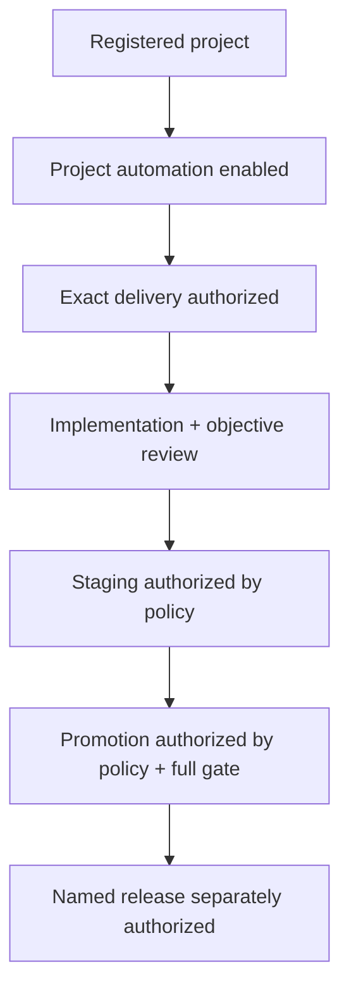

# Guardrails, authority, and confirmations

## Principle

Usability means removing clerical ceremony, not removing authority boundaries.
The system may hold, compare, and submit exact fingerprints without asking a
human to copy them. It may not infer permission to execute, promote, release,
spend, waive evidence, or mutate production.

## Authority layers

Every arrow is monotone and explicit. A lower layer never implies a higher one.

## Actor model

| Actor | May do | May not do |
|---|---|---|
| Human product owner | Approve intent/delivery, resolve decisions, configure within authority | Forge objective proof or impersonate reviewer |
| Human administrator | Machine/project policy, named override, service repair | Create silent unaudited exception |
| Interactive agent | Implement work explicitly requested in its session; record proof | Start daemon, dispatch nested workers, infer background authority |
| Dispatched implementation worker | Work one claimed task in exact workspace | Claim another task, review itself, move default branch |
| Independent reviewer | Read-only inspect/prove and submit typed verdict | Edit implementation or create passing proof by assertion |
| Resident daemon | Reconcile, claim, dispatch, land, unlock within policy | Invent product scope, cross opt-in boundaries |
| Deterministic integration/promotion handler | Move exact validated revisions within policy | Substitute candidates or release implicitly |
| Model triage | Classify ambiguous structured red failure when enabled | Receive secrets, promote, release, or mint scope |

## Authority matrix

| Action | Required authority | Receipt |
|---|---|---|
| Register project | Local human/explicit setup | Registration |
| Enable automation | Project policy actor | Config change |
| Authorize delivery | Human actor + exact reviewed identity | Delivery authorization |
| Claim task | Daemon + enabled project + authorized scope + health | Claim |
| Pass independent review | Configured reviewer + attempt-bound result | Review |
| Close objective task | Deterministic completion transaction | Completion |
| Stage reviewed work | Scheduled policy mode `stage` or above | Boarding/integration |
| Promote default branch | Mode `promote` + exact full-green candidate | Promotion |
| Release | Named profile + separate release authority | Release |
| Paid red triage | Explicit model-triage authority + quota | Paid launch |
| Human override | Named human authority + exact revision/reason | Override |
| Destructive cleanup | Human/admin + preview | Cleanup |

## Confirmation tiers

### Tier 0 — no confirmation

Read-only navigation, search, review, preflight, route preview, doctor, census,
capability discovery, copy link, mark notification read.

### Tier 1 — direct reversible action

One click plus immediate readback:

- pause/resume;
- retry a classified transient failure within budget;
- acknowledge settled failure;
- local UI preference;
- refresh/reconcile.

### Tier 2 — consequence review

Review sheet with changed values, scope, and consequences:

- enable/expand automation;
- change model/permissions;
- change capacity materially;
- start exact delivery;
- change staging/promotion mode;
- discard a leaf task;
- interrupt a live run;
- clean a safe workspace.

### Tier 3 — explicit high-authority confirmation

Named actor, reason, exact object/revision, expiry where relevant:

- release;
- human evidence/review override;
- destructive cascading discard;
- production mutation;
- force conflict resolution;
- cleanup with uncommitted changes;
- permission expansion to full access.

Do not use copy-a-hash confirmation. Typing a short object name is reserved for
irreversible, high-blast-radius destruction and is supplementary, not proof of
understanding.

## Exact plan authorization

The review response binds:

- plan identity and revision;
- governing spec/decision revisions;
- task set and dependencies;
- acceptance/proof/artifact contracts;
- effective routing and policy;
- human gates;
- exclusions.

The Start button submits those server-held values. The server revalidates
before import/arm. If changed, it returns a semantic diff. The UI never invents
or edits the fingerprint.

## Human gates

A human gate is valid only when it names:

1. missing capability, external authority, unresolved intent, or contractually
   subjective judgment;
2. why an implementation/reviewer agent cannot supply it;
3. exact human action;
4. verification that resumes work;
5. affected dependency closure.

Invalid human gates include routine code review, tests, logs, benchmarks,
choices already settled by a spec, and ordinary merge conflict handling.

## Human override

Independent review remains normal. When its runner/evidence environment is
irrecoverable, an authorized human must not be powerless.

The dedicated override requires:

- named locally accountable human authority;
- exact task and state revision;
- implementation revision;
- applicable proof/gate/review fingerprints;
- exact requirement overridden;
- concrete incident reason;
- optional expiry;
- downstream/integration risk preview.

Result state is `waived_by_human`, never `review_passed`. The receipt is
permanent and visible from task, delivery, Today/brief, and audit. It closes one
exact revision and grants no standing permission, automation, ref movement,
release, or spend.

Dispatched workers cannot mint or consume override authority by supplying an
actor string.

## Destructive actions

Before destructive mutation:

- resolve exact target;
- compute dependency/workspace/ref impact;
- preserve user changes where possible;
- show recoverability;
- refuse broad/unresolved paths;
- bind confirmation to the preview revision.

Material deletion reports what was removed and whether it can be recovered.
Repository/vault deletion is never bundled with “remove project.”

## Git and landing

- No worker pushes/merges directly to default branch.
- Each task has attributable source revision and isolated workspace.
- Landing uses serialized deterministic lanes.
- Boarding readiness includes clean/frozen revision, proof, review, gates,
  blocker, and claim health.
- Boarding/completion receipt binds exact merge commit atomically.
- Promotion binds expected default revision and rechecks immediately.
- Drift recomputes/refuses; never optimistic push.

## Proof and review

- Proof maps to acceptance.
- Process exit is not acceptance.
- Review result is typed and attempt-bound.
- Reviewer is read-only.
- Risk increases proof depth and safeguards, not implicit human approval.
- Broad/full gates are reusable only for the exact command/toolchain/tree
  fingerprint.
- Red integration is bisected/classified before model escalation.

## Permissions and secrets

- Runner permissions come from versioned profiles.
- Repository policy may narrow machine rules; broadening respects named
  authority.
- Built-in destructive/credential protections cannot be removed silently.
- Models receive handles or redacted context, never release credentials.
- Release profiles are locked and named; no arbitrary deploy-script textbox.
- Exact executable/PATH substitutions require explicit policy.

## Spend

- Launch/attempt quotas are enforceable.
- Paid model triage is separately opt-in and defaults off.
- Dollar caps are not presented as hard enforcement without trustworthy
  provider billing data.
- Spending hold is a notification-class event and blocks only affected paid
  launches.

## Fail-closed versus continue

| Failure | Behavior |
|---|---|
| Missing/malformed promotion config | Promotion disabled |
| Stale plan identity | No new scope; review again |
| Runner unhealthy before claim | No claim; infrastructure blocker |
| One project corrupt/unhealthy | Quarantine it; healthy siblings continue |
| One DAG branch failed | Park affected hard closure; independent branches continue |
| Event stream lost | Reconcile from canonical state |
| UI offline | Disable mutations; keep cached reads |
| Release failed | Main remains recorded; production outcome distinct |
| Human gate | Only affected closure waits |
| Attempt budget exhausted | Terminal escalation; no infinite retry |

## Audit

Every authority-changing action records:

- actor identity and authority source;
- timestamp;
- object and before/after revisions;
- policy/config version;
- reason;
- impact;
- exact result;
- linked evidence/receipt.

Audit records are append-only and searchable. UI copy may summarize them but
must not rewrite history.

## Acceptance

- No clerical confirmation substitutes for authority.
- A one-click PM path still binds exact revisions.
- Every broadened authority is explicit and read back.
- Human override is powerful, narrow, and impossible to disguise as proof.
- Release and secrets remain outside model authority.
- Failures contain blast radius and remain auditable.
