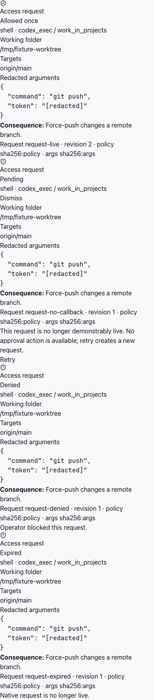

# Agent access approval UI

The routed fixture at 390px covers one immutable native request through `pending` → `allowed`, duplicate delivery deduplication, a no-callback request with no decision controls, and existing `denied`/`expired` informational states. The request displays the exact server-provided redacted arguments, working folder, resolved targets, route, policy fingerprint, argument digest, consequence, and state revision.

The keyboard journey focuses the pending card and presses Enter; no request is sent. The explicit Allow once action sends `requestId`, `expectedRevision`, and `decision: allow_once`. Block uses the same revision-bound response endpoint. Dismiss only hides the local card; it never settles the request. Dead requests expose Retry, which represents the existing task retry action and creates a new request.

This is source/fixture evidence only. It does not qualify native callback liveness, provider enforcement, or a live installed agent.
