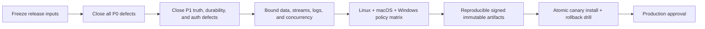

# Tusker production-readiness code review — 2026-08-09

> **Audit baseline, not current disposition.** The findings below intentionally
> preserve the pre-remediation review snapshot. Current implementation status,
> regression proof, residual debt, and the remaining human release gates are in
> [`production-hardening-implementation-2026-08-09.md`](production-hardening-implementation-2026-08-09.md).

> **Release decision: DO NOT DISTRIBUTE.** This checkout has three P0 stop-ship
> defects, twenty P1 production blockers, and eleven P2 hardening gaps. The most
> serious problems can mutate the wrong project, report durable UI success when
> nothing was persisted, or let an unvalidated release version escape the release
> directory and reach `rm -rf`/shell recipes.

## Review identity and limits

| Item | Value |
| --- | --- |
| Repository | Tusker |
| Reviewed commit | `efc8e5ad3679a003085db7469571d761cf110fce` (`main`, equal to `origin/main` at review time) |
| Checkout state | Dirty: 56 tracked changes and 27 untracked paths existed before this report |
| Review mode | Source-led, read-only audit; this report is the only file added by the review |
| Static checks | `git diff --check` passed; every tracked/untracked Go source was already `gofmt`-clean |
| Not run | Builds, tests, daemon, browser, network, release, installer, macOS signing, Windows execution |

The dirty tree matters. Findings describe the exact integrated checkout above,
including its in-progress hardening files; they are not a clean-HEAD certification.
Existing changes were preserved. Raw Tusker events, attempts, evidence, and runtime
logs were not opened.

The review sampled every major product boundary:

- Go CLI routing, configuration, runtime store and migrations, execution/ownership,
  leases, scratch retention, daemon, hooks, Serve API, streaming, and installation.
- React transport/query seams, app shell, task/docs/knowledge flows, operator actions,
  settings, accessibility primitives, and stream invalidation.
- Native macOS lifecycle, WebKit shell, SSE, notifications, daemon supervision,
  build/sign/install scripts, and application replacement.
- Go/UI/E2E tests, Make targets, GitHub Actions, release artifacts, installer trust,
  user/maintainer docs, and the existing production-readiness packet.

This is a broad production audit, not a claim that every branch of roughly 118k
non-test lines in `cmd/tusker` was exhaustively proven. Findings below require
deterministic tests before closure.

## Severity and release policy

| Level | Meaning | Release policy |
| --- | --- | --- |
| **P0** | Credible destructive behavior, wrong-authority mutation, or user-visible data loss | Stop all distribution work until fixed and adversarially tested |
| **P1** | Major correctness, durability, security, usability-truth, or release-integrity failure | Must close before production or public beta |
| **P2** | Bounded hardening, scale, accessibility, operability, or maintainability gap | Close before broad rollout; a named owner/date is required for limited dogfood |
| **P3** | Polish or low-consequence cleanup | May follow production launch |

## Executive scorecard

| Area | State | Why |
| --- | --- | --- |
| Correctness and authority | **Red** | A global run lookup can select another project's task with the same ID |
| Durability and product truth | **Red** | Primary Save/Approve/frontmatter/settings controls can claim success without persistence |
| Local security and privacy | **Red** | Runtime state is not owner-private by construction and Serve mutations have no capability authentication |
| Performance and scale | **Red** | Several runtime histories are unbounded; stream overflow drops state without replay |
| Accessibility and operator UX | **Amber/Red** | Dialog/drawer focus behavior is incomplete and several surfaces are development stand-ins presented as authoritative |
| Release and installer integrity | **Red** | Release input reaches recursive deletion; artifacts are unsigned, mutable, and installed non-atomically |
| Verification | **Red** | Current tree has no completed full-suite/platform/release proof; the latest recorded packet still says “Do not distribute yet” |

The production gate should be sequential. A green focused test is not permission to
skip a preceding gate.

---

# 1. Correctness, data integrity, security, and operations

## COR-01 — Global run lookup can mutate the wrong project **P0**

- **Evidence:** `cmd/tusker/run_runtime_commands.go:78-89` implements
  `FindRun(identity)` by loading every run and returning the first matching
  `ItemID` or `RecordID`. It has no project parameter. Authority-changing callers
  include `cmd/tusker/run_ownership.go:613-624` and lifecycle paths at
  `cmd/tusker/run_ownership.go:632-685`.
- **Failure:** two registered projects can both own `APP-T-0001`. Ordering by the
  global run list can route heartbeat, submit, fail, release, reclaim, or inspect
  to the other project. That is a cross-project authority violation, not merely an
  ambiguous display.
- **Change:** make `(project_id, record_id)` the canonical key at every boundary.
  Resolve the exact registered project from the requested vault/repository before
  lookup. Refuse unscoped identities when more than one project matches.
- **Acceptance:** seed two projects with the same task ID, invoke every lifecycle
  action for project B, and prove only B changes. A bare ambiguous ID must return a
  typed refusal without mutating either run.

## COR-02 — Runtime state is not private by construction **P1**

- **Evidence:** `cmd/tusker/helpers.go:290-312` writes text as `0644` and creates
  directories as `0755`. `OpenRuntimeStore` uses that helper and opens SQLite
  without an owner/mode/symlink preflight (`cmd/tusker/runtime_store.go:515-537`).
  A read-only spot check on the review host reproduced a `0755` state root and
  `0644` database/WAL/SHM under a normal `022` umask.
- **Failure:** another local account can read repository/workspace paths, runner
  and session identifiers, policy fingerprints, operational errors, and any other
  runtime metadata. Files created later inherit ambient umask instead of a stated
  security contract.
- **Change:** create the runtime root as `0700`; create database, WAL/SHM, control,
  status, request, and log files as `0600`; reject symlinked, non-owned, or
  group/world-writable existing roots. Provide a deliberate migration that tightens
  existing modes and reports anything it cannot secure.
- **Acceptance:** under umask `022`, initialize a fresh state root and assert every
  sensitive mode. Test insecure pre-existing directories, files, and symlinks and
  require fail-closed behavior with an actionable repair command.

## COR-03 — Loopback Serve is a privileged unauthenticated control plane **P1**

- **Evidence:** binding is correctly restricted to loopback
  (`cmd/tusker/serve_command.go:103-140`), but mutation protection only validates
  `Host` and rejects `Origin`/`Referer` when those headers are present
  (`cmd/tusker/serve_command.go:142-155`). Requests with neither header are
  accepted. The API exposes daemon, task, run, wave, review, and gate mutations.
- **Failure:** any same-user local process—or a request path that omits browser
  origin headers—can invoke privileged actions. “Localhost” limits network reach;
  it does not authenticate the caller.
- **Change:** issue a random per-install capability, expose it to the native/UI
  client through a narrow bridge or protected cookie/header, rotate it, and require
  it for every mutation. Keep strict same-origin, method, and content-type checks.
  Document the control-plane threat model.
- **Acceptance:** a mutation with loopback Host but no token and no Origin/Referer
  returns `401/403`; wrong/cross-origin tokens fail; a valid UI/native request
  succeeds. Include replay, rotation, and log-redaction tests.

## COR-04 — Hooks can exhaust memory and exfiltrate secrets into diagnostics **P1**

- **Evidence:** `runHooks` executes configured `sh -c` commands and calls unbounded
  `CombinedOutput`; failure/timeout context includes the full command and complete
  output (`cmd/tusker/config.go:138-173`). `defer cancel()` is also accumulated
  inside the loop rather than cancelled after each command.
- **Failure:** a noisy or malicious hook can allocate hundreds of MB/GB in the
  daemon/CLI. Hooks often print tokens; those values can be persisted or displayed
  in error JSON/logs together with the command text.
- **Change:** drain stdout/stderr through a hard byte cap (for example 64 KiB plus
  a truncation marker), cancel each context immediately, omit raw command text from
  user-facing errors, and apply centralized redaction before persistence/transport.
- **Acceptance:** a hook that emits 10 MiB remains within a measured memory bound;
  output is truncated deterministically; a seeded secret marker never appears in
  CLI JSON, API responses, runtime DB fields, or logs.

## COR-05 — Scratch deletion still races live writers and terminalization **P1**

- **Evidence:** the in-progress retention implementation explicitly records that a
  writer can land between revalidation and `RemoveAll`, and that a shared per-vault
  lock is still required (`cmd/tusker/scratch_retention.go:214-247`).
  `reapTaskScratch` deletes a task directory on close/discard paths
  (`cmd/tusker/scratch_retention.go:250-270`). Existing Tusker work
  `SGC-T-0004/0005` also tracks live-run and daemon/GC coordination.
- **Failure:** a directory planned as stale can become the current runner's output
  after the recheck and then be recursively deleted. A close/discard transition can
  erase live work if runner liveness and terminal authority are not fenced together.
- **Change:** use one per-vault retention lease honored by every writer, dispatcher,
  close route, and GC path. Refuse terminal transitions while an exact verified-live
  attempt owns the directory. Prefer atomic tombstone/rename followed by asynchronous
  deletion after ownership is released.
- **Acceptance:** deterministic barriers must force a writer/dispatch between scan,
  recheck, tombstone, and delete; live output survives. Exercise every close,
  discard, repair, and setup-GC route.

## COR-06 — Runtime migrations have no cheap, versioned upgrade boundary **P1**

- **Evidence:** every `OpenRuntimeStore` runs `Migrate`, duplicate reconciliation,
  uniqueness work, and expired-lease reconciliation
  (`cmd/tusker/runtime_store.go:515-543`). `Migrate` executes a large DDL list and
  many `PRAGMA table_info`/`ALTER` probes before bespoke migrations
  (`cmd/tusker/runtime_store.go:692-700`, `1064-1307`). The gate-ledger rebuild is
  transactional (`1337-1364`), but the overall schema evolution has no ordered
  version ledger in this path.
- **Failure:** every short CLI invocation pays schema/reconcile work and can contend
  with the daemon's single SQLite connection. A crash between independent migration
  phases leaves a partially advanced schema whose provenance and rollback path are
  unclear.
- **Change:** add monotonic schema versions, one transaction per migration, a cheap
  no-op when current, backup/integrity preflight for destructive rebuilds, and a
  documented forward/downgrade policy. Move routine reconciliation out of every
  store open unless correctness requires it.
- **Acceptance:** migrate fixtures from every supported historical version; inject
  failure between each step; reopen safely; verify `integrity_check`; restore the
  backup; and measure current-schema open latency under daemon contention.

## COR-07 — Corrupt attempt end state is silently treated as valid zero state **P2**

- **Evidence:** `ListAttemptsForRun` discards `json.Unmarshal` errors for
  `end_state_json` (`cmd/tusker/run_runtime_commands.go:92-112`).
- **Failure:** inspection and downstream policy can present incomplete provenance
  without warning, making a corrupt record indistinguishable from an intentionally
  empty end state.
- **Change:** return a typed decode error or mark the attempt explicitly invalid;
  authority-sensitive consumers must refuse it.
- **Acceptance:** insert malformed JSON and prove inspect/API output reports invalid
  provenance and no landing/close path treats it as a valid terminal record.

## COR-08 — One directive read bypasses SQLite busy retry **P2**

- **Evidence:** the store provides `queryRowScan` with `withBusyRetry`
  (`cmd/tusker/runtime_store.go:632-635`), but `RunDirective` calls
  `s.db.QueryRow` directly (`cmd/tusker/runtime_store.go:1816-1829`).
- **Failure:** transient writer contention can turn directive observation/expiry
  into a false failure and miss a one-shot dispatch window.
- **Change:** route the read through the retry/context wrapper and make the deadline
  observable.
- **Acceptance:** hold a write lock, release it inside the retry budget, and prove
  directive lookup succeeds; hold it beyond the budget and require a typed busy
  error with timing metrics.

## COR-09 — Runner completion depends on `python3` being on PATH **P2**

- **Evidence:** the generated shell script invokes `python3` to publish terminal
  status (`cmd/tusker/runner_exec.go:150-160`) even though runner PATH is configurable.
- **Failure:** the workload can finish but the status file is never written; the
  daemon then waits, reclaims, or misclassifies an otherwise completed attempt.
- **Change:** let the trusted Go parent atomically write terminal status after the
  child exits. Status-write failure itself must be a durable infrastructure outcome.
- **Acceptance:** remove `python3` from PATH, run success/failure/interrupt cases,
  and verify exactly one atomic terminal record with the correct exit code.

## COR-10 — HTTP error boundaries and resource/security headers are incomplete **P2**

- **Evidence:** standalone and embedded servers set only `ReadHeaderTimeout`
  (`cmd/tusker/serve_command.go:47-50`, `cmd/tusker/daemon_serve.go:49-57`). The
  panic recovery writes JSON even if a handler already committed output
  (`cmd/tusker/serve_command.go:209-215`). Static/API responses do not set a CSP,
  `frame-ancestors`/frame denial, `nosniff`, or referrer policy
  (`cmd/tusker/serve_command.go:418-491`).
- **Failure:** a local client can consume excessive connection/header/goroutine
  resources; panic-after-write can create mixed malformed bodies; framing and
  permissive content interpretation enlarge the control-plane attack surface.
- **Change:** set `MaxHeaderBytes`, bounded request admission, idle policy, and
  SSE-specific timeout behavior. Add security headers globally. Ensure errors are
  decided before commit, or log/close after a late panic without appending JSON.
- **Acceptance:** stress slow/large-header and many-connection clients while
  asserting bounded goroutines/memory; inject panic before/after commit; assert
  exact response headers on SPA, API, and SSE routes.

## COR-11 — Operational history is either missing or discarded abruptly **P2**

- **Evidence:** `ReleaseResourceLease` updates the lease and wakes waiters but does
  not append a release event (`cmd/tusker/resource_lease.go:417-439`). The launchd
  daemon writes stdout/stderr to one `daemon.log`
  (`cmd/tusker/daemon_service.go:68-82`) with no rotation in that path. The mac app
  deletes its only app-daemon log once it exceeds 1 MB
  (`apps/mac/TuskerBar/Sources/TuskerBar/RuntimeSupervisor.swift:299-313`).
- **Failure:** incident reconstruction misses attributable releases; the service log
  can grow without bound, while the app log can delete the evidence needed to
  diagnose a crash loop.
- **Change:** append lease-release events transactionally; use size/age/count-bounded
  rotation with redaction and owner-only modes; expose a diagnostic export that
  includes generation, truncation, and retention metadata.
- **Acceptance:** assert acquire/takeover/release event sequences, rotation across
  restarts, maximum disk use, retained crash evidence, permissions, and redaction.

---

# 2. Performance, scalability, and efficiency

## PERF-01 — Runtime list/inspection paths load unbounded history **P1**

- **Evidence:** `ListRuns` has no limit (`cmd/tusker/runtime_store.go:1745-1772`);
  attempts have no limit (`cmd/tusker/run_runtime_commands.go:92-112`); turns and
  external-loop events have no limits (`cmd/tusker/runtime_store.go:3027-3045`,
  `3284-3302`). `buildRunInspection` materializes every collection
  (`cmd/tusker/run_runtime_commands.go:115-148`). The store intentionally uses one
  SQLite connection (`cmd/tusker/runtime_store.go:519-525`).
- **Failure:** a long-lived project can make `/api/runs` or inspect allocate every
  row, monopolize the connection, stall daemon work, and eventually exhaust memory.
- **Change:** add cursor pagination and server-side default/hard caps; return totals
  separately; aggregate summaries in SQL; define retention/archive policy for
  high-cardinality attempts, turns, decisions, and external events. Do not “fix”
  this by blindly raising the SQLite connection count.
- **Acceptance:** seed more than each hard cap, assert stable cursor ordering and
  bounded response size, and record p50/p95/p99 latency, allocations, and daemon
  scheduling delay under concurrent reads/writes.

## PERF-02 — Stream backpressure drops clients without replay **P1**

- **Evidence:** each stream client has a 16-event buffer; overflow closes and
  removes the client (`cmd/tusker/serve_stream.go:14-17`, `73-101`). The web client
  reconnects with plain `EventSource` and only falls back to 45-second polling
  (`internal/serve/ui/src/lib/stream.ts:1-48`, `116-174`). The mac client tracks a
  last ID but does not send it on reconnect
  (`apps/mac/TuskerBar/Sources/TuskerBar/SSE.swift:69-99`).
- **Failure:** UI/native state can remain stale after a slow consumer or network
  gap; badge/notification state may not self-heal until another event or poll.
- **Change:** define an event cursor contract. Keep a bounded replay ring or durable
  stream ledger, honor `Last-Event-ID`, and force a full summary refresh when replay
  is unavailable. Count drops, replay misses, reconnects, and lag.
- **Acceptance:** disconnect, broadcast events, overflow the old buffer, reconnect,
  and prove both web and mac converge to the current summary without waiting for an
  unrelated event.

## PERF-03 — Project settings write on every keystroke **P1**

- **Evidence:** workspace mode and numeric concurrency call the mutation directly
  in `onChange`; transient numeric values become `Number(...)`
  (`internal/serve/ui/src/features/settings/ProjectSettings.tsx:152-163`). The hook
  allows concurrent calls and merely invalidates on settle
  (`internal/serve/ui/src/lib/queries.ts:100-105`).
- **Failure:** typing `12` can send transient values, and a slower older response can
  overwrite a newer one. Every key adds config writes, snapshot invalidation, disk
  I/O, and network churn.
- **Change:** edit a local validated draft and save explicitly, or debounce with a
  monotonic mutation token/CAS. Disable save while invalid; serialize writes; show
  authoritative readback and rollback on refusal.
- **Acceptance:** delay responses out of order while typing rapidly; final disk/API/UI
  state must equal the last valid submitted draft and request count must stay bounded.

## PERF-04 — The package/test architecture has become a feedback-loop bottleneck **P2**

- **Evidence:** `cmd/tusker` contains about 118k non-test and 71k test lines in one
  `main` package. Largest files include `daemon.go` (7,165 lines),
  `commands_v7.go` (4,087), and `runtime_store.go` (3,685). Make defaults package
  and test parallelism to one and serializes validation (`Makefile:15-23`).
- **Failure:** unrelated edits rebuild/retest one giant unit; global-state fixtures
  and serialization hide isolation problems and make broad proof slow enough to be
  deferred—the opposite of a reliable production loop.
- **Change:** use a strangler refactor, not a rewrite. Extract runtime-store,
  execution, Serve, release/install, and configuration packages behind narrow
  interfaces; replace process-global fixtures with injectable state; then raise
  safe test parallelism based on measurements.
- **Acceptance:** record baseline package build/test timing and flake rate, extract
  one boundary at a time with contract tests, and demonstrate reduced affected-test
  scope without changing CLI/API behavior.

---

# 3. Product usability, accessibility, and truthfulness

## UX-01 — Primary document Save is a no-op that reports success **P0**

- **Evidence:** `USE_MOCK` is false (`internal/serve/ui/src/lib/api.ts:54-55`), but
  the legacy docs editor explicitly says no backend is touched and implements local
  mock validation/CAS (`internal/serve/ui/src/features/docs/editor.ts:1-9`,
  `87-109`). `DocReader` wires its Save button directly to that local method
  (`internal/serve/ui/src/features/docs/DocReader.tsx:125-145`). A real docgraph
  save API already exists at `internal/serve/ui/src/lib/api.ts:398-415`.
- **Failure:** a user edits a task/spec, sees “saved” and a bumped revision, but disk
  bytes never change. Reload loses the edit. This is direct user-visible data loss.
- **Change:** remove/consolidate the mock editor and route all editable documents
  through one durable CAS endpoint with typed `409` conflict and `422` validation
  handling. Until then, make this reader explicitly read-only.
- **Acceptance:** edit through the UI, then verify API GET, on-disk bytes/hash, and a
  cold reload. Concurrent edits must produce a real conflict, never local theater.

## UX-02 — “Approve spec” falsely claims the gate is cleared **P1**

- **Evidence:** `DocReader` flips local `approved` state and renders “Spec approved ·
  gate cleared. Downstream tasks unblocked”
  (`internal/serve/ui/src/features/docs/DocReader.tsx:166-180`, `229-245`). It never
  calls the real `gateAction` API at `internal/serve/ui/src/lib/api.ts:313-319`.
- **Failure:** an operator believes work was authorized while the daemon still sees
  an open gate; or they proceed manually based on a false UI assertion.
- **Change:** require the exact gate ID, action, actor, reason/evidence, and backend
  result. Render “cleared” only from refreshed authoritative gate/task state.
- **Acceptance:** click Approve, inspect the gate endpoint and task readiness, reload,
  and prove state remains satisfied. A backend refusal/error must remain visibly open.

## UX-03 — Frontmatter mutations are always fake successes **P1**

- **Evidence:** `updateFrontmatter` always returns a delayed `{ok:true}` despite
  real mode (`internal/serve/ui/src/lib/api.ts:330-337`); the query hook then patches
  task/doc caches (`internal/serve/ui/src/lib/queries.ts:402-440`).
- **Failure:** properties appear saved during the session and revert on refresh,
  while other screens make decisions from optimistic fiction.
- **Change:** implement a validated CAS endpoint with provenance/readback, or disable
  the control and label it unavailable. Optimistic state must roll back on refusal.
- **Acceptance:** edit each supported field, reload/API-read/disk-read, and prove
  persistence; seed rejection and concurrent update cases and prove visible rollback.

## UX-04 — Global settings look authoritative but live only in component memory **P1**

- **Evidence:** density and defaults use local state despite “global” provenance
  (`internal/serve/ui/src/features/settings/app/GeneralSection.tsx:31-36`,
  `58-88`). Notification toggles/delivery are local-only with a persistence TODO
  (`internal/serve/ui/src/features/settings/app/NotificationsSection.tsx:15-49`).
  Permissions/profiles contain similar mock/TODO surfaces.
- **Failure:** users believe they changed runner defaults, permissions, density, or
  notification policy; remount/restart silently resets them. Security-sensitive
  permission UI can disagree with actual runtime policy.
- **Change:** connect every editable setting to the layered config authority and
  show winning source plus write destination. Hide/disable anything not supported;
  never label local component state “global.”
- **Acceptance:** change a setting, restart browser/native app/daemon, and prove the
  same effective value and provenance. Test managed/legacy/local overrides and
  denied writes.

## UX-05 — Mutation refusals are transport-success and easy to ignore **P1**

- **Evidence:** the API intentionally returns refusals in HTTP 200 bodies
  (`internal/serve/ui/src/lib/api.ts:70-83`). Project-settings failures return
  `{refused:true}` with 200 (`cmd/tusker/serve_actions.go:371-401`), while the
  settings mutation only invalidates on settle and shows no rollback/error state
  (`internal/serve/ui/src/lib/queries.ts:100-105`).
- **Failure:** an invalid or rejected change looks like a completed click, then
  flickers/reverts with no explanation. Operators cannot distinguish “accepted,”
  “refused,” and “transport failed.”
- **Change:** centralize `ActionResult` handling: accepted, refused, validation,
  conflict, and transport error are distinct typed states. Every mutation surface
  gets pending, success-from-readback, refusal reason, retry, and rollback UX.
- **Acceptance:** contract-test every action result variant and run UI tests proving
  no refused action emits a success toast/state.

## UX-06 — Dialogs and the mobile drawer do not manage focus completely **P2**

- **Evidence:** task search has `aria-modal` and autofocus but no trap/restoration
  (`internal/serve/ui/src/features/search/TaskSearch.tsx:43-64`, `137-167`). The
  sidebar focuses its `<aside>` but does not trap or restore focus
  (`internal/serve/ui/src/components/Sidebar.tsx:19-36`, `47-66`). The shared
  confirmation dialog handles Escape/Enter but also lacks trap/restoration
  (`internal/serve/ui/src/components/ui/action-feedback.tsx:130-205`).
- **Failure:** keyboard focus escapes behind an obscuring modal/drawer, and closing
  can strand focus, making repeated operator actions difficult or impossible.
- **Change:** build one tested dialog/drawer primitive using focus trap, `inert` or
  equivalent background suppression, initial-focus rules, Escape, and restoration
  to the invoking control.
- **Acceptance:** keyboard-only Tab/Shift-Tab cycles inside, Escape closes, focus
  returns to the trigger, and axe/screen-reader checks pass at narrow/wide layouts.

## UX-07 — macOS notification dedupe suppresses legitimate repeat events **P2**

- **Evidence:** notification identity is `taskID.kind` and an in-memory `delivered`
  set suppresses repeats (`apps/mac/TuskerBar/Sources/TuskerBar/Notifications.swift:16-27`,
  `45-58`).
- **Failure:** a task that needs attention twice for the same event kind only alerts
  once for the app lifetime.
- **Change:** dedupe by immutable event ID or explicit state transition with a
  bounded time window; persist only the minimum bounded history needed across restart.
- **Acceptance:** two distinct same-task/same-kind events both notify; replay of the
  same event does not; restart and pruning behavior are deterministic.

## UX-08 — Production trust boundaries retain development shortcuts **P2**

- **Evidence:** Markdown links pass `href` directly even though a safety helper is
  available (`internal/serve/ui/src/features/docs/Markdown.tsx:139-158`). The mac
  release WebView is inspectable on every build
  (`apps/mac/TuskerBar/Sources/TuskerBar/MainWindowController.swift:25-40`).
- **Failure:** link-scheme policy is implicit in third-party renderer defaults, and
  production users can open Web Inspector against a privileged local control UI.
- **Change:** enforce an explicit allowlist for HTTP(S), mail, and supported internal
  routes; add `noopener`/`noreferrer`; reject `javascript:`, `data:`, and ambiguous
  schemes. Gate Web Inspector behind `DEBUG` or an explicit developer preference.
- **Acceptance:** malicious-link unit/browser tests and a release-build assertion
  that inspection is unavailable by default.

## UX-09 — Capability and documentation surfaces lie about what is real **P1**

- **Evidence:** `internal/serve/ui/BACKEND-GAPS.md:3-30` describes the UI as a
  front-end mock and line 102 says `USE_MOCK=true`, while current code sets it false.
  Several settings/editor controls remain local stand-ins. Separately,
  `docs/system/serve-ui.md:18-33` says Serve is read-only, writes nothing, and loads
  a fresh snapshot per request, even though the same doc lists POST actions and the
  server returns cached snapshots for up to/background-refreshes after 30 seconds
  (`cmd/tusker/serve_command.go:494-650`). The diagram still says “reads, never
  writes” (`docs/system/serve-ui.md:153-164`).
- **Failure:** users underestimate the threat model and staleness; maintainers cannot
  tell which screens are durable; stale handoff docs encourage duplicate/mock work.
- **Change:** publish one machine-readable capability registry consumed by routes,
  UI controls, docs, and tests. Classify every surface as authoritative mutable,
  authoritative read-only, cached projection, local preference, or unavailable.
  Delete/supersede stale mock-era docs.
- **Acceptance:** a drift test compares exposed routes/controls to capabilities and
  generated docs; every unsupported mutation is hidden/disabled and every cached
  view states its freshness/reconnect behavior.

---

# 4. Maintainability, testing, documentation, and release engineering

## REL-01 — Unvalidated release version reaches recursive deletion and shell **P0**

- **Evidence:** `RELEASE_VERSION` becomes `RELEASES_DIR`
  (`Makefile:8-10`), then reaches `rm -rf`, paths, archive names, and `go build`
  ldflags (`Makefile:135-154`). There is no validation or containment check.
  `VERSION` is similarly interpolated into a shell/ldflags recipe
  (`Makefile:28-36`).
- **Failure:** `RELEASE_VERSION=../../some-dir` deterministically escapes
  `dist/releases` and can delete an unintended directory. Backticks or shell
  metacharacters in a caller-supplied version can be interpreted after Make expands
  the quoted recipe.
- **Change:** validate an exact release grammar (for example strict `vMAJOR.MINOR.PATCH`
  with explicitly supported prerelease syntax) before any path/recipe expansion.
  Move release assembly to a script that receives data as arguments, canonicalize
  the destination, and assert it is a child of `dist/releases`. Never recursively
  delete an unresolved input-derived path.
- **Acceptance:** adversarial tests for `../`, absolute paths, empty/whitespace,
  backticks, shell metacharacters, Unicode confusables, and overlong tags; no test
  may create/delete/execute outside a temporary release root.

## REL-02 — Artifacts are unsigned, archives are unconfined, and releases are mutable **P1**

- **Evidence:** the installer downloads archive and checksum from the same release
  and verifies SHA-256 only (`scripts/install.sh:148-243`). It extracts with plain
  `tar -xzf` (`scripts/install.sh:245-249`). The release workflow overwrites assets
  on rerun with `--clobber` (`.github/workflows/release.yml:51-60`).
- **Failure:** compromise of the release account/workflow can replace both archive
  and checksum under the same tag; “latest” then serves different bytes. Archive
  confinement is delegated entirely to the platform `tar`; Tusker does not prove
  that traversal, absolute paths, hard links, or symlink chains remain inside the
  temporary extraction root.
- **Change:** sign artifacts and provenance (Sigstore/minisign or equivalent), pin
  verification trust in the installer, publish SBOM/attestations, validate the full
  tar member list and symlink targets before sandboxed extraction, and make tagged
  assets immutable. A rerun must compare digests and fail closed.
- **Acceptance:** signature/key/checksum mismatch, traversal, absolute member,
  symlink escape, duplicate member, and existing-release rerun tests all fail without
  changing the install target.

## REL-03 — CLI and macOS upgrades are destructive/non-atomic **P1**

- **Evidence:** the shell installer copies directly to the final binary path with no
  backup or post-install health check (`scripts/install.sh:245-250`). The mac app
  removes the current application before `ditto` and verification
  (`apps/mac/TuskerBar/scripts/install-app.sh:27-30`); bundle build also deletes the
  previous bundle first (`apps/mac/TuskerBar/scripts/build-app.sh:15-21`).
- **Failure:** interruption, disk-full, copy, or codesign failure leaves a truncated
  binary or no working app and no rollback.
- **Change:** stage on the same filesystem, fsync, verify signature/hash/version and
  a bounded health command, atomically rename/swap, retain one known-good version,
  and restore it automatically on launch failure.
- **Acceptance:** inject failure/termination at every phase and prove either the old
  or new version is complete and executable; exercise explicit rollback.

## REL-04 — Release artifacts are not reproducible **P1**

- **Evidence:** release builds use ordinary `go build` and `tar -czf` with current
  file mtimes, gzip timestamps/default metadata, Go build IDs, and host paths
  (`Makefile:135-154`). No `SOURCE_DATE_EPOCH`, `-trimpath`, normalized uid/gid/mode,
  or provenance binds output to source/toolchain.
- **Failure:** two builds from the same commit can hash differently, weakening
  review, incident response, mirroring, and third-party verification.
- **Change:** pin toolchains, derive timestamp from the signed commit/tag, use
  `-trimpath` and deterministic build metadata, normalize archive ordering/modes/
  uid/gid/mtime, and emit build provenance.
- **Acceptance:** two clean isolated runners build the same tag and produce identical
  hashes for every artifact and SBOM; embedded version/commit/toolchain are inspectable.

## REL-05 — CI does not prove the supported platform/product matrix **P1**

- **Evidence:** CI is one Ubuntu job (`.github/workflows/ci.yml:12-43`). All three
  E2E suites are `//go:build !windows`. No macOS TuskerBar/launchd/install smoke,
  Windows execution, race lane, retained test reports, or explicit release canary is
  present in the two workflows.
- **Failure:** platform-specific filesystem, process, socket, signing, notification,
  and installer bugs can ship despite green Linux source tests.
- **Change:** publish an explicit support policy. For supported targets, run Linux,
  macOS, and Windows lanes; critical Go race tests; E2E; UI/browser/accessibility;
  mac app/launchd smoke; installer/archive/adversarial tests; and retain reports/logs.
- **Acceptance:** required-check policy blocks release on every matrix lane. An
  intentionally broken platform fixture must demonstrably fail the corresponding gate.

## REL-06 — Release workflow trust and permissions are too broad **P1**

- **Evidence:** any `v*` tag triggers publication; the workflow grants
  `contents:write` globally and uses mutable action tags such as
  `actions/checkout@v6`, setup actions, and artifact actions
  (`.github/workflows/release.yml:3-20`, `34-60`; CI has the same pinning pattern).
  There is no protected-branch/tag/signature/provenance check before publish.
- **Failure:** action-tag compromise or any actor able to create a matching tag can
  obtain a release path; the build job has more privilege than needed.
- **Change:** pin actions by reviewed commit SHA, set job-level least privilege,
  split unprivileged build from protected publish, require a signed protected tag
  pointing to an approved main commit, and use an environment approval for production.
- **Acceptance:** untrusted branch/tag and unsigned/wrong-base tag simulations cannot
  reach publish; the build job token cannot create or mutate releases.

## REL-07 — No automated dependency, license, SBOM, or vulnerability policy **P2**

- **Evidence:** Go and Bun lockfiles exist, but the workflows contain no scheduled or
  release-blocking `govulncheck`/OSV-equivalent, dependency-update automation, license
  policy, SBOM, SAST, or artifact attestation.
- **Failure:** known vulnerable or policy-incompatible dependencies can remain
  invisible and ship; there is no component inventory for incident response.
- **Change:** add scheduled scans and release gates with severity/SLA thresholds,
  generated SPDX/CycloneDX SBOMs, signed attestations, and a documented exception
  process with expiry.
- **Acceptance:** a seeded forbidden license/vulnerable fixture fails CI; a release
  contains verifiable SBOM/provenance tied to exact artifact digests.

## REL-08 — Maintainer entrypoints advertise commands that cannot work **P1**

- **Evidence:** `make docs-export`, `docs-dev`, `docs-build`, and `docs-check` call
  `tusker docs ...` (`Makefile:165-176`), while CLI routing marks those commands
  legacy-only (`cmd/tusker/cli.go:535-550`) and the implementations return removed-
  surface errors (`cmd/tusker/removed_surfaces.go:24-34`). `make install` always
  depends on `mac-install` (`Makefile:119-124`) even though `scripts/install.sh`
  documents macOS and Linux support.
- **Failure:** documented happy paths are guaranteed failures; Linux maintainers can
  enter macOS Swift/codesign/open scripts through a generic install target.
- **Change:** remove dead targets or point them at the real publication pipeline;
  split `install-cli`, `install-user`, and `install-mac-app`; guard platform-specific
  targets and make help/support output authoritative.
- **Acceptance:** CI smoke-runs every advertised Make/CLI help example on its supported
  platform; removed commands are absent or give one exact migration path.

## REL-09 — Monolith and duplicate surfaces invite contract drift **P2**

- **Evidence:** the 118k-line production `cmd/tusker` package combines storage,
  migrations, execution, Serve, docs, install, release helpers, and CLI routing.
  The UI has both legacy docs/editor and newer docgraph/editor paths, mock-era API
  comments beside live transport, and reference-only settings that resemble real ones.
- **Failure:** a contract change can update one caller/screen/doc while leaving
  another silently stale—as the fake Save and broken Make targets demonstrate.
- **Change:** establish package ownership and one source per contract: generated CLI
  capabilities/schema, a single UI API client, a single document editor, shared
  action-result semantics, and architecture tests that prohibit backwards imports.
- **Acceptance:** dependency/route/capability drift tests run in CI; each extracted
  domain has a narrow public API and an owner; duplicate legacy surfaces are deleted.

## REL-10 — There is no current green production proof **P1**

- **Evidence:** `docs/reports/production-readiness-2026-07-31.md:20-33` records one
  focused lane passing, one repaired lane pending rerun, five focused config failures,
  and the full package/repository validation/doctor/archive smoke still pending. It
  explicitly concludes “Do not distribute yet.” The current tree has changed
  substantially since that packet and was not executed during this review.
- **Failure:** shipping from focused or historical proof conflates source intent with
  integrated behavior. Dirty-tree results cannot be silently transferred to a tag.
- **Change:** freeze a candidate commit, run the complete gate below from clean
  isolated environments, retain machine-readable results bound to commit/artifact
  hashes, and require explicit human release approval.
- **Acceptance:** every gate is green on the exact candidate; rerunning from clean
  clones produces the same results/artifacts; no “pending,” “repaired pending rerun,”
  dirty marker, or unreviewed exception remains.

---

# Fix order: turn findings into executable work

## Wave 0 — Stop making the hole deeper

1. Disable/publicly block release publication and hide fake durable UI mutations.
2. Freeze one candidate base; inventory and reconcile the 83 pre-existing working-
   tree paths rather than testing an accidental mixture.
3. Convert every P0 and P1 below into a task with one owner, exact owned paths,
   deterministic acceptance, dependency links, and review authority. Reconcile with
   existing `PRH-T-0001..0004` and `SGC-T-0004..0005`; do not duplicate them blindly.

## Wave 1 — P0 authority, data-loss, and destructive-input fences

1. `COR-01`: project-scope every run identity and lifecycle mutation.
2. `UX-01`: disable the fake editor immediately, then wire real CAS persistence.
3. `REL-01`: validate/canonicalize release versions before any delete/build recipe.
4. Add adversarial regression tests first; prove the old failure scenarios fail on
   the old code and pass on the repair.

## Wave 2 — P1 durability, truth, and local security

1. Owner-private runtime state and authenticated Serve mutations.
2. Real gate/frontmatter/settings actions with shared refusal/readback UX.
3. Scratch writer/GC/close coordination and versioned database migrations.
4. Bounded hook output/redaction and paginated runtime histories.
5. Replayable/convergent streaming for web and mac clients.

## Wave 3 — Release system and platform proof

1. Atomic rollback-safe installers and immutable signed artifacts.
2. Reproducible builds, SBOM/provenance, pinned workflows, protected tags.
3. Linux/macOS/Windows-policy CI, race/E2E/UI/a11y/mac app/install lanes.
4. Remove broken Make/help paths and generate capability/docs drift checks.

## Wave 4 — Scale and experience hardening

1. Extract package boundaries and raise safe test parallelism from measured baselines.
2. Central dialog/drawer accessibility, notification lifecycle, safe links, release
   WebView policy, bounded logs, and attributable operational history.
3. Run load/soak, crash injection, database backup/restore, upgrade/downgrade, and
   interrupted-install drills.

---

# Production exit gate

The release candidate is ready only when all of the following are true on the exact
clean candidate commit and exact artifact hashes:

- [ ] All P0 and P1 findings above are closed with reviewed deterministic regression tests.
- [ ] Ambiguous cross-project identities refuse; every mutation is explicitly project-scoped.
- [ ] UI Save/Approve/frontmatter/settings outcomes survive cold reload and authoritative disk/API readback.
- [ ] Runtime root/database/WAL/SHM/socket/status/log modes pass owner/symlink preflight.
- [ ] No-token, wrong-token, cross-origin, malformed, replayed, and over-limit control requests fail closed.
- [ ] Runtime list/inspect APIs enforce stable cursor pagination and hard response budgets.
- [ ] Stream disconnect, overflow, daemon restart, and replay-miss tests converge web and mac state.
- [ ] Migration fixtures, crash injection, SQLite integrity, backup restore, and downgrade policy pass.
- [ ] Hook/log/diagnostic secret redaction and byte/disk retention tests pass.
- [ ] `git diff --check`, formatting, vet/lint, focused tests, `go test ./cmd/tusker`, `go test ./...`, UI tests/build, validation, and strict skill doctor pass.
- [ ] Supported Linux/macOS/Windows lanes, race, E2E, browser/a11y, mac app/launchd, and installer smoke pass with retained reports.
- [ ] Two clean builders produce identical artifact hashes; signature, SBOM, provenance, and tag/commit binding verify offline.
- [ ] Malicious archive and release-version suites pass; release assets are immutable.
- [ ] Interrupted CLI/mac upgrades preserve either a verified old or verified new install, and rollback is proven.
- [ ] CLI help, Make targets, installer docs, capability registry, and Serve threat/freshness documentation agree.
- [ ] A canary upgrade/rollback and 24-hour soak complete without unbounded DB/log/memory growth or lost stream state.
- [ ] Human release authority reviews the retained proof and explicitly approves distribution.

Until then, the honest product state is **internal development/dogfood with destructive
and fake-durability surfaces disabled**, not production or “prime time.”
