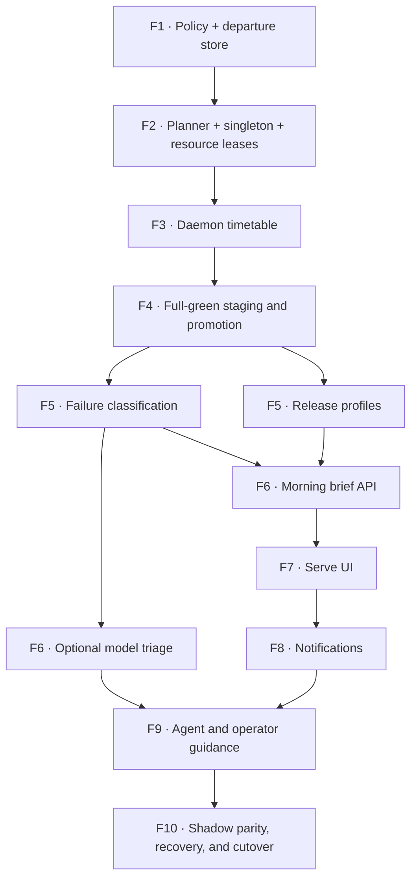

# Execute the Opt-in Scheduled Promotion Wave

This runbook turns the accepted scheduled-promotion specification into an
executable Tusker delivery. It is deliberately fail-closed: copying a prompt,
importing a plan, registering a repository, or starting Serve does not
authorize implementation or scheduled promotion.

## What exists

- Governing contract:
  `docs/specs/12-opt-in-scheduled-promotion.md`
- Versioned DAG:
  `docs/plans/12-opt-in-scheduled-promotion-v1.yaml`
- Imported wave:
  `W-0001 · Opt-in scheduled promotion`
- Imported tasks:
  `ORC-T-0014` through `ORC-T-0028`
- Concurrency ceiling: `3`
- Integration branch: `integration/W-0001`

This is the new delivery-plan DAG format (`tusker.delivery-plan/v1`). The
source-keyed plan is reviewable and repeatable; Tusker owns final task IDs,
relations, wave membership, and the authorization fingerprint.

## Why this is one wave

The ten rows below are dependency frontiers, not ten separately authorized
waves. That distinction is intentional.

A literal ten-wave rollout would require ten human arm actions and could leave
the railway half-built between phases. One wave lets the operator authorize
the complete reviewed scope once. The daemon then releases only the current
frontier, waits for proof, review, and landing, and unlocks the next frontier.
A material edit to the specification, a task contract, a dependency, or a gate
invalidates the authorization fingerprint and stops new claims.



| Frontier | Runnable tasks | Exit condition |
| --- | --- | --- |
| 1 | `ORC-T-0014`, `ORC-T-0015` | Default-off policy and restart-safe departure records are independently proven and landed. |
| 2 | `ORC-T-0016`, `ORC-T-0017`, `ORC-T-0019` | Read-only planning, zero-ceremony singleton delivery, and global resource leases are proven. |
| 3 | `ORC-T-0018` | The resident daemon owns timetables, holds, misfires, and duplicate-trigger convergence. |
| 4 | `ORC-T-0020` | Reviewed work stages through existing landing machinery and only a frozen full-green candidate may move main. |
| 5 | `ORC-T-0021`, `ORC-T-0023` | Red evidence is deterministically classified and release is a separate named authority boundary. |
| 6 | `ORC-T-0022`, `ORC-T-0024` | Ambiguous-only paid triage and the three-list morning projection are proven. |
| 7 | `ORC-T-0025` | Serve exposes the morning screen and explicit opt-in controls. |
| 8 | `ORC-T-0026` | Only red promotion, failed release, and spending hold can notify. |
| 9 | `ORC-T-0027` | Canonical skill and project guidance teach the final operating contract. |
| 10 | `ORC-T-0028` | Default-off safety, shadow parity, crash recovery, singleton delivery, contention, cutover, and rollback pass end to end. |

## Current launch status

As of 2026-07-25, the plan and task contracts validate, but `W-0001` is not
safe to arm:

- the wave is disarmed and every member is held in `backlog`;
- the Tusker project is registered but runtime-disabled;
- `.tusker/WORKFLOW.md` and `tusker.yaml` also have automation disabled;
- the configured workspace strategy is the legacy shared workspace;
- the unattended Codex approval policy can pause for routine approval;
- the managed daemon is not installed or running;
- `integration/W-0001` is not a clean branch at the current `main`;
- the effective workflow cannot pass the current wave-authorization preflight;
- the planning files and imported records are not yet tracked in Git.

Starting only the daemon will therefore do nothing useful. Enabling only the
project will still not authorize this wave. Arming before a green preflight is
rejected.

## Copy-paste prompt: prepare unattended execution

Paste this into a new interactive Codex task in the Tusker repository. This
prompt prepares the railway but intentionally does not turn it on.

```text
Use the installed Tusker skill and work in
/Users/sarav/Downloads/side/tusker.

Prepare delivery wave W-0001 for unattended execution. This is an interactive
setup task, not authorization to implement the scheduled-promotion feature.

Read:
- docs/specs/12-opt-in-scheduled-promotion.md
- docs/plans/12-opt-in-scheduled-promotion-v1.yaml
- docs/runbooks/execute-opt-in-scheduled-promotion-wave.md
- tusker show W-0001 --json
- tusker wave preflight W-0001 --json

First inspect the live Git, project-registration, daemon, runner, workflow,
workspace, skill, integration-branch, and queue state. Do thought experiments
for: a dirty main checkout, a stale integration/W-0001 branch, unrelated
ready/rework tasks, a daemon restart, and a worker that needs routine approval.

Resolve only repo-local preflight defects:
- use a supported isolated worktree strategy;
- use a canonical unattended runner;
- make the unattended approval policy non-blocking without widening extension,
  MCP, release, secret, or network authority;
- preserve automation as default-off until the final operator step;
- make integration/W-0001 a clean, attributable base for the current main
  without discarding unmerged user work;
- keep the spec, delivery plan, imported wave, and imported task contracts
  internally consistent and ready for the operator's reviewed commit;
- preserve unrelated dirty files and existing tasks.

Do not run tusker daemon run, tusker daemon service install/start,
tusker automation dispatch, tusker projects enable, tusker wave arm, tusker
land, or any release command. Do not implement ORC-T-0014 or later tasks.

Validate with:
- tusker setup doctor --json
- tusker validate --json
- tusker delivery import --plan
  docs/plans/12-opt-in-scheduled-promotion-v1.yaml
  --wave "Opt-in scheduled promotion" --dry-run
- tusker delivery rollout doctor --json
- tusker wave preflight W-0001 --json

Some preflight failures are expected while the daemon and project remain
intentionally off. At the end, report:
1. every file changed and why;
2. every validation result;
3. the exact remaining non-green preflight checks;
4. whether any unrelated ready/rework task would dispatch if automation were
   enabled;
5. the exact human commands to enable, start, preflight, and arm safely.

Do not commit, push, enable automation, start the daemon, or arm the wave unless
the user explicitly asks in that task.
```

## Human launch sequence

Run this only after reviewing and committing the preparation changes. This
sequence is intentionally not one blind shell block; inspect each JSON result
before continuing.

### 1. Confirm the contract and queue

```bash
cd /Users/sarav/Downloads/side/tusker
tusker setup doctor --json
tusker validate --json
tusker delivery rollout doctor --json
tusker automation queue --repo . --json
git status --short
```

Do not continue with an unexplained dirty tree, an unrelated dispatchable task,
an unsupported runner, a shared workspace, or a routine approval requirement.
The specification, plan, imported tasks, wave record, and this runbook must
exist on the base branch that isolated workers will receive.

### 2. Explicitly enable ordinary task automation

In a reviewed commit, explicitly change both current repository-owned
configuration sources:

- `tusker.yaml`: `automation.enabled: true`
- `.tusker/WORKFLOW.md`: `automation_enabled: true`

Then enable the runtime registration while the daemon is still off:

```bash
tusker projects enable --repo . --json
tusker projects list --json
tusker automation queue --repo . --json
```

This is the first opt-in. It authorizes eligible ordinary Tusker tasks in this
repository to be dispatched; it does not arm `W-0001`, enable the future
scheduled-promotion feature, authorize a release, or authorize paid triage.

If the queue contains unrelated work, or either configuration source still
resolves automation to disabled, disable the project and resolve that scope
before starting the service:

```bash
tusker projects disable --repo . --json
```

### 3. Start the independently managed daemon

The repository lives under macOS `Downloads`, so first grant the installed
Tusker binary Full Disk Access. Then install the managed service with the
protected-project acknowledgment:

```bash
tusker daemon service install --allow-protected-projects --json
tusker daemon service status --json
tusker daemon status --json
```

Do not run this from an interactive agent session. The human operator starts
the independently resident service.

### 4. Preflight and arm exactly once

```bash
tusker wave preflight W-0001 --json
```

Continue only when the response has `ok: true` and all checks are true. Then:

```bash
tusker wave arm W-0001 --by human:sarav
tusker wave show W-0001 --json
```

Arming promotes the first held frontier to runnable and binds authorization to
the current material fingerprint. The daemon, not the interactive session,
claims the tasks.

## Copy-paste prompt: manually implement the first policy task

Use this only if you deliberately choose interactive execution instead of the
daemon. The wave must already be validly armed, or the task must otherwise be
runnable through an explicit Tusker lifecycle decision.

```text
Use the installed Tusker skill and work only on ORC-T-0014 in
/Users/sarav/Downloads/side/tusker.

Inspect the live owner first. Read `tusker show ORC-T-0014 --capsule` and
`tusker packet ORC-T-0014 --for agent`. If another live owner holds it, stop
and report the conflict. Otherwise claim it through Tusker and implement every
acceptance criterion in the task contract.

The governing rule is fail-closed opt-in: absent configuration and disabled
mode must preserve current behavior and cause no timetable evaluation, Git
access, model launch, ref mutation, release, or feature-generated runtime
record. Shadow, stage, and promote are monotone permissions. Promotion must
not imply release or paid model triage. Fresh init and migration remain
disabled by default and configuration inspection must show effective
provenance.

Search before editing. Preserve compatibility for repositories that do not use
scheduled promotion. Add the exact focused behavior-matrix proof required by
the task. Run the task's verification command, record proof against the
acceptance IDs, write the bounded knowledge delta required for a high-risk
task, and finish with an independent review request.

Do not work on another wave member, start or install the daemon, dispatch
nested workers, arm/disarm the wave, land the wave, move main, enable release,
or enable paid model triage.
```

## Copy-paste prompt: manually implement the first storage task

`ORC-T-0015` is independent of `ORC-T-0014`, so a second interactive task may
work it concurrently after valid authorization.

```text
Use the installed Tusker skill and work only on ORC-T-0015 in
/Users/sarav/Downloads/side/tusker.

Inspect the live owner first. Read `tusker show ORC-T-0015 --capsule` and
`tusker packet ORC-T-0015 --for agent`. If another live owner holds it, stop
and report the conflict. Otherwise claim it through Tusker and implement every
acceptance criterion in the task contract.

Build the first-class restart-safe departure runtime record. It must capture
the scheduled window and exact candidate/gate/promotion/release facts, prevent
duplicate creation across concurrent triggers and restarts, reject stale state
writers with compare-and-swap semantics, and reconcile incomplete states
without repeating a committed ref or release action.

Use the existing runtime-store conventions rather than inventing a second
database or representing a departure as a fake task attempt. Search before
editing. Add the exact persistence, race, stale-writer, and restart proof
required by the task. Run the task's verification command, record proof
against the acceptance IDs, write the bounded knowledge delta required for a
high-risk task, and finish with an independent review request.

Do not work on another wave member, start or install the daemon, dispatch
nested workers, arm/disarm the wave, land the wave, move main, enable release,
or enable paid model triage.
```

## Monitor, pause, and recover

Normal monitoring is read-only:

```bash
tusker wave show W-0001 --json
tusker wave brief W-0001
tusker automation status --json
tusker automation queue --repo . --json
tusker daemon status --json
```

Pause future claims without killing active attempts:

```bash
tusker wave pause W-0001 --reason "operator-requested investigation"
```

Resume after inspecting the fingerprint and blockers:

```bash
tusker wave preflight W-0001 --json
tusker wave resume W-0001 --by human:sarav
```

Withdraw authorization:

```bash
tusker wave disarm W-0001 --reason "scope withdrawn"
```

Turn off daemon pickup for this repository:

```bash
tusker projects disable --repo . --json
```

Stop the resident service only when the operator intends to affect all
registered projects:

```bash
tusker daemon stop --drain --json
```

## What “take it to completion” means

After a green preflight and one explicit arm, the intended behavior is:

1. dispatch only the current dependency frontier;
2. isolate each implementation workspace;
3. require task-specific proof;
4. run independent review and bounded rework;
5. land accepted task branches into `integration/W-0001`;
6. unlock the next frontier;
7. run the serialized integration gate;
8. land the fully drained wave through the configured landing policy.

The daemon does not promise that every scope must succeed. It promises that
machine-solvable work keeps moving and that failures become truthful durable
state. It must park instead of guessing when it reaches a human gate, an
exhausted attempt cap, an authorization fingerprint change, an unsafe merge,
missing credentials, or a failed objective gate.

That is the right semantics for “hope it takes it to completion”: autonomous
progress where authority and evidence are sufficient, an actionable brief
where they are not.
