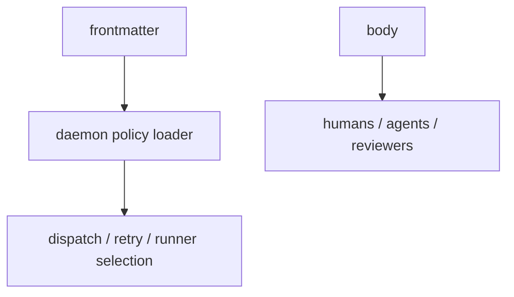

# Spec 02: Workflow Contract

Status: Draft

## Decision

Tusker uses a project-level `WORKFLOW.md` as the daemon/runtime contract.

- `WORKFLOW.md` is the only project-owned orchestration contract.
- `skill/references/WORKFLOW.md` remains reusable guidance for direct agent sessions.
- The durable tracker state machine comes from [01-vault-tracker.md](./01-vault-tracker.md).
- The daemon runtime store comes from [03-daemon-and-registry.md](./03-daemon-and-registry.md).
- The `WORKFLOW.md` body is the project-specific agent runbook and prompt template.
- The `WORKFLOW.md` frontmatter is machine policy.

This file configures behavior. It does not redefine tracker state and it does not store runtime state.

## Goals

- move runtime policy out of `_system/config.yaml`
- make orchestration opt-in at the project level
- keep runtime policy visible, reviewable, and repo-local
- let the daemon consume policy without hidden config

## Non-Goals

- custom per-project tracker schemas
- daemon-owned shadow config outside `WORKFLOW.md`
- runtime lease/session fields in tracker notes
- using bundled skill docs as live runtime policy

## Contract Location

Canonical path:

```text
<vault>/WORKFLOW.md
```

Discovery order:

1. if `--vault` is given, load `<vault>/WORKFLOW.md`
2. else discover a Tusker vault upward and load its `WORKFLOW.md`
3. during migration only, `_system/config.yaml` may be read as a legacy fallback
4. bundled skill docs are never read as runtime policy

## File Shape

`WORKFLOW.md` is markdown with machine-readable frontmatter and human-readable body text.



## Required Frontmatter

| Field | Type | Required | Meaning |
|---|---|---|---|
| `workflow_version` | integer | yes | starts at `1` |
| `tracker.kind` | string | yes | `tusker_vault` |
| `tracker_schema_version` | integer | yes | expected note schema, starts at `2` |
| `tracker.active_states` | string[] | yes | durable statuses eligible for orchestration |
| `tracker.review_states` | string[] | yes | durable statuses observed but not dispatched |
| `tracker.terminal_states` | string[] | yes | terminal durable statuses |
| `agents.default` | string | yes | default runner name |
| `agents.enabled` | string[] | yes | allowed runners |
| `agents.max_concurrent_agents` | integer | yes | global concurrency ceiling |
| `agents.max_concurrent_agents_by_state` | map | no | optional per-status ceilings |
| `runtime.poll_interval_ms` | integer | yes | polling cadence |
| `runtime.lease_ttl_ms` | integer | yes | stale-run detection threshold |
| `workspace.root` | string | yes | workspace root under daemon state |
| `workspace.strategy` | string | yes | `worktree`, `clone`, or `copy` |
| `retry.max_attempts` | integer | yes | automatic retry ceiling |
| `retry.backoff_ms` | integer[] | yes | retry backoff schedule |
| `codex.command` | string | no | Codex app-server command |
| `claude.command` | string | no | Claude Code command |
| `hooks.after_workspace_create` | string[] | no | setup hooks |
| `hooks.before_workspace_remove` | string[] | no | cleanup hooks |

## Required Body Sections

- `## Routing`
- `## Prompt`
- `## Retry policy`
- `## Human override policy`

The daemon reads frontmatter and renders the body. Humans read the whole file.

The body is load-bearing. It is not decorative documentation. It is the project-specific behavior contract for daemon-run agents.

Prompt rendering rules:

- render with strict variable/filter handling
- unknown variables fail the attempt, not the daemon
- expose project, workflow, note, attempt, turn, workspace, runtime, and trust-profile context
- turn 1 receives the full rendered body
- continuation turns receive short continuation guidance derived from workflow policy

## Tracker Contract

The tracker state machine is fixed in Spec 01.

This file only says which durable tracker states orchestration should care about.

Recommended defaults:

| Field | Recommended value |
|---|---|
| `tracker.active_states` | `["active", "rework", "merging"]` |
| `tracker.review_states` | `["in_review"]` |
| `tracker.terminal_states` | `["done", "cancelled"]` |

If a project wants pure tracker mode, it can have no `WORKFLOW.md` at all.

## Runtime Boundary

`WORKFLOW.md` configures runtime behavior. It does **not** authorize runtime state in notes.

There is no canonical `dispatch_state` or `run_state` note field in v2.

Runtime ownership belongs to the daemon store for:

- leases
- attempts
- turns
- sessions
- retry timers
- heartbeats
- active run metadata

## Relationship To The Skill Bundle

The skill bundle explains how humans and direct agent sessions should write Tusker notes.

`WORKFLOW.md` explains how the daemon should behave for this project.

Those are different jobs. Keep them separate.

## Example

```yaml
---
workflow_version: 1
tracker:
  kind: "tusker_vault"
  active_states: ["active", "rework", "merging"]
  review_states: ["in_review"]
  terminal_states: ["done", "cancelled"]
tracker_schema_version: 2
agents:
  default: "codex"
  enabled: ["codex", "claude-code"]
  max_concurrent_agents: 3
  max_concurrent_agents_by_state:
    rework: 1
runtime:
  poll_interval_ms: 5000
  lease_ttl_ms: 900000
workspace:
  root: "workspaces"
  strategy: "worktree"
retry:
  max_attempts: 3
  backoff_ms: [30000, 120000, 600000]
codex:
  command: "codex app-server"
claude:
  command: "claude -p --output-format stream-json"
hooks:
  after_workspace_create: []
  before_workspace_remove: []
---
```

## Hot Reload

The daemon must reload `WORKFLOW.md` on each poll tick or via file-change notification.

Policy changes affect:

- future dispatch decisions
- future retry scheduling
- future workspace creation

They do not retroactively mutate already-running attempts.

Invalid reloads must keep the last-known-good workflow and mark the project degraded. An invalid template or frontmatter edit must not kill the daemon or silently fall back to defaults.

Reload behavior:

| Field | Behavior |
|---|---|
| polling/runtime interval | next tick |
| concurrency caps | next dispatch decision |
| retry policy | future retry scheduling |
| prompt body | future turns only |
| Codex command | future launches |
| Codex thread sandbox | future sessions only |
| Codex turn policy | future turns if supported |
| hooks | future hook executions |
| workspace strategy | future workspace creation |
| workspace root | restart required |
| tracker kind | restart and migration required |

## Migration From Current Config

### Replace config ownership

| Current | New |
|---|---|
| `_system/config.yaml` | `<vault>/WORKFLOW.md` |
| `loadConfig` | `loadWorkflow` |
| bundled workflow reference docs | human guidance only |

### Replace legacy note runtime assumptions

The current vault may still contain legacy runtime fields such as:

- `dispatch_state`
- `claimed_by`
- `claimed_at`
- `run_attempts`
- `failure_class`

Those are migration baggage only. They do not survive as canonical v2 note schema.

## Go Implementation Notes

| Area | File(s) | Required change |
|---|---|---|
| Loader | `cmd/tusker/config.go` or new `workflow.go` | parse `WORKFLOW.md` frontmatter and body |
| Validation | new `workflow_validate.go` | enforce required fields and state references |
| Init | `cmd/tusker/install.go`, `cmd/tusker/cli.go` | scaffold `WORKFLOW.md` when orchestration is enabled |
| Legacy fallback | loader layer | read `_system/config.yaml` only during migration window |

## Rejected Alternatives

| Alternative | Why rejected |
|---|---|
| keep `_system/config.yaml` as canon | same ambiguity, prettier wrapping |
| let each project invent custom statuses in `WORKFLOW.md` | sounds flexible, turns automation into soup |
| treat bundled skill docs as runtime policy | docs should not silently reconfigure a project |
