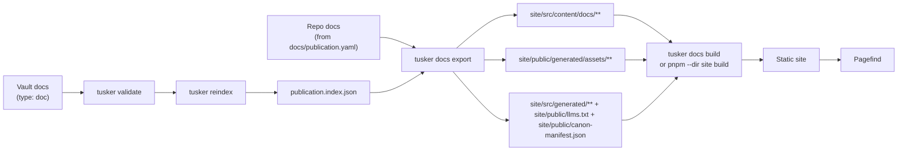

# Spec 07: Documentation Site And Publication Pipeline

Status: Draft

## Decision

Tusker should ship a documentation system with a hard split:

| Layer | Owns | Does not own |
|---|---|---|
| Tusker | source-of-truth, validation, routing, export, manifests, asset copying, link rewriting | page chrome, search UI, typography, theming |
| Astro + Starlight | static rendering, docs UX, search integration, theme, MDX components | publication policy, vault semantics, canon rules |

Bluntly:

- Tusker is the compiler.
- Astro/Starlight is the renderer.

Do **not** make Astro read the raw vault directly.

Do **not** duplicate publication logic in TypeScript.

Do **not** rely on a global Astro install. The site should live in-repo under `site/` with pinned package versions.

## Why This Exists

Tusker already has the hard parts:

- frontmatter parsing and serialization in `cmd/tusker/frontmatter.go`
- doc schema and publication fields in `cmd/tusker/schema.go`
- vault-wide indexing in `cmd/tusker/commands_index.go`
- `_system/generated/publication.index.json` as an existing publication manifest seed

That means the missing work is not "how do we author docs?"

The missing work is:

- how published docs map to real routes
- how repo-native docs join vault docs without chaos
- how wikilinks and local assets survive publication
- how to keep the site fast instead of turning it into JS soup
- how to make the repetitive edit -> preview -> publish loop boring

This spec freezes those decisions.

## Product Goal

Tusker should be able to take a repo plus an optional vault and produce a serious documentation website with:

- separate user and developer lanes
- static HTML output
- strong search
- excellent readability
- markdown-first authoring
- frontmatter-driven routing and categorization
- charts, diagrams, images, and video when needed
- machine-friendly outputs like `llms.txt`, `content-manifest.json`, and `canon-manifest.json`

## Non-Goals

- No second CMS.
- No live database-backed docs platform.
- No SSR requirement.
- No React island party for ordinary docs pages.
- No magical repo crawling that silently publishes random markdown.
- No promise that Tusker v1 exposes a clean public Go library API for this. CLI-first wins.

## Hard Decisions

### 1. Use Astro + Starlight

Astro + Starlight wins because the product needs a strong docs UX more than it needs a single Rust binary.

Zola is still respectable, but the trade is clear:

```text
Zola           = faster toolchain
Astro/Starlight = better docs product
```

This product needs the second one.

### 2. Tusker Owns Publication Semantics

Publication rules belong in Tusker because Tusker already knows:

- which docs are canonical
- which docs are publishable
- which audience a doc targets
- which route a doc should land on
- what tags/ordering metadata matter
- how vault links map to work items

If Astro owns those rules, the system gets two brains. Two-brain systems rot.

### 3. CLI First, Library Second

Tusker is currently a CLI-centered codebase. Most logic still lives under `cmd/tusker` in `package main`.

That means the correct v1 boundary is:

```text
tusker validate
tusker reindex
tusker docs export
tusker docs build
```

Not:

```text
import "tusker/publication"
```

If we later extract reusable internal packages, fine. That is phase-two cleanup, not a prerequisite.

### 4. Export Boundary Is Mandatory

The docs site should consume a normalized exported tree, not the raw vault.

Reasons:

- keeps Obsidian-only conventions from leaking into the site
- gives us a real place to rewrite links/assets
- allows repo docs and vault docs to merge cleanly
- makes cleanup and incremental rebuilds sane
- keeps future private/public separation possible

### 5. Static First, Always

The site should be generated as static HTML.

No SSR adapter. No runtime database. No client rendering requirement to read docs.

Interactive behavior should be limited to:

- search
- optional media controls
- truly necessary component interactions

Everything else should render server-side.

### 6. Explicit Repo-Doc Registry

Vault docs are not the only useful docs. Repo-native docs matter too.

But publishing repo docs must be explicit, not magical.

Tusker should read a registry file at:

```text
docs/publication.yaml
```

That registry declares which repo files or directories are publishable and where they land.

### 7. Performance Beats Cleverness

Rules:

- no custom client hydration for ordinary prose pages
- Mermaid should be pre-rendered to SVG during export/build, not drawn in-browser
- charts default to static SVG/PNG; client chart libraries are opt-in, not default
- local video should be lazy-loaded
- exported docs should be incrementally rewritten only when source content changes

If a feature makes the site substantially slower and only adds visual garnish, it loses.

## Architecture



### Ownership Boundary

| Concern | Owner |
|---|---|
| frontmatter schema | Tusker |
| `publish` eligibility | Tusker |
| route generation | Tusker |
| nav data generation | Tusker |
| wikilink resolution | Tusker |
| asset copying/rewriting | Tusker |
| section landing pages | site-owned manual pages |
| typography/theme | Astro/Starlight |
| search UI | Starlight/Pagefind |
| CI build orchestration | Makefile + CI |

## Source Model

Tusker should support four source classes.

### Class A: Vault Docs

These are Tusker notes with:

- `type: doc`
- frontmatter managed under the Tusker schema
- body content written as Markdown or MDX-compatible text

Use for:

- architecture docs
- developer guides
- user guides
- support docs
- release notes
- polished canonical docs attached to epics/stories

### Class B: Repo Docs

These are in-repo markdown files explicitly registered in `docs/publication.yaml`.

Use for:

- `docs/specs/**`
- `skill/references/**`
- selected `README.md` files
- any other repo-local canon that should be part of the site

### Class C: Manual Site Pages

These are pages owned by the site itself, not exported from Tusker.

Examples:

- `/`
- `/developer/`
- `/user/`
- custom landing pages
- showcase/index pages

They live directly under `site/src/content/docs/**`.

### Class D: Generated Metadata

These are machine-facing outputs:

- `publication.index.json`
- `navigation.json`
- `content-manifest.json`
- `export-report.json`
- `routes-removed.json`
- `canon-manifest.json`
- `llms.txt`
- `llms-full.txt`

Humans do not author these directly.

## Publication Eligibility

### Vault Docs

A vault doc is exportable when all of these are true:

| Rule | Required |
|---|---:|
| `type == "doc"` | yes |
| `publish == true` | yes |
| `status in {"approved", "published"}` | yes |
| `publish_path` is non-empty | yes |
| `publish_description` is non-empty | yes |
| `publish_path` is unique across all published docs | yes |

Anything else stays out.

Draft leakage is not a feature.

### Repo Docs

A repo doc is exportable only if it appears in `docs/publication.yaml`. It enters `canon[]` only when the registry entry or file frontmatter explicitly sets `canonical: true` and `canonical_status`. Tags like `specs`, `architecture`, and `repository` are taxonomy, not authority.

There is no fallback "crawl the repo and see what happens" mode.

## Information Architecture

Top-level lanes are fixed:

```text
/
├── developer/
├── user/
├── release-notes/
├── support/
└── internal/
```

Interpretation:

- `developer/` for architecture, reference, implementation, internals, guides
- `user/` for guides, concepts, workflows, reference, tutorials
- `release-notes/` for versioned release notes
- `support/` for operator/support runbooks
- `internal/` for private or non-public material, excluded by default

### Route Rule

`publish_path` is the canonical route path without a leading slash.

Examples:

| Source | Frontmatter / Registry | Route |
|---|---|---|
| vault doc | `publish_path: developer/architecture/runtime-store` | `/developer/architecture/runtime-store/` |
| vault doc | `publish_path: user/guides/getting-started` | `/user/guides/getting-started/` |
| repo doc | `route_prefix: developer/specs` + file `07-documentation-site-and-publication.md` | `/developer/specs/07-documentation-site-and-publication/` |
| repo file override | `route: developer/repository/repository-overview` | `/developer/repository/repository-overview/` |

### Path Constraints

`publish_path` must obey:

- no leading `/`
- no trailing `/`
- no empty segments
- no `.` or `..`
- final segment must not be `index`
- top-level segment must be one of `developer`, `user`, `release-notes`, `support`, `internal`

Recommended minimum depth:

- `developer/*/*`
- `user/*/*`
- `release-notes/*`
- `support/*/*`

This is not just style. Shallow junk routes make the site harder to organize.

### Sidebar/Nav Rule

Navigation should be derived from published routes and ordering metadata.

No hand-maintained sidebar YAML for published docs.

Tusker should emit:

```text
site/src/generated/navigation.json
```

That file becomes the source for Starlight sidebar configuration.

## Frontmatter Contract

Tusker already has a doc schema. Extend it; do not replace it.

### Core Fields

| Field | Role |
|---|---|
| `id` | canonical Tusker doc ID |
| `title` | page title |
| `type` | must be `doc` for vault-published docs |
| `status` | publication gate |
| `epic` / `story` | lineage |
| `doc_intent` | `canon` vs `companion` |
| `audience` | audience class |
| `canonical` | explicit inclusion in agent canon manifests |
| `canonical_status` | `draft`, `approved`, `deprecated`, or `historical` |
| `owner_epic` | epic that owns this doc's canon |
| `verified_at` | last implementation-check date |
| `deprecated` / `superseded_by` | stale-doc routing |
| `publish` | inclusion gate |
| `publish_path` | canonical route |
| `publish_url` | deployed URL once known |
| `published_at` | publication timestamp |
| `created` / `updated` | chronology |
| `tags` | taxonomy and related-doc signals |

### Publication Routing Fields

| Field | Type | Required when `publish: true` | Purpose |
|---|---|---:|---|
| `publish_description` | string | yes | meta description, search snippet, cards |
| `publish_order` | integer | no | sibling ordering in nav |
| `publish_section_title` | string | no | label override for section/group names |

That is enough for the compiler contract: route fields decide where a page renders; canon lifecycle fields decide whether agents may treat it as authority.

### Example Vault Doc Frontmatter

```yaml
---
schema_version: 2
record_id: "01JVF1A9R6W8KK7F9N2GG6B7PX"
id: "MEM-D-0003"
title: "Runner session protocol"
type: "doc"
status: "approved"
epic: "[[MEM]]"
epic_record_id: "01JVF17X3FKB3QQPXX4DJJ2N9N"
doc_intent: "canon"
canon_for: "[[MEM]]"
story: ""
story_record_id: ""
audience: "developer"
canonical: true
canonical_status: "approved"
owner_epic: "[[MEM]]"
verified_at: "2026-04-23"
deprecated: false
superseded_by: ""
publish: true
publish_path: "developer/architecture/runner-session-protocol"
publish_description: "Canonical protocol for Tusker runner sessions, state transitions, and resume semantics."
publish_order: 20
publish_section_title: "Architecture"
redirect_from: []
publish_url: ""
published_at: ""
created: "2026-04-23"
updated: "2026-04-23"
tags:
  - architecture
  - runners
---
```

### Validation Rules

Add publication validation to `tusker validate`:

- `publish: true` requires `publish_path`
- `publish: true` requires `publish_description`
- `publish_path` must be syntactically valid
- `publish_path` must be unique
- `publish_order`, if present, must be an integer
- `publish_section_title`, if present, must be non-empty
- `redirect_from`, if present, must contain valid old route paths
- `canonical: true` must set `canonical_status`
- `canonical_status: approved` should set `verified_at`
- deprecated docs should set `superseded_by`
- public exports must exclude `internal/*` unless explicitly allowed
- if a docs manifest exists, both manifest copies must match
- published sources must not be newer than `canon-manifest.json.generatedAt`
- manifest sources must still exist
- vanished published routes must be covered by `redirect_from`
- every active epic must have a reachable canon entry in `canon[]`

Suggested new error codes:

| Code | Meaning |
|---|---|
| `PUBLISH_PATH_MISSING` | `publish: true` without `publish_path` |
| `PUBLISH_DESCRIPTION_MISSING` | `publish: true` without `publish_description` |
| `PUBLISH_PATH_INVALID` | malformed route |
| `PUBLISH_PATH_COLLISION` | duplicate route |
| `PUBLISH_INTERNAL_LEAK` | internal doc would enter public build |
| `DOCS_SOURCE_MISSING` | manifest source no longer exists |
| `DOCS_ROUTE_REMOVED` | published route disappeared without `redirect_from` |

## Repo Publication Registry

Repo docs need explicit configuration.

Tusker should read:

```text
docs/publication.yaml
```

### Registry Shape

```yaml
repo_docs:
  - source: docs/specs
    include: "**/*.md"
    route_prefix: developer/specs
    audience: developer
    section_title: Specs
    canonical: true
    canonical_status: draft
    owner_epic: ORC
    verified_at: "2026-04-28"
    tags: [specs]

  - source: skill/references
    include: "**/*.md"
    route_prefix: user/reference
    audience: user
    section_title: Reference
    tags: [reference]

  - source: README.md
    route: developer/repository/repository-overview
    audience: developer
    title: Repository overview
    description: High-level overview of the Tusker repository, install modes, and key entry points.
    tags: [repository, overview]
```

### Registry Rules

- `source` may point to a file or directory.
- directory sources require `route_prefix`
- file sources require `route` or `route_prefix`
- `include` defaults to `**/*.md`
- `internal: true` marks the entry private
- `title` and `description` overrides are allowed
- registry routes participate in the same uniqueness checks as vault docs

This registry is intentionally boring. Boring config is easier to trust.

## Reindex And Manifest Changes

`tusker reindex` already emits `publication.index.json`. Expand it so the exporter does not need to re-derive everything from raw docs.

### `publication.index.json` Should Include

| Field | Notes |
|---|---|
| `id` | Tusker doc ID |
| `title` | doc title |
| `path` | vault-relative source path |
| `epic` | owning epic ID |
| `story` | linked story if present |
| `audience` | user/developer/etc |
| `doc_intent` | canon/companion |
| `owner_epic` | epic that owns the doc |
| `canon_for` | epic this doc canonically answers |
| `canonical` | explicit canon-manifest inclusion |
| `canonical_status` | `draft`, `approved`, `deprecated`, or `historical` |
| `verified_at` | last implementation-check date |
| `deprecated` | stale-doc marker |
| `superseded_by` | replacement route or source |
| `status` | approved/published |
| `publish` | boolean |
| `publish_path` | canonical route |
| `publish_description` | meta/search snippet |
| `publish_order` | optional nav ordering |
| `publish_section_title` | optional group label override |
| `tags` | taxonomy |
| `updated` | source freshness |
| `source_kind` | always `vault_doc` for this manifest |

### Example

```json
{
  "schemaVersion": 1,
  "generatedAt": "2026-04-23T12:00:00Z",
  "items": [
    {
      "source_kind": "vault_doc",
      "id": "MEM-D-0003",
      "title": "Runner session protocol",
      "path": "epics/MEM/MEM-D-0003.md",
      "epic": "MEM",
      "story": "",
      "audience": "developer",
      "doc_intent": "canon",
      "owner_epic": "MEM",
      "canon_for": "MEM",
      "canonical": true,
      "canonical_status": "approved",
      "verified_at": "2026-04-23",
      "deprecated": false,
      "superseded_by": "",
      "status": "approved",
      "publish": true,
      "publish_path": "developer/architecture/runner-session-protocol",
      "publish_description": "Canonical protocol for Tusker runner sessions, state transitions, and resume semantics.",
      "publish_order": 20,
      "publish_section_title": "Architecture",
      "tags": ["architecture", "runners"],
      "updated": "2026-04-23"
    }
  ]
}
```

## Export Pipeline

Add a `docs` command group to the CLI.

That means `parseCLI()` should recognize `docs` the same way it already recognizes `workflow`, `daemon`, `projects`, `review`, `retry`, and `runs`.

### Commands

#### `tusker docs init`

Purpose:

- scaffold `site/` if it does not exist
- pin Astro/Starlight dependencies
- create base landing pages
- create starter components and generated-data placeholders

Flags:

| Flag | Meaning |
|---|---|
| `--site <path>` | output site directory, default `./site` |
| `--force` | overwrite starter files if safe |

#### `tusker docs export`

Purpose:

- read vault publication manifest
- read repo publication registry
- build the route table
- rewrite links and local asset references
- emit normalized content into the site tree
- emit navigation, content, and canon manifests
- emit `llms.txt`
- clean stale generated files incrementally

Flags:

| Flag | Meaning |
|---|---|
| `--vault <path>` | vault root |
| `--site <path>` | site directory, default `./site` |
| `--clean` | remove stale exported outputs before write |
| `--public-only` | exclude `internal/*` |
| `--json` | emit machine-readable summary |

#### `tusker docs dev`

Purpose:

- run `reindex`
- run incremental export
- start the local Starlight dev server
- optionally watch vault and repo docs for changes

Flags:

| Flag | Meaning |
|---|---|
| `--vault <path>` | vault root |
| `--site <path>` | site directory, default `./site` |
| `--watch` | watch source files and re-export on change |
| `--port <n>` | dev server port |
| `--host <host>` | bind host |

#### `tusker docs build`

Purpose:

- run `reindex`
- run export
- build the static site
- fail on invalid links or invalid publication state

Flags:

| Flag | Meaning |
|---|---|
| `--vault <path>` | vault root |
| `--site <path>` | site directory, default `./site` |
| `--public-only` | exclude internal docs |
| `--json` | emit machine-readable summary |

### Export Algorithm

`tusker docs export` should do this in order:

1. Load `publication.index.json`.
2. Load `docs/publication.yaml` if present.
3. Load existing export manifest from the previous run.
4. Build one unified route table from:
   - vault docs
   - repo docs
   - reserved manual site pages
5. Fail on route collisions.
6. Parse each source document frontmatter/body.
7. Rewrite links:
   - wikilinks
   - relative markdown links
   - repo doc links
8. Rewrite/copy local assets.
9. Emit normalized frontmatter for the site.
10. Write changed content files only.
11. Delete stale generated files/assets from the previous manifest.
12. Emit generated metadata files.

Incremental export matters. Rewriting the whole site on every keystroke is how good tools become annoying tools.

## Output Layout

The site should own these paths:

```text
site/
├── astro.config.mjs
├── package.json
├── src/
│   ├── content/
│   │   └── docs/
│   │       ├── index.mdx
│   │       ├── developer/
│   │       │   ├── index.mdx
│   │       │   ├── architecture/
│   │       │   │   └── runner-session-protocol.mdx
│   │       │   ├── specs/
│   │       │   │   └── 07-documentation-site-and-publication.md
│   │       │   └── repository/
│   │       │       └── repository-overview.md
│   │       ├── user/
│   │       │   ├── index.mdx
│   │       │   └── guides/
│   │       │       └── getting-started.mdx
│   │       └── release-notes/
│   │           └── v0-3-0.mdx
│   ├── generated/
│   │   ├── navigation.json
│   │   ├── content-manifest.json
│   │   ├── export-report.json
│   │   ├── routes-removed.json
│   │   └── export-state.json
│   ├── components/
│   │   └── docs/
│   │       ├── Mermaid.astro
│   │       ├── Figure.astro
│   │       ├── Video.astro
│   │       ├── Tabs.astro
│   │       └── CardGrid.astro
│   └── styles/
│       └── custom.css
└── public/
    ├── generated/
    │   └── assets/
    ├── llms.txt
    └── llms-full.txt
```

### File Ownership Rules

| Path | Owner |
|---|---|
| `site/src/content/docs/index.mdx` | human |
| `site/src/content/docs/<lane>/index.mdx` | human |
| leaf pages created by export | Tusker |
| `site/src/generated/**` | Tusker |
| `site/public/generated/assets/**` | Tusker |
| components/styles/config | human |

Tusker must never silently overwrite manual pages. If a generated route collides with a human-owned file, export fails.

## Site Frontmatter Mapping

Exported pages should use Starlight-friendly frontmatter plus a nested `tusker` metadata block.

### Example Exported Page Frontmatter

```yaml
---
title: Runner session protocol
description: Canonical protocol for Tusker runner sessions, state transitions, and resume semantics.
sidebar:
  order: 20
tusker:
  source_kind: vault_doc
  id: MEM-D-0003
  audience: developer
  doc_intent: canon
  epic: MEM
  story: ""
  source_path: epics/MEM/MEM-D-0003.md
  updated: "2026-04-23"
  tags:
    - architecture
    - runners
---
```

The site content schema should explicitly allow the `tusker` block instead of treating it as mystery meat.

## Link Resolution Rules

Tusker docs currently lean on wikilinks. Export has to normalize them.

### Supported Inputs

| Input | Meaning |
|---|---|
| `[[MEM-D-0003]]` | Tusker doc by ID |
| `[[MEM-D-0003|Runner protocol]]` | doc by ID with label |
| `[[MEM-D-0003#Resume semantics]]` | doc with section anchor |
| `[[MEM]]` | epic link |
| `[[MEM-S-0007]]` | story link |
| relative markdown links | local links from source doc |
| repo-relative links like `docs/specs/05-runner-and-session-protocol.md` | repo doc links |

### Output Rules

| Source link | Export behavior |
|---|---|
| published vault doc | rewrite to site route |
| published repo doc | rewrite to site route |
| unpublished doc/story/epic | do not emit a broken internal link |
| external URL | leave untouched |
| unresolved target | fail validation in strict build mode |

### Unpublished Target Policy

If a link points to something intentionally unpublished:

- prefer plain text over a broken link
- optionally render a small badge later, but not in MVP

Broken internal links in a docs site make it look homemade in the bad way.

## Asset Handling

### Local Assets

If a source doc references a local image/video relative to the source file:

1. copy it under `site/public/generated/assets/...`
2. rewrite the reference to the new public path
3. preserve alt text and ordinary markdown syntax where possible

### Asset Path Strategy

Use stable, source-derived paths:

```text
/generated/assets/<source-kind>/<source-id-or-slug>/<filename>
```

Examples:

```text
/generated/assets/vault-doc/MEM-D-0003/sequence.svg
/generated/assets/repo-doc/07-documentation-site-and-publication/diagram.png
```

Human-readable beats content-hash spaghetti for MVP. If caching becomes a real issue later, add hashes then.

### Images

Rules:

- keep standard markdown images when that is enough
- allow manual MDX `<Figure>` when captions/layout matter
- preserve alt text
- fail build if a referenced local image is missing

### Video

Rules:

- support local `.mp4` and `.webm`
- support remote YouTube/Vimeo embeds
- load lazily
- do not autoplay by default

### Diagrams

Rules:

- Mermaid is the default diagram path
- exporter/build should pre-render Mermaid to SVG where feasible
- no browser-side Mermaid runtime for ordinary pages

### Charts

Rules:

- default to static SVG or PNG
- only use a client chart library when interactivity is actually needed
- ordinary docs should not ship a charting framework to draw one bar chart

## Rich Content Policy

Tusker should support both plain Markdown and MDX-compatible source bodies.

### Default Authoring Path

Use plain Markdown for:

- prose
- headings
- lists
- code blocks
- tables
- Mermaid fences
- normal images

### Escape Hatch

Use MDX-compatible content only when needed for:

- video embeds
- figures with captions/layout control
- tabbed tool instructions
- custom callouts/cards

Tusker should treat the body as opaque content and avoid trying to "understand" MDX beyond safe link and asset rewriting.

## Navigation Generation

Tusker should emit a navigation manifest:

```text
site/src/generated/navigation.json
```

### Shape

```json
{
  "lanes": [
    {
      "slug": "developer",
      "label": "Developer Docs",
      "sections": [
        {
          "slug": "architecture",
          "label": "Architecture",
          "items": [
            {
              "title": "Runner session protocol",
              "route": "/developer/architecture/runner-session-protocol/",
              "order": 20
            }
          ]
        }
      ]
    }
  ]
}
```

### Generation Rule

- first segment selects the lane
- middle segments define nested sections
- `publish_section_title` can override section labels
- `publish_order` sorts siblings
- fallback sort is title

This keeps site navigation deterministic without turning `astro.config.mjs` into a hand-edited sitemap.

## LLM-Friendly Outputs

Required outputs:

- semantic HTML
- `sitemap.xml`
- `llms.txt`
- `llms-full.txt`
- `content-manifest.json`
- `canon-manifest.json`

### `content-manifest.json`

Emit:

```text
site/src/generated/content-manifest.json
```

Shape:

```json
{
  "generatedAt": "2026-04-23T12:00:00Z",
  "items": [
    {
      "source_kind": "vault_doc",
      "id": "MEM-D-0003",
      "title": "Runner session protocol",
      "route": "/developer/architecture/runner-session-protocol/",
      "audience": "developer",
      "owner_epic": "MEM",
      "canon_for": "MEM",
      "canonical": true,
      "canonical_status": "approved",
      "verified_at": "2026-04-23",
      "tags": ["architecture", "runners"],
      "updated": "2026-04-23",
      "summary": "Canonical protocol for Tusker runner sessions, state transitions, and resume semantics."
    }
  ]
}
```

### `canon-manifest.json`

Tusker should emit a machine-readable truth map for agents:

```text
site/src/generated/canon-manifest.json
site/public/canon-manifest.json
```

Shape:

```json
{
  "schemaVersion": 1,
  "generatedAt": "2026-04-23T12:00:00Z",
  "canon": [
    {
      "topic": "MEM",
      "title": "Runner session protocol",
      "route": "/developer/architecture/runner-session-protocol/",
      "source_kind": "vault_doc",
      "source_id": "MEM-D-0003",
      "source_path": "epics/MEM/MEM-D-0003.md",
      "audience": "developer",
      "doc_intent": "canon",
      "owner_epic": "MEM",
      "canon_for": "MEM",
      "canonical": true,
      "canonical_status": "approved",
      "verified_at": "2026-04-23"
    }
  ],
  "published": [],
  "do_not_cite": [
    "site/src/content/docs/**",
    "tusker/_system/generated/**"
  ]
}
```

Agents should read this before broad docs archaeology. This is the guardrail that stops stale docs from looking canonical just because they are nearby.

### `routes-removed.json`

Tusker should emit a route lifecycle report:

```text
site/src/generated/routes-removed.json
```

Shape:

```json
{
  "schemaVersion": 1,
  "generatedAt": "2026-04-23T12:00:00Z",
  "removed": [
    {
      "title": "Old runtime topology",
      "route": "developer/architecture/old-runtime-topology",
      "routeURL": "/developer/architecture/old-runtime-topology/",
      "source_path": "docs/old-runtime-topology.md"
    }
  ]
}
```

`removed[]` should be empty in a healthy export. If a route intentionally moved, the replacement page sets `redirect_from` with the old route. This is not full redirect serving yet; it is the guard that stops public URL breakage from becoming invisible.

### `llms.txt`

Tusker should emit a compact machine-readable catalog of public docs with:

- title
- route
- summary
- audience
- updated date

`llms-full.txt` can include a longer per-page listing.

## Search

Search strategy:

- use Starlight's built-in Pagefind path first
- do not wire Algolia or Typesense in MVP

Reasons:

- static
- good enough
- low operational drag
- avoids premature infrastructure nonsense

If Pagefind result quality later proves weak, upgrade then. Not before.

## Performance Rules

The site should stay fast even as the docs corpus grows.

### Hard Rules

- build static HTML only
- no custom hydrated islands on standard prose pages
- pre-render Mermaid where possible
- lazy-load large media
- incremental export writes only changed files
- route/nav/manifest generation should run in linear time over source docs

### Targets

Targets are goals, not excuses:

| Metric | Target |
|---|---|
| ordinary doc page render | server-rendered HTML with no page-specific custom JS |
| export on small content change | update only touched docs/assets |
| local docs preview | one command |
| search | static index, no external search service |

The fastest docs page is still the one that mostly ships HTML and CSS. Shocking, I know.

## Site Design Direction

The prototype site should keep Starlight's bones and replace the stock skin.

### Visual Rules

- light-first, not default purple sludge
- strong typography for long-form reading
- explicit section hierarchy
- clear code block contrast
- restrained motion
- no generic blog theme cosplay

### Tailwind Usage

Tailwind should be used for:

- design tokens
- custom component styling
- layout utilities
- media presentation

Tailwind should **not** be used to fight Starlight's ergonomics out of ego.

## CI And Local Commands

### Makefile Targets

Add:

```text
make docs-export
make docs-dev
make docs-build
make docs-check
```

Responsibilities:

| Target | Responsibility |
|---|---|
| `docs-export` | `tusker reindex` + `tusker docs export` |
| `docs-dev` | `tusker docs dev --watch` |
| `docs-build` | `tusker docs build` |
| `docs-check` | validate + export + site build + broken-link checks |

### CI Rules

If a PR touches:

- publishable vault docs
- `docs/publication.yaml`
- `site/**`
- `docs/specs/**`
- `skill/references/**`

then CI should:

1. run `tusker validate`
2. run `tusker reindex`
3. run `tusker docs export`
4. build the site
5. fail on broken links, publication collisions, stale manifests, missing sources, removed routes, or missing epic canon

Preview deploys are nice-to-have, not MVP-critical.

## Implementation Plan

### Phase 1: Schema And Validation

Work:

- add `publish_description`, `publish_order`, `publish_section_title` to doc schema ordering
- extend validation rules
- extend `publication.index.json`

Primary files:

- `cmd/tusker/schema.go`
- `cmd/tusker/frontmatter.go`
- `cmd/tusker/commands_index.go`
- `skill/references/SCHEMA.md`

### Phase 2: CLI And Exporter

Work:

- add `docs` command group
- implement export pipeline
- implement route table and collision detection
- implement link rewriting
- implement asset copying
- emit generated metadata files

Suggested files:

- `cmd/tusker/docs_commands.go`
- `cmd/tusker/docs_export.go`
- `cmd/tusker/docs_routes.go`
- `cmd/tusker/docs_links.go`
- `cmd/tusker/docs_assets.go`
- `cmd/tusker/docs_registry.go`
- `cmd/tusker/docs_manifest.go`

### Phase 3: Site Integration

Work:

- finalize `site/` layout
- wire generated navigation into Starlight config
- add custom components
- add generated manifest consumption

Primary files:

- `site/astro.config.mjs`
- `site/src/content.config.ts`
- `site/src/components/docs/*`
- `site/src/styles/custom.css`

### Phase 4: Rich Media And Performance

Work:

- Mermaid render path
- image/video components
- incremental export caching
- `llms.txt` and `llms-full.txt`

### Phase 5: CI And Governance

Work:

- Makefile targets
- CI checks
- broken-link enforcement
- public/internal build split

## Acceptance Criteria

The feature is done when all of this is true:

1. `tusker docs build --vault <path> --site ./site` succeeds on a real repo/vault.
2. published vault docs land at routes derived from `publish_path`.
3. registered repo docs land at routes derived from `docs/publication.yaml`.
4. duplicate routes fail the build.
5. local images are copied and rewritten correctly.
6. wikilinks to published docs resolve to site routes.
7. unpublished targets do not produce broken links.
8. the site ships static HTML and Pagefind search.
9. `llms.txt`, `content-manifest.json`, and `canon-manifest.json` are emitted.
10. an incremental re-export updates only changed files.

If those are not true, the system is not done. It is merely underway.

## Recommended Initial Scope

Ship this in the first real implementation pass:

- `docs` command group
- publication field extensions
- explicit repo doc registry
- export to `site/`
- navigation manifest
- content manifest
- Pagefind search
- static Mermaid support

Do **not** block the launch on:

- DocSearch
- multi-version docs
- perfect image processing
- full private/public deployment split
- public Go library extraction

## Rejected Alternatives

### Read The Vault Directly From Astro

Rejected because:

- duplicates Tusker logic in TS
- makes link/asset normalization messy
- ties site shape to vault layout too tightly
- creates no clean publication boundary

### Use Next/Fumadocs Instead

Rejected because:

- more runtime/build machinery
- no meaningful upside for a static docs-first product
- worse fit for "Tusker compiles, site renders"

### Use Zola As Primary Path

Rejected because:

- faster toolchain but weaker docs-product ergonomics
- worse rich-content/component story for this use case
- gives up too much to save build tooling complexity

## Summary

The model is simple:

```text
Tusker owns meaning.
Starlight owns presentation.
Export is the seam.
Static output is the rule.
```

That is the buildable architecture.
