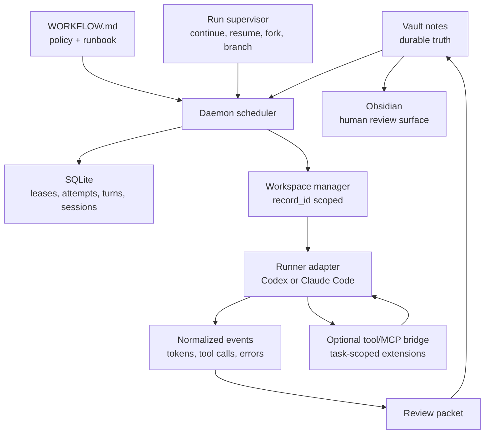
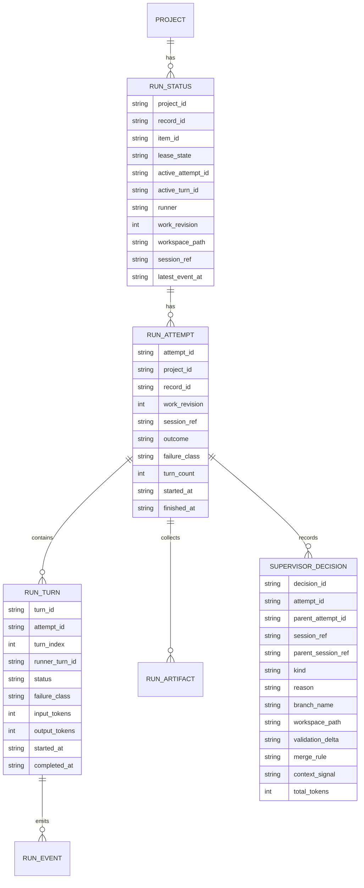
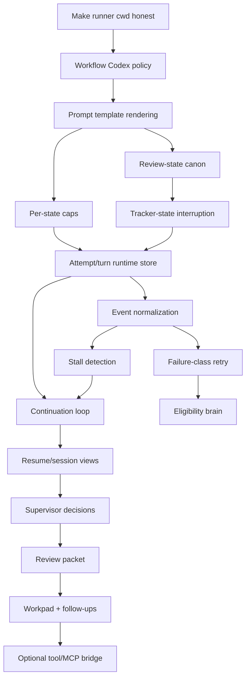

# 08. Symphony Alignment And Orchestration Roadmap

Status: Draft
Date: 2026-04-28
Depends on: [00-product-modes.md](./00-product-modes.md), [01-vault-tracker.md](./01-vault-tracker.md), [02-workflow-contract.md](./02-workflow-contract.md), [03-daemon-and-registry.md](./03-daemon-and-registry.md), [04-workspace-manager.md](./04-workspace-manager.md), [05-runner-and-session-protocol.md](./05-runner-and-session-protocol.md), [06-review-rework-retry.md](./06-review-rework-retry.md)

## Purpose

This document records the design decisions from the Symphony research spike and turns them into Tusker-specific canon.

The point is not to clone Symphony. The point is to keep the parts that make agent orchestration work and reject the parts that do not fit Tusker's constraints:

- single developer or small team
- markdown-native tracker
- Obsidian as the first-class human surface
- repo-local specs and evidence
- risk-tiered ceremony
- optional daemon
- one local binary
- multi-repo use through symlinked vaults

## Product Position

Tusker optimizes for **trustworthy unattended throughput**.

Symphony's useful promise is:

> For every open task, guarantee an agent is running in its own workspace.

Tusker's promise is narrower and better for this product:

> For every eligible note, guarantee an agent can work in an isolated workspace, leave a legible workpad, attach evidence, and stop at the right human gate.

That one sentence drives the rest of this document.

## External Reference

The reference point is OpenAI's official Symphony announcement, published on 2026-04-27, plus the `openai/symphony` `SPEC.md` and reference implementation.

Corrections that matter:

| Claim | Canonical Tusker reading |
|---|---|
| Symphony was published on 2026-03-05 | The official OpenAI page is dated 2026-04-27. Use that date unless citing a third-party post. |
| Symphony represents 18 months of OpenAI design | Unsupported by the official source. Treat it as background noise. |
| Tusker should mirror Symphony's no-DB scheduler | No. Tusker keeps SQLite because a laptop-local daemon needs deterministic restart and sleep recovery. |
| `failure_class` belongs in note frontmatter | No. v2 notes reject legacy runtime fields. Failure classification belongs in SQLite attempts and turns. |
| `WORKFLOW.md` is documentation | It is a runtime contract: frontmatter is machine policy, body is the agent runbook. |

## Source Of Truth Split

This table is load-bearing. Code review should reject changes that violate it.

| State or behavior | Canonical owner | Notes |
|---|---|---|
| Task intent | Markdown note | Problem, acceptance criteria, plan, risk, links, canon, evidence. |
| Human durable state | Markdown note | `status`, `review_state`, `work_revision`, attestation, signoff. |
| Runtime lease state | SQLite | Claimed/running/retry/interrupted/released. Never frontmatter. |
| Attempts and turns | SQLite | Attempts are worker sessions. Turns are Codex turns inside an attempt. |
| Session refs | SQLite | Used for resume hints, not durable product truth. |
| Retry timers | SQLite | Runtime memory, not markdown. |
| Failure class | SQLite | Attempt/turn classification. Notes may receive a human-readable summary only. |
| Token and runtime usage | SQLite plus artifact summaries | Aggregated for budget and observability. |
| Raw runner logs | State root under `runs/` | High-volume artifacts stay out of notes. |
| Normalized runner events | State root plus SQLite summaries | JSONL is the canonical event stream. |
| Project agent behavior | `WORKFLOW.md` body | Strict prompt template and runbook, versioned with the repo. |
| Project runtime policy | `WORKFLOW.md` frontmatter | Concurrency, Codex policy, hooks, retry, trust profiles. |
| Global operating norms | Skill bundle | Reusable defaults and human/agent conventions. |
| Human reading surface | Obsidian vault | CLI and socket API supplement it. |
| Runner protocol state | Runner/session layer | Codex app-server first-class; other runners may degrade. |

## Locked Design Decisions

| Decision | Canon |
|---|---|
| Product lane | Tusker is not a Linear clone. Vault markdown remains the tracker. |
| Runtime store | SQLite stays mandatory for orchestration mode. |
| Workflow body | `WORKFLOW.md` body is load-bearing and rendered into the agent prompt. |
| Prompt rendering | Strict template rendering. Unknown variables or filters fail the attempt, not the daemon. |
| Workspace cwd | Runner cwd must equal the prepared workspace path. Repo root may be passed as metadata only. |
| Codex policy | Approval and sandbox policy come from `WORKFLOW.md`, eventually by risk profile. No hard-coded high-trust default. |
| Attempt model | One `RunAttempt` is one worker session. A session contains one or more `RunTurn` records. |
| Continuation | Continuation turns are the steady-state worker model. Resume is restart recovery. |
| Session supervision | The daemon owns deterministic continue/resume/fork decisions. A model auditor may assist, but no always-on parent-agent control plane is required. |
| Branching | Separate branches are allowed inside one ticket when the work needs an isolated exploration path. The branch/session relationship is runtime state, not a new tracker item by default. |
| Daemon writer role | Daemon writes narrow durable transitions. Agent writes rich content. Human writes verdicts. |
| Review packet | Generated baseline plus agent-authored workpad. Both are needed. |
| Tools | Tool/MCP injection is an optional task-specific extension bridge. It is not the core orchestration model and must never bypass runner sandbox, workflow policy, or Tusker risk gates. |
| UI | Obsidian first. CLI and local read API second. No cloud dashboard, multi-tenant control plane, or complex web UI in this roadmap. |
| Runners | Codex app-server and Claude Code must both support same-ticket resume semantics where their native session model allows it. Capability gaps are surfaced honestly. |

## Non-Goals

- Do not implement a Linear live adapter as part of Symphony alignment.
- Do not build a cloud dashboard.
- Do not build a multi-tenant control plane.
- Do not build a Phoenix-style dashboard or complex web UI.
- Do not add an SSH worker pool for v2.
- Do not treat markdown as a runtime process database.
- Do not promise fake feature parity across Codex and Claude Code.
- Do not make injected tools or MCPs the foundation of orchestration.
- Do not auto-approve high-risk work by default.
- Do not let implementation convenience erase the risk ladder.

## System Shape

## Phase Roadmap

The order matters. Controllability comes before capability.

| Phase | Name | Outcome | Primary specs |
|---:|---|---|---|
| 1 | Make It Honest | Existing advertised surfaces actually work. | 02, 04, 05 |
| 2 | Runtime Spine | Attempts, turns, events, tokens, and sessions are queryable. | 03, 05 |
| 3 | Worker Model | Same-thread continuation, stall handling, and state-change reconciliation land. | 05, 06 |
| 4 | Eligibility Brain | Dispatch becomes dependency-aware, priority-aware, risk-aware, and failure-class-aware. | 01, 02, 03, 06 |
| 5 | Proof Layer | Runs produce review packets and durable workpads. | 01, 05, 06 |
| 6 | Supervisor Policy | The daemon decides when to continue, resume, fork a thread, start a branch, or stop for audit. | 03, 04, 05, 06 |
| 7 | Extension Bridge | Task-scoped tool and MCP injection lands as an optional runner extension, not a required tracker-write path. | 02, 05, 06 |

### Phase 1: Make It Honest

This phase fixes broken promises before adding new power.

Required stories:

1. Enforce runner cwd equals workspace path.
2. Move Codex approval and sandbox policy into `WORKFLOW.md`.
3. Render `WORKFLOW.md` body as strict prompt template.
4. Resolve `verification_requested` versus `requested` review-state drift.
5. Enforce `agents.max_concurrent_agents_by_state`.
6. Interrupt or park running agents when tracker state becomes ineligible.

Acceptance:

- No daemon-run agent executes in the registration repo root.
- Changing a note to `blocked`, `cancelled`, `done`, or another non-active state interrupts or parks the live run on the next reconcile tick.
- `WORKFLOW.md` frontmatter fields that are documented as policy are either enforced or rejected by validation.
- The default Codex posture is explicit, inspectable, and not hard-coded in the runner.

### Phase 2: Runtime Spine

This phase creates the state model required for long sessions and reliable viewing.

Required stories:

1. Add `run_turns`.
2. Add `run_events` summaries or event indexes.
3. Normalize live Codex app-server events to JSONL.
4. Aggregate token and runtime usage per turn, attempt, project, and daemon.
5. Add session listing and inspection commands.
6. Add last-known-good workflow cache for reload failures.

Acceptance:

- `tusker runs inspect <id>` shows attempt, active turn, session ref, workspace path, latest event time, token totals, failure class, and resume availability.
- Raw logs are still available, but the operator does not need raw logs to know what happened.
- Daemon restart can reconcile open attempts using SQLite session refs and tracker state.

### Phase 3: Worker Model

This phase changes execution from "one process exits, then review" to "one worker session may contain several turns."

Required stories:

1. Same-thread continuation turns.
2. Continuation retry after normal worker exit.
3. Stall detection by event inactivity.
4. Reconcile active runs against tracker state before dispatch.
5. Resume semantics for daemon restart, machine sleep, and interrupted app-server sessions.

Acceptance:

- One attempt may contain multiple turns on the same Codex thread.
- The first turn receives the full rendered prompt.
- Later turns receive continuation guidance only.
- If the tracker still says the note is active and `max_turns` is not exhausted, the worker continues.
- If `max_turns` is exhausted, the attempt stops with a human-readable blocked or review-needed summary instead of spinning.
- Resume reattaches only to the same `attempt_id`, `work_revision`, and compatible session ref.

### Phase 4: Eligibility Brain

This phase makes dispatch selective instead of "active means run."

Required stories:

1. Dependency-aware dispatch from `blocked_by` and `blocks`.
2. Priority and due-date sorting.
3. Risk-tier trust profile routing.
4. Failure-class retry policy.
5. Budget-aware dispatch and interruption.

Acceptance:

- A note with unresolved blockers is not dispatched.
- `risk: critical` does not auto-dispatch without explicit workflow policy.
- Auth, sandbox, approval-needed, and deterministic failures do not burn retry budget.
- Transient and infrastructure failures may retry according to workflow policy.
- Context-window failures produce a tighter continuation strategy or a follow-up split, not blind retry storms.

### Phase 5: Proof Layer

This phase turns "the agent finished" into "the agent demonstrated the work."

Required stories:

1. Generated review packet.
2. Workpad section or formal workpad convention.
3. PR feedback sweep runbook.
4. Rework reset runbook.
5. Agent-proposed follow-up stories.

Acceptance:

- Every successful attempt leaves a review packet with a diff summary, changed files, verification commands, result status, artifacts, and open risks.
- UI-facing work can attach screenshots or video when available.
- Agents may draft follow-up stories, but those stories remain `intake` until human activation.

### Phase 6: Supervisor Policy

This phase prevents long-running tickets from burying the important state inside one giant model context.

Required stories:

1. Add a run supervisor decision record.
2. Define continue/resume/fork/new-branch/stop decision rules.
3. Support same-ticket resume for Codex and Claude Code where native sessions are compatible.
4. Support a fresh branch/session under the same ticket when the current path should be isolated.
5. Record every supervisor decision in normalized events and run inspection.

Acceptance:

- The daemon can explain why it continued the same thread, resumed a session, forked a new thread, started a separate branch, or stopped for human review.
- Same-ticket resume requires matching `record_id`, `work_revision`, runner, workspace metadata, and compatible native session ref.
- New branch under the same ticket is explicit runtime state with branch name, parent attempt, reason, and workspace path.
- Context-window or token-pressure failures produce a supervisor decision, not blind retries.
- A model auditor may be invoked for high-risk or ambiguous cases, but deterministic daemon policy remains authoritative.

Implementation status as of 2026-04-28:

- `supervisor_decisions` is persisted in SQLite and exposed through run inspection.
- Decision events are appended to the normalized event log when a run has an event sink.
- Context-window/context-length failures emit `fork_thread` with `context_signal=context_pressure`.
- Review packets include supervisor decision history.
- Same-ticket branch lineage is represented in workspace metadata and runtime decisions; higher-level workflow policy decides when to request a `new_branch`.

### Phase 7: Extension Bridge

This phase adds optional task-scoped tool and MCP extension support.

The purpose is not to give Codex or Claude basic coding tools. Their harnesses already own file edits, shell, approvals, and sandboxing. The purpose is to let a workflow opt into additional task-specific capabilities such as a constrained Tusker tracker tool, a project MCP, a browser MCP, or another narrowly scoped helper.

Required stories:

1. Define workflow schema for optional runner extension tools and MCPs.
2. Implement a runner-neutral extension manifest that adapters can translate into their native protocol.
3. Start with read-only Tusker tools; keep MCP pass-through policy-only until a runner-native bridge is proven.
4. Route any Tusker mutation through the same optimistic writer semantics as CLI commands.
5. Record extension availability, calls, denials, and results in attempt events.

Acceptance:

- Tool/MCP injection is opt-in per workflow, per risk profile, or per task.
- Tool calls cannot bypass workspace sandbox, approval policy, tracker risk gates, or optimistic writer checks.
- If a runner cannot support a requested extension safely, dispatch blocks with a clear reason.
- Tool calls are visible in `runs inspect`, `runs events`, and review packets.

Implementation status as of 2026-04-28:

- Workflow `extensions` policy exists and defaults off.
- Codex supports a first read-only extension, `tusker.show_current`, when explicitly allowed.
- Codex extension calls, denials, and results are written as normalized run events.
- Claude Code blocks native extension bridge requests with an explicit unsupported-capability reason.
- Write tools and MCP execution remain open until optimistic writer semantics and adapter support are tested.

## Runtime Model

### Core Objects

### Attempt

An attempt is one worker session against one frozen `record_id + work_revision + runner`.

It may contain multiple turns.

An attempt starts when the daemon leases a dispatchable note and launches or resumes a runner session.

An attempt ends when:

- the note reaches a non-dispatchable tracker state
- max turns is exhausted
- the worker reports success and the daemon moves the note to review
- a terminal or non-retryable failure occurs
- retry budget is exhausted
- a human interrupts the run

### Turn

A turn is one model interaction inside an attempt.

Rules:

- Turn 1 gets the full rendered `WORKFLOW.md` body.
- Turn 2..N get short continuation guidance.
- Every turn has its own event stream and usage summary.
- Turn failure may end the attempt or schedule a retry depending on failure class.

### Session

A session is the runner-native conversation context, such as a Codex thread id.

Rules:

- A session ref is a resume hint, not product truth.
- Resume is allowed only for the same `attempt_id`, `record_id`, `work_revision`, and runner.
- If the runner cannot prove continuity, the daemon starts a new attempt instead of pretending resume happened.

## Resume And Viewing Semantics

Tusker needs first-class resume and viewing surfaces because unattended runs will be long-running and sometimes interrupted by sleep, restart, approvals, or human review.

### Resume Cases

| Case | Behavior |
|---|---|
| Daemon restart while runner process is alive | Reconcile SQLite attempt, verify process/session, continue same attempt if possible. |
| Laptop sleep killed process but session ref remains resumable | Resume same attempt only if runner confirms compatible session continuity. |
| Session ref is missing or stale | Mark prior attempt abandoned, start a new attempt only if tracker state is still dispatchable. |
| Human requested changes | Increment `work_revision`; start a new attempt. Never resume old session. |
| Acceptance criteria changed materially | Treat as new revision. |
| Human interrupted | Mark attempt cancelled/interrupted. Do not auto-resume unless the human explicitly retries. |
| Approval or sandbox blocker cleared | Resume same attempt if session continuity is valid. |
| Max turns exhausted | Do not auto-resume. Move to blocked or review-needed according to workflow. |

### Supervisor Decisions

Long tickets need a small control loop above individual turns. Call it the run supervisor.

The supervisor is not a mandatory "parent agent" that chats forever. That would become a token sink and a second place for truth to drift. The default supervisor is deterministic daemon policy plus runtime evidence. A model auditor can be invoked only when workflow policy asks for judgment, usually for high-risk, ambiguous, or context-window cases.

| Decision | Use when | Runtime effect |
|---|---|---|
| `continue_thread` | Same intent, same branch, progress is visible, context budget healthy. | Next turn in same attempt/session. |
| `resume_session` | Process died or daemon restarted, but native session continuity is valid. | Same attempt resumes with same session ref. |
| `fork_thread` | Same ticket and branch, but context is bloated or confused. | New native thread/session seeded from workpad, review packet, and artifacts. |
| `new_branch` | Same ticket needs an isolated implementation path or competing approach. | New workspace branch under the same `record_id`; parent attempt is recorded. |
| `new_revision` | Human requested different work or acceptance criteria materially changed. | Increment `work_revision`; old sessions are not resumed. |
| `stop_for_audit` | Risk, token, sandbox, auth, or uncertainty threshold is hit. | Lease releases or parks with a human-readable reason. |

Branching under one ticket is allowed. It should not create a new story unless the work is actually out of scope. The branch decision records:

- parent attempt id
- parent session ref
- branch/workspace path
- reason
- expected validation difference
- merge/discard instruction

### Operator Views

Minimum CLI and socket surfaces:

| Surface | Purpose |
|---|---|
| `tusker runs` | Active and queued runs across projects. |
| `tusker runs inspect <id>` | One run, attempt, active turn, session, workspace, token totals, latest event, failure class, resume status. |
| `tusker runs logs <id>` | Raw and normalized event tails. |
| `tusker runs events <id>` | Structured event stream for debugging. |
| `tusker sessions` | Open/resumable/abandoned runner sessions. |
| `tusker sessions inspect <session>` | Session refs, latest attempt, last message ref, resumability, last seen. |
| `tusker runs retry <id>` | Explicit retry for released/failed runs. |
| `tusker runs interrupt <id>` | Interrupt live attempt or active turn. |
| `tusker daemon status --json` | Machine-readable daemon snapshot. |
| Unix socket `state` | Dashboard-friendly state snapshot. |
| Unix socket `record/<id>` | Full view for a single record. |
| Unix socket `refresh` | Force immediate poll. |

### Obsidian Views

Obsidian remains the primary human surface.

Required views:

- Active runs by project.
- Awaiting review.
- Rework queue.
- Blocked with blocker links.
- High-risk work.
- Stale runs by latest event age.
- Recent review packets.
- Agent-proposed follow-ups in `intake`.

The CLI/socket surfaces should make these views possible without requiring a web server.

## Workflow Contract

`WORKFLOW.md` has two roles:

| Part | Role |
|---|---|
| Frontmatter | Machine policy. |
| Body | Agent runbook and prompt template. |

The body is not decorative. It is the project-specific behavioral contract.

### Template Context

The prompt renderer must expose a stable context:

| Variable | Meaning |
|---|---|
| `project` | Project id, key, name, repo root, vault root. |
| `workflow` | Workflow path and selected policy summary. |
| `note` | Frontmatter and selected body sections. |
| `attempt` | Attempt id, ordinal, work revision, runner, budget. |
| `turn` | Turn index, max turns, continuation flag. |
| `workspace` | Workspace path, branch, strategy, base revision. |
| `runtime` | State root, artifact paths, event sink path, status path. |
| `trust` | Selected trust profile and risk tier. |

Strict rendering rules:

- Unknown variables fail the attempt.
- Unknown filters fail the attempt.
- Template errors do not kill the daemon.
- Failed render records an operator-visible attempt failure.

### Reload Semantics

| Workflow field | Reload behavior |
|---|---|
| `runtime.poll_interval_ms` | Applies next tick. |
| `agents.max_concurrent_agents` | Applies next dispatch decision. |
| `agents.max_concurrent_agents_by_state` | Applies next dispatch decision. |
| `retry.*` | Applies to future retry scheduling. Existing retry timers may keep their schedule unless explicitly refreshed. |
| `codex.command` | Applies to future launches. |
| `codex.approval_policy` | Applies to future turns if the runner supports turn-level policy; otherwise future attempts only. |
| `codex.thread_sandbox` | Future sessions only. Existing sessions are not restarted. |
| `codex.turn_sandbox_policy` | Future turns if supported. |
| `codex.stall_timeout_ms` | Applies next reconcile tick. |
| `hooks.*` | Applies to future hook executions. |
| `workspace.strategy` | Applies to future workspace creation only. Existing workspaces retain metadata. |
| `workspace.root` | Restart required. Do not hot-reload. |
| `tracker.kind` | Restart and migration required. Do not hot-reload. |
| Body prompt template | Future turns only. In-flight turn is not restarted. |

Invalid reload behavior:

- Keep the last-known-good workflow.
- Mark project health degraded.
- Record the validation error.
- Do not kill in-flight attempts.

## Risk-Tier Trust Profiles

Risk is the routing key. Status alone is not enough.

Recommended initial profiles:

| Risk | Default dispatch | Approval posture | Sandbox posture | Human gate |
|---|---|---|---|---|
| low | auto | on-failure or never by explicit project opt-in | workspace-write | verifier/agent attestation enough |
| medium | auto | on-request | workspace-write | evidence required |
| high | explicit workflow opt-in | on-request or manual | workspace-write with tighter write rules | human attestation required |
| critical | no auto-dispatch by default | manual | read-only until human authorizes | human attestation and signoff required |

These defaults should be policy, not runner constants.

## Failure Classification

Failure class belongs in SQLite and the review packet, not canonical note frontmatter.

| Failure class | Retry? | Human action |
|---|---:|---|
| transient | yes | none unless budget exhausted |
| infrastructure | yes | inspect if repeated |
| runner_crash | yes | inspect if repeated |
| stalled | yes, bounded | inspect latest event/log |
| auth | no | fix credentials |
| sandbox | no | decide whether to widen trust profile |
| approval_needed | no auto-retry | approve, deny, or change workflow |
| budget_exceeded | no | raise budget or split work |
| context_window | maybe | tighten prompt, split story, or continue with summary |
| deterministic | no | human review or rework |
| blocked_by_human | no | human decision |
| tracker_conflict | no immediate retry | reload note and reconcile |
| workspace_dirty | maybe | inspect/reset workspace |
| unknown | no by default | classify before retrying |

Retry policy is based on failure class first, attempt count second.

## Review Packet

A successful attempt must leave proof, not just confidence.

Skill-level operator guidance lives in `skill/docs/ORCHESTRATION_RUNBOOK.md`. That runbook is the concise human-facing version of this section: one durable workpad, a generated-or-agent-refined review packet, explicit follow-up drafts, rework reset rules, and run/session inspection commands.

Generated baseline:

- attempt id
- work revision
- turn count
- runner and model if available
- workspace path
- branch
- changed files
- diff summary
- commands run
- command results
- test output references
- PR link if available
- screenshots or video references for UI work
- token/runtime summary
- failure or risk notes
- open follow-ups

Agent-authored workpad:

- current plan
- checklist status
- acceptance criteria mapping
- decisions made
- confusions and assumptions
- verification notes
- follow-up proposals

The packet should be appended or linked under `## Evidence`, while the live workpad should be edited in place.

The workpad is intentionally singular. Agents update one `## Workpad` section in place so the latest plan, blocker, verification note, and next action are not scattered through append-only logs.

## Extension Bridge

The long-term extension interface is an optional daemon-mediated bridge for task-specific tools and MCPs.

Initial Tusker-scoped tools:

| Tool | Purpose |
|---|---|
| `tusker.list` | List candidate notes with filters. |
| `tusker.show` | Read one note summary and relevant sections. |
| `tusker.handoff` | Render handoff packet for current role. |
| `tusker.update_workpad` | Replace the live workpad section. |
| `tusker.attach_evidence` | Add evidence entry. |
| `tusker.review_comment` | Append non-state-changing review comment. |
| `tusker.set_status` | Narrow status transition, policy-checked. |
| `tusker.propose_followup` | Create draft intake story. |

Rules:

- Extension tools are not required for baseline orchestration.
- Codex and Claude Code keep using their native harnesses for code work, shell, approvals, and sandboxing.
- Workflow policy decides which extensions are available for a risk profile or item.
- The daemon records extension availability and calls in normalized events.
- Tool mutations use the same optimistic concurrency writer as CLI commands.
- Tool calls are scoped to the current project unless workflow explicitly allows cross-project reads.
- Dangerous transitions still require workflow policy and human gates.

## Workspace Rules

Workspace isolation is a promise, not a suggestion.

Hard invariants:

- Workspace path must be under `<state-root>/workspaces/<project_key>/`.
- Workspace key derives from immutable `record_id`.
- Runner cwd must equal workspace path.
- Repo root is metadata, not cwd.
- The runner receives repo root as an env var or tool argument when needed.
- Workspace metadata must match `project_id` and `record_id` before reuse.
- Workspace cleanup deletes only paths with valid Tusker metadata.

## Testing Requirements

### Unit Tests

| Area | Cases |
|---|---|
| Workflow template rendering | valid render, unknown variable failure, unknown filter failure, context fields present |
| Workflow reload | valid reload, invalid reload keeps last-known-good, reload-safe fields apply, unsafe fields require restart |
| Trust profiles | risk selection, missing profile fallback, critical does not auto-dispatch by default |
| Per-state caps | cap hit, cap miss, no configured cap fallback to global/project cap |
| Dependency eligibility | unresolved blockers prevent dispatch, terminal blockers unblock, cancelled blockers behavior explicit |
| Failure classification | retryable versus non-retryable classes, budget exhaustion, retry timer calculation |
| Attempt/turn store | create attempt, add turns, active turn pointer, terminal attempt invariants |
| Session resume | matching revision resumes, changed revision does not, stale session becomes abandoned |
| Workspace manager | containment, cwd invariant, metadata mismatch rejection, cleanup safety |
| Review state | chosen `review_state` enum is enforced everywhere |

### Integration Tests

| Flow | Required proof |
|---|---|
| Dispatch from active note | creates workspace, starts Codex in workspace cwd, records attempt and turn |
| Prompt template dispatch | rendered body includes note/attempt/workspace values |
| Tracker cancellation | active run is interrupted when note moves to `cancelled` |
| Tracker blocking | active run is interrupted or parked when note moves to `blocked` |
| Continuation | same session ref receives multiple turns until note leaves active state or max turns hits |
| Stall detection | live process with no events past timeout is classified `stalled` and handled by retry policy |
| Daemon restart | open runtime state reconciles from SQLite plus vault |
| Review packet | successful run leaves generated evidence and workpad |
| Extension bridge | optional tool/MCP call is exposed only when workflow permits it; calls and denials are logged |
| Claude degraded path | Claude runner reports unsupported capabilities honestly and does not claim Codex-only features |
| Supervisor decisions | context pressure forks thread; competing approach creates new branch; review change creates new revision |

### Manual QA

- Run a low-risk story end to end with Codex.
- Interrupt mid-turn and verify session/run state.
- Put laptop to sleep during a run and verify reconcile behavior.
- Edit `WORKFLOW.md` with an invalid template and confirm the daemon degrades without dying.
- Move a running note to `blocked` in Obsidian and confirm the process stops or parks.
- Verify Obsidian views show active, review, rework, stale, and proposed follow-up work.

### Documentation Tests

- `docs/specs/README.md` links every spec.
- Site sync includes this spec.
- Public docs build after sync.
- `llms.txt` and manifest include the new spec.
- Ticket handoff packets cite this spec as canon.

## Documentation Requirements

Before implementation is considered complete:

- Update `docs/specs/02-workflow-contract.md` with final workflow schema.
- Update `docs/specs/03-daemon-and-registry.md` with run turns and event summaries.
- Update `docs/specs/04-workspace-manager.md` with cwd invariants.
- Update `docs/specs/05-runner-and-session-protocol.md` with attempt/turn/session semantics.
- Update `docs/specs/06-review-rework-retry.md` with continuation/retry/resume semantics.
- Update `skill/references/WORKFLOW.md` to remove legacy dispatch-state language.
- Add a workpad convention to the skill bundle.
- Add operator docs for `runs inspect`, `sessions`, retry, interrupt, and resume.
- Add user docs for interpreting review packets.

## Migration Requirements

- Existing v2 notes remain valid unless review-state canon changes.
- Runtime DB migration adds `run_turns` and new run summary fields.
- Legacy frontmatter runtime fields stay rejected.
- Existing attempts without turns may be represented as one synthetic turn during migration.
- Existing workspaces get metadata verification before reuse.
- Existing `WORKFLOW.md` files without body templates receive a compatible default template.

## Implementation Backlog Map

The corresponding Tusker tickets should live under the orchestration epic and follow this sequence:

## Open Questions

These need explicit design answers before the remaining dependent implementation lands:

1. Should `verification_requested` remain as a distinct review state, or should Tusker collapse to `requested`?
2. Should the daemon move an attempt to `in_review` automatically after a successful review packet, or should an agent tool make that transition?
3. What exact default trust profiles ship for low, medium, high, and critical risk?
4. What is the first supported template engine and strict-mode behavior?
5. What events from Codex app-server are mandatory to normalize for v2?
6. What thresholds cause `fork_thread` versus `stop_for_audit`?
7. Which optional tool/MCP extensions are safe enough for the first bridge?

## Done Means

This alignment work is done when:

- The spec set contains the source-of-truth split and locked decisions.
- The backlog has one epic plus sequenced implementation stories.
- Each story has acceptance criteria, testing requirements, and dependency links.
- Existing docs no longer imply that unenforced orchestration promises are already true.
- Future implementation PRs can point to this document instead of re-litigating Symphony versus Tusker.
