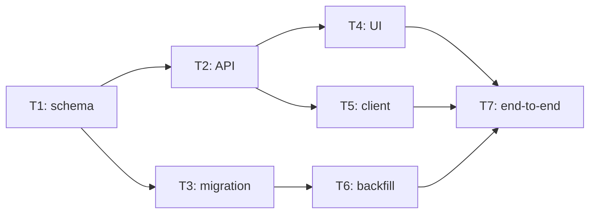

---
capsule:
  what: "Binding V7 contract for turning an approved canonical spec into an armed, dependency-aware wave that drains to objective proof and artifact-first delivery."
  use_when:
    - "Work changes spec-to-task planning, wave authorization, unattended DAG scheduling, reviewer close policy, or morning delivery artifacts."
  skip_when:
    - "The task only changes one runner adapter, task implementation, or unrelated tracker CRUD."
---

# 11 — Spec-to-wave autonomous delivery

Date: 2026-07-14

Status: binding implementation spec

## Purpose

The operator should spend time designing canonical product specifications, not
copy-pasting orchestration prompts or approving routine engineering work.
Tusker turns an approved spec into a validated task DAG, records one explicit
authorization to execute that DAG, drains every runnable frontier through
isolated workers and independent reviewers, and returns an artifact-first brief.

The terminal condition is not "an agent touched every task." It is one of:

- every wave member is objectively proven, reviewed, landed, and documented as
  required by its contract; or
- all remaining work is parked behind a concrete machine failure or a genuine
  human capability, authority, or unresolved-intent boundary, while unrelated
  runnable work has continued.

## Operator contract

```text
long design discussion
        ↓
approved canonical spec / decisions
        ↓
task-DAG proposal + artifact contracts
        ↓
wave preflight
        ↓
one explicit arm action
        ↓
daemon drains runnable DAG frontiers
        ↓
artifact-first delivery brief
```

The operator does not approve each task, code review, test result, dependency
transition, or merge. Arming the wave is the durable authorization for all
objective work already entailed by the linked spec and task contracts.

## Product boundaries

| Concern | Durable owner | Rule |
|---|---|---|
| Product intent | Canonical spec and decisions | Tasks may decompose intent but never silently change it. |
| Implementation contract | Task acceptance, verification, and artifact contract | Every task must be independently attributable and provable. |
| Ordering | Task dependency DAG | The scheduler runs the complete eligible frontier, not a handwritten sequence. |
| Execution authorization | Armed wave record | Ready tasks are inert until their wave is armed or direct work is explicitly requested. |
| Runtime ownership | Daemon run/lease/session | One modifying owner per task and workspace. |
| Objective acceptance | Independent reviewer agent | Code review, tests, logs, benchmarks, traces, and objective artifacts are agent work. |
| Human interruption | Explicit gate | Only missing human capability, external authority, unresolved intent, or explicitly subjective acceptance may stop dependent work. |
| Delivery | Wave integration branch plus delivery brief | The morning surface shows outcomes and artifacts, not orchestration transcripts. |

## Spec-to-task planning

A planning session emits or imports a structured delivery plan. Tusker remains
the record writer: remote or interactive models may propose the graph, but they
do not fabricate final task IDs, revisions, or lifecycle state.

The plan contains:

- the governing spec and decision references;
- tasks with observable acceptance outcomes;
- exact focused verification commands;
- dependencies with explicit hard/soft semantics when defaults are insufficient;
- owned paths or declared overlap where known;
- an operator artifact contract for each task;
- the desired concurrency ceiling and runner profile;
- knowledge nodes that must change when the implementation changes durable truth.

Planning must reject cycles, dangling dependencies, placeholder acceptance,
placeholder verification, and artifact requirements that name no production
path. Imported tasks begin held; a successful wave preflight is the only bulk
promotion path.

## Artifact contract

Every task names the best compact artifact that lets the operator understand
the outcome without conducting a basic code review. The artifact is evidence,
not decoration.

| Work type | Preferred artifact |
|---|---|
| UI or interaction | Screenshot set or short recording tied to acceptance IDs. |
| Performance | Before/after benchmark, environment, variance, and ratio. |
| API/backend behavior | Request/response example, trace, replay, or concise behavior matrix. |
| Reliability | Failure-injection timeline and recovered terminal state. |
| Security | Threat/change summary, checks performed, and residual risk. |
| Refactor/internal cleanup | Diff summary plus focused regression proof when no richer artifact exists. |
| Documentation/knowledge | Rendered or routed document plus link-check/skill-doctor result. |

Artifact production is agent-owned unless the contract explicitly requires a
human's subjective judgment. A screenshot can be captured and objectively
checked by agents; "does this feel on-brand?" is human only when the approved
contract says that subjective acceptance is required.

## Wave authorization and preflight

Wave lifecycle and execution authorization are separate. Wave completion stays
derived from member state; authorization is recorded as `disarmed`, `armed`, or
`paused` with actor, time, spec revision, and task-set fingerprint.

Target surface:

```bash
tusker delivery plan --spec docs/specs/example.md --out .tusker/scratch/delivery-plan.yaml
tusker delivery import --plan .tusker/scratch/delivery-plan.yaml --wave "Example delivery"
tusker wave preflight W-0001 --json
tusker wave arm W-0001 --by human:sarav
tusker wave pause W-0001 --reason "operator-requested pause"
tusker wave brief W-0001
```

`preflight` is read-only and checks the complete batch once:

1. spec/decision links resolve and the task graph is acyclic;
2. every member has concrete acceptance, exact focused proof, and an artifact contract;
3. dependencies and the initial runnable frontier are explained;
4. the project is registered, enabled, and healthy;
5. the managed daemon is alive and reconciling;
6. the runner/skill/workflow versions are compatible and the unattended runner
   profile cannot pause for routine approvals;
7. multi-task work uses isolated task workspaces and a clean wave integration base;
8. genuine human gates are listed with their affected dependency closure;
9. expected concurrency, validation lane, branch, and landing policy are shown.

`arm` fails atomically if preflight fails. It records authorization for exactly
the fingerprinted spec revision and task set, promotes valid held members to the
appropriate runnable state, and never silently includes unrelated ready tasks.
A material spec/task-set change disarms the stale authorization until preflight
passes again.

## DAG draining

The resident daemon continuously schedules the armed wave's topological
frontier up to its configured concurrency ceiling.



The scheduler must:

- run `T1`, then the complete `{T2, T3}` frontier, then `{T4, T5, T6}` as their
  own dependencies become machine-green, without operator prompting;
- give each task a fresh context, isolated worktree, attributable patch/commit,
  focused proof, artifact, and independent review;
- let proof-satisfied soft dependencies flow while asynchronous review/landing completes;
- park only the failed task and its hard dependency closure after bounded retries;
- continue unrelated branches after a machine failure or human gate;
- never treat `review`, proof recording, task boundaries, or a worker's clean exit
  as a reason to stop draining the wave;
- never claim completion from implementation activity without the required
  deliverable and acceptance-mapped proof.

## Review, proof, and human boundaries

Risk controls proof depth, reviewer profile, and landing safeguards. Risk does
not by itself require a human acceptor.

Independent reviewer agents may close objective work at every risk tier after
the configured proof and explicit gates pass. High/critical work may require a
stronger model, additional deterministic checks, or two independent reviewer
passes. It does not create an implicit human approval.

A human gate is valid only when it names:

1. the missing capability, external authority, or unresolved product fact;
2. why no implementation or reviewer agent can supply it;
3. the exact human action;
4. the evidence that resumes the affected tasks.

Valid examples include OAuth/login, a secret unavailable to the environment,
production release authority, a destructive external action, an inaccessible
physical device, a contradiction the approved spec does not resolve, or
explicitly subjective final-artifact acceptance. Code review, test execution,
log inspection, benchmark interpretation, and choices already made by the spec
are invalid human gates.

## Validation and landing

Per-task workers run focused checks while implementation is fresh. Broad builds,
full suites, and expensive platform matrices run in one serialized validation
lane against the integrated wave state.

Validation results are reusable only for the same source/task/command/toolchain
fingerprint. A red integration batch is bisected: green members continue
landing, the isolated offender returns to rework, and the whole wave does not
wait for a human to diagnose ordinary test failure.

No worker edits or merges directly to the default branch. Task branches land
through the existing wave integration and serialized landing lane.

## Delivery brief

`tusker wave brief` and the Serve/Mac morning surface use this order:

1. **Outcome:** what the wave delivered and whether it fully drained.
2. **See it:** screenshots, recordings, benchmark deltas, traces, matrices, and
   security/reliability summaries grouped by acceptance outcome.
3. **Landed:** concise task and integration summaries with links.
4. **Rework/parked:** the first actionable machine failure and affected closure.
5. **Human action:** only genuine gates, each with one exact action and resume ID.
6. **Documentation:** changed canonical knowledge nodes and skill routes.

Do not lead with token counts, attempt transcripts, raw logs, or "worked on"
tables. Distinguish implementation present, objectively proven, reviewed,
landed, and documented.

## Direct interactive work

An explicit direct request such as "work through A, B, and C" authorizes that
interactive session to implement those tasks itself. Daemon `backlog`/`held`
eligibility and claimed-run protocol do not block direct work. The session must
still inspect an existing live automated owner, preserve per-task attribution,
record proof, and continue across task boundaries until the named set is
delivered or genuinely blocked.

For actual unattended work, the session prepares and arms the wave. It does not
spawn ad hoc nested model processes. Managed-service lifecycle actions may be
performed only when the operator explicitly requested unattended execution and
the action is represented in the preflight/arm result.

## Failure behavior

| Failure | Required behavior |
|---|---|
| Daemon absent or not reconciling | Preflight fails loudly; never promise overnight execution. |
| Project disabled/unhealthy | Preflight names the exact registration/config repair. |
| Stale skill/workflow/runner | Preflight blocks arming or performs an explicit approved repair, then rechecks. |
| Task is held/backlog | Valid wave arm promotes it; direct explicit work proceeds without daemon claiming. |
| Missing acceptance/proof | Planning or preflight fixes/rejects the contract before overnight execution. |
| Dirty shared checkout | Multi-task wave uses clean isolated worktrees; unrelated user changes are never absorbed. |
| Routine test failure | Task returns to rework; independent DAG branches continue. |
| Attempt cap | Task parks with one actionable machine summary; no infinite retry loop. |
| Human gate on one branch | Only its dependency closure waits; other runnable work drains. |
| Spec/task set changes after arm | Authorization becomes stale and the wave disarms until re-preflighted. |

## Work streams

- `[[DEL]]` owns the end-to-end spec-to-wave product contract.
- `[[AGX-T-0006]]` provides spec/task traceability.
- `[[AGX-T-0007]]` provides the narrow human-approval boundary.
- `[[OPS-T-0001]]` provides the wave record.
- `[[OPS-T-0002]]` provides isolated task landing and integration validation.
- `[[OPS-T-0003]]` provides escalation and the morning digest foundation.
- `[[RUN-T-0015]]` provides the managed resident-daemon foundation.
- `[[FBK-T-0004]]` provides cross-repo skill/workflow setup diagnostics.

The DEL task graph adds the missing plan/import, preflight/authorization, DAG
draining, objective close policy, artifact brief, and end-to-end rollout work.

- `[[DEL-T-0001]]` owns delivery-plan validation and atomic spec-to-wave import.
- `[[DEL-T-0002]]` owns whole-wave preflight and explicit authorization.
- `[[DEL-T-0003]]` owns durable DAG draining and failure containment.
- `[[DEL-T-0004]]` owns objective reviewer close at every risk tier.
- `[[DEL-T-0005]]` owns artifact contracts and the delivery brief.
- `[[DEL-T-0006]]` owns end-to-end dogfood and cross-project rollout.
