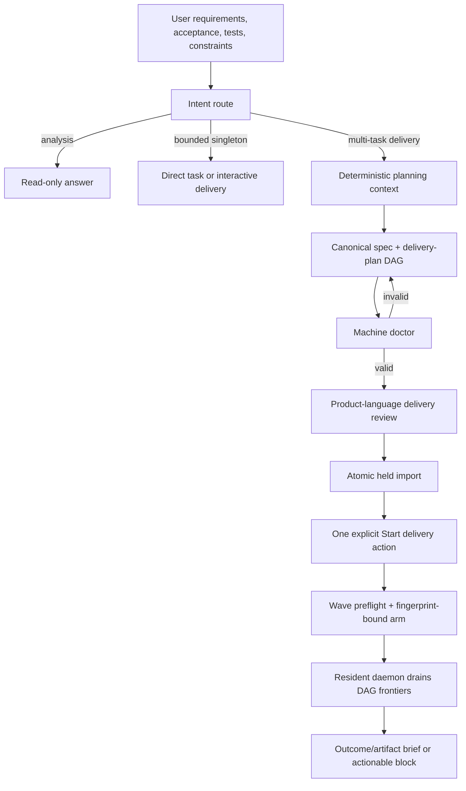

---
capsule:
  what: "Binding product and implementation contract for turning normal requirement conversations into requirements-traceable, daemon-drainable Tusker delivery DAGs by default."
  use_when:
    - "Work changes how agents classify planning requests, create tasks or waves, gather planning context, review a delivery plan, authorize factory execution, onboard repositories, or distribute the Tusker skill."
  skip_when:
    - "The work executes one already-tracked task or changes an unrelated runner, proof record, or repository domain fact."
---

# Requirements-to-DAG Factory Intake

Status: proposed implementation contract
Date: 2026-07-25

## 1. Outcome

A user describes what should exist, why it matters, how success should be
observed, and any constraints they care about. Tusker and its installed agent
skill handle the operational decomposition:

1. inspect the repository and existing project knowledge;
2. resolve only material product ambiguity;
3. write or update the governing specification;
4. compose a versioned, requirements-traceable task DAG;
5. validate acceptance, tests, artifacts, dependencies, ownership, and gates;
6. present one product-language delivery review;
7. import the work held and disarmed;
8. accept one explicit, fingerprint-bound **Start delivery** action;
9. let the resident daemon drain implementation, proof, review, rework, and
   landing frontiers;
10. return an outcome-and-artifact brief or one actionable blocked state.

The user does not need to know task IDs, wave mechanics, dependency syntax,
worktree policy, runner profiles, retry rules, evidence record shapes, or
daemon commands.

This is the default planning path for multi-task implementation work in every
repository with the Tusker operator skill installed. It is not an automatic
grant of execution authority.

## 2. Product thesis

The software factory should spend human attention on:

- desired behavior;
- acceptance outcomes;
- important test cases and failure modes;
- product constraints and priorities;
- genuine authority, credential, legal, or subjective decisions;
- reviewing what landed.

The factory should own:

- repository discovery;
- decomposition and dependency ordering;
- task and wave record mechanics;
- exact verification command discovery;
- workspace isolation and concurrency;
- implementation and independent review;
- routine failure diagnosis and bounded rework;
- integration gates and landing;
- operational status projection.

If a user has to ask whether their task breakdown is in "the new DAG format,"
the intake product has failed.

## 3. Intake routing contract

Agents route by the requested outcome and structural scope, not by a brittle
keyword list. The canonical skill owns the following decision table.

| User intent | Default route | Durable mutation | Execution authority |
| --- | --- | --- | --- |
| Explain, evaluate, audit, compare, investigate, or critique | Read-only analysis | None unless explicitly requested | None |
| Record one small bug, chore, or follow-up | Direct singleton task | One held/backlog task | None |
| Implement one clearly bounded change now | Direct interactive delivery | Existing or implicit singleton contract | The explicit direct request, bounded to that change |
| Plan, decompose, task, build out, roadmap, or create workstreams | Factory planning | Spec plus versioned delivery-plan DAG, imported held when task creation was requested | None |
| Implement a change spanning multiple independently reviewable units, lanes, branches, or domains | Factory planning, then delivery | Spec plus DAG and wave | One fingerprint-bound Start delivery action |
| Run autonomously, overnight, through the daemon, or to completion | Factory planning plus unattended preflight | Spec, DAG, wave, preflight result | One fingerprint-bound Start delivery action; project automation remains separately opt-in |

Structural signals for a DAG include:

- two or more independently provable outcomes;
- backend and UI or another multi-domain boundary;
- work that can execute concurrently;
- migrations, generated sources, or shared scarce resources;
- a rollout, cutover, compatibility, or recovery phase;
- more than one likely implementation branch or reviewer packet;
- explicit user language such as "tasks," "workstreams," "waves," "long term,"
  or "take it to completion."

When the user asks only for analysis, the agent may explain the likely DAG but
must not create it. When the user asks to create tasks or a plan that can be
run, the agent must use the delivery-plan path rather than hand-minting a list
of final task records.

A one-task delivery plan is valid when the user explicitly asks for a
daemon-drainable plan but decomposition produces one real outcome. The agent
does not invent extra tasks to make a DAG look impressive.

## 4. Conversation contract

The agent starts from the user's requirements and searches the repository
before asking questions. It asks only when one of these would materially
change the result:

- the intended user-visible outcome is ambiguous;
- acceptance alternatives conflict;
- a product or architecture boundary has no governing decision;
- external authority, credentials, or a subjective judgment are required;
- the repository contains contradictory sources of truth that cannot be
  resolved mechanically.

The agent does not ask the user to choose:

- an epic acronym;
- task IDs;
- hard versus soft dependency notation;
- concurrency groups;
- worktree or branch names;
- runner profiles;
- proof modes;
- evidence file locations;
- retry counts;
- daemon polling or lifecycle commands.

Those are factory implementation details. The planning review may explain
important consequences, but it never turns internal bookkeeping into product
questions.

## 5. Factory intake lifecycle



Planning and import remain inert:

- no project automation is enabled;
- no daemon is started;
- no task becomes runnable;
- no model worker is dispatched;
- no integration or default branch moves;
- no release or paid external action occurs.

## 6. Deterministic planning context

The agent should not reconstruct repository capabilities from a broad,
expensive source crawl every time. Tusker exposes a read-only planning context
packet for a governing spec.

Target surface:

```text
tusker delivery context --spec docs/specs/example.md --scope settings-redesign/v1 --json
```

The bounded packet contains:

- project and vault identity;
- spec and decision references with fingerprints;
- relevant epic candidates and open duplicate task clues;
- routed project-knowledge domains;
- configured focused and integration test commands;
- runner profiles and supported proof capabilities;
- workspace, branch, gate, and landing policy;
- protected/default branch identity;
- likely owned paths and known generated/shared resources;
- project automation and daemon readiness as informational facts;
- current human gates relevant to the cited domains;
- the delivery-plan schema and exact validation rules.

It excludes:

- secrets and environment values;
- raw logs and attempt transcripts;
- full task or knowledge collections;
- unrelated project source;
- permission to mutate or dispatch.

Missing context is reported as unknown, never invented. An unknown test command
must become a concrete discovery outcome or a genuine gate; it must not become
fake verification.

## 7. Requirements-traceable delivery plan

The current `tusker.delivery-plan/v1` remains supported. Factory intake adds a
backward-compatible reader and a new `tusker.delivery-plan/v2` authoring
contract.

V2 adds:

- a planner-authored `context_fingerprint` from the bounded planning-context packet;
- stable requirement IDs and observable requirement outcomes;
- task-to-requirement traceability;
- an optional source-keyed epic contract when no suitable epic exists;
- source-keyed human gates tied to tasks and acceptance IDs;
- declared shared resources and intentional owned-path overlap;
- plan assumptions and explicitly unresolved decisions;
- explicit non-goals that remain visible in product review;
- an operator-facing plan summary.

Conceptual shape:

```yaml
schema: tusker.delivery-plan/v2
scope: settings-redesign/v1
title: Settings redesign
spec_refs:
  - docs/specs/settings-redesign.md
context_fingerprint: sha256:<planning-context-fingerprint>
non_goals:
  - The redesign does not add new notification channels.
epic_contract:
  source_key: settings-redesign
  acronym_hint: SET
  title: Settings redesign
requirements:
  - id: R1
    outcome: A user can change notification preferences from one screen.
tasks:
  - source_key: settings-api
    requirement_refs: [R1]
    title: Expose notification preferences
    outcome: The settings API reads and updates notification preferences.
    acceptance:
      - id: A1
        outcome: Valid preference updates round-trip through the public API.
    verification:
      - covers: A1
        check: "command: go test ./internal/settings -run '^TestPreferencesAPI$'"
    dependencies: []
    artifact:
      kind: behavior_matrix
      path: internal/settings/preferences_api_test.go
      summary: Request, response, validation, and persistence behavior matrix.
      acceptance_ids: [A1]
```

Tusker, not the model, allocates final epic, task, gate, wave, revision, and
event identities. Stable scope and source keys make repeated planning
idempotent.

### 7.1 Plan doctor

The plan doctor rejects or explains:

- missing or duplicate requirement IDs;
- a requirement not covered by any task acceptance;
- task acceptance without exact verification;
- verification not mapped to acceptance;
- cycles or dangling dependencies;
- an implementation task without an operator artifact;
- a human-owned proof step without a real human gate;
- source-key collisions or unsafe plan-scope reuse;
- simultaneous frontier tasks with conflicting owned paths unless the overlap
  has an explicit integrator or shared-resource strategy;
- unsupported runner or proof requirements;
- concurrency above available or declared capacity;
- plan assumptions presented as accepted product facts;
- imported scope that would absorb unrelated runnable work.

Warnings do not silently become permission. A plan is executable only when all
blocking findings are resolved.

## 8. Human delivery review

Users should not review YAML to start work. Tusker renders the validated plan
as one concise surface:

1. **What will be delivered** — requirement outcomes and non-goals.
2. **How it will be proven** — acceptance and important test/failure coverage.
3. **How work flows** — dependency frontiers, expected concurrency, and broad
   integration/rollout phases.
4. **What needs your decision** — only genuine human gates or unresolved
   product choices.
5. **Start boundary** — exact plan and planning-context fingerprints, project readiness, estimated
   execution class, and the single Start delivery action.

Target CLI/API shapes:

```text
tusker delivery review --plan <plan.yaml> [--json]
tusker delivery start --plan <plan.yaml> --by human:<name> --confirm <fingerprint>
```

Serve presents the same versioned projection and a Start delivery button. The
button is disabled with one actionable reason when project setup, daemon,
runner, workspace, plan, or gate preflight is not ready.

## 9. Start delivery semantics

`delivery start` is a convenience transaction over existing authority
boundaries, not a bypass:

1. re-read and validate the exact confirmed plan fingerprint;
2. atomically import or reconcile the held plan;
3. run whole-wave preflight;
4. arm only if every preflight check passes and the actor/fingerprint match;
5. return the wave ID, first frontier, expected concurrency, and status link.

If import succeeds but environmental preflight fails, the wave remains
truthfully held and disarmed. Repeating the command is idempotent.

`delivery start` never:

- enables project automation;
- installs or starts the resident daemon;
- changes runner permissions;
- satisfies a human gate;
- authorizes release or paid external work;
- includes unrelated tasks;
- moves a source or integration branch itself.

Project registration, automation, daemon supervision, and approved runner
profiles are one-time factory setup. They are observable prerequisites, not
per-requirement chores.

## 10. Canonical skill and distribution

The canonical `skills/tusker/SKILL.md` uses normative language:

- multi-task planning **must** produce a versioned delivery plan;
- final task records **must** come from import;
- analysis stays read-only;
- direct task creation is limited to genuine singleton intake and follow-ups;
- import is inert;
- unattended execution requires preflight and one exact Start/arm action;
- users are asked product questions, not Tusker bookkeeping questions.

The decision table lives in one canonical factory-intake contract consumed by
the skill, docs, tests, and setup doctor. References such as formal intake,
quick mode, onboarding, commands, and system documentation must not contradict
it.

Skill metadata advertises the factory-intake contract version. Distribution
rules:

- symlink installs observe canonical source changes immediately;
- copied and bundled installs record their source fingerprint and contract
  version;
- setup/rollout doctor reports stale copies with the exact `skill sync`
  repair;
- wave preflight rejects an installed skill that predates the planning
  contract when the wave was created under it;
- generated installs are never patched as source.

## 11. Onboarding

Repository onboarding remains conservative but joins the same planning
language. It produces:

- observed project/domain knowledge proposals;
- assumptions and open questions;
- proposed epic contracts;
- optional executable delivery plans only where acceptance and exact proof are
  known;
- source-keyed gates for missing human facts.

It does not emit a parallel `tasks.yaml` format that bypasses delivery-plan
validation. Unknown verification remains a gate or non-executable proposal,
not a ready task with invented proof.

## 12. Failure and edge-case behavior

| Scenario | Required result |
| --- | --- |
| "Evaluate this proposal" | Read-only analysis; no spec, plan, task, or wave mutation unless requested. |
| "Write tasks for this feature" | Versioned plan, dry-run, and held import; no hand-created task series. |
| One typo or isolated bug | Direct task/implementation path remains available. |
| One outcome explicitly requested as daemon work | A valid one-node delivery DAG. |
| Missing product decision | Ask one bounded question or create a source-keyed human gate; do not guess. |
| Missing test command | Inspect first; otherwise create a real discovery contract or gate, never placeholder proof. |
| Two planners race | Stable scope/source keys converge or one receives a named conflict; no duplicate tasks. |
| Plan changes after review or arm | Fingerprint mismatch blocks Start or stales authorization. |
| Existing unrelated ready tasks | They are excluded from the wave and called out before factory enablement. |
| Symlinked skill | Canonical policy change is immediately visible. |
| Stale copied skill | Doctor/preflight blocks with an exact sync action. |
| Daemon absent | Review succeeds, Start parks held with one setup action; it never promises autonomous completion. |
| Human gate on one branch | Only the affected dependency closure waits after arm. |
| Machine failure | Bounded repair/review continues; exhausted work parks with an actionable brief. |

## 13. Rollout

1. Land the canonical intake decision contract and V2 compatibility model.
2. Add deterministic planning context and plan-doctor findings.
3. Add the product-language review and fingerprinted Start transaction.
4. Switch the canonical skill and all intake references from optional/manual
   task planning to the default DAG path.
5. Migrate onboarding output.
6. Add skill version/fingerprint freshness checks and refresh generated
   installs.
7. Add Serve review/start controls.
8. Dogfood on:
   - a read-only architecture review;
   - a direct singleton bug;
   - a two-frontier backend change;
   - a UI/backend feature with human acceptance;
   - an unattended wave with a deliberately stale plan;
   - a copied-skill repository.
9. Roll out to existing registered repositories only after the dogfood matrix
   passes. Automation and future scheduled promotion remain separately opt-in.

## 14. Success measures

The rollout is successful when:

- at least 95% of prompts asking for multi-task implementation planning produce
  a valid delivery-plan DAG without the user mentioning Tusker;
- zero imported factory plans contain placeholder acceptance or verification;
- users can review and start a valid plan without seeing or editing YAML;
- no plan/import operation dispatches work;
- every started delivery has exact requirement-to-task-to-proof traceability;
- copied stale skills are detected before planning or preflight;
- routine task, review, retry, and landing transitions require no human action;
- the delivery brief distinguishes landed, blocked machine work, and genuine
  human decisions without exposing orchestration transcripts.

## 15. Non-goals

- This contract does not silently enable project automation.
- It does not grant standing authority to arm arbitrary future plans.
- It does not require a wave for ordinary read-only analysis.
- It does not inflate a true singleton into artificial workstreams.
- It does not make an LLM the owner of final Tusker identities or lifecycle
  state.
- It does not replace canonical product specifications with task prose.
- It does not promise success through genuine human, credential, legal, or
  unresolved-intent boundaries.

## Work streams

<!-- tusker:delivery-import:97cfc4c5dfa25453:begin -->

- `[[ORC-T-0035]]` implements delivery source `canonical-factory-guidance`.
- `[[ORC-T-0032]]` implements delivery source `delivery-plan-doctor`.
- `[[ORC-T-0030]]` implements delivery source `delivery-plan-v2`.
- `[[ORC-T-0033]]` implements delivery source `delivery-review-brief`.
- `[[ORC-T-0034]]` implements delivery source `delivery-start-transaction`.
- `[[ORC-T-0029]]` implements delivery source `factory-intake-contract`.
- `[[ORC-T-0039]]` implements delivery source `factory-intake-e2e`.
- `[[ORC-T-0037]]` implements delivery source `onboarding-plan-migration`.
- `[[ORC-T-0031]]` implements delivery source `planning-context-packet`.
- `[[ORC-T-0036]]` implements delivery source `serve-factory-intake`.
- `[[ORC-T-0038]]` implements delivery source `skill-distribution-freshness`.

- `[[W-0002]]` is the imported delivery wave.

<!-- tusker:delivery-import:97cfc4c5dfa25453:end -->
