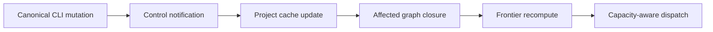

---
capsule:
  what: "Binding contract for Tusker's opt-in, multi-project execution control loop: claimed work, incremental DAG reconciliation, independent review, deterministic integration, and automatic successor dispatch."
  use_when:
    - "Work changes daemon dispatch eligibility, interactive ownership, dependency-frontier reconciliation, automated review/rework, landing completion, multi-project scheduling, factory operations UI, or installed agent guidance."
  skip_when:
    - "The work only changes requirement intake, scheduled promotion, release, or one already-claimed product task without changing factory lifecycle semantics."
---

# Opt-in Factory Execution Control

Status: proposed implementation contract
Date: 2026-07-25

## 1. Outcome

After a user approves one bounded delivery wave, Tusker should take that wave
from its first runnable dependency frontier through implementation, proof,
independent review, bounded rework, integration, successor unlock, and final
delivery without routine project-management intervention.

The user's continuing responsibilities are:

- state the requirements and constraints;
- agree on observable acceptance and important tests;
- make genuinely human product, authority, credential, legal, or subjective
  decisions;
- review the outcome and artifacts.

Tusker owns the operational loop:

1. determine the current runnable dependency frontier;
2. claim each selected task atomically before work starts;
3. preserve one task, revision, workspace, branch, and owner identity;
4. react to implementation handoff by dispatching an independent reviewer;
5. convert the review into a typed pass, changes-requested, or blocked result;
6. execute ordinary integration and task closure deterministically;
7. return failed review or landing work to a bounded repair loop with complete
   context;
8. recompute only the affected dependency closure;
9. dispatch newly unlocked tasks within project, wave, runner, resource, and
   global limits;
10. expose a product-language status surface.

Automation remains opt-in. Creating tasks, importing a plan, registering a
project, installing a skill, or starting the resident daemon does not by itself
authorize arbitrary repository work.

## 2. This is not a new DAG engine

Tusker already has most of the required railway. The implementation must
extend and harden these paths rather than build parallel machinery.

| Capability | Existing source of truth | Required work |
| --- | --- | --- |
| Markdown task and wave records | V7 task/wave frontmatter | Preserve |
| Hard and soft dependency semantics | `v7_dependencies.go` | Preserve and prove active-run relock |
| Runnable armed-wave frontier | `armed_wave.go` | Preserve |
| Restart reconstruction from durable state | armed-wave snapshot and runtime store | Preserve and extend crash proof |
| CLI mutation daemon wakeup | `cli_mutation_notify.go` | Add changed-object hints |
| Warm zero-parse note cache | `notes.go` | Reuse for fallback scans |
| Atomic runtime ownership and path conflict checks | `run_ownership.go` | Make the universal agent entry path |
| Independent review lane and bounded cycles | `daemon.go` | Replace prose/Git choreography with a typed result |
| Reviewer finding hand-back | `reviewer_finding.go` | Feed from typed findings |
| Staged merge, gates, bisection, and integration branch | `v7_land_cmd.go` | Compose into one idempotent completion transaction |
| Whole-wave drain | `drainArmedWavesToMain` and configured landing policy | Preserve policy boundary |

The missing product is not “parse dependencies and loop.” It is one coherent,
enforced control contract over the existing pieces.

## 3. Safety and authority model

### 3.1 Project automation

Fresh repositories use:

```yaml
automation:
  enabled: false
  dispatch_scope: armed_waves
```

`automation.enabled` controls whether the resident daemon may create fresh
background claims for the project.

`automation.dispatch_scope` controls what an enabled project authorizes:

| Value | Daemon authority |
| --- | --- |
| `armed_waves` | Only ready/rework members of a currently armed, non-stale wave fingerprint |
| `all_eligible` | Any task that satisfies the project's configured dispatch policy; explicit legacy/advanced mode |

Fresh setup defaults to `armed_waves`. Existing enabled projects with no field
retain their prior behavior through an explicit legacy-effective projection
and receive a doctor warning; migration must never silently narrow or widen a
live project's authority.

An interactive user-directed session may explicitly claim one task while
project automation is disabled. That claim authorizes only the named task and
does not enable daemon dispatch.

### 3.2 Wave authorization

An epic is an organizational and requirements boundary. It is not an
execution grant.

A wave is the frozen executable subset. In `armed_waves` mode, only exact
members of the currently authorized wave fingerprint can produce fresh daemon
claims. Adding, removing, or materially changing a task, dependency, gate,
proof contract, runner, or integration base makes the authorization stale.

The daemon never interprets “run this epic” as “run every open task in the
epic.” Requirements planning chooses the wave; the daemon schedules it.

### 3.3 No arbitrary lifecycle hooks

Task frontmatter must not embed arbitrary commands to run when status changes.
Lifecycle reactions are typed Tusker handlers.

Verification and gate commands remain explicit task or profile contracts.
Release, deployment, and other privileged operations use named, locked-down
profiles. Secrets are never placed in task Markdown or model prompts.

## 4. Canonical work-session protocol

Every agent that modifies a tracked task enters through one shared ownership
path, whether the agent is interactive or daemon-dispatched.

Target surface:

```text
tusker work start <TASK-ID> --by agent:<name> [--source codex|claude|tusker_cli] --json
tusker work status <TASK-ID> --json
tusker work heartbeat <TASK-ID> --by agent:<name>
tusker work submit <TASK-ID> --by agent:<name> --deliverable <text> --verification <text>
tusker work fail <TASK-ID> --by agent:<name> --reason <text>
tusker work release <TASK-ID> --by agent:<name> --reason <text>
```

`work start` is a façade over the existing run-ownership service. It:

1. resolves the exact task and current projected dependency readiness;
2. refuses human gates, stale wave authority for daemon work, terminal state,
   unsafe workspace state, path ownership conflicts, and a healthy live owner;
3. safely reclaims only a provably dead expired holder;
4. prepares or reuses the task workspace and branch;
5. creates one runtime lease and attempt intent bound to task, work revision,
   source revision, owner, workspace, branch, and authorization source;
6. returns the task packet path, workspace, branch, lease expiry, and exact
   next command;
7. notifies the resident daemon of the changed task without asking it to spawn
   an interactive worker.

The operation is valid with project automation disabled when explicitly
invoked by a live interactive user session. It never starts a daemon, enables
automation, arms a wave, or launches a nested model.

Canonical agent guidance requires a live work session before implementation
and requires submit/fail/release to terminate it. Reviewer and human control
operations remain distinct. A human/local break-glass path stays available,
but it is explicit and attributable.

Legacy `claim`, `attempt`, and `runs` surfaces remain compatible during
migration. They must either delegate to the shared ownership service or report
the exact canonical replacement; they must not create a second, contradictory
notion of active work.

## 5. Incremental project and DAG reconciliation

The primary path is event-driven:



The control notification carries:

- project identity;
- changed object IDs and kinds;
- resulting state revisions when available;
- mutation cause;
- whether dependencies, gates, proof, wave authorization, or runtime
  eligibility may have changed.

The daemon keeps one in-memory graph projection per active project:

- task ID to parsed operational note and state revision;
- forward and reverse hard/soft dependency edges;
- wave membership and authorization fingerprint;
- current task eligibility and reason;
- frontier generation.

One canonical CLI mutation reloads the changed records and recomputes the
smallest affected reverse-dependency and wave closure. It must not YAML-parse
every task in every project.

The existing adaptive scan remains the correctness and recovery fallback:

- raw file edits;
- missed or incompatible control notifications;
- daemon restart;
- registry changes;
- cache corruption or revision mismatch.

Unchanged fallback scans remain stat-only through the shared note cache. The
graph projection is rebuildable and is not a second durable source of truth.

Performance targets are measured, not guessed:

- a one-task CLI mutation in a warm 10,000-task project parses only changed
  records plus a bounded affected closure;
- an unrelated registered project performs no note reads or YAML parses;
- restart rebuild produces the same frontier as a clean full reconcile;
- raw edits become visible within the documented adaptive fallback window.

## 6. Dependency and frontier semantics

The existing edge contract remains:

- hard dependency: satisfied only when the predecessor is `done`;
- soft dependency: satisfied when the predecessor is `done`, or while it is in
  `review` with satisfied machine proof;
- a predecessor returned to `rework` re-locks its soft dependents until the
  condition is satisfied again.

The runnable frontier is deterministic and stable:

1. exact armed-wave membership and non-stale authorization;
2. status `ready` or `rework`;
3. no unsatisfied hard/soft dependency;
4. no open human-owned gate;
5. no healthy runtime owner;
6. compatible runner, workspace, resource, and path ownership;
7. available wave, project, runner, resource, and global capacity.

If a provisional soft dependency re-locks while a downstream run is live, the
daemon stops or suspends that run at the next safe boundary, preserves its
workspace, and returns it to an attributable resumable state. It must not land
work whose dependency premise is no longer true.

One failed or human-blocked branch contains only its hard downstream closure.
Independent branches continue.

## 7. Typed review result

A review worker is independent and read-only with respect to implementation
files. Its only lifecycle output is a typed result bound to the current review
attempt:

```text
tusker review submit <TASK-ID> \
  --attempt <ATTEMPT-ID> \
  --verdict pass|changes_requested|blocked \
  --covers A1,A2 \
  --summary <bounded-summary> \
  [--finding <bounded-finding>] \
  [--evidence-ref <ref>]
```

The result binds:

- task and work revision;
- implementation source SHA;
- reviewer attempt, actor, runner, and profile;
- acceptance IDs examined;
- proof and gate fingerprints;
- verdict;
- bounded summary and structured findings;
- artifact/evidence references;
- timestamp and result revision.

`pass` requires complete acceptance coverage and currently satisfied objective
proof and gates. `changes_requested` requires at least one actionable finding.
`blocked` requires a typed machine, infrastructure, or genuine human blocker.

Reviewer prose, process exit code, an unmarked verification row, and “looks
good” text are not acceptance. A reviewer exit without one valid result leaves
the task in review and follows the configured retry/park policy.

The model does not perform Git merge choreography, close the task, or move
integration/default refs.

## 8. Deterministic review-to-done transaction

A valid review result wakes one daemon-owned completion transaction keyed by:

```text
project + task + work_revision + implementation_sha +
review_attempt + review_result_revision + integration_base
```

### 8.1 Changes requested

The reactor:

1. writes or updates the bounded generated reviewer-finding section;
2. returns the task to `rework`;
3. preserves the implementation workspace and branch;
4. releases the review lease;
5. records the finding and prior proof/gate fingerprints in the next
   implementation packet;
6. re-locks affected soft dependents;
7. dispatches rework only within the normal attempt and review-cycle caps.

Repeated handling of the same review result is a no-op.

### 8.2 Pass

The reactor:

1. freezes implementation SHA, review result, proof/gate fingerprints, and
   integration base;
2. creates a detached staging worktree from the wave integration branch;
3. merges the exact task branch using the existing landing engine;
4. materializes the typed review verification and closes the task inside the
   staged tracker state;
5. runs the configured merged-state gate;
6. compare-and-swap updates the integration ref;
7. records landing and close audit facts;
8. projects the task as `done`;
9. recomputes affected dependencies and dispatches the newly available
   frontier;
10. delegates default-branch movement to the configured immediate or scheduled
   promotion policy.

No model is invoked for a clean merge or green deterministic gate.

### 8.3 Failure

Merge conflict, gate failure, stale source, stale review, proof/gate drift, or
integration-base drift cannot close the task. The transaction returns the task
to rework or parks it with:

- exact source and integration revisions;
- first actionable merge/gate failure;
- affected acceptance and paths;
- reproduction command or artifact reference;
- prior review result;
- stable defect identity for deduplication.

Optional model triage is reserved for ambiguity after deterministic
classification and remains separately configured and quota-bound.

### 8.4 Crash safety

Crash injection at result persistence, staging, merge, gate, close
materialization, integration CAS, audit persistence, and successor wakeup must
converge without:

- duplicate review dispatch;
- duplicate merge commits;
- terminal task rewind;
- false `done`;
- lost finding;
- duplicate successor claim;
- duplicate default-branch movement.

## 9. Multi-project scheduling

The resident daemon owns one global capacity budget and per-project,
per-runner, per-wave, and named-resource limits.

Eligible projects are selected fairly rather than exhausted in registry order.
At equal priority, a project with a waiting frontier receives a dispatch turn
before another project consumes a second global slot. Explicit priority and
scarce-resource policy may change ordering but must expose the reason.

One unhealthy, incompatible, disabled, held, or corrupt registration is
quarantined without blocking healthy siblings. Targeted mutations wake only
their project. Global resource release wakes every project waiting on that
resource.

## 10. Human surface

The control loop is only useful if the user can understand it without opening
logs. CLI, API, Serve, and desktop consume one versioned factory-operations
projection:

1. **Delivered** — accepted artifacts and integration/default revisions.
2. **Working now** — task outcomes, not process trivia.
3. **In review or rework** — bounded reason and automatic next action.
4. **Blocked** — affected dependency closure and first actionable cause.
5. **Needs your decision** — only genuine human-owned gates.
6. **Next frontier** — outcomes that will start when capacity/dependencies
   allow.

The project surface also shows:

- automation off/on and effective dispatch scope;
- armed wave and fingerprint health;
- current integration base and promotion mode;
- global/project capacity and named-resource holds;
- exact pause, resume, disarm, or repair action.

Raw logs, transcripts, prompt text, token totals, YAML frontmatter, and routine
heartbeats remain drill-down diagnostics.

## 11. Installed skill contract

Canonical and distributed Tusker skills must say:

- multi-task executable work is authored as an importable dependency DAG;
- import is inert and automation defaults off;
- an epic is not an execution grant;
- daemon work requires an enabled project and the configured dispatch scope;
- `armed_waves` requires one exact wave authorization;
- every modifying agent starts through `tusker work start`;
- interactive agents implement directly and never start the daemon or nested
  runners;
- dispatched workers verify their injected claim and never claim again;
- implementation submits proof; independent review submits a typed verdict;
- the daemon, not a model, performs routine landing and successor scheduling;
- users own requirements, acceptance, tests, and genuine decisions rather than
  task IDs, dependency syntax, runners, or day-to-day operations.

Setup and rollout doctor report stale installed skills and incompatible
workflow policy. Sync updates canonical generated copies without overwriting
project knowledge or unrelated user-authored content.

## 12. Rollout and compatibility

Rollout is staged:

1. characterize current frontier, cache, review, landing, and restart behavior;
2. add dispatch-scope policy with legacy-effective compatibility;
3. ship the universal work-session façade and skill guidance;
4. ship typed review results without changing landing authority;
5. enable the deterministic completion transaction behind a project feature
   flag;
6. run two-project shadow comparison against current behavior;
7. dogfood one low-risk armed wave;
8. enable the transaction for opted-in projects;
9. only then build requirements intake and scheduled-promotion cutovers on top.

During shadow mode, current authoritative execution continues. Shadow
decisions cannot claim, review, mutate task state, merge, close, or dispatch.

Rollback disables the new completion reactor and dispatch scope for fresh
claims while leaving live work, task history, review results, integration refs,
and runtime leases intact and inspectable.

## 13. Acceptance

1. Fresh repositories remain automation-off and default to armed-wave-only
   background dispatch.
2. Every modifying interactive or automated task has one shared runtime owner,
   revision, workspace, and lifecycle identity.
3. Canonical CLI mutations update only the affected graph closure on the fast
   path; adaptive stat-only scanning preserves correctness for raw edits and
   restarts.
4. Review produces a typed, attempt-bound result and never relies on prose or
   process exit as acceptance.
5. A passing review is deterministically merged, gated, closed on integration,
   and followed by exactly-once successor unlock.
6. Findings and landing failures produce bounded, contextual rework and relock
   affected downstream work without stopping independent branches.
7. Multiple projects share global capacity fairly and one unhealthy project
   cannot block healthy siblings.
8. Product surfaces explain delivered, working, review/rework, blocked, human
   decision, and next-frontier outcomes without requiring logs.
9. Canonical and installed skills make DAG planning, universal work sessions,
   opt-in authority, and deterministic daemon ownership the default operating
   contract.
10. End-to-end crash and replay tests prove no duplicate claim, review, merge,
    close, successor dispatch, or default-branch movement.

## 14. Non-goals

- Letting the daemon invent normal product scope or decompose an epic at
  runtime.
- Treating every open task in an epic as approved execution.
- Replacing Markdown task and wave records with a second durable graph
  database.
- Polling and YAML-parsing every repository on every mutation.
- Running arbitrary lifecycle scripts from task frontmatter.
- Asking a model to perform clean merges, ordinary state transitions, or
  scheduling.
- Enabling automation, release, deployment, spending, or paid triage as a side
  effect of planning, skill installation, project registration, or daemon
  startup.

## Work streams

<!-- tusker:delivery-import:c4ddb09995079021:begin -->

- `[[ORC-T-0048]]` implements delivery source `canonical-factory-execution-guidance`.
- `[[ORC-T-0045]]` implements delivery source `deterministic-review-completion`.
- `[[ORC-T-0040]]` implements delivery source `dispatch-scope-policy`.
- `[[ORC-T-0049]]` implements delivery source `factory-execution-dogfood-cutover`.
- `[[ORC-T-0047]]` implements delivery source `factory-execution-e2e`.
- `[[ORC-T-0046]]` implements delivery source `factory-operations-surface`.
- `[[ORC-T-0044]]` implements delivery source `fair-multi-project-dispatch`.
- `[[ORC-T-0042]]` implements delivery source `incremental-frontier-index`.
- `[[ORC-T-0043]]` implements delivery source `typed-review-results`.
- `[[ORC-T-0041]]` implements delivery source `universal-work-session`.

- `[[W-0003]]` is the imported delivery wave.

<!-- tusker:delivery-import:c4ddb09995079021:end -->
