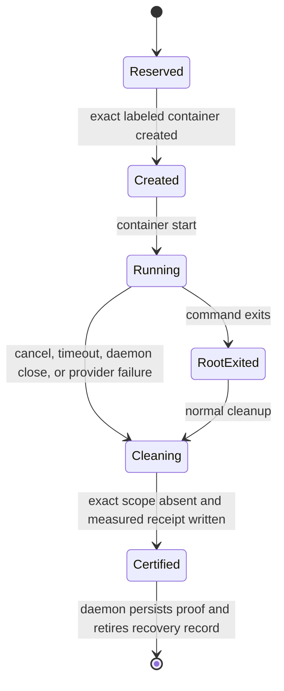

---
capsule:
  what: "Binding contract for the concrete, opt-in Docker and Podman lifecycle providers that may certify a scheduled full-promotion gate."
  use_when:
    - "Work changes full-gate provider setup, runtime attestation, container isolation, cleanup receipts, promotion proof reuse, or cutover readiness."
  skip_when:
    - "The task changes focused staging gates, ordinary agent sandboxes, or repositories that have not opted into scheduled promotion."
---

# Opt-in Full-gate Lifecycle Provider

Status: proposed implementation contract
Date: 2026-07-26
Extends: `docs/specs/12-opt-in-scheduled-promotion.md`

## 1. Outcome

Tusker can run the exact frozen full-promotion gate inside a disposable Docker
or Podman container whose complete lifecycle is owned by a trusted,
service-local provider. A successful receipt proves the candidate was mounted
read-only, network access was disabled, the container received no Tusker or
runtime control authority, and the whole container scope was destroyed before
the result became reusable promotion proof.

The provider is necessary but never self-enabling. Installing Tusker,
registering a repository, starting the daemon, importing or starting a delivery
plan, configuring ordinary automation, or selecting `scheduled_promotion:
promote` does not install a container runtime, start a VM, pull an image,
create a provider profile, or authorize promotion.

## 2. Authority and opt-in boundaries

Provider profiles live under the resident daemon's service-owned state root,
not in a repository or model-writable workspace. Creating or replacing one is
an attributable operator action:

```text
tusker gate-provider configure \
  --profile <name> \
  --runtime docker|podman \
  --client </absolute/native/binary> \
  --endpoint <local-unix-endpoint> \
  --image <repository@sha256:digest>
```

The exact spelling may evolve, but the authority semantics may not:

- configure never enables repository automation, dispatch, scheduled
  promotion, release, model spend, or a daemon service;
- configure never installs or starts Docker, Podman, Docker Desktop, or a
  Podman machine;
- configure never performs an implicit image pull; an explicit operator pull
  or preparation command is a separate action;
- only local Unix-socket runtimes are supported initially; remote TCP, SSH, and
  ambient context selection fail closed;
- a repository names an existing profile, but cannot define its executable,
  endpoint, runtime identity, image, policy, or attestation;
- changing or removing a profile revokes old proof for future promotion and
  crash recovery.

`tusker gate-provider doctor --profile <name> --json` is read-only. A separate
explicit live smoke may create and destroy one inert container, but must say so
before it runs and does not execute repository code.

## 3. Trusted profile closure

A profile is one immutable trust closure:

| Fact | Required binding |
| --- | --- |
| Provider | Exact native Tusker provider executable digest and implementation version |
| Runtime client | Canonical absolute regular-file path, native executable digest, and client version |
| Runtime endpoint | Canonical local Unix endpoint identity; no ambient context or environment fallback |
| Runtime server | Backend, server/API version, OS, architecture, isolation/rootless facts, and measured server identity digest |
| Policy | Canonical launch/inspect/cleanup policy plus exact resource ceilings |
| Image | Locally present immutable image ID and repository digest; tags alone are refused |
| Capability schema | Exact supported receipt and measured-containment schema |

The daemon recomputes this closure before every full gate and before completing
a pre-ref crash recovery. Client, endpoint, server, policy, provider, image, or
capability drift invalidates ledger reuse and blocks promotion with one stable
repair action.

Repository configuration, task branches, gate commands, shell startup files,
`PATH`, Docker/Podman contexts, and model output are not trust anchors.

## 4. Container contract

The provider creates a uniquely named scope bound to the project, departure,
request digest, and random run identity. Docker and Podman backends implement
the same measured contract:

- exact candidate mounted at `/workspace` as a read-only bind;
- no repository common Git directory, daemon state root, provider registry,
  host home, credential store, SSH/GPG agent, container-runtime socket, or
  other host path mounted into the container;
- network mode `none`, with the measured runtime inspection agreeing;
- read-only container root filesystem;
- writes allowed only in bounded `tmpfs` scratch/cache mounts;
- fixed non-root UID/GID, all Linux capabilities dropped, and
  `no-new-privileges`;
- fixed PID, memory, CPU, scratch-size, command-time, command-count, individual
  output, and aggregate transcript ceilings;
- fixed minimal environment (`HOME`, locale, scratch/cache paths, and no
  inherited host variables);
- immutable image digest with `pull=never` during a promotion;
- exact lifecycle/request labels checked before start, inspect, stop, kill, or
  remove;
- no privileged mode, host namespaces, devices, extra groups, added
  capabilities, writable bind mounts, or socket forwarding.

Project gate images own their toolchains and offline dependencies. A command
that needs a network fetch or writes into the source tree fails the gate; the
provider does not relax isolation to make the build pass.

## 5. Lifecycle and crash recovery



The service-owned recovery record is written before container creation. The
container name and labels are deterministic from that record, so restart never
searches by PID ancestry or broad name patterns.

Normal completion, gate failure, cancellation, timeout, daemon close, wrapper
failure, and daemon crash converge on one idempotent cleanup:

1. inspect the exact named object;
2. refuse a label or request-digest mismatch;
3. stop then force-remove the exact container when necessary;
4. verify the object is absent;
5. measure the final receipt;
6. retain the recovery record on any ambiguous or failed cleanup;
7. retire it only after the daemon persists certified proof or a certified
   non-green outcome.

Daemon shutdown cannot report success while a provider wrapper can still
create a container. Startup reservation, wrapper exit, and cleanup are
synchronized. Recovery scans are bounded and fail daemon readiness closed on
an unresolved scope.

## 6. Results, receipts, and proof reuse

Provider transport failure and repository gate failure are different typed
outcomes:

- `gate_passed`: command exit zero and certified cleanup;
- `gate_failed`: non-zero command exit with bounded output and certified
  cleanup;
- `provider_failed`: runtime, containment, inspection, cleanup, receipt, or
  attestation failure;
- `cancelled` or `timed_out`: certified cleanup plus the initiating reason.

A normal test failure must remain a gate defect eligible for deterministic
task/flake classification. It must not be mislabeled as infrastructure merely
because the container command exited non-zero. Conversely, a missing or
malformed result can never become a test failure or green proof.

Only `gate_passed` can enter the full-gate ledger. Every ledger row contains a
structured receipt binding:

- project, departure, request, candidate tree, command, profile, and toolchain;
- provider/runtime/policy/attestation/image identities;
- lifecycle identity and measured containment facts;
- exit/result class and cleanup certification;
- receipt schema and digest.

Ledger hits are reverified against the current trusted profile. A pre-ref
recovery reloads the current workflow, recomputes the complete candidate and
gate contract, and reverifies every required command receipt before moving the
default branch. Revoked or drifted proof never promotes.

## 7. Backends

Docker and Podman are separate adapters over one provider core. They may be
implemented and reviewed in parallel after the common request, result,
measurement, and lifecycle state machine is stable.

Each adapter must prove, with a fake deterministic CLI and an opt-in live
smoke:

- exact create/start/wait/inspect/remove arguments;
- tag-to-digest refusal and `pull=never`;
- hostile pre-existing name/label refusal;
- ordinary exit-code propagation;
- bounded stdout/stderr;
- cancel, timeout, wrapper crash, daemon crash, and restart cleanup;
- reparented descendants disappear with the container;
- post-cleanup inspection proves the exact scope absent.

Live smoke is not required to compile or run unit tests. It is required before
an operator may select that backend for real promotion.

## 8. Setup and cutover doctor

Factory cutover readiness adds provider checks:

1. scheduled promotion remains explicitly `disabled`, `shadow`, or `stage`
   while setup is incomplete;
2. the named profile exists in the exact daemon state root and is not
   repository-writable;
3. provider and runtime client identities match;
4. the local runtime endpoint is reachable without starting it;
5. server attestation and immutable image identity match;
6. one inert live smoke proves measured isolation and complete cleanup;
7. no unresolved recovery scope exists;
8. full-gate commands fit command, time, resource, and aggregate-output bounds;
9. crash-recovery and receipt-revocation tests are green.

The product surface reports the exact missing operator action. It never offers
an automatic install/start/pull button as part of enabling repository
automation.

## 9. Non-goals

- This work does not choose Docker or Podman for the operator.
- It does not install or start a runtime or VM.
- It does not provide Kubernetes, remote Docker, SSH, TCP/TLS, or arbitrary
  third-party provider plugins.
- It does not enable scheduled promotion or move `main`.
- It does not solve release/deployment isolation.
- It does not make network-dependent test suites compatible with a networkless
  promotion gate.

## 10. Delivery shape

The executable, still-inert V2 DAG is
`docs/plans/15-opt-in-full-gate-lifecycle-provider-v2.yaml`.

The common protocol/result task runs first. Docker and Podman adapters then
run in parallel. Profile configuration follows the common core; cutover doctor
integrates both adapters and configuration; skill/operator guidance lands
after the doctor contract is fixed. Starting that delivery still requires the
normal fingerprint-bound human Start action.
