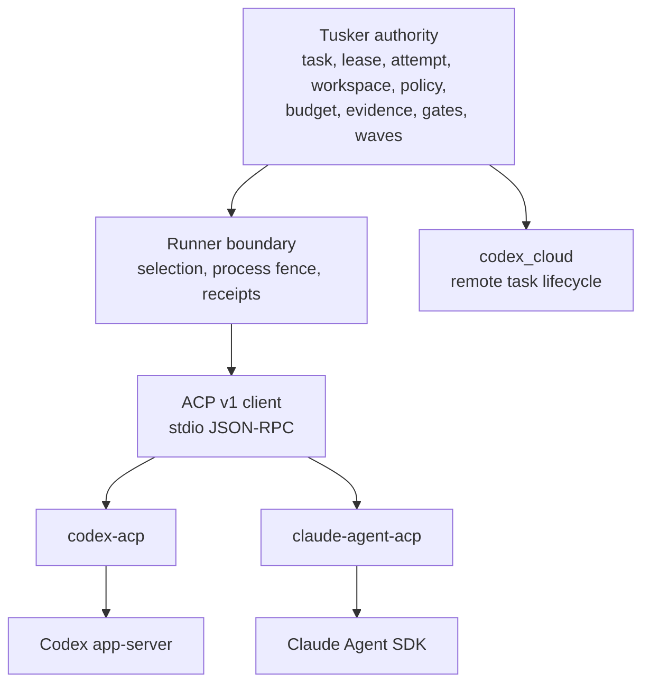
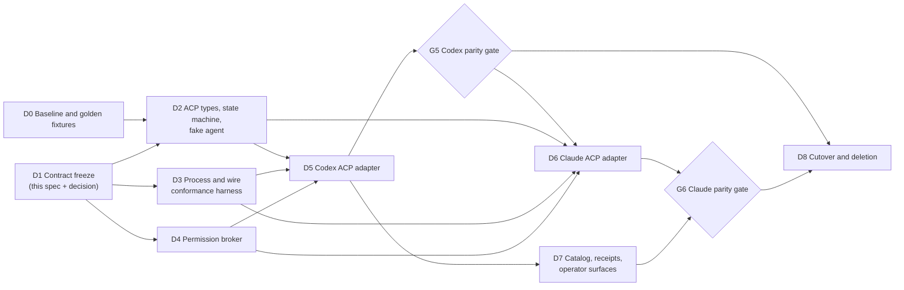

# ACP runner migration

Status: accepted migration contract. The implementation remains gated by the evidence in [Acceptance and deletion gates](#acceptance-and-deletion-gates).

Related decision: [ACP runner migration decision](../../.tusker/specs/decisions/2026-08-10-acp-runner-migration.md).

## Product outcome

Tusker will use Agent Client Protocol (ACP) as the local process and session transport for Codex and Claude without turning ACP into a second orchestrator.

Tusker continues to own task state, claims, leases, attempts, workspace assignment, policy, budgets, gates, evidence acceptance, review, waves, dispatch, and release authority. An ACP agent owns only its provider session and the execution it reports within one Tusker attempt. `codex_cloud` remains a separate remote lifecycle.

The point of this migration is deletion: replace duplicated provider-specific session, permission, cancellation, and event plumbing with one bounded ACP client. If the final design adds ACP while retaining equivalent direct lifecycle implementations indefinitely, the migration has failed.



## Locked requirements

| ID | Requirement |
|---|---|
| ACP-R1 | ACP is a runner transport only. No ACP message, session, tool call, extension, or provider event can claim work, renew a lease, authorize an operation, accept evidence, pass a gate, close a review, advance a wave, or trigger release. |
| ACP-R2 | The first production protocol is ACP version `1` over local stdio. HTTP transport and later ACP drafts are out of scope until a separate compatibility decision. |
| ACP-R3 | The first implementation uses one ACP subprocess per Tusker attempt. There is no process or session pooling. |
| ACP-R4 | Tusker launches a preinstalled, fingerprinted executable by argument vector and absolute working directory. No shell wrapper, runtime package download, `npx -y`, or network installation is allowed in the launch path. |
| ACP-R5 | The client advertises only implemented capabilities. Phase one advertises no client filesystem, terminal, elicitation, or MCP capability and sends an empty `mcpServers` list. |
| ACP-R6 | Tusker's resolved runner profile, sandbox, approval preset, deny rules, attempt budget, and dispatch authority are the permission ceiling. ACP permission options are suggestions and cannot expand it. |
| ACP-R7 | Principal, Tusker actor, attempt, ACP process, ACP session, turn, and tool call identities remain distinct and are recorded with explicit provenance. |
| ACP-R8 | `codex_cloud` is not routed through ACP. It retains its durable remote task `Start`/`Reconcile`/`Collect` lifecycle and must not acquire a fake local PID or ACP session identity. |
| ACP-R9 | Existing direct runners remain selectable until provider-by-provider parity gates pass. Persisted runner kinds are never silently reinterpreted as ACP. |
| ACP-R10 | Every buffer, request table, frame, log, queue, timeout, cancellation drain, and subprocess tree has a finite bound and an adversarial conformance test. |
| ACP-R11 | A lost terminal response after prompt delivery becomes `delivery_unknown`, not an automatic retry. Cancellation timeout poisons the process and session. |
| ACP-R12 | Direct provider lifecycle code is deleted only after conformance, live parity, fallback, receipt, soak, and rollback evidence is archived. |

## Authority and identity model

The following identifiers may correlate but are never interchangeable.

| Identity | Issuer | Meaning | Explicitly does not mean |
|---|---|---|---|
| Principal | Tusker/authentication boundary | Human, daemon, or service identity ultimately responsible for an action | Provider login, ACP agent, or subprocess |
| Tusker actor | Tusker runtime | The concrete CLI, daemon, or dispatched worker acting for a principal | Attempt ownership without a valid claim/lease |
| Attempt ID | Tusker | One bounded execution attempt against one claimed task and workspace | ACP session ownership or permission grant |
| ACP process ID | OS/Tusker supervisor | One launched adapter process fenced to the attempt | Durable task, resumable authority, or successful delivery |
| ACP session ID | ACP agent | Provider conversation/session reference | Tusker run ID, task ID, lease, accepted evidence, or permission scope |
| Turn | ACP agent | One `session/prompt` lifecycle | One Tusker task transition or attempt completion |
| Tool call ID | ACP agent | One reported provider operation | Authorization by itself |
| Provider/subagent identity | Adapter/provider | Execution observation nested beneath the attempt | Tusker actor, principal, delegate, or independent authority |

The persisted relationship is `principal -> Tusker actor -> attempt -> ACP process -> ACP session -> turn/tool call`. Reverse inference is forbidden. ACP `_meta`, subagent, tool-call, and session-update fields are observations; only recognized adapter fields may be normalized, and they still cannot grant authority.

An ACP session reference may be stored in the existing runner session record, but its namespace must include the adapter kind and negotiated protocol. Loading or resuming it requires the same Tusker attempt/claim checks used by every runner. A session existing at the provider does not make the attempt runnable.

## ACP v1 wire boundary

The protocol boundary follows the ACP v1 [overview](https://agentclientprotocol.com/protocol/v1/overview), [initialization](https://agentclientprotocol.com/protocol/v1/initialization), [session setup](https://agentclientprotocol.com/protocol/v1/session-setup), [prompt turn](https://agentclientprotocol.com/protocol/v1/prompt-turn), [tool calls](https://agentclientprotocol.com/protocol/v1/tool-calls), and [stdio transport](https://agentclientprotocol.com/protocol/v1/transports) contracts.

### Transport

- The client starts a local subprocess and exchanges newline-delimited UTF-8 JSON-RPC 2.0 messages on stdin/stdout.
- Stdout is protocol-only. Adapter diagnostics go to stderr and the existing bounded runner log path.
- The executable, arguments, environment allowlist, fingerprint, adapter version, and absolute workspace are resolved before process launch and recorded in the attempt receipt.
- The default maximum serialized ACP frame is 4 MiB, matching the existing direct live-runner scanner ceiling. Larger frames are a protocol failure, not truncation.
- The default pending-request limit is 64 and the session-update queue limit is 256. Reaching either limit triggers bounded backpressure or a typed overload failure; it cannot discard a terminal result.
- Initialization and non-turn RPCs have a 30-second deadline. Turn and stall deadlines come from the resolved runner policy; current defaults are ten minutes and two minutes respectively. Cancellation has a five-second drain before process-group termination.
- Raw stdout/stderr retention uses the existing configured raw-log byte ceiling. Wire parsing never depends on retained log completeness.
- One process serves one attempt. On terminal completion or failure, Tusker drains, terminates, and reaps the complete process group. Descendants holding pipes cannot keep collection open indefinitely.

These are v1 safety ceilings. Configuration may reduce them. Increasing them requires an explicit compatibility and resource-risk review.

### Negotiation and readiness

Tusker sends `initialize` with `protocolVersion: 1`, client identity, and only capabilities it fully implements. The adapter must select version `1`; any other version fails before session creation or prompt delivery. Omitted capabilities are unsupported, not implicitly available.

Readiness is a vector, not a boolean:

| Readiness field | Evidence |
|---|---|
| `installed` | Executable resolves to the configured path and its fingerprint can be read |
| `configured` | Descriptor, argv, environment, workspace policy, and adapter profile validate |
| `authenticated` | Required ACP authentication completes or the adapter reports no required method |
| `protocol_compatible` | Initialization agrees on ACP version `1` and required capabilities |
| `conformant` | The exact executable fingerprint passes the local black-box conformance suite |
| `authorized` | Tusker automation, runner allowlist, task, claim, lease, workspace, and policy checks pass |
| `running` | The attempt owns a live, fenced subprocess and valid process receipt |

The catalog must report these states separately. A successful `--version`, a static capability manifest, or an executable on `PATH` proves only a subset. Negotiated protocol version, agent/adapter identity and version, executable fingerprint, auth method, and capabilities are recorded for every attempt.

The current `RunnerCapabilities.ResumeSession` boolean is too coarse for ACP: `session/load` and `session/resume` are distinct negotiated capabilities. The ACP implementation must retain exact normalized capability details and expose the legacy boolean only as a conservative derived view.

### Allowed protocol surface

| Method | Phase-one handling |
|---|---|
| `initialize` | Required exactly once before other methods |
| `authenticate` | Used only when the selected advertised method is configured and policy permits it; secrets are never logged |
| `session/new` | Required for a fresh attempt; `cwd` must be the absolute assigned workspace |
| `session/load` | Allowed only when `loadSession` was negotiated and Tusker authorizes the stored session reference |
| `session/resume` | Allowed only when the exact resume capability was negotiated and Tusker authorizes it |
| `session/prompt` | Required turn boundary; delivery phase is tracked before and after every write |
| `session/update` | Accepted as bounded execution observation; it cannot mutate Tusker authority state |
| `session/request_permission` | Routed to the Tusker permission broker below |
| `session/cancel` | Notification sent on an authorized interrupt; pending permission requests resolve as cancelled |
| `session/close` | Used only when negotiated; process teardown remains the final fence |
| Unknown/custom methods and `_meta` | Bounded and ignored or rejected unless an adapter-specific decoder is explicitly registered; never executed as an instruction |

No phase-one ACP client filesystem, terminal, elicitation, or MCP server method is implemented or advertised. Provider-side tools continue to run within the provider adapter's sandbox and the permission ceiling resolved by Tusker.

## Lifecycle and typed outcomes

Transport state is not task state. The ACP client records a monotonic transport lifecycle:

`starting -> initializing -> authenticating? -> session_ready -> prompting -> waiting_permission? -> cancelling? -> terminal`

Terminal transport outcomes are typed:

| Outcome | Meaning | Retry posture |
|---|---|---|
| `completed` | ACP returned `end_turn` | No transport retry. Tusker still evaluates process status, collected artifacts, evidence, task contract, and gates. |
| `budget_exceeded` | ACP returned `max_tokens` | No silent retry; supervisor applies the existing budget policy. |
| `turn_cap_exhausted` | ACP returned `max_turn_requests` | No silent retry; supervisor records the exhausted cap. |
| `refused` | ACP returned `refusal` or the permission broker denied a required operation | Typed refusal with reason code; never converted to success. |
| `cancelled` | ACP returned `cancelled` after an authorized interrupt | Terminal and non-successful; record interrupt origin. |
| `protocol_failed` | Version, framing, JSON-RPC, ordering, or capability contract failed before ambiguous delivery | Retry only when the delivery ledger proves the prompt was not sent and policy permits it. |
| `timed_out` | A bounded deadline expired before ambiguous delivery | Same delivery-aware rule as `protocol_failed`. |
| `delivery_unknown` | Prompt transmission began or completed but the client lost a trustworthy terminal result | Never auto-retry or resume. Poison the session and require explicit reconciliation/new-attempt policy. |
| `poisoned` | Cancellation drain failed, process integrity was lost, or state can no longer be trusted | Kill and reap the process tree; session is non-resumable. |

The delivery ledger records `not_sent`, `write_started`, `write_complete`, `response_seen`, and `terminal_received`. EOF, malformed JSON, process death, or timeout at or after `write_started` is conservatively `delivery_unknown` unless the protocol provides proof that the prompt was not accepted. This prevents duplicate side effects.

An ACP `end_turn` means only that the transport turn ended. It cannot mark the Tusker task complete or accept evidence. Existing collection, exit-policy, evidence, review, and gate rules run afterward.

## Permission broker

The broker consumes a normalized operation request plus the already resolved Tusker attempt policy. Its decision is one of `allow_once`, `reject`, or `cancelled` in phase one.

1. Validate the request shape, operation identity, target, and bounded metadata. Missing or ambiguous security-relevant fields are a rejection.
2. Intersect the requested operation with the runner allowlist, sandbox, approval preset, deny rules, workspace boundary, attempt budget, and dispatch mode. A provider-offered option cannot widen that intersection.
3. In unattended execution, automatically select `allow_once` only when the complete operation is deterministically inside the existing envelope. Otherwise select a rejection option or return cancelled. The process must never wait indefinitely for a human.
4. In a future explicitly interactive mode, a human may choose `allow_once`; session-persistent permission requires a separate decision. Tusker never automatically selects `allow_always`.
5. On interrupt, resolve all pending permission requests as cancelled before the drain deadline.
6. Record adapter, method, normalized operation class, target digest/redaction, policy rule, decision, and latency. Do not retain secrets, full prompts, credentials, or unbounded tool arguments.

Provider permission callbacks remain execution observations. They do not replace Tusker's task authorization, automation opt-in, claim, lease, spend, or release gates.

## `codex_cloud` exclusion

`codex_cloud` is a remote durable job service, not a local interactive ACP subprocess. It retains its current runner kind and remote task identity, including asynchronous start, status reconciliation, and result collection.

The ACP implementation must not:

- alias `codex_cloud` to a Codex ACP descriptor;
- synthesize an ACP session ID or local PID for a cloud task;
- apply local EOF, process-group, or stdio delivery rules to remote reconciliation;
- remove the cloud runner when direct local lifecycle code is deleted.

Cloud execution may later adopt a separate remote API adapter, but that is not part of this migration and must not be presented as ACP compatibility.

## Migration and fallback

The migration is a provider-by-provider strangler, not a flag-day rewrite.

- Add a distinct persisted ACP runner kind or descriptor. Do not reinterpret `codex_app_server`, `codex_exec`, or `claude-code` records.
- Freeze direct provider lifecycle files except for critical fixes and parity instrumentation while ACP work proceeds.
- Prove the common client against a fake adversarial agent before connecting a real provider.
- Migrate Codex first through the maintained [`codex-acp`](https://github.com/agentclientprotocol/codex-acp) adapter, then Claude through [`claude-agent-acp`](https://github.com/agentclientprotocol/claude-agent-acp).
- Keep direct `codex_exec` and `claude-code` fallbacks during their defined compatibility window. Fallback selection is explicit and visible in the receipt; it is never an automatic retry after ambiguous delivery.
- Delete direct app-server/control-protocol lifecycle code only after the relevant provider deletion gate passes. Shared process/log safety code may remain if ACP uses it.
- Keep `codex_cloud` permanently separate unless a later decision replaces its remote API contract.

## Versioned delivery DAG



| Delivery | Scope | Dependencies | May run in parallel with | Exit evidence |
|---|---|---|---|---|
| D0 | Capture current direct-runner golden events, lifecycle cases, capability contradictions, and fallback behavior | Canonical clean checkpoint | D1 | Golden fixtures and baseline test report |
| D1 | Freeze this boundary and decision record | Canonical clean checkpoint | D0 | Reviewed spec with no unresolved authority or lifecycle question |
| D2 | Implement ACP v1 types, exact capability model, lifecycle/outcomes, bounded JSON-RPC client, and fake agent | D0, D1 | D3 and D4 after interfaces are frozen | Deterministic unit and state-machine tests |
| D3 | Build adversarial subprocess/conformance harness and process-tree supervision | D1 | D2 and D4 | Black-box fixture suite passes without leaks or hangs |
| D4 | Implement normalized permission broker and audit record | D1 | D2 and D3 | Policy matrix tests cover unattended refusal and cancellation |
| D5 | Integrate Codex descriptor/adapter and map normalized events | D2-D4 | D7 design only | Codex parity, fault, receipt, and live smoke evidence |
| G5 | Decide whether Codex ACP is defaultable | D5 | None for shared runner integration | Explicit go/no-go record; fallback remains intact |
| D6 | Integrate Claude descriptor/adapter using the proven common client | D2-D4, G5 | D7 implementation on non-overlapping files | Claude parity, fault, receipt, and live smoke evidence |
| D7 | Expose readiness vector, negotiated capabilities, receipts, and operator diagnostics | D5; complete before G6 | D6 on owned files | Catalog/diagnostic tests and redaction review |
| G6 | Decide whether Claude ACP is defaultable | D6, D7 | None for shared runner integration | Explicit go/no-go record; fallback remains intact |
| D8 | Change defaults, soak, verify rollback, then delete superseded direct lifecycle code | G5, G6 | Documentation/release work only | Deletion diff, soak report, rollback drill, full validation |

### Genuine Wave 1 and Wave 2 parallelism

Wave 1 is D0 and D1 in parallel. Once D1 freezes interfaces, D2, D3, and D4 may proceed in parallel because they own separate packages/files and meet at tests, not shared implementation files.

Wave 2 is not “Codex and Claude both editing the runner factory at once.” Provider adapter work can prototype in parallel after D2-D4, but integration is sequenced Codex gate first, then Claude. D6 and D7 may overlap only after the Codex gate and only with disjoint file ownership. Shared factory, profile, daemon, capabilities, schema, and documentation edits have one integration owner.

## File ownership

| Lane | Owned paths | Shared paths requiring the integration owner | Must not edit |
|---|---|---|---|
| ACP core | New `internal/acp/**` package and its tests | None after D1 interface freeze | Provider adapters, daemon, cloud runner |
| Process conformance | New fake-agent fixture; ACP process supervision tests; narrowly shared process/log helpers | Existing raw-log/process helpers when reuse is required | Provider mappings and policy |
| Permission broker | New normalized broker package/files and policy-matrix tests | Runner policy types only through an agreed interface | Provider lifecycle and daemon |
| Codex adapter | New Codex ACP descriptor/mapping files and tests | Runner factory/profile/catalog wiring through integration owner | Claude adapter and `runner_codex_cloud.go` |
| Claude adapter | New Claude ACP descriptor/mapping files and tests | Runner factory/profile/catalog wiring through integration owner | Codex adapter and `runner_codex_cloud.go` |
| Runtime integration | `cmd/tusker/runner.go`, `runner_profiles.go`, `runner_catalog.go`, `capabilities_cmd.go`, `runner_wrapper.go`, relevant daemon/runtime/schema/receipt files | Sole owner of all listed paths during each merge window | Provider-specific implementation files except mechanical wiring |
| Cloud guard | `runner_codex_cloud.go` and cloud tests only if a regression guard is needed | Runner factory assertions | ACP core and local adapters |
| Documentation | This spec, decision record, operator docs after behavior exists | User-facing runner catalog/reference index | Code and Tusker task records |

The direct files `runner_codex_live.go` and `runner_claude_live.go` are frozen compatibility references until their deletion gate. They are not copied into the ACP core.

## Acceptance and deletion gates

Test names below are contract names. Equivalent table-driven names are acceptable only when the test output preserves each case distinctly.

### Common conformance gate

The fake ACP agent must deterministically exercise:

- `TestACPInitializeRejectsUnsupportedVersionBeforeSession`
- `TestACPInitializeOmitsUnimplementedClientCapabilities`
- `TestACPNewSessionRequiresAbsoluteCWD`
- `TestACPLoadAndResumeRequireNegotiatedCapability`
- `TestACPMalformedJSONFailsClosed`
- `TestACPInitializeHangHitsDeadlineAndReapsProcess`
- `TestACPFrameLimitPoisonsProcess`
- `TestACPPendingRequestLimitIsBounded`
- `TestACPUpdateQueueSaturationCannotHideTerminal`
- `TestACPUnknownFieldsRemainBoundedAndInert`
- `TestACPChildHoldingPipeCannotBlockCollection`
- `TestACPCancelResolvesPendingPermissionAsCancelled`
- `TestACPCancelDrainTimeoutKillsDescendantsAndPoisonsSession`
- `TestACPEOFAfterPromptWriteIsDeliveryUnknown`
- `TestACPStopReasonMappingIsTyped`
- `TestACPSessionCannotAcquireRunAuthority`
- `TestACPProviderObservationCannotAcceptEvidence`

### Permission gate

- Every runner profile/sandbox/approval-mode combination has an allow/reject expectation.
- Forbidden, ambiguous, out-of-workspace, over-budget, and unrecognized operations reject without waiting for input.
- Provider `allow_always` suggestions never become automatic grants.
- Cancellation resolves all pending requests within the drain deadline.
- Audit records contain the decision basis while redaction tests prove credentials, full prompts, and unbounded arguments are absent.

### Provider parity gate

Each provider must prove on the exact pinned adapter fingerprint:

- fresh session, authorized load/resume when negotiated, prompt, streaming update, tool call, permission allow/reject, interrupt, terminal result, timeout, malformed frame, adapter crash, and descendant cleanup;
- normalized receipts and execution observations preserve at least the operator-relevant information of the direct runner;
- model, reasoning/effort, sandbox, approval, workspace, and configured environment semantics are either preserved or explicitly reported as unsupported before launch;
- one opt-in authenticated smoke test completes without secrets in logs;
- fallback to the direct runner works for a new attempt, while ambiguous delivery never triggers fallback;
- a soak covering the agreed production-like task mix shows no leaked processes, unbounded growth, stuck permissions, duplicate prompts, or unexplained outcome drift.

### Cloud separation gate

- `TestCodexCloudRemainsRemoteWithoutACPIdentity` proves remote task IDs are not ACP sessions and no local process receipt is synthesized.
- Cloud `Start`/`Reconcile`/`Collect` regression tests pass unchanged.
- Removing direct local lifecycle code does not remove or reroute the cloud runner.

### Exact verification record

The implementation handoff must archive command, revision, executable fingerprints, configuration/profile, test count, duration, result, and log/artifact path for:

```text
go test ./internal/acp/... -count=1
go test ./cmd/tusker -run 'ACP|PermissionBroker|RunnerCatalog|RunnerProfile|Authority|CodexCloud' -count=1
go test ./cmd/tusker -run 'RunnerWrapper|RawLog|Process|Cancellation' -count=1
go test ./... -count=1
./tusker validate --json
./tusker skill doctor --strict --json
```

Authenticated provider smoke tests are separate opt-in evidence because local credentials and installed adapters are environment facts. Hosted CI, packaging, and a human go/no-go remain separate from local test success.

### Deletion gate

Direct provider lifecycle code may be removed only when all of the following are true for that provider:

1. Common conformance, permission, provider parity, redaction, cloud separation, and full regression gates pass on the canonical revision.
2. The ACP adapter executable and version are pinned in packaging for Linux and macOS, with installation/authentication diagnostics and no runtime download.
3. Default-on soak and explicit rollback drill pass; rollback does not reuse a poisoned or delivery-unknown session.
4. Operator documentation identifies the selected runner, readiness vector, adapter fingerprint, protocol version, fallback, and typed outcome.
5. The deletion diff removes the superseded direct session/permission/cancellation/event implementation and reduces total provider-specific lifecycle code. A permanent duplicate stack is a no-go.
6. A human records the provider cutover decision. Local tests alone do not authorize deletion or release.

## Non-goals

- Replacing Codex, Claude, or their official/maintained adapters.
- Moving Tusker task orchestration, claims, leases, evidence, gates, review, waves, or releases into ACP.
- Importing Buzz's Nostr identity, relays, public-key signing, channels, workflow DSL, Redis/Postgres/S3 topology, or Rust sidecar.
- Making Tusker an ACP editor client with filesystem, terminal, elicitation, or MCP services in the first migration.
- Treating protocol compatibility as authentication, authorization, conformance, or production readiness.
- Routing `codex_cloud` through a local protocol to make the architecture look uniform.

## Primary references

- [ACP v1 overview](https://agentclientprotocol.com/protocol/v1/overview)
- [ACP v1 initialization](https://agentclientprotocol.com/protocol/v1/initialization)
- [ACP v1 session setup](https://agentclientprotocol.com/protocol/v1/session-setup)
- [ACP v1 prompt turns](https://agentclientprotocol.com/protocol/v1/prompt-turn)
- [ACP v1 tool calls and permissions](https://agentclientprotocol.com/protocol/v1/tool-calls)
- [ACP v1 transports](https://agentclientprotocol.com/protocol/v1/transports)
- [`codex-acp`](https://github.com/agentclientprotocol/codex-acp)
- [`claude-agent-acp`](https://github.com/agentclientprotocol/claude-agent-acp)
- [Buzz ACP crate at the reviewed commit](https://raw.githubusercontent.com/block/buzz/119a84897f225c1e3213a09cd149abb37dcb3abc/crates/buzz-acp/README.md)
- [Buzz reviewed commit](https://github.com/block/buzz/commit/119a84897f225c1e3213a09cd149abb37dcb3abc)
