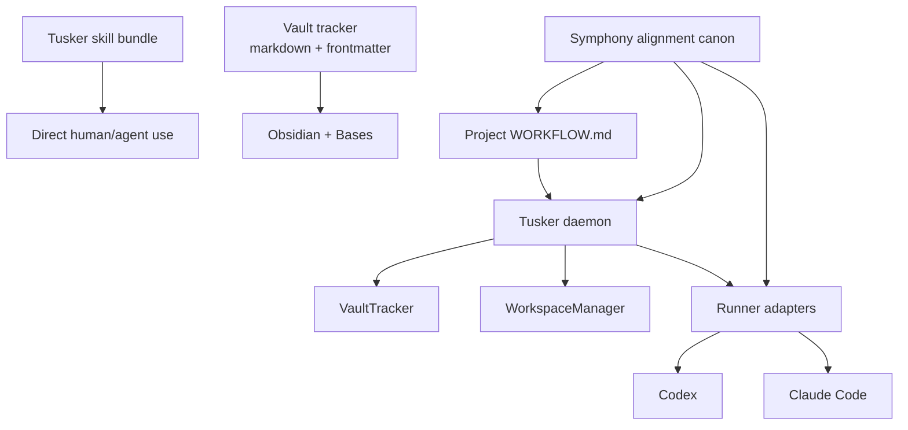

# Tusker Spec Set

This directory is the implementation spec set for Tusker v2.

It exists because one giant design doc would be a pain to maintain and even worse to implement against. Tusker now has three separate concerns that need separate specs:

1. The installable skill bundle in [`/Users/sarav/Downloads/tusker/skill/SKILL.md`](/Users/sarav/Downloads/tusker/skill/SKILL.md)
2. The vault tracker model stored as markdown and frontmatter
3. The long-running daemon that monitors projects and orchestrates agent runs

The skill bundle remains the reusable human/agent operating model.

The specs here define the machine-facing system that other agents can build into the Go binary under [`/Users/sarav/Downloads/tusker/cmd/tusker`](/Users/sarav/Downloads/tusker/cmd/tusker).

## Spec Map

| File | Purpose | Primary implementation surface |
|---|---|---|
| `00-product-modes.md` | Product shape, operating modes, packaging, and subsystem boundaries | CLI surface, packaging, daemon opt-in behavior |
| `01-vault-tracker.md` | Canonical tracker model backed by Obsidian markdown/frontmatter | `schema.go`, `notes.go`, `commands_create.go`, `commands_lifecycle.go`, `commands_index.go` |
| `02-workflow-contract.md` | Project-level `WORKFLOW.md` runtime contract for the daemon | `config.go`, new workflow loader/validator files |
| `03-daemon-and-registry.md` | Global daemon, project registry, local control plane | new daemon, registry, transport, and status command files |
| `04-workspace-manager.md` | Per-item isolated workspaces and lifecycle hooks | new workspace manager files plus daemon integration |
| `05-runner-and-session-protocol.md` | Runner abstraction and session protocol for Codex and Claude Code | new runner adapters and session state files |
| `06-review-rework-retry.md` | Human review, rework, resume, retry, and reconciliation semantics | lifecycle commands, daemon reconcile loop, runner resume logic |
| `07-documentation-site-and-publication.md` | Publication pipeline and docs-site architecture for developer and user docs | doc frontmatter, exporter, site build, and publication validation |
| `08-symphony-alignment-and-orchestration-roadmap.md` | Symphony research canon, source-of-truth split, locked orchestration decisions, and implementation roadmap | workflow, daemon, workspace, runner, review, retry, docs, and backlog sequencing |

## Layering

## Design Commitments

- One binary, multiple modes.
- Markdown stays canonical for human-significant task state.
- The skill bundle stays separate from the daemon runtime contract.
- The daemon is global and multi-project.
- The daemon runtime store is SQLite, not markdown and not JSON sidecars.
- SQLite is optional for tracker mode and mandatory for orchestration mode.
- The tracker boundary remains explicit even if v1 ships only one implementation: `VaultTracker`.
- Human workflow state, daemon dispatch state, and run outcome must be separate concepts.
- Every durable work item gets an immutable machine identity in addition to the human-readable ticket ID.
- `WORKFLOW.md` replaces ad hoc daemon configuration ownership. The old `_system/config.yaml` becomes compatibility baggage, not the future.
- Tusker optimizes for trustworthy unattended throughput: eligible notes can be worked safely, with evidence, behind the right human gate.
- `WORKFLOW.md` is a runtime contract: frontmatter is machine policy, body is the agent runbook and prompt template.
- Codex and Claude Code must both support same-ticket resume where their native session model can prove continuity. Capability gaps must be advertised honestly.
- Tool/MCP injection is optional task-specific extension infrastructure, not the core orchestration model.
- No cloud dashboard, multi-tenant control plane, Linear live adapter, or complex web UI belongs in the orchestration roadmap.
- The daemon writes narrow durable transitions; agents write rich content; humans write verdicts.

## Suggested Build Order

1. `00-product-modes.md`
2. `01-vault-tracker.md`
3. `03-daemon-and-registry.md`
4. `02-workflow-contract.md`
5. `06-review-rework-retry.md`
6. `04-workspace-manager.md`
7. `05-runner-and-session-protocol.md`
8. `07-documentation-site-and-publication.md`
9. `08-symphony-alignment-and-orchestration-roadmap.md`

That order is not arbitrary. If the product shape, tracker schema, writer semantics, and runtime-store boundary are muddy, everything after it turns into cargo-cult orchestration.

## Non-Goals

- Not a Beads clone or Dolt-backed graph tracker competitor.
- Not a CI system.
- Not a multi-tenant orchestration server.
- Not a cloud dashboard.
- Not a Linear live adapter.
- Not a complex web UI.
- Not a general-purpose workflow engine.
- Not a requirement that every project run a daemon.

## Parallel Workstreams

Three streams is the honest split. Five is merge-conflict cosplay.

| Workstream | Spec files | Likely Go ownership |
|---|---|---|
| Stream A: tracker and policy | `01`, `06` | `schema.go`, `commands_create.go`, `commands_lifecycle.go`, `commands_index.go`, review/retry command files |
| Stream B: workflow and daemon | `02`, `03` | workflow loader, daemon loop, runtime store, status commands |
| Stream C: workspaces and runners | `04`, `05` | workspace manager, runner adapters, session/reconcile files |
| Stream D: orchestration honesty and proof | `08` plus `02`-`06` | workflow prompt rendering, trust profiles, run turns, event normalization, review packets |

## Done Means

The spec set is ready to build against when:

- field names are frozen
- state transitions are explicit
- ownership boundaries are explicit
- migration from current Tusker v1 behavior is documented
- implementation files under `cmd/tusker/` are named so multiple agents can split work

If a future edit makes one of those fuzzy again, the spec is getting sloppy.
