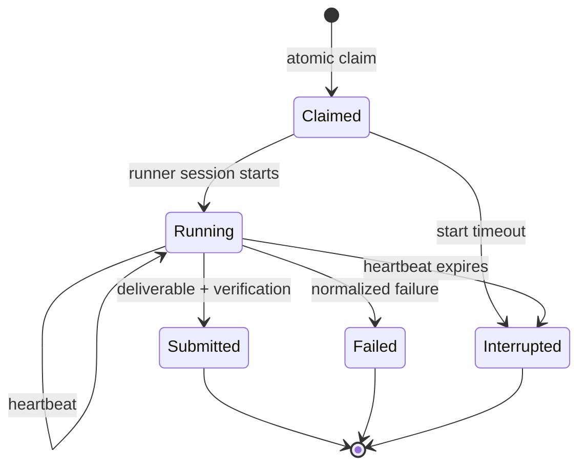

---
capsule:
  what: "Decision spec for project-local runner sessions, atomic ownership, truthful runtime UI, and temporarily disabled token controls."
  use_when:
    - "Work changes task claims, runner workspaces, session resume, liveness projection, or token dispatch guards."
  skip_when:
    - "You only need an individual task's acceptance and verification contract."
---

# Reliable execution lifecycle

## Purpose

Make every Tusker, Codex, and Claude execution visible, resumable, exclusive at the task boundary, and honest about whether it delivered work. Restore delivery reliability before reintroducing token budgets or cost guards.

## Decisions

1. Project registration uses a native folder picker when available; manual path entry remains a fallback.
2. The registered repository path is the default working directory for Codex and Claude sessions.
3. Isolated worktrees are an explicit project option, never a silent default.
4. Every session retains the registered project identity even when its physical workspace is an opted-in worktree.
5. Every daemon-created modifying run must atomically claim its task before its worker process starts.
6. A human-opened Codex/Claude session executes directly and never becomes a daemon worker. It does not require automation enablement or a daemon lifecycle claim; before taking over the same tracked task it inspects any live automated owner and coordinates rather than launching a competing worker.
7. The default project concurrency for modifying work is one. Operators may explicitly raise it.
8. Durable task statuses remain `ready`, `review`, `rework`, and `done`. `in_progress` is a live projection from a fresh run lease.
9. Live runs heartbeat. A run that stops heartbeating becomes `interrupted` after the reclaim grace period and releases ownership safely.
10. Success means a normalized successful outcome plus the required diff/artifact and acceptance-mapped verification. Process activity alone is not delivery.
11. Tusker records runner, session id, registered project path, physical workspace, timestamps, outcome, deliverable summary, verification summary, and failure reason for every run.
12. The operator UI exposes real runtime data only. Hardcoded active-worktree and run fixtures must not appear in production views.
13. Automatic dispatch is independently controllable per project and records the actor that authorized each run.
14. Token budgets, token circuit breakers, token-based dispatch restrictions, and operator-facing aggregate token totals are disabled until accounting is redesigned and proven accurate.
15. No human gates are introduced by this workstream. Automated verification and a final end-to-end dogfood task provide acceptance.
16. Existing Codex/Claude sessions and dispatched workers never start `tusker daemon run`, invoke dispatch, or launch nested model runners. Only an independently running resident daemon creates background workers.
17. Reviewer workers are independent and read-only. Automated review is limited to three cycles per task before the task remains in review for operator intervention.

## Lifecycle

The task remains durably `ready` or `rework` while Claimed/Running. Serve projects a fresh claimed/running lease as `in_progress`. Submission requests `review`; failure or interruption leaves the task dispatchable according to retry policy and shows the latest attempt separately.

## Required interfaces

### Run ownership

Provide one atomic ownership service for daemon-created implementation and review workers. At minimum it supports claim, start/session attach, heartbeat, submit, fail, interrupt, and reclaim. A second live automated claim for the same task must fail deterministically with the owning run metadata. Direct interactive sessions are outside this runner lifecycle; they inspect live ownership before taking over the same tracked task.

### Workspace policy

Each project has a persisted workspace mode:

- `shared`: use the registered repository path; default.
- `worktree`: create an isolated physical checkout while preserving the registered project identity.

Shared mode enforces the configured project modifying-run concurrency. The initial default and migration fallback are one.

### Agent protocol

Installed Codex and Claude Tusker skills distinguish direct interactive sessions from daemon-dispatched workers. Interactive sessions execute the user's request themselves and never launch runners. The daemon claims before spawn. A worker with `TUSKER_ATTEMPT_ID` verifies only its injected task/attempt/workspace and does not claim again; the harness owns session attachment, heartbeats, and normalized runtime outcomes, while the worker records proof and requests review or one concrete blocker/gate. Generated skill installs are updated through canonical skill sync, not hand-edited.

### Operator projection

The work board, settings, and run detail views consume daemon/runtime APIs. They distinguish:

- current liveness (`claimed`, `running`, `stale`),
- durable task lifecycle (`ready`, `review`, `rework`, `done`),
- attempt outcome (`succeeded`, `failed`, `interrupted`, `declined`), and
- delivery (`diff/artifact`, verification, proof status).

Every run detail provides a copyable workspace path and runner-specific resume command or native resume action when supported.

### Token controls

Until a later accounting redesign:

- usage ingestion may be retained only as diagnostic raw data;
- no usage aggregate controls dispatch;
- no daily budget circuit opens;
- no normal UI presents aggregate counts as authoritative;
- existing configuration migrates to disabled without deleting historical records.

## Failure cases

- Two actors claim one task concurrently: exactly one wins.
- An interactive session finds a live daemon-owned run for the same task: it reports the owner/resume information and coordinates rather than spawning a competing worker.
- A direct session works in a disabled project: it proceeds normally because automation state controls only background dispatch.
- A dispatched worker tries to start a daemon or nested runner: the CLI rejects it before process creation.
- Runner starts but no session id is returned: run fails or interrupts; it cannot remain permanently live.
- Process is killed: heartbeat expiry marks interruption and eventually permits reclaim.
- Successful process with no required deliverable or verification: submission is rejected.
- Worktree session: UI and APIs show both the registered project and physical workspace.
- Token telemetry is malformed or cumulative: it cannot stop dispatch.

## Verification strategy

Unit and integration tests cover ownership races, heartbeat expiry, shared/worktree policy, normalized outcomes, task projection, settings persistence, and token-control disablement. The final task runs an end-to-end matrix across daemon dispatch, manual CLI pickup, Codex, and Claude with both success and forced interruption paths.

## Work streams

- `[[LIF]]` owns the lifecycle implementation.
- `[[SRV-T-0028]]` owns native folder selection and remains an external prerequisite for the complete onboarding experience.
