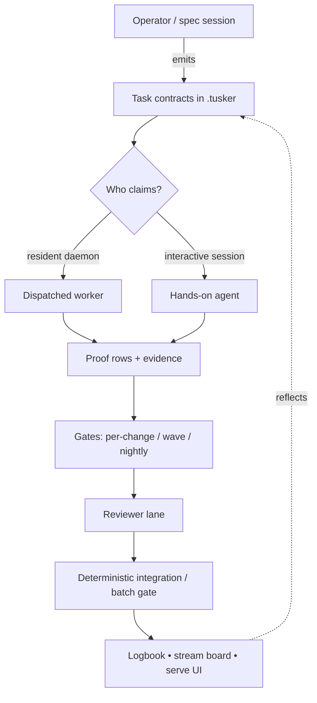

# Tusker system overview

Tusker is a **repo-local, agent-native work tracker**. It lives inside a single
repository (a `.tusker/` vault) and treats every piece of work as a *task
contract*: what should change and how we will know it is done. Agents or an
operator claim contracts, do the work, attach **proof**, pass **gates**, and get
**reviewed** before the change lands. State is files in the repo — no cloud
service — so it travels with the code.

## Mental model in one breath

- A **task contract** has a PM-readable top (what/why/acceptance) and an
  implementer appendix (files, symbols, commands).
- Work is a **DAG of contracts on the outside** (dependency-ordered,
  gate-fenced) with **loop-ish workers on the inside**.
- **Proof, not vibes.** A task closes only when proof rows are green and, for
  risky work, an independent reviewer submitted a typed verdict.
- **Whoever drives, it registers.** Daemon workers and interactive sessions use
  the same CLI, so every view reflects reality.

## Route to the right doc

Load exactly one subsystem doc per question; each carries its own
`read_when`/`skip_when` frontmatter.

| Question is about | Doc |
|---|---|
| Task/epic schema, lifecycle states, readiness, dependencies, validation | [[tasks-and-proof]] |
| Recording proof, evidence, attempts, closeout checkpoints, close/accept | [[proof-and-closeout]] |
| Human gates, the automated gate tier, gate ledger, batch/full gates | [[gates]] |
| Landing merges, completion reactor, receipts, integration authority | [[landing-and-completion]] |
| The resident daemon: scheduling, dispatch, departures, limits | [[orchestration]] |
| Execution identity, lineage, runs, work sessions, heartbeats, cancellation | [[execution-observability-system]] |
| Runner adapters, routing, the wrapper, the ACP stack | [[runners-and-acp]] |
| Delivery plans, import transactions, waves, arming, rollout | [[delivery-and-waves]] |
| The localhost control plane, its API, streams, snapshots, the SPA | [[serve-ui]] |
| Docgraph/frontmatter contract, docs map, domain canon, feedback pipeline, improve scan, logbook/digest/morning brief | [[knowledge-and-feedback]] |
| Skill packaging, install destinations, provenance, managed snippets | [[skills]] |
| The factory intake contract and factory operations projection | [[factory-intake]] |
| Vault vs state root, SQLite runtime store, event log, traces, migrations | [[storage-and-runtime]] |
| CLI grammar, exit codes, output modes, deprecations, command families | [[cli]] |
| Supported operating systems, OS-gated behavior, release targets, CI lanes | [[platform-support]] |

## Where things live

| Path | What it holds |
|---|---|
| `.tusker/specs/` | Canonical specs — the durable *why / what-changes* |
| `.tusker/specs/decisions/` | Decision logs — point-in-time records of what was decided |
| `.tusker/work/` | Live task/epic/gate records |
| `.tusker/knowledge/domains/` | Per-domain `INDEX.md` + `CANON.md` — durable domain truth |
| `docs/system/` | These canonical *how it is today* docs |

Other `.tusker/` subtrees (`events`, `_generated`, `attempts`, `evidence`,
`Attachments`, raw logs) are machine state — do not read them unless a task
requires it. `.tusker/scratch/<TASK-ID>/` is ephemeral and reaped; promote
anything worth keeping to evidence before close. The full on-disk ownership
table is in [[storage-and-runtime]].

## The documentation contract

- **Specs** (`.tusker/specs/`) say *why* and *what will change*.
- **Decision logs** (`.tusker/specs/decisions/`) record *what was said*; never
  updated.
- **System docs** (`docs/system/`) describe *how the system actually is today*,
  read from the code. If code and doc disagree, the code wins and the doc is
  the bug — fix the doc.

Cross-references between managed docs are Obsidian-style `[[subject]]`
wikilinks; the frontmatter fields, validation codes, and the wikilink
convention itself are specified in [[knowledge-and-feedback]]. The index and
graph below are generated by `tusker docs map` — never edit them by hand.

```mermaid
graph TD
  n_acp_runner_migration["ACP runner migration: one bounded local agent transport"]
  n_acp_runner_migration_decision["ACP runner migration decision"]
  n_build_and_test_economics["Build and test economics: how often we build and test at each stage"]
  n_cli["Tusker CLI reference"]
  n_delivery_and_waves["Delivery plans and waves (author → review → import → arm)"]
  n_execution_observability["Execution observability: names, lineage, and truthful multi-agent tracking"]
  n_execution_observability_grill["Decision log: execution observability and direct-agent identity"]
  n_execution_observability_system["Execution observability"]
  n_factory_intake["Factory intake and operations"]
  n_gates["Gates (human gates, the gate tier, the isolated full gate, and batch merge windows)"]
  n_gates_over_records["Decision log: gates over records"]
  n_knowledge_and_feedback["Knowledge canon and the feedback loop"]
  n_knowledge_graph["Knowledge graph: self-scaffolding, self-checking documentation"]
  n_knowledge_graph_grill["Decision log: the knowledge-graph discussion"]
  n_landing_and_completion["Landing and completion (how finished work reaches the integration branch and main)"]
  n_orchestration["Orchestration"]
  n_overview["Tusker system overview"]
  n_platform_support["Platform support"]
  n_proof_and_closeout["Proof recording and closeout"]
  n_runners_and_acp["Runners and the ACP adapter stack"]
  n_scratch_retention["Scratch retention: task scratch is ephemeral and reaps itself"]
  n_scratch_retention_grill["Decision log: scratch retention session, 2026-08-04"]
  n_serve_ui["Serve — local control plane and embedded SPA"]
  n_skills["Skill packaging and distribution"]
  n_software_factory["Software Factory: Tusker as the production loop harness"]
  n_software_factory_grill["Decision log: the factory grill session"]
  n_storage_and_runtime["Storage and runtime state"]
  n_tasks_and_proof["V7 task model: schema, lifecycle, validation"]
  n_software_factory --> n_acp_runner_migration
  n_acp_runner_migration --> n_acp_runner_migration_decision
  n_software_factory --> n_build_and_test_economics
  n_overview --> n_cli
  n_overview --> n_delivery_and_waves
  n_software_factory --> n_execution_observability
  n_execution_observability --> n_execution_observability_grill
  n_overview --> n_execution_observability_system
  n_overview --> n_factory_intake
  n_overview --> n_gates
  n_software_factory --> n_gates_over_records
  n_overview --> n_knowledge_and_feedback
  n_overview --> n_knowledge_graph
  n_knowledge_graph --> n_knowledge_graph_grill
  n_overview --> n_landing_and_completion
  n_overview --> n_orchestration
  n_overview --> n_platform_support
  n_overview --> n_proof_and_closeout
  n_overview --> n_runners_and_acp
  n_software_factory --> n_scratch_retention
  n_scratch_retention --> n_scratch_retention_grill
  n_overview --> n_serve_ui
  n_overview --> n_skills
  n_overview --> n_software_factory
  n_software_factory --> n_software_factory_grill
  n_overview --> n_storage_and_runtime
  n_overview --> n_tasks_and_proof
```

<!-- tusker:docs-map:begin -->

<!-- tusker:docs-map:end -->
