# System overview

Tusker tracks work in a Git repository. A task is a contract. It states the
result, the checks, and the proof.

## Authority map

| Fact | Current authority |
| --- | --- |
| Command behavior | `cmd/tusker/` and `tusker capabilities --json` |
| Record fields and allowed values | `internal/v7schema/schema.go` |
| Close policy | `internal/v7policy/` and the close commands in `cmd/tusker/` |
| Repository tracker state | `.tusker/` |
| Machine runtime state | `cmd/tusker/runtime_store.go` |
| Local HTTP API | `cmd/tusker/serve_command.go` and `cmd/tusker/serve_*.go` |
| Web routes and screens | `internal/serve/ui/src/` |
| macOS shell | `apps/mac/TuskerBar/` |
| Agent operation rules | `skills/tusker/` |
| Project facts | `.tusker/knowledge/domains/project/` |
| Public system explanation | `docs/system/` |

Source and schemas win when a page is wrong. A runtime observation can show
what one process did. It does not change the source contract.

## Main flow

1. A person creates a task contract.
2. The CLI checks its fields and state revision.
3. An interactive worker or an enabled daemon claims the work.
4. The worker changes the repository.
5. The worker records proof for the acceptance rows.
6. A reviewer submits a typed result.
7. Landing and close check the bound revisions and proof.

Planning, review, import, and automation are separate actions. A plan does not
dispatch work. Project registration does not enable automation.

## Important boundaries

- `.tusker/` is repository truth. `daemon.db` is machine runtime truth.
- Serve is a guarded view and control surface. It is not a second tracker.
- TuskerBar uses or starts the local daemon. It does not store task state.
- Generated indexes and the embedded web `dist/` are build outputs.
- Names such as `tusker.task/v7` are file-format identifiers. They are not
  product generations.

## Read next

- [Tasks and proof](tasks-and-proof.md)
- [Proof and closeout](proof-and-closeout.md)
- [Storage and runtime](storage-and-runtime.md)
- [CLI reference](cli.md)
- [Orchestration](orchestration.md)
- [Serve UI](serve-ui.md)
- [Platform support](platform-support.md)

## Documentation rule

Each page must name its code sources. Use short sentences. Use active voice.
Use one term for one idea. Do not copy plans, old task history, or runtime logs
into this document set.

Run `tusker docs map --vault ./.tusker` after a system page changes.

## Code sources

- `cmd/tusker/cli.go`
- `cmd/tusker/runtime_store.go`
- `cmd/tusker/serve_command.go`
- `internal/v7schema/schema.go`
- `internal/v7policy/`
- `apps/mac/TuskerBar/Sources/TuskerBar/RuntimeSupervisor.swift`

```mermaid
graph TD
  n_cli["CLI reference"]
  n_delivery_and_waves["Delivery and waves"]
  n_execution_observability_system["Execution observability"]
  n_factory_intake["Factory intake"]
  n_gates["Gates"]
  n_knowledge_and_feedback["Knowledge and feedback"]
  n_landing_and_completion["Landing and completion"]
  n_orchestration["Orchestration"]
  n_overview["System overview"]
  n_platform_support["Platform support"]
  n_proof_and_closeout["Proof and closeout"]
  n_runners_and_acp["Runners and ACP"]
  n_serve_ui["Serve UI"]
  n_skills["Skills"]
  n_storage_and_runtime["Storage and runtime"]
  n_tasks_and_proof["Tasks and proof"]
  n_overview --> n_cli
  n_overview --> n_delivery_and_waves
  n_overview --> n_execution_observability_system
  n_overview --> n_factory_intake
  n_overview --> n_gates
  n_overview --> n_knowledge_and_feedback
  n_overview --> n_landing_and_completion
  n_overview --> n_orchestration
  n_overview --> n_platform_support
  n_overview --> n_proof_and_closeout
  n_overview --> n_runners_and_acp
  n_overview --> n_serve_ui
  n_overview --> n_skills
  n_overview --> n_storage_and_runtime
  n_overview --> n_tasks_and_proof
```

<!-- tusker:docs-map:begin -->

<!-- tusker:docs-map:end -->
