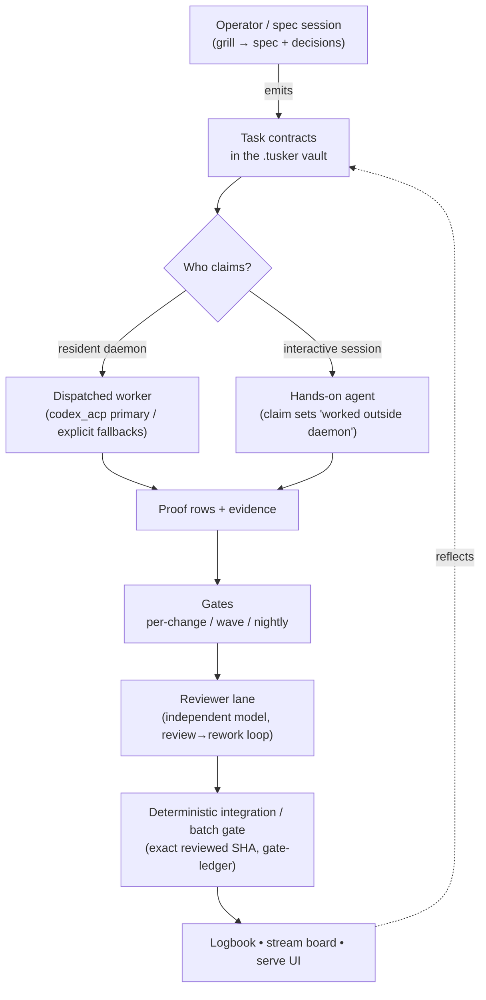

# Tusker system overview

Tusker is a **repo-local, agent-native work tracker**. It lives inside a single
repository (in a `.tusker/` vault) and treats every piece of work as a *task
contract*: a plain-language statement of what should change and how we will know
it is done. Agents (Claude/Codex sessions) or an operator claim those contracts,
do the work, attach **proof**, pass **gates**, and get **reviewed** before the
change lands. Nothing is tracked in a cloud service — the state is files in the
repo, so it travels with the code and is truthful to whoever reads it.

The core idea: writing code is cheap now; the expensive parts are a clear
definition-of-done, clean context for the worker, and an honest record of state.
Tusker is the harness that supplies all three. See the driving spec:
[software-factory.md](../../.tusker/specs/software-factory.md).

## Mental model in one breath

- A **task contract** has two layers: a PM-readable top (what/why/acceptance)
  and an implementer appendix (files, symbols, commands).
- Work is a **DAG of contracts on the outside** (dependency-ordered,
  gate-fenced) with **loop-ish workers on the inside** (one agent free to
  traverse its own path within one task).
- **Proof, not vibes.** A task closes only when its proof rows are green and, for
  risky work, an independent reviewer has submitted a typed verdict.
- **Whoever drives, it registers.** A background daemon worker and a hands-on
  interactive session both claim, update, and close through the same CLI, so the
  logbook, stream board, and serve UI always reflect reality.

## Architecture

## Major subsystems

| Subsystem | One-line purpose | Reference |
|---|---|---|
| Tasks & proof | Two-layer contracts, lifecycle status, proof rows, evidence, acceptance | [tasks-and-proof.md](tasks-and-proof.md) |
| Orchestration | Daemon polling, dispatch, runs/leases, waves, interactive session attach | [orchestration.md](orchestration.md) |
| Local coding-agent transport | ACP-primary Codex setup, authority boundary, explicit fallback, and Cloud separation | [ACP migration](../specs/26-acp-runner-migration.md) |
| Execution observability | Immutable execution identities, direct work, provider children, and convergent timelines | [execution-observability.md](execution-observability.md) |
| Gates | Per-change / wave-end / nightly gate tiers, gate-ledger, closeout checkpoints | [gates.md](gates.md) |
| Skills & knowledge | The `tusker` operator skill, per-repo project-knowledge skill, domain canon | [skills.md](skills.md) |
| Serve UI | Privileged localhost control plane with authoritative actions, bounded projections, and explicit read-only surfaces | [serve-ui.md](serve-ui.md) |
| Platform support | Supported operating systems, release targets, and intentionally unavailable surfaces | [platform-support.md](platform-support.md) |
| CLI | Every user-facing `tusker` command, grouped by purpose | [cli.md](cli.md) |

## Where things live

| Path | What it holds |
|---|---|
| `.tusker/specs/` | Canonical specs — the durable *why / what-changes* (e.g. `software-factory.md`, `build-and-test-economics.md`) |
| `.tusker/specs/decisions/` | Decision logs — a record of *what was actually said* in a grill/spec session |
| `.tusker/work/` | The live task/epic/gate records (the vault's tracked work) |
| `.tusker/dashboards/` | Generated dashboards and the stream board |
| `.tusker/logbook/` | Plain-language daily digests for a product reader |
| `docs/system/` | These canonical *how the system is today* docs |

Other `.tusker/` subtrees (`events`, `_generated`, `attempts`, `evidence`,
`Attachments`, raw logs) are machine state — do not read them unless a task
explicitly requires it. `.tusker/scratch/<TASK-ID>/` is ephemeral: it is
reaped when the task closes, and the 14-day retention sweep takes any
surviving entry after that, so anything worth keeping must be promoted to
evidence before close.
`tusker setup doctor` warns (`scratch_size`) when scratch exceeds 200M and
can repair it with the same sweep.

## The documentation contract

Three kinds of writing, three jobs — keep them separate:

- **Specs** (`.tusker/specs/`) say *why* we are building something and *what
  will change*. Start at [software-factory.md](../../.tusker/specs/software-factory.md).
- **Decision logs** (`.tusker/specs/decisions/`) record *what was said* — the
  alternatives weighed and the calls made in a session. Point-in-time, not
  updated.
- **These system docs** (`docs/system/`) describe *how the system actually is
  today*, read from the code. They are living reference: **update them whenever a
  design changes**, in place, no versions.

If code and these docs disagree, the code wins and the doc is the bug — fix it.

## Execution observability

Tasks and waves describe delivery contracts and authorization; an **execution**
describes one observable strand of work. Tusker gives every execution an
immutable `exec_…` identity. A friendly display name, task ID, wave ID,
provider session ID, and reusable agent type are separate correlation fields,
never substitutes for that identity.

This distinction matters most for direct work. A Codex or Claude session may
register before it launches or attach after it has a provider ID. Until it is
bound to a task's canonical wave, it appears in the **unbound inbox** and is
observation-only: it cannot claim work, prove acceptance, request review, arm
a wave, land, release, or spend. Binding is audited and creates a new authority
generation; it never makes earlier history eligible retroactively. The complete
operator model, limits, and recovery procedure are in
[execution-observability.md](execution-observability.md).

```mermaid
graph TD
  n_acp_runner_migration["ACP runner migration: one bounded local agent transport"]
  n_acp_runner_migration_decision["ACP runner migration decision"]
  n_build_and_test_economics["Build and test economics: how often we build and test at each stage"]
  n_cli["Tusker CLI reference"]
  n_execution_observability["Execution observability: names, lineage, and truthful multi-agent tracking"]
  n_execution_observability_grill["Decision log: execution observability and direct-agent identity"]
  n_execution_observability_system["Execution observability"]
  n_factory_intake["Factory intake contract"]
  n_gates["Gates (human gates, the gate tier, and batch merge windows)"]
  n_gates_over_records["Decision log: gates over records"]
  n_knowledge_graph["Knowledge graph: self-scaffolding, self-checking documentation"]
  n_knowledge_graph_grill["Decision log: the knowledge-graph discussion"]
  n_orchestration["Orchestration"]
  n_overview["Tusker system overview"]
  n_platform_support["Platform support"]
  n_scratch_retention["Scratch retention: task scratch is ephemeral and reaps itself"]
  n_scratch_retention_grill["Decision log: scratch retention session, 2026-08-04"]
  n_serve_ui["Serve UI and local control plane"]
  n_skills["The Tusker skill system"]
  n_software_factory["Software Factory: Tusker as the production loop harness"]
  n_software_factory_grill["Decision log: the factory grill session"]
  n_tasks_and_proof["Tasks and proof (v7 task model)"]
  n_software_factory --> n_acp_runner_migration
  n_acp_runner_migration --> n_acp_runner_migration_decision
  n_software_factory --> n_build_and_test_economics
  n_overview --> n_cli
  n_software_factory --> n_execution_observability
  n_execution_observability --> n_execution_observability_grill
  n_overview --> n_execution_observability_system
  n_overview --> n_factory_intake
  n_overview --> n_gates
  n_software_factory --> n_gates_over_records
  n_overview --> n_knowledge_graph
  n_knowledge_graph --> n_knowledge_graph_grill
  n_overview --> n_orchestration
  n_overview --> n_platform_support
  n_software_factory --> n_scratch_retention
  n_scratch_retention --> n_scratch_retention_grill
  n_overview --> n_serve_ui
  n_overview --> n_skills
  n_overview --> n_software_factory
  n_software_factory --> n_software_factory_grill
  n_overview --> n_tasks_and_proof
```

<!-- tusker:docs-map:begin -->

<!-- tusker:docs-map:end -->
