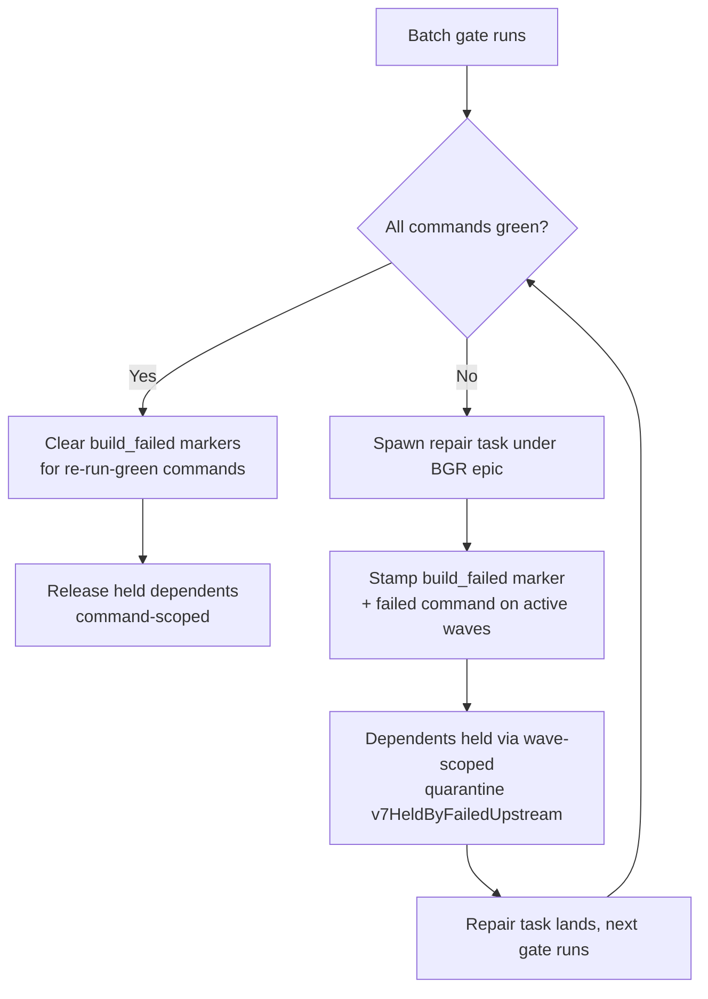

# Gates

"Gate" means three related things in Tusker. This page separates them:

1. **Human gates** — a blocker on a task that only a person can clear.
2. **The gate tier** — the automated build/test proof a change must pass, run
   with refusal-before-cost and one-pass failure harvesting.
3. **Batch gate + merge windows** — the wave-end collective gate the daemon runs
   on a clock, and what happens when it goes red.

The policy behind stages 2 and 3 is written in
[build-and-test-economics.md](../../.tusker/specs/build-and-test-economics.md);
the human-gate rule is in
[software-factory.md](../../.tusker/specs/software-factory.md).

## Human gates

A human gate is a control-plane record wired to one or more tasks it `blocks`.
Managed with `tusker gate list | satisfy | waive | obsolete`
(`cmd/tusker/v7_control_cmd.go`, `gateV7Transition`).

Per the factory spec, human gates are **for blockers only**: missing credentials
or auth, an unclear spec, or a replacement decision ("this supersedes that").
They are **never for code review** — routine diffs are adjudicated by the
reviewer lane, not gated.

| Move | Effect | Requires |
|---|---|---|
| `satisfy` | Marks the gate cleared | `--evidence` for blocking gates (or `--force`) |
| `waive` | Clears with a policy exception | `--reason` |
| `obsolete` | Retires a gate that no longer applies | `--reason` |

An open, `blocking` gate that lists a task in `blocks` prevents that task from
closing (checked in both `closeV7Cmd` and accept preflight).

## The gate tier

The gate tier (`cmd/tusker/gate_tier.go`, run via `tusker gate-run`) mechanizes
the proof economics for slow-compile ecosystems. Total cost is (compile cycles)
× (cycle cost), so a gate must (1) refuse before paying a cycle it cannot use,
(2) **harvest the complete failure set in one pass** rather than fail fast, and
(3) hand back a defect list an agent repairs as one batch. Every language detail
(harvest command, profile, defect marker) is project configuration under
`orchestration.gate`, never code.

Preflight runs in doctrine order and returns the **first** refusal:

1. **Ledger hit** — this exact command already passed on this exact tree (a
   pass, not a refusal; see ledger below).
2. **Disk headroom** — free disk below the configured floor.
3. **Build slot held** — another stream owns this host's build lock.
4. **Profile parity** — requested profile ≠ the canonical gate profile.
5. **Tree not frozen** — uncommitted paths in the worktree.

Only when preflight passes does it run the pending commands, never stopping at
the first failure, collecting every defect (`harvestGateDefects`).

### Selective (per-change) gates

`tusker gate-run --changed` (`runSelectiveGateTier` in
`cmd/tusker/gate_scope.go`) runs Stage 1: only the scopes a change actually
touched. Scopes come from `orchestration.gate.scopes` in the WORKFLOW config —
each names path globs and the harvest commands covering that area. The change's
touched paths come from a diff against the base branch (`changedGatePaths`:
committed delta since merge-base, plus uncommitted and untracked work).

Fail-closed rules:

- **Diff unavailable** → refuses (`diff_unavailable`). It never passes on a
  narrowed or empty diff.
- **Unscoped touched path** (a path no scope owns) → falls back to the **full**
  harvest set rather than silently skip it.
- A truly empty diff passes without running commands, but still stamps the tree
  hash and runs preflight.

`--changed` requires configured scopes; with none it refuses rather than run the
full harvest silently.

### The gate ledger

`cmd/tusker/gate_ledger.go` keys each passing result to a **tree state hash**
(`workspaceTreeStateHash` — the content of every tracked and untracked source
file, excluding Tusker's own mutable control-plane paths like `.tusker/events/`,
`.tusker/evidence/`). Because identity is the compiled tree, a green result is
attributable to exactly one revision, and re-running an unchanged tree is a
ledger hit instead of a paid cycle. Only passing gates are recorded.

## Batch gate + merge windows

The daemon runs a wave-end **batch gate** on a schedule
(`cmd/tusker/batch_gate.go`, `scheduleBatchGateIfDue`). Scheduling is either
clock **windows** (`orchestration.batch_gate.windows`, `HH:MM` local times, each
fires at most once per day) or a **period** fallback (`period_hours`, default 24
h). A run still in flight suppresses a concurrent spawn, bounded by a stuck-run
grace so a wedged run cannot block the schedule forever.

`executeBatchGate` runs each command. Green commands are recorded to the ledger.
On failure it captures the actionable excerpt and spawns repair tasks (up to
`max_repairs`, default 3) under a `BGR` epic.

### Red-gate path

- **Red** (`stampFailedCommandOnActiveWaves`): the failing command is stamped
  onto every wave with an in-flight member, plus `build_failed` markers on the
  repair task. Dependents are then held — `v7HeldByFailedUpstream`
  (`cmd/tusker/upstream_hold.go`) holds a task when a dependency still carries a
  red `build_failed` marker, or when its own wave carries the red command. The
  hold is **scoped**: only the failed piece's dependents / same-wave in-flight
  work, not the whole project. Dead (cancelled/superseded) upstreams are ignored
  so their markers cannot pin a dependent forever; `done` is deliberately not
  dead (a done piece can be green-on-status yet red-on-build).
- **Green** (`clearBuildFailedMarkers`): drops only the markers whose recorded
  command (and profile) the just-passed run actually re-ran green — an unrelated
  red marker (different command or profile) stays. The release is therefore
  command-scoped.

## Refusal causes and remedies

From `gate_tier.go` / `gate_scope.go`. Each is a stable, machine-routable
`cause` with a `remedy`:

| Cause | Trigger | Remedy |
|---|---|---|
| `tree_not_frozen` | Uncommitted paths in the worktree (unless `allow_dirty_tree`) | Commit or stash so the verdict is attributable to one revision |
| `disk_headroom` | Free disk below the measured floor, or unmeasurable | Reclaim scratch outside the build cache (deleting the cache costs a full rebuild) |
| `build_slot_held` | A build-slot lock is held by another stream | Wait for the running build, or clear the lock if its owner is gone |
| `profile_parity` | Requested profile ≠ canonical gate profile | Rerun with the canonical profile; alternating profiles discards the warm build |
| `diff_unavailable` | Selective gate cannot compute the change set | Make the base branch/merge-base resolvable (fetch base or pass `--base`) |
| `worktree_cap` | Opening another live work copy would exceed the configured (measured) cap | Free a worktree before starting another |

Every floor is **measured, not guessed** (the disk floor reads real free space
via `freeDiskGB`), per the factory spec's measured-floors principle.
