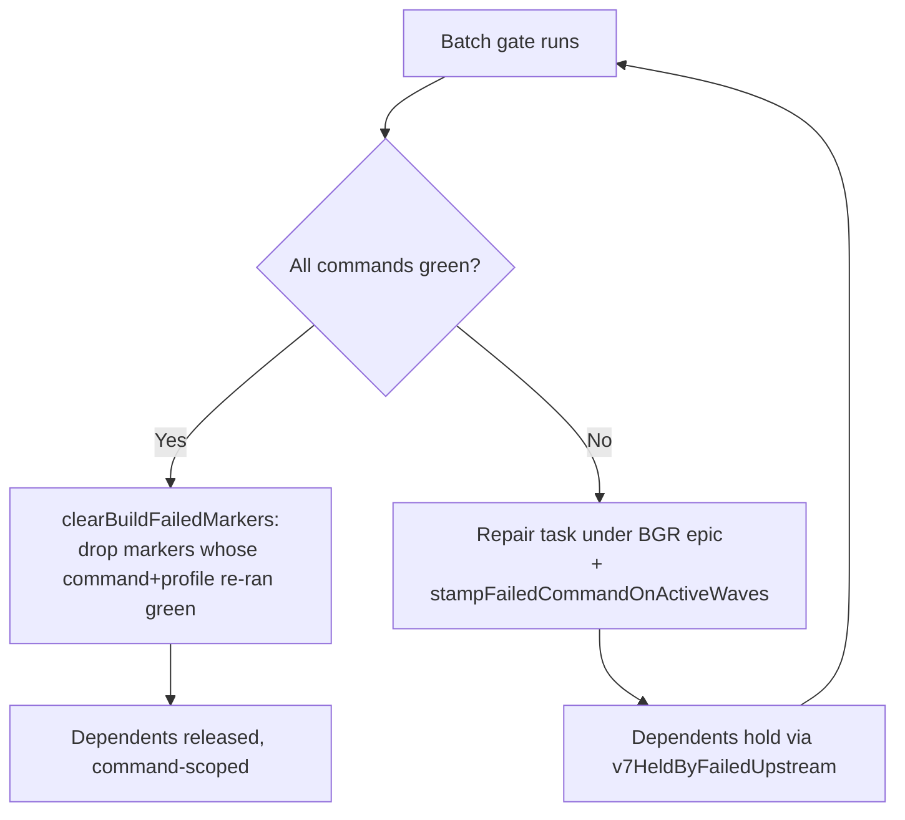

# Gates

"Gate" means four distinct things in Tusker. Do not conflate them:

| Sense | What it is | Owner | Code |
|---|---|---|---|
| **Human gate** | A control-plane document that blocks named tasks until a person acts | human/external | `cmd/tusker/v7_control_cmd.go` |
| **Gate tier** | Automated build/test proof run behind refusal-before-cost, harvesting every defect in one pass | agent, via `tusker gate-run` | `cmd/tusker/gate_tier.go`, `gate_scope.go` |
| **Full gate** | The gate tier executed inside a trusted container/VM lifecycle provider, producing a certified receipt | promotion/departure pipeline | `cmd/tusker/v7_full_gate_provider.go`, `v7_land_cmd.go` |
| **Batch gate** | The unattended wave-end collective gate the daemon runs on a clock | daemon | `cmd/tusker/batch_gate.go` |

The **gate ledger** (`gate_ledger.go`) is shared plumbing under all of the
automated senses. Close-time proof rules live in [[proof-and-closeout]]; the
promotion/departure pipeline that drives the full gate lives in
[[landing-and-completion]]; wave and daemon scheduling live in [[orchestration]].

## 1. Human gates

A human gate is a `tusker.gate/v1` document under `.tusker/work/gates/` wired to
the tasks it `blocks` (`newV7Gate`, `cmd/tusker/commands_v7.go`); driven with
`tusker gate list|satisfy|waive|obsolete` (`gateV7Cmd` → `gateV7Transition`).
`gate_kind` is a closed enum (`internal/v7schema/schema.go`, `GateKinds`): `auth`,
`env`, `setup`, `dev_host`, `ci`, `verification`, `signoff`, `decision`, `quota`,
`external_service`, `manual_hold`, `security`, `privacy`, `legal`, `billing`,
`release`, `destructive_external_action`, `subjective_acceptance`.

### Creation policy — gates are for blockers, never for review

`validateV7GateCreationPolicy` (`commands_v7.go`) rejects, at creation time:

| Rejection | Trigger |
|---|---|
| missing `--owner` / `--action` / `--verification` | always required |
| placeholder text | `v7GateTextIsPlaceholder` on action or verification |
| missing `--why-agent-cannot` | blocking gate owned by a human/external owner |
| agent-capable work | `v7HumanGateOwnsAgentCapableWork` — code review, diff reading, test inspection, implementation judgment |
| missing `--suggestion` | `gate_kind: decision` on a human/external blocking gate |

Routine diffs are adjudicated by the reviewer lane. A gate is a capability boundary
(credentials, a device, a product decision), not a review queue. Transitions:

| Move | Sets | Requires |
|---|---|---|
| `satisfy` | `status: satisfied`, `satisfied_by/at`, `satisfaction_evidence[_refs]` | `--evidence` or `--evidence-refs` for `blocking: true` gates, unless `--force` |
| `waive` | `status: waived`, `waived_by/at`, `waive_reason` | `--reason` |
| `obsolete` | `status: obsolete`, `obsolete_reason` | `--reason` |

Every transition takes the material-epoch lock, saves under CAS against
`state_rev`, emits `gate_satisfied`/`gate_waived`/`gate_obsoleted`, then reconciles
projections and re-runs proof status for every blocked task (`gateV7Transition`).

### Hard-closure fingerprint for `auth` and `release` gates

Satisfying or waiving an `auth` or `release` gate first walks the hard-dependency
closure of every task it blocks (`v7GateHardClosureFingerprint`). Any dependency
missing, unsatisfied, or carrying stale cross-scope material refuses with
`GATE_HARD_DEPENDENCY_INCOMPLETE`. On success the closure fingerprint is stored as
`dependency_material_fingerprint`; if that material later moves,
`v7GateAuthorityReceiptCurrent` goes false and wave authorization raises
`GATE_AUTHORITY_RECEIPT_STALE` (`v7_wave_authorization.go:416`). Other gate
kinds skip this entirely.

### Where a gate actually blocks

- Close: an `open`, `blocking` gate listing the task in `blocks` stops the close
  (`v7_close_ceremony.go:136`, `commands_v7.go:2610`).
- Risk policy: `enforceV7ClosePolicy` (`v7_control_cmd.go`) also requires a
  **satisfied or waived gate of each `gate_kind` the risk tier's close policy
  names** — an absent gate of that kind is itself a block.
- Proof: a satisfied gate can *supply* proof for the acceptance IDs in its
  `covers` list (`v7_proof_cmd.go`) — see [[proof-and-closeout]].

## 2. The gate tier

`runGateTier` (`gate_tier.go`, CLI `tusker gate-run` — note the hyphen; plain
`tusker gate` is the human-gate verb, `cli.go:793`) mechanizes proof economics for
slow-compile ecosystems: total cost is (compile cycles) × (cycle cost), so the gate
must (1) refuse before paying an unusable cycle, (2) harvest the **complete**
failure set in one pass instead of failing fast, (3) return a defect list repairable
as one batch. Every language detail lives in `orchestration.gate` config
(`GateTierPolicy`, `cmd/tusker/workflow.go:188`), never in code; unset
`harvest_commands`/`profile` fall back to `orchestration.batch_gate`
(`resolveGateTierPolicy`). Order of evaluation:

1. **Tree hash** first; its failure — like a missing runtime boundary — is a hard
   error, not a refusal. An empty toolchain fingerprint is *not* an error: it
   silently disables both ledger lookup and ledger recording.
2. **Ledger check, per command.** Each harvest command is looked up individually;
   hits land in `ledger_hits` and drop out of `pending`. Only if *every* command
   hits does the run return `ledger_hit` — without ever running preflight.
3. **`gateTierPreflight`** returns the **first** refusal, in this order: disk
   headroom → build slot held → profile parity → tree not frozen.
4. **Execute all pending commands.** Never stop at the first failure; failures go
   through `harvestGateDefects`, passes through `RecordPass` into the ledger.

Outcome is `passed` when no defects remain, else `failed`. `gateRunCmd` exits 1 on
`refused` or `failed`, and emits the `GateTierResult` JSON for every completed
run (a hard error emits none).

### Refusal causes

| Cause | Trigger | Remedy |
|---|---|---|
| `disk_headroom` | free disk under `min_free_disk_gb`, or unmeasurable (`freeDiskGB` via `statfs`) | reclaim scratch outside the build cache |
| `build_slot_held` | one of `build_slot_locks` exists on disk (`heldBuildSlot`) | wait for the running build, or clear a stale project-local lock |
| `profile_parity` | requested profile ≠ `orchestration.gate.profile` | rerun with the canonical profile; alternating profiles discards the warm build |
| `tree_not_frozen` | `git status --porcelain` non-empty and `allow_dirty_tree` unset | commit or stash so the verdict is attributable to one revision |
| `diff_unavailable` | selective gate cannot compute the change set | make the base/merge-base resolvable, or pass `--base` |
| `worktree_cap` | another live work copy would exceed the measured cap — raised by `cmd/tusker/workspace_manager.go:145`, **not** by `gateTierPreflight` | free a worktree first |

Floors are measured, never guessed.

### Defect harvesting

`harvestGateDefects` splits a failing command's output into one defect per failing
target using `defect_target_regex` (one capture group, e.g. `^--- FAIL: (\S+)`).
Repeated targets append to the existing excerpt; each is capped at
`defect_line_limit` (default 12) lines of ≤320 chars. With no regex, or one with no
capture group, the command becomes a single defect whose excerpt is
`actionableGateFailure` output.

### Selective (per-change) gates

`tusker gate-run --changed` runs `runSelectiveGateTier` (`gate_scope.go`) — Stage 1,
only the scopes the change touched. A `GateScope` (`orchestration.gate.scopes`)
names path globs plus the harvest commands covering that area; `scopeOwnsPath`
matches exact path, directory prefix, or `filepath.Match` glob against the whole
path and each trailing segment (so `*.go` covers `pkg/foo/bar.go`). Selected scopes'
commands are unioned, order-preserving. Fail-closed rules:

| Situation | Behavior |
|---|---|
| no `scopes` configured | `gateRunCmd` refuses outright rather than silently run the full harvest |
| `DiffPaths` errors | refuse with `diff_unavailable`; never pass on a narrowed diff |
| any touched path owned by no scope | run the **full** harvest set, reporting `fallback` |
| genuinely empty diff | pass without running commands, but still stamp the tree hash and run preflight |

`changedGatePaths` is the default diff boundary: committed delta since the
merge-base with the base branch (default branch when `--base` is absent) **plus**
uncommitted (`diff HEAD`) and untracked (`ls-files --others`) work. The committed
delta is load-bearing — its unavailability is `GATE_DIFF_UNAVAILABLE`, never a
silent narrowing; the two additive queries may fail without blinding the gate.

## 3. The gate ledger

`gate_ledger.go` keys a **passing** gate result to the tree that produced it.
Only passes are recorded (`gate-ledger record` rejects any non-pass result).

| Field | Meaning |
|---|---|
| `project_id` | owning project |
| `tree_hash` | `workspaceTreeStateHash` — SHA-256 over every tracked *and untracked* source path and its content |
| `command` | the exact harvest command string |
| `profile` | the gate profile |
| `toolchain` | deterministic fingerprint of the executables that produced the proof; **empty never satisfies a lookup** |
| `host`, `duration_ms`, `passed_at` | provenance |
| `provider_receipt_json` | certified full-gate receipt, when present (see §4) |

Those first five fields are the uniqueness key (`ON CONFLICT(project_id,
tree_hash, command, profile, toolchain) DO UPDATE`). `gateLedgerIgnoresPath`
excludes Tusker's own mutable control-plane trees (`.tusker/work/`, `events/`,
`evidence/`, `attempts/`, `dashboards/`, `scratch/`, `_generated/`) from the tree
hash: recording proof or moving a task to review cannot change compiled code. CLI
is `tusker gate-ledger check|record --command <cmd>`; a record with an
unresolvable toolchain returns `recorded: false, reusable: false` rather than
minting an unreusable proof.

## 4. The isolated full gate (promotion)

Promotion and scheduled departure do not run harvest commands in the daemon's own
process. `runV7GateTierOnRefContext` (`v7_land_cmd.go:3064`) builds a detached
`git worktree` at the candidate ref, freezes its tree hash and status, **removes the
`.git` pointer** so a repository-controlled gate cannot reach shared refs, hooks,
config, or signing material, then replaces `gateTierRuntime.Exec` with
`provider.Run` against a trusted lifecycle provider.

- **Provider trust** (`resolveV7TrustedFullGateProviderAtRoot`): the profile named
  by `orchestration.gate.isolation_provider` must appear in
  `<state-root>/full-gate-providers.yaml` with `kind: container|vm`, a known
  `implementation_id`, matching capability schema, and well-formed runtime /
  client / policy / attestation / image digests. The executable must be an
  absolute-path native Mach-O binary, never a script, never `sandbox-exec`;
  `newV7FullGateProvider` then refuses a repository-local executable path.
- **Platform.** Every full-gate provider path — construction, trusted-executable
  verification, immutable-authority walk, descriptor transport, and the Darwin ACL
  probe — fails closed off macOS with the typed
  `GATE_PROVIDER_UNSUPPORTED_PLATFORM` refusal carrying `goos` and
  `supported: [darwin]` (`v7FullGateProviderPlatformError`,
  `v7_full_gate_provider.go`). It is never a pathname-based fallback and never a
  pass. Classification unwraps with `errors.As`/`errors.Is`
  (`isV7FullGateProviderError`), so a refusal joined into another error still
  reports outcome `provider_failed` rather than a plain gate failure.
- **State root** (`v7_full_gate_state_root.go`): all provider state is resolved
  through an `os.Root` descriptor over a non-group/world-writable directory, so
  `..` and symlink traversal cannot escape and a swapped pathname is caught as an
  identity change.
- **Outcomes** are provider-neutral: `gate_passed`, `gate_failed`,
  `provider_failed`, `cancelled`, `timed_out`. Only `gate_passed` may become a
  reusable green.
- **Receipts.** `GateProviderReceipt` (`runtime_store.go:51`) carries lifecycle
  ID, project/departure IDs, request/candidate/command digests, profile, provider profile,
  toolchain, containment/cleanup/result/output digests, and `cleanup_certified`;
  `v7CertifiedGateProviderReceipt` requires *all* of them.
- **Certified ledger reuse.** `v7CertifiedFullGateLedger.FindGateLedger` rejects
  a green row whose receipt is absent, uncertified, or disagrees with the lookup
  on project, candidate digest, command digest, profile, or toolchain — a legacy
  or artifact-only row can never satisfy a full gate.
- **Crash recovery.** `recoverV7FullGateProviderScopes` runs before a daemon
  accepts work: durable request/outcome journals let the next daemon invoke the
  provider's exact cleanup rather than infer safety from a dead PID.
- **Caps** (`v7_full_gate_provider.go:32`): 2 h runtime, 1 MB result and output,
  16 KB command, 16 MB artifact, 128 recovery scopes / journal entries.

## 5. Batch gate and merge windows

The daemon schedules the wave-end collective gate in `scheduleBatchGateIfDue`
(`batch_gate.go`), gated on `orchestration.batch_gate.enabled` plus a non-empty
`commands` list.

| Schedule mode | Rule |
|---|---|
| `windows: ["HH:MM", …]` | daemon-host **local** wall clock, parsed by `parseMergeWindows` (malformed entries are a config error, not a silent drop). A run started at or after the current window consumed it, so each window fires at most once per day. |
| `period_hours` (fallback, default 24 h) | fire when the last run started more than one period ago. |

A run still `running` suppresses a concurrent spawn — bounded by
`mergeWindowRunningGrace` (24 h) on the window path and `2 × period` on the period
path, so a wedged run cannot block the schedule forever. Each run is persisted as a
`batch_gate_runs` row (`saveBatchGateRun`) and executed in a goroutine.

`executeBatchGate` runs every command and records green ones to the gate ledger.
Each failure captures `actionableGateFailure` (up to 12 lines containing
fail/error/panic/undefined) and, up to `max_repairs` (default 3), spawns a repair
task under an auto-created `BGR` epic. Repairs coalesce by
`promotion_failure_identity`, not by command — one command can hold several
unrelated tests, and merging them would erase ownership. Note the batch gate runs
the raw commands directly (`runGateCommand`); it does **not** apply gate-tier
preflight, so no disk/slot/frozen-tree refusal happens here.

### Red-gate path

- **Red.** All failing commands are stamped as one newline-delimited marker, and
  only onto waves with a non-terminal member (`v7WaveHasInFlightMember`) — a wave
  whose work has all landed carries nothing new. Dependents then hold through
  `v7HeldByFailedUpstream`
  (`cmd/tusker/upstream_hold.go`), which reaches both red-marked dependencies and
  the task's own wave. The hold is scoped to endangered work, not the whole project.
- **Green.** `clearBuildFailedMarkers` drops a marker only when the just-passed run
  actually covered that marker's recorded command set, with a matching profile when
  both are set; an unrelated red marker survives. A legacy marker with no recorded
  command clears only after the full configured command set passes, so it has a
  conservative operator escape without being cleared by a partial run. The loop
  continues through every task and wave on error, joining failures, so one bad
  document cannot half-apply a release.

Both paths then rewrite the run row and refresh the stream board.
