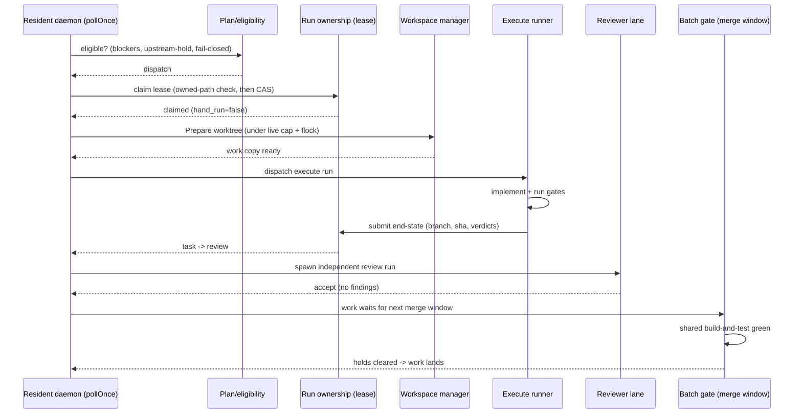
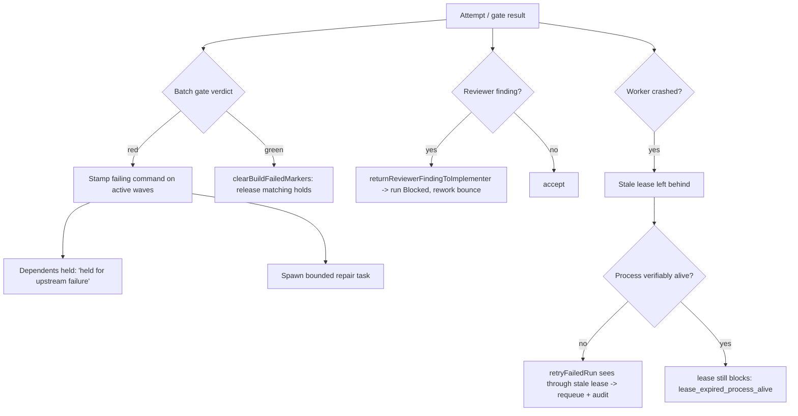

# Orchestration

This doc describes how Tusker's orchestration works **today**, drawn from
`cmd/tusker/`: the daemon poll loop, how work is selected and claimed,
workspaces, lanes, run end-states, retries, merge windows, and trace/replay. For
the wider factory model see
[../../.tusker/specs/software-factory.md](../../.tusker/specs/software-factory.md).

Tusker separates *deciding* what should run (read-only, available to anyone)
from *doing* it — dispatching a local runner, which happens only inside the
operator-started resident daemon.

## Who may do what: daemon vs interactive session

An interactive Claude Code / Codex session opened by the user **implements the
work itself** and never starts a daemon or dispatches runners. This is a hard
rule in the repo `CLAUDE.md`: "Never start `tusker daemon run`, invoke
`tusker automation dispatch`, or launch nested workers from an interactive agent
session." The code enforces it: every one-shot CLI entry point that could
dispatch is handed a refusal reason.

| Operation | Resident daemon (`tusker daemon run`) | Interactive / one-shot CLI |
|---|---|---|
| Poll loop, control server, serve server, watchdog | Yes (`daemon.go:103-147`) | No — `--once` skips all of them |
| Dispatch a local runner | Yes | **Refused** via `oneShotDispatchRefusal` (`daemon.go:1501`) |
| `tusker automation plan` (read-only decision) | n/a | Yes |
| `tusker automation dispatch` | Yes (the daemon) | Refused |
| Claim / start / heartbeat / submit a run by hand | Yes | Yes (hand-run, see below) |
| Retry a failed run, inspect streams, replay a trace | Yes | Yes |

`oneShotDispatchRefusal` returns *"<command> cannot dispatch local runners from a
one-shot CLI process; start the resident daemon…"* — injected for `daemon run
--once`, `refresh`, `automation dispatch`, and `advance-external --dispatch`.

## The daemon poll loop

`(d *Daemon) Run(ctx, once)` (`daemon.go:95`) is the entry point.

- **`--once`**: sets the one-shot dispatch refusal, skips control/serve/watchdog,
  runs exactly one `PollOnce`, and returns (`daemon.go:96-134`). Useful for
  reconcile-only sweeps; it cannot dispatch runners.
- **Resident (`!once`)**: starts a control server accepting `interrupt`, `stop`,
  `reconcile_project`, `reconcile_registry`; starts the serve server and a
  watchdog; does an initial poll; then loops on a wake channel, an adaptive poll
  timer (`TUSKER_POLL_INTERVAL_MS`), and an attention ticker (`daemon.go:104-218`).

One cycle is `pollOnce` (`daemon.go:599`). It caches process identity, loads
projects and runtime runs, counts dispatch capacity, sorts candidate tasks, and
then per task: reconciles execute runs against the plan, evaluates dispatch
blockers, dispatches execute / review / integrator runs, and finally records
`daemon_last_poll_at`.

## Picking work: plan (read-only) vs dispatch

`tusker automation plan <task>` builds a **read-only** decision and never
dispatches. It emits a `decision` of `"dispatch"` or `"do_not_dispatch"` plus the
list of `blockers` (`automation_commands.go:722`). `tusker automation plan` being
read-only "does not authorize dispatch" (repo `CLAUDE.md`).

The daemon's dispatch path re-derives eligibility and, when blocked, stamps
`current.LastError = "dispatch blocked: <reason>"` and skips the task. Blocker
sources include:

| Blocker family | Where | Example reason string |
|---|---|---|
| Basic runnable | `commands_v7.go:3253` | `kind is not task`, `status is <x>`, `readiness is <x>`, `next_owner is <x>` |
| Wave authorization | `commands_v7.go:3286-3316` | `<id> is not an authorized member of wave <w>`; `wave does not resolve: <w>` |
| **Upstream hold** | `upstream_hold.go:79` | `held for upstream failure: <id> failed its build-and-test` |
| **Cannot-verify (fail closed)** | `commands_v7.go:3326` | `cannot verify upstream health: <err>` |
| Verification/proof gaps | `commands_v7.go` | `verification missing`, `proof_mode missing`, `proof_required missing` |
| Critical risk | `daemon.go:1460` | `dispatch blocked: critical risk requires explicit human dispatch` |
| Capacity caps | `daemon.go:952-1004` | `dispatch blocked: state %q concurrency cap reached` |
| Crash-loop / budget / invariant | `daemon.go:958-990` | guard-specific reasons |
| Runner declined | `daemon.go:2772` | `automation plan do_not_dispatch: <blockers>` |

**Fail-closed is the design point.** If the dependency index cannot load, the
code appends `cannot verify upstream health: <err>` and blocks — the comment
reads *"Fail closed: if we cannot load the index we cannot rule out an upstream
build failure, so block dispatch."* Wave-auth verification is the same: a load
error yields `wave authorization cannot be verified: <err>` rather than an
optimistic pass.

## Claims and leases

Dispatch claims a lease before any runner touches files (`run_ownership.go`).

- **Owned-path conflict is checked before the lease CAS** (`ownedPathConflict`,
  `run_ownership.go:69`). A lease protects a task row, not the files two tasks
  intend to edit. Overlap is prefix-aware (a directory claim conflicts with a
  file beneath it). A refusal carries `OWNED_PATH_CONFLICT` with holder, path,
  lease age, and liveness.
- **Liveness beats lease age** (`holderLiveness`, `run_ownership.go:51`). An
  aged-out lease whose process is provably alive (`lease_expired_process_alive`)
  still blocks — it is still editing files. Only a holder that is *both* aged out
  *and* unprovable is `dead`, and only then may `reclaimDeadOwnedPathHolders`
  take over.
- Claims are serialized cross-process by an flock at
  `<state>/locks/owned-path-claims.lock`. The lease CAS (`ClaimRunLease`) checks
  expected state, owner, generation, work revision, and per-project concurrency.

### Hand-run origin stamping

Work registers in Tusker no matter who drives it — a daemon dispatch or a human
in a live session. A **hand-run** claim is any claim made without
`TUSKER_ATTEMPT_ID` in the environment (`claimIsHandRun`,
`hand_run_marker.go:40`).

- The daemon claim path stamps `hand_run=false` and clears any stale marker
  (`claimExistingWithAuthorization`, `run_ownership.go:295`).
- The authoritative per-run origin is the `HandRun` stamp on the `RunStatus` at
  claim time. A task-keyed marker file (`<taskID>.hand_run`) is restamped on
  **every** claim and exists only for legacy runs that predate the stamp and for
  lease-level introspection — board/web rows read the per-run stamp, not the
  marker, because the marker only reflects the latest claim
  (`runHandRunOrigin`, `hand_run_marker.go:88`).

## Workspaces

`FSWorkspaceManager` (`workspace_manager.go`) prepares a work copy per task.
Strategies: `shared`/`in_place` (the repo itself, must be clean outside
`.tusker`), `worktree`, `clone`, `copy`.

- **Per-task worktree**: for `worktree`, `Prepare` runs `git worktree add` on a
  branch keyed by `<recordID>__<sanitized-branch>` under the per-project
  workspace root (`materializeWorkspace`, `:504`).
- **Live-worktree cap with stale-orphan pruning under flock**: when
  `MaxLiveWorktrees > 0`, `Prepare` takes an flock on `<root>/.worktree-cap.lock`,
  then `countLiveWorktrees` counts child dirs holding `.tusker/workspace.json`.
  A copy whose owning PID is dead (or, for legacy PID-less copies, older than the
  24h `staleWorkspaceThreshold`) is **pruned, not counted**
  (`workspace_manager.go:161-208`). Opening past the cap is refused with
  `gateRefusalWorktreeCap` before any git worktree is created, so accumulated
  orphans can never wedge dispatch.
- **Cleanup** (`cleanupWorkspacePath`, `:466`) detaches the git worktree
  (`git worktree remove --force`) then removes the directory — the single removal
  path shared by explicit cleanup and orphan pruning.

## Lanes

Lanes are the kinds of run the daemon dispatches (`daemon.go:44-47`).

| Lane / work-kind | Constant | What it is |
|---|---|---|
| Implementation | `runLaneExecute = "execute"` | The default lane; a runner implements the task. |
| Review | `runLaneReview = "review"` | An independent reviewer run, gated by the workflow's `Reviewer` policy. |
| Integrator | `runLaneIntegrator = "integrator"` | Selected when the task's `work_kind == "integrator"` (`daemon.go:1032`); integrator tasks also inherit the workflow's shared namespaces as owned paths. |

**Review lane.** When the workflow enables a reviewer, the daemon spawns an
independent review run (`d.dispatchRun(..., runLaneReview)`, `daemon.go:1210`),
capped by `reviewDispatchAllowed`. If the cap is hit the message is *"review
dispatch blocked: automated review cycle cap reached (%d/%d); operator
intervention required."*

**Findings auto-return.** On a completed review run, if the reviewer left a
finding (`reviewerFindingFromTask`), the daemon bounces it back to the
implementer via `returnReviewerFindingToImplementer`, marks the run `Blocked`,
and records a stop-for-audit with reason `reviewer finding returned to
implementer` (`reviewer_finding.go:21`). A dirty reviewer workspace takes
precedence and blocks with its own reason.

## Run end-states

Every successful submit **must** carry a captured end-state; a missing or
incomplete one is the same defect (`finishWithEndState`, `run_ownership.go:379`).
`captureRunEndState` reads the authoritative facts from the workspace (git
branch/HEAD/dirty) rather than trusting the runner's self-report; a mismatch
between reported and harness values is recorded as a `Discrepancy`.

| Field | Required | Meaning |
|---|---|---|
| `branch` | yes | Harness-observed branch (`missingRunEndStateFields`, `:498`) |
| `head_sha` | yes | Harness-observed HEAD SHA |
| `worktree_path` | yes | The work copy path |
| `gate_verdicts` | yes (≥1) | Map of gate cover → verdict |
| `dirty` | captured | Whether the tree was dirty at submit |
| `reported_*` / `discrepancies` | optional/derived | Runner self-report vs harness, and mismatches |

A successful `submit` also requires non-empty deliverable and
acceptance-mapped verification summaries, then normalizes the task to `review`
(`runsLifecycleCmd`, `run_ownership.go:636`). The Streams board renders each
landed run's end-state (`streams.go`).

## Retries

`retryFailedRun` (`retry_failed_task.go:131`) retries **one** failed run without
disturbing neighbours. It is idempotent and scoped to the single record.

- **Sees through a stale lease.** A `Claimed`/`Running` lease counts as a live
  attempt only if the lease is unexpired **or** the process is verifiably ours
  and alive (`retryHasLiveAttempt`, `:79`). A crashed worker's expired lease is
  reapable, so the retry proceeds. Identity verification refuses the bare PGID
  fallback when a recorded PID mismatches — "dead is dead" (`:48`).
- **Backoff expedite.** A run already parked in `RetryQueued` with a future
  `NextRetryAt` is pulled forward to now on operator demand, keeping the attempt
  counters (`expediteQueuedRetry`, `:211`).
- **Honest no-ops.** `AlreadyLive` names the in-flight attempt; `AlreadyQueued`
  reports a parked run with no live attempt. Two concurrent retries converge:
  the CAS loser re-reads and reports the winner's outcome
  (`retryConcurrentReadback`, `:239`).
- **Audit trail.** Every retry writes a `SupervisorDecisionRedrive` decision with
  the prior attempt count, lease state, and outcome (`recordRetryAudit`, `:265`).

## No-stacking rule and merge windows

The batch gate (`batch_gate.go`) runs the shared build-and-test and is the
project's merge-window mechanism. It fires at most once per window and never
lets two gates stack.

- **Clock windows.** `orchestration.batch_gate.windows` are daily `HH:MM` local
  wall-clock times, validated and de-duplicated (`parseMergeWindows`, `:30`).
  `scheduleBatchGateIfDue` fires the window at most once: a run started at or
  after the current window boundary already consumed it (`:142`).
- **No stacking / stuck-run grace.** A run still `running` from before the window
  suppresses a new spawn — but only up to `mergeWindowRunningGrace = 24h`
  (`:17`, `:150`), so a permanently stuck run cannot wedge the schedule forever.
  The period-based path (`PeriodHours`) has the equivalent `2*period` guard.
- **Green releases holds; red quarantines.** On green, `clearBuildFailedMarkers`
  drops only the holds whose recorded command actually re-ran green. On red,
  `stampFailedCommandOnActiveWaves` stamps the failing command onto every wave
  with an in-flight member, so their not-yet-landed dependents hold via
  `v7HeldByFailedUpstream` (the upstream-hold blocker above). A red gate also
  spawns bounded repair tasks (`createBatchGateRepairTask`, up to `MaxRepairs`,
  default 3). See [gates.md](gates.md) for gate profiles and verdicts.

## Replay and traces

Boundary traces let a completed attempt be re-adjudicated deterministically with
**no new model or network calls** — measured, not asserted.

- **Recording.** `RecordAttemptTraces` (`trace.go:114`) projects an attempt's
  event sink into boundary records. When the attempt reaches any end state
  (`Terminal`), it appends a terminal **`attempt_closed` sentinel**
  (`attemptTraceSentinelRecord`, `trace.go:191`) so an adjudicating replay can
  tell a complete recording from a crash-truncated one. It is idempotent.
- **Replay modes** (`trace_replay.go:125`): `mock` (default), `live-tools` (the
  only mode allowed to reach a live execution path), and `adjudicate`.
- **Completeness.** Adjudicate mode first runs `checkTraceReplayComplete`: a
  trail with no `attempt_closed` sentinel, or a boundary that recorded neither
  output nor error, fails as incomplete. The sentinel itself is skipped as a
  replay step (`trace_replay.go:176`).
- **Measured zero-model-call guarantee** (`trace_replay.go:249`). In mock and
  adjudicate modes the executor stays `nil`, so no live tool runs. Any invocation
  that *does* reach the live seam increments `NetworkCalls`. Adjudication then
  checks the counters: if `ModelCalls > 0 || NetworkCalls > 0` it fails with
  *"adjudication reached a live path: model_calls=… network_calls=…"* rather than
  printing an unearned zero.

## Escalation reasons

Runner escalations are validated against an enumerable set
(`v7_escalation_digest_cmd.go:22`), default `system_error`: `system_error`
(tooling/harness failure), `security_concern`, `unresolvable_conflict`, and
`stuck_loop`. Daemon-side parks record a fixed kind `"park"` with lease states
`LeaseStateParkedNoProgress` / `LeaseStateParkedBudget`; escalations get IDs
`ESC-<n>` with open-status dedupe.

## Diagram 1 — happy path

## Diagram 2 — failure paths

## Related docs

- [tasks-and-proof.md](tasks-and-proof.md) — task contracts, acceptance, verification rows.
- [gates.md](gates.md) — gate profiles, verdicts, and the gate ledger.
- [../../.tusker/specs/software-factory.md](../../.tusker/specs/software-factory.md) — the factory model this implements.
</content>
</invoke>
