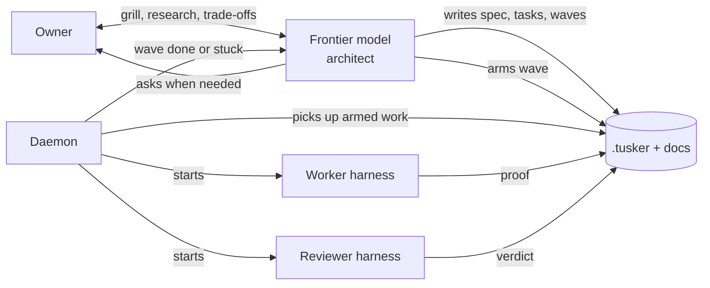

# Testing Tusker for real

This page does two jobs. It records what Tusker is for, in the owner's words.
It also holds the running work list for the current test campaign, so a new
session can pick up where the last one stopped.

Update the **Work list** and **Log** sections as items move. Keep the vision
section stable unless the owner changes it.

## What Tusker is for

Coding agents now write better code than most people. The code quality is no
longer the gap. The gap is intent. An agent makes a design decision the owner
did not want, then builds a lot on top of it.

The fix is to spend human time up front. The human and a frontier model agree
on the spec, the trade-offs and, most of all, the acceptance criteria. After
that, cheaper agents do the building, and other agents check it.

An example of a trade-off only a human can settle: agents tolerate 200 to 800
milliseconds of read latency, so a product built mostly for agents can keep its
data in cheap object storage instead of fast local disks.

Tusker was inspired by beads and by OpenAI's Symphony. It does three jobs.

### 1. Documentation and specs

All specs and docs are Markdown files with short front matter. They follow the
same idea as agent skills: show a little, and let the reader ask for more.

- The docs root has one index note that lists what the product does.
- Each folder has an intro note that says what the folder holds.
- Each file says, in one line each, when to read it and when to skip it.

An agent can then walk the docs like a file browser. It opens a folder, sees
the intro and the one-line summaries, and picks the next step. It should reach
the right document in four or five steps, without grepping blindly.

Docs must read like a person wrote them. Use plain words, short sentences and
diagrams. Avoid jargon.

### 2. Task tracking

A task is a contract. It states the result, the owned files, the acceptance
rows and the exact checks. The CLI does the boilerplate and the linting, so an
agent does not spend tokens filling in front matter. The CLI should offer just
enough commands: not five hundred, and not too few to be useful.

Proof depends on the kind of work:

| Kind of work | Proof |
| --- | --- |
| New UI | A screenshot, and later a video |
| Change to existing UI | Before and after screenshots |
| Performance | The number before and the number after |
| Database or deep technical change | A short write-up a person can read |

Tasks group into **waves**. A wave is a dependency graph, so work runs in
parallel wherever it can. Finishing one task unlocks the tasks that wait on it.
One wave can also wait on another. Each task and each wave ends with a short
note on what it achieved.

### 3. Orchestration

Tusker is a meta-harness. It never runs model turns or tool calls itself. It
starts other harnesses, hands them a task, and records what happened. It
supports four harnesses: Codex, Claude Code, Devin and Muse.

A **profile** is one harness, model, effort and sandbox setting. Examples are
Devin SWE-2 Max, Muse Spark, Codex Sol low and Claude Opus high. Each profile
carries one or more **tiers**:

| Tier | Kind of task | Example profiles |
| --- | --- | --- |
| Light (1) | Small, well-bounded scripts | Codex Luna, Claude Haiku or Sonnet |
| Standard (2) | Harder work with a clear spec, like a good ticket | Devin SWE-2, Codex Sol low |
| Demanding (3) | Unclear work that needs research and design | Claude Opus, Codex Sol high |

Every task has a worker and a reviewer. Tiers apply to both. All work is
reviewed.

### Who does what

The owner and the frontier model act as the architect. They grill the idea,
read competitors and library docs, write the spec, write the tasks and arm the
wave. **Arming** marks a wave as ready, so that tasks still being drafted do
not start by accident.

The daemon does the ticket moving. It watches for armed work, starts workers
and reviewers, and tells the architect when a wave is done. The frontier model
should not poll workers like a middle manager. That wastes an expensive model
on clerical work.

### When a worker gets stuck

A worker can stop for three different reasons, and each needs a different
response:

1. The harness itself crashed.
2. Something outside failed, such as a full disk or a blocked API.
3. The spec is unclear, or the sandbox denied something the task needs.

Tusker should tell these apart and send the problem to the right place: the
architect's session or the owner. A simple first version is acceptable.

Steering uses one method for every harness. Tusker stops the process, adds the
message, and resumes the same session by its ID. This keeps prompt-cache hits.
Codex runs through `codex exec`, not the app server, because the app server
would make Tusker manage turns. Devin and Muse speak ACP, so they may support
live messages. The value of the shared message board between agents is still
unproven.

### Surfaces

- **CLI:** for agents.
- **Daemon:** runs the work.
- **UI (Serve and TuskerBar):** lets the owner watch, start a task or a wave by
  hand, and review.

Full automation is the goal. It is not yet trusted. For now the owner starts
work by hand and watches.

## Goal of this campaign

1. Start one task by hand and watch it go through work, review and close.
2. Start one wave and watch the dependency graph unlock tasks in order.
3. See the status at every step. If a status cannot be shown, write down why.
4. Do this for all four harnesses.
5. Then move to real projects, and improve Tusker from what breaks.

The test bed is a throwaway repository seeded by
`docs/qualification/live-harness/seed.sh`. It holds fictional docs, one
standalone task, three four-task waves and one small task per harness. The
step-by-step runbook is `docs/qualification/live-harness/README.md`.

## How the build compares to the vision

Checked on 2026-09-27 against `aa1637fc`.

| Vision | What exists | Gap |
| --- | --- | --- |
| Walk the docs folder by folder | `tusker docs browse`, `find`, `read`, `backlinks` | Plain-text browse hides `read_when` and `skip_when`. One bad file stops the whole listing. |
| Docs that read like a person wrote them | Style rules in the README and the skill | The owner still finds the output hard to read. There is no example-driven style guide. |
| Just enough CLI | 101 commands, about 55 top-level verbs | Too many. Needs an audit. |
| Proof by kind of work | Evidence kinds include screenshot, video and benchmark | No before-and-after kind. Not checked whether a UI task must have a screenshot to close. |
| Exec-only meta-harness | Adapters for all four harnesses | Old `codex_app_server`, `codex_acp` and `codex_cloud` adapters still registered. |
| Arming | Waves must be armed before dispatch | None found. |
| Tell the architect when a wave ends | `wave_result` message and a hook inbox | Never tested with a real provider. |
| Tell the three kinds of failure apart | Forced-failure checks; workers can ask questions | Not checked whether the three kinds get separate labels. |
| Four harnesses tested live | Runbook and seed script exist | Never run. No results report existed before this campaign. |

## Work list

Status values: `todo`, `doing`, `done`, `blocked`, `parked`.

### Now: live qualification

| # | Item | Status | Notes |
| --- | --- | --- | --- |
| Q0 | Fix `docs browse` crash on `session-testing.md` | done | Added missing front matter. |
| Q1 | Add global profile `devin-swe-2-max` | done | Tiers standard and demanding. |
| Q2 | Seed `/tmp/tusker-live-qual` | done | IDs in `/tmp/tusker-live-qual.proof/ids.env`. |
| Q3 | Route check (runbook step 0.5) | done | All eight lanes correct, no blockers. |
| Q4 | Daemon, Serve and harness login check (steps 0.1, 0.2) | done | Daemon up after `make install`. Retired the stale row (F7), ran `daemon resume`; circuit closed. All four harnesses installed. |
| Q5 | Enable automation for the test project only (step 0.6) | done | Only remaining blockers: wave disarmed, and the circuit. |
| Q6 | Codex: task QLH-T-0001, wave W-0005 | todo | Reviewer Devin SWE-2 Max. |
| Q7 | Claude Code: task QLH-T-0002, wave W-0006 | todo | |
| Q8 | Devin: task QLH-T-0003, wave W-0007 | todo | |
| Q9 | Muse: task QLH-T-0004, wave W-0008 | todo | Risk: Muse sandbox may block Tusker's state folder. |
| Q10 | Run one four-task wave and watch the graph unlock | todo | |
| Q11 | Forced-failure checks per harness | todo | Needs four fake profiles in the global config. |
| Q12 | Wave-done message reaches the architect session | todo | |
| Q13 | Write `docs/reports/live-harness-qualification-2026-09-27.md` | todo | Use the runbook's results template. |

### Next: fixes found so far

| # | Item | Status | Notes |
| --- | --- | --- | --- |
| F1 | `docs browse` text output should show `read_when` and `skip_when` | todo | |
| F2 | `docs browse` should skip a bad file with a warning, not stop | todo | Needs owner decision; a test pins today's behavior. |
| F3 | `tusker models show` fails outside a repository | todo | Profiles are global, so no repository should be needed. |
| F4 | Add `tusker wave list` | todo | |
| F5 | Seeded epics have "TBD." as their summary | todo | |
| F6 | Clean up the 41 registered projects, mostly dead temp folders | todo | Ask before removing any. Seven enabled projects have no vault left. |
| F7 | One stale row froze all dispatch for five days | todo | RPF-T-0064 in `rzn/backend` (automation disabled) held `retry_queued` on a backlog task. The circuit latched on 2026-09-22 and kept the old violation after the row was retired. A disabled project should not be able to stop every project. Nothing told the owner. |
| F8 | Resuming the daemon would start real work in the Tusker repo | done | The `tusker` project has automation on, with 7 armed waves and 8 directives. `kurpod` has 1 directive. Turned automation off for `tusker` and `kurpod` before resuming. Turn back on with `tusker projects enable --id <id>`. |
| F9 | No command lists runs | todo | `tusker runs` has no `list`. Finding the active run needed a direct database query. |
| F11 | Add one global automation switch | todo | Owner wants three levels: global, project, wave. Today only project and wave exist; the only global stop is `daemon stop`, which also stops Serve. `daemon limits` refuses 0. The switch should stop new dispatch but keep the daemon and Serve up. |
| F12 | `projects disable --repo` on kurpod says several projects match, but `projects list` shows one | todo | Worked with `--id`. |
| F13 | Seeded test project was hidden from the sidebar | done | `demo seed` hides projects unless `--visible` is passed; the qualification seed did not pass it. Fixed `seed.sh`, and set `visible` in the existing manifest. A hidden project gives no hint of why it is missing. |
| F10 | Two different active-run counts | todo | `/api/daemon` says 0; `daemon status --json` says 1. The 1 is a stale interactive claim (CMT-T-0001 in `cinta`, `agent:claude`, no process). |

### Later: gaps against the vision

| # | Item | Status | Notes |
| --- | --- | --- | --- |
| V1 | Rewrite the README and system overview from the vision above | todo | After testing, so docs are written once. |
| V2 | Docs style guide with good and bad examples and diagrams | todo | |
| V3 | Audit the CLI for just-enough commands | todo | |
| V4 | Proof rules by kind of work, including before and after | todo | |
| V5 | Remove leftover Codex adapters if exec-only is final | todo | |
| V6 | Label the three kinds of worker failure and route them | todo | Simple first version. |
| V7 | Decide whether the agent message board earns its keep | todo | |

## How work gets done

The frontier model in the owner's session plans and reviews. Most building
goes to Devin SWE-2 Max (`devin -p --model swe-2-max`) and Codex Sol low
(`codex exec`). The owner presses the UI controls during live tests. Agents
never start the daemon.

## Log

- 2026-09-27: Wrote this page. Finished Q0 to Q3. The owner ran `make install`,
  and TuskerBar started the daemon. Found the global circuit open since
  2026-09-22 (F7). Turned off automation for `tusker` and `kurpod`, retired the
  stale row, and resumed. Only the test project can dispatch. Next: the owner
  arms W-0005 (Codex) in the UI.
