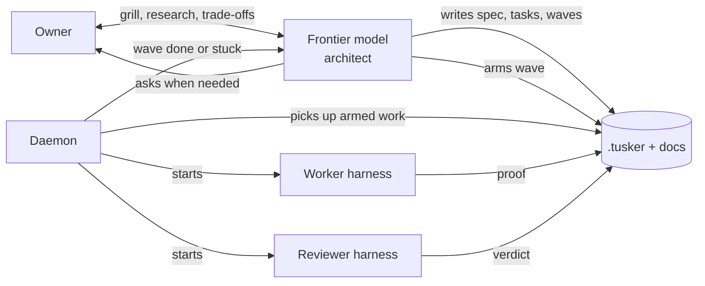

# Testing Tusker for real

This page does two jobs. It records what Tusker is for, in the owner's words.
It also holds the running work list for the current test campaign, so a new
session can pick up where the last one stopped.

Update the **Work list** and **Log** sections as items move. Keep the vision
section stable unless the owner changes it.

## What Tusker is for

Coding agents now write better code than most people. The code quality is no
longer the gap. The gap is intent. An agent makes a design decision the owner
did not want, then builds a lot on top of it.

The fix is to spend human time up front. The human and a frontier model agree
on the spec, the trade-offs and, most of all, the acceptance criteria. After
that, cheaper agents do the building, and other agents check it.

An example of a trade-off only a human can settle: agents tolerate 200 to 800
milliseconds of read latency, so a product built mostly for agents can keep its
data in cheap object storage instead of fast local disks.

Tusker was inspired by beads and by OpenAI's Symphony. It does three jobs.

### 1. Documentation and specs

All specs and docs are Markdown files with short front matter. They follow the
same idea as agent skills: show a little, and let the reader ask for more.

- The docs root has one index note that lists what the product does.
- Each folder has an intro note that says what the folder holds.
- Each file says, in one line each, when to read it and when to skip it.

An agent can then walk the docs like a file browser. It opens a folder, sees
the intro and the one-line summaries, and picks the next step. It should reach
the right document in four or five steps, without grepping blindly.

Docs must read like a person wrote them. Use plain words, short sentences and
diagrams. Avoid jargon.

### 2. Task tracking

A task is a contract. It states the result, the owned files, the acceptance
rows and the exact checks. The CLI does the boilerplate and the linting, so an
agent does not spend tokens filling in front matter. The CLI should offer just
enough commands: not five hundred, and not too few to be useful.

Proof depends on the kind of work:

| Kind of work | Proof |
| --- | --- |
| New UI | A screenshot, and later a video |
| Change to existing UI | Before and after screenshots |
| Performance | The number before and the number after |
| Database or deep technical change | A short write-up a person can read |

Tasks group into **waves**. A wave is a dependency graph, so work runs in
parallel wherever it can. Finishing one task unlocks the tasks that wait on it.
One wave can also wait on another. Each task and each wave ends with a short
note on what it achieved.

### 3. Orchestration

Tusker is a meta-harness. It never runs model turns or tool calls itself. It
starts other harnesses, hands them a task, and records what happened. It
supports four harnesses: Codex, Claude Code, Devin and Muse.

A **profile** is one harness, model, effort and sandbox setting. Examples are
Devin SWE-2 Max, Muse Spark, Codex Sol low and Claude Opus high. Each profile
carries one or more **tiers**:

| Tier | Kind of task | Example profiles |
| --- | --- | --- |
| Light (1) | Small, well-bounded scripts | Codex Luna, Claude Haiku or Sonnet |
| Standard (2) | Harder work with a clear spec, like a good ticket | Devin SWE-2, Codex Sol low |
| Demanding (3) | Unclear work that needs research and design | Claude Opus, Codex Sol high |

Every task has a worker and a reviewer. Tiers apply to both. All work is
reviewed.

### Who does what

The owner and the frontier model act as the architect. They grill the idea,
read competitors and library docs, write the spec, write the tasks and arm the
wave. **Arming** marks a wave as ready, so that tasks still being drafted do
not start by accident.

The daemon does the ticket moving. It watches for armed work, starts workers
and reviewers, and tells the architect when a wave is done. The frontier model
should not poll workers like a middle manager. That wastes an expensive model
on clerical work.

### When a worker gets stuck

A worker can stop for three different reasons, and each needs a different
response:

1. The harness itself crashed.
2. Something outside failed, such as a full disk or a blocked API.
3. The spec is unclear, or the sandbox denied something the task needs.

Tusker should tell these apart and send the problem to the right place: the
architect's session or the owner. A simple first version is acceptable.

Steering uses one method for every harness. Tusker stops the process, adds the
message, and resumes the same session by its ID. This keeps prompt-cache hits.
Codex runs through `codex exec`, not the app server, because the app server
would make Tusker manage turns. Devin and Muse speak ACP, so they may support
live messages. The value of the shared message board between agents is still
unproven.

### Surfaces

- **CLI:** for agents.
- **Daemon:** runs the work.
- **UI (Serve and TuskerBar):** lets the owner watch, start a task or a wave by
  hand, and review.

Full automation is the goal. It is not yet trusted. For now the owner starts
work by hand and watches.

## Goal of this campaign

1. Start one task by hand and watch it go through work, review and close.
2. Start one wave and watch the dependency graph unlock tasks in order.
3. See the status at every step. If a status cannot be shown, write down why.
4. Do this for all four harnesses.
5. Then move to real projects, and improve Tusker from what breaks.

The test bed is a throwaway repository seeded by
`docs/qualification/live-harness/seed.sh`. It holds fictional docs, one
standalone task, three four-task waves and one small task per harness. The
step-by-step runbook is `docs/qualification/live-harness/README.md`.

## How the build compares to the vision

Checked on 2026-09-27 against `aa1637fc`.

| Vision | What exists | Gap |
| --- | --- | --- |
| Walk the docs folder by folder | `tusker docs browse`, `find`, `read`, `backlinks` | Plain-text browse hides `read_when` and `skip_when`. One bad file stops the whole listing. |
| Docs that read like a person wrote them | Style rules in the README and the skill | The owner still finds the output hard to read. There is no example-driven style guide. |
| Just enough CLI | 101 commands, about 55 top-level verbs | Too many. Needs an audit. |
| Proof by kind of work | Evidence kinds include screenshot, video and benchmark | No before-and-after kind. Not checked whether a UI task must have a screenshot to close. |
| Exec-only meta-harness | Adapters for all four harnesses | Old `codex_app_server`, `codex_acp` and `codex_cloud` adapters still registered. |
| Arming | Waves must be armed before dispatch | None found. |
| Tell the architect when a wave ends | `wave_result` message and a hook inbox | Never tested with a real provider. |
| Tell the three kinds of failure apart | Forced-failure checks; workers can ask questions | Not checked whether the three kinds get separate labels. |
| Four harnesses tested live | Runbook and seed script exist | Never run. No results report existed before this campaign. |

## Work list

Status values: `todo`, `doing`, `done`, `blocked`, `parked`.

### Now: live qualification

| # | Item | Status | Notes |
| --- | --- | --- | --- |
| Q0 | Fix `docs browse` crash on `session-testing.md` | done | Added missing front matter. |
| Q1 | Add global profile `devin-swe-2-max` | done | Tiers standard and demanding. |
| Q2 | Seed `/tmp/tusker-live-qual` | done | IDs in `/tmp/tusker-live-qual.proof/ids.env`. |
| Q3 | Route check (runbook step 0.5) | done | All eight lanes correct, no blockers. |
| Q4 | Daemon, Serve and harness login check (steps 0.1, 0.2) | done | Daemon up after `make install`. Retired the stale row (F7), ran `daemon resume`; circuit closed. All four harnesses installed. |
| Q5 | Enable automation for the test project only (step 0.6) | done | Only remaining blockers: wave disarmed, and the circuit. |
| Q6 | Codex: task QLH-T-0001, wave W-0005 | paused | Worker done after the answer woke it (fresh session, not resumed): result.txt correct. Review failed on F21, then parked by F25. Paused until Phase 0 and Phase 2 land: each hand push found one more guard. | Ran 04:59 UTC, did pause 1, asked its question, waited 300 s, yielded. Owner answered at 05:55. Run never woke (F16, F17). |
| Q7 | Claude Code: task QLH-T-0002, wave W-0006 | todo | |
| Q8 | Devin: task QLH-T-0003, wave W-0007 | todo | |
| Q9 | Muse: task QLH-T-0004, wave W-0008 | todo | Risk: Muse sandbox may block Tusker's state folder. |
| Q10 | Run one four-task wave and watch the graph unlock | todo | |
| Q11 | Forced-failure checks per harness | todo | Needs four fake profiles in the global config. |
| Q12 | Wave-done message reaches the architect session | todo | |
| Q13 | Write `docs/reports/live-harness-qualification-2026-09-27.md` | todo | Use the runbook's results template. |

### Next: fixes found so far

| # | Item | Status | Notes |
| --- | --- | --- | --- |
| F1 | `docs browse` text output should show `read_when` and `skip_when` | fixed, unmerged (`fix/f1-browse-text` 37518d4c) | Some docs lack `read_when`, so they print nothing; see V2. |
| F2 | `docs browse` should list a bad file with a problem note, not stop | running (Devin, `fix/f2-browse-skip`) | Decided 2026-09-27: browse lists the bad file with its problem; lint still fails on it. |
| F3 | `tusker models show` fails outside a repository | fixed, unmerged (`fix/f3-models-global` 4b26e5c2) | Profiles are global, so no repository should be needed. |
| F4 | Add `tusker wave list` | todo | |
| F5 | Seeded epics have "TBD." as their summary | fixed (331fe33d) | |
| F6 | Clean up the 41 registered projects, mostly dead temp folders | todo | Ask before removing any. Seven enabled projects have no vault left. |
| F7 | One stale row froze all dispatch for five days | todo | RPF-T-0064 in `rzn/backend` (automation disabled) held `retry_queued` on a backlog task. The circuit latched on 2026-09-22 and kept the old violation after the row was retired. A disabled project should not be able to stop every project. Nothing told the owner. |
| F8 | Resuming the daemon would start real work in the Tusker repo | done | The `tusker` project has automation on, with 7 armed waves and 8 directives. `kurpod` has 1 directive. Turned automation off for `tusker` and `kurpod` before resuming. Turn back on with `tusker projects enable --id <id>`. |
| F9 | No command lists runs | todo | `tusker runs` has no `list`. Finding the active run needed a direct database query. |
| F11 | Add one global automation switch | fixed (17a818c3); UI toggle pending | Spec: [kill-switch-and-access.md](kill-switch-and-access.md). Off stops new dispatch and interrupts running workers; resumable by session ID. Owner-only. |
| F12 | `projects disable --repo` on kurpod says several projects match, but `projects list` shows one | fixed (376fa6df) | Worked with `--id`. |
| F13 | Seeded test project was hidden from the sidebar | done | `demo seed` hides projects unless `--visible` is passed; the qualification seed did not pass it. Fixed `seed.sh`, and set `visible` in the existing manifest. A hidden project gives no hint of why it is missing. |
| F14 | Auto-close refuses every full-access profile, and every harness except Codex | todo | Demo seed turns on `completion_reactor: authoritative`. In that mode `completion_worker_safety.go` requires a Codex sandbox (`workspace-write`, reviewers `read-only`). Claude, Devin and Muse are refused outright. Test project switched to `disabled` on 2026-09-27; the owner lands and closes by hand. Real fix depends on D1. |
| F15 | `automation explain` said the task was ready, then dispatch failed | todo | Explain does not run the completion-authority check, so it cannot predict F14. |
| F16 | An answer to a worker's question never wakes the run | done (unmerged) | Branch `fix/f16-wakeup`: `124b87c7` one bad wakeup no longer blocks others; `1adb22b5` recording an answer nudges the daemon (slice 0.2). Focused tests 94 passed. Merge at the central gate. | Wakeup row `wake-01m3gpx8yx9jkqeny3e9hptc47` stays `queued`, never claimed, though the daemon polls. `agent_coordination.go` has about twenty branches that park a wakeup as held, stale or unsupported. |
| F17 | Asking a question marks the worker's session "not resumable" | doing | Devin SWE-2 Max, worktree `../tusker-wt-f17`, branch `fix/f17-resumable`. | `daemon.go` ~2903 and ~2959 pass `resumable=false` when a worker yields for a human. `runs continue` then refuses with "stored session is not resumable", though the Codex session file exists. The yield-and-resume design cannot work as written. |
| F18 | "Needs you" gives no call to action | todo | The task card says Needs you and Waiting, the wave says Queued, and the drawer shows a disabled Queued button. The question is not shown where the owner looks. |
| F19 | Too many words for one state | todo | Waiting, Queued, Needs you and waiting_on_you all describe one paused run. |
| F20 | Devin print mode refuses new folders | todo | `devin -p` fails with "Refusing to run in an untrusted workspace" in any folder not trusted by hand. Every Tusker worktree is new. `--respect-workspace-trust false` skips it. Check whether `devin acp` (Tusker's route) has the same check before Q8. |
| F21 | Devin can never be a reviewer | todo | `runner_acp.go:941` accepts only workspace-write with network; reviewers run read-only. QLH-T-0001 review failed on it. Re-pinned that task's reviewer to Sol low. |
| F22 | The daemon's adaptive poll ignores queued wakeups | fixed (8e4bcba5) | Real root cause of F16: the answer waited ~10 min for the project's next slow poll. Needs a `daemon.go` change. The F16 branch only stops one bad wakeup from blocking others. |
| F23 | Agent actor rules differ per command | fixed in CLI, unmerged (`fix/actor-rule` f6cb5ad9); Serve's human-actor refusal and other event writers still differ | `redrive` and `wave start` accept `--by human:sarav` from an agent session; `task update` refuses it. `wave start` refuses `agent:claude` and requires `--mode background`, its only mode. |
| F24 | Changing a task's reviewer disarms its wave | todo | After the review-profile re-pin, `explain` says "wave W-0005 authorization is stale". Any task edit makes the owner re-arm the wave, even for a routing change. |
| F25 | Config refusals count as review cycles | fixed (2cec515d) | Three instant Devin refusals (F21) used up the 3-cycle review cap. The real Sol low review then started at 06:34:29 and was cancelled 16 s later ("completion-authoritative runner cancelled: context canceled"), though completion mode is `disabled`. A requeue did not reset the review cap. |
| F26 | A reseeded project inherits the old project's worktrees | fixed (a2ee6782) | After reseed at the same path (same project key, new ID), all 6 attempts of QLH-T-0001 failed in seconds with "workspace metadata project_id does not match requested project" (`workspace_manager.go:504`). Attempts showed outcome `none` and no typed reason. Fix: `projects remove`/reseed should clear the key's workspaces, or prepare should recreate a mismatched workspace. Worked around by deleting `workspaces/tusker-live-qual`. |
| F27 | V7 tasks run with `work_revision` 0 | fixed (03cb38f9, review P2s 5fc63d49) | V7 tasks have no `work_revision` field, so runs get 0. Say fails with "runs say requires a current native session identity"; worker identity rejects revision 0 (`worker_coordination.go:164`). |
| F28 | Continue after Stop is refused | fixed (03cb38f9), but blocked live by F33 | `runs continue` after `runs interrupt` fails: "stored native session has no distinct prior prompt context" (`daemon.go:7294`). The run row's `prompt_path` is empty after the interrupt. The stopped attempt is marked `failed`, not interrupted. |
| F29 | Operator reply needs `--sender operator:operator` | fixed (57145329) | `message reply --sender human:sarav` is refused ("reply sender does not match original recipient"). The runbook says `human:`. Accept a human actor as the operator, or fix the runbook. |
| F30 | A running command shows as Quiet | todo | Codex emits `item.started` for a long command, but `runs events` shows only completions, so the run reads Quiet during pause 1. Attempt rows also get their `SessionRef` only when the attempt settles. |
| F31 | `tusker packet --for agent` fails inside a worker worktree | todo | The worker ran `tusker packet QLH-T-0001 --for agent` and got "No Tusker vault found in this worktree". Workers should find the canonical vault on their own (the env has the project). |
| F32 | Recovering a Blocked `crashed` task takes three commands | todo | Needed `runs retire`, then `redrive`, then `wave start` again (a title edit made the wave stale, see F24). The spec says Blocked `crashed` shows "Retry": one command. |
| F33 | V7 runs never get a resume marker | fixed (5fc63d49) | `resumeContextFingerprint` (`daemon.go`) returns empty when `worker_policy_fingerprint` or `execute_policy_fingerprint` is empty, and both are empty on V7 runs. With no marker, hard Say and Continue are refused: "stored native session prompt context fingerprint is missing or invalid". Found on the rerun after F27/F28. |
| F34 | A refused hard Say still stops the run | fixed (3193962e) | The hard Say interrupted the Codex turn first, then failed the resume check, which left the run Stopped. Say should run the resume preflight before it interrupts. |
| F35 | Tusker's own default Claude command fails its runner policy | fixed (01926ba1) | Q7 blocked before launch: `policy_conflict: configured arguments contain permission, sandbox, settings, tool, or directory overrides`. The default `claude -p ... --permission-mode bypassPermissions` (`workflow.go:353`) is refused by `internal/runner/policy.go:41`. Ten real projects carry that command, so the fix strips the legacy tokens in code. |
| F36 | Claude ignores the profile's access preset | fixed (3baf30ed); check Muse, also missing from the harness list in `codexPolicyForResolvedProfile` | After moving `claude-opus-high` to `danger-full-access` (D1), launch still fails: "Claude Code cannot enforce Tusker's bounded workspace-write preset" (`runner_claude_live.go:293`). `startLiveClaude` reads the project WORKFLOW.md Codex policy (`thread_sandbox: workspace-write`) instead of the resolved profile. Before that, the old `access: work_in_projects` block was refused as `policy_unenforceable`. |
| F37 | Continue preflight computes a different fingerprint than dispatch | in progress (Opus `fix/fp-preflight`) | Regression from the P2-1 fix (5fc63d49). Nothing changed on disk, yet `runs continue` after Stop is refused: "stored native session prompt context fingerprint changed". Both attempt prompts carry the same marker. |
| F38 | A session that never started becomes resumable | todo | Claude gets `--session-id` up front. When the attempt failed before Claude ran (F36), the next attempt used `--resume 40566fd7…` and Claude said "No conversation found with session ID". It burned the continuation cap (3) as `provider_error`. Only record a session ref as resumable once the provider confirms it. |
| F39 | Start fresh has no CLI command | fixed (`tusker runs fresh`) | Only Serve's `POST /api/runs/<task>/control {"action":"start_fresh"}` has it. Parity rule: add `tusker runs fresh <task> --by`. Used the API to recover QLH-T-0002. |
| F40 | Soft Say reports success as an error | fixed (2b1a16cb) | `runs say` on Claude during a long tool call returned `UNKNOWN: soft Say delivery uncertain: Claude echo timeout`, yet the token arrived after the tool call, in the same attempt. Report it as queued for the next tool boundary. |
| F41 | A policy refusal shows as Blocked `crashed` | todo (in Phase 2 brief) | QLH-T-0002's review proposal was refused by `review_proposal.go:341` (F14). The task showed Blocked "the harness failed after 3 attempts". It should be Blocked `not_allowed`, and the cap is 6 per the spec. |
| F42 | Devin ACP refuses `swe-2-max` | fixed (49540b39) for swe-2-max only; ACP names it `swe-2-high` + `thought_level=max`. Follow-up: the catalog lists `devin models list` IDs that ACP rejects, and other SWE variants need the same general mapping | Q8 failed at launch: `ACP config option "model" did not advertise value "swe-2-max"`, though `runner catalog` lists it and `devin -p --model swe-2-max` works. The run log keeps only stderr byte counts and hashes, so it shows no cause. |
| F43 | `runner test` needs a vault | todo | `tusker runner test <profile>` outside a repo fails with "No Tusker vault found". Profiles are global (same class as F3). |
| F44 | Devin resume dies on a vendor ACP notification | fixed (18a4547b) | Q8 hard Say: the interrupt and queued resume worked, but the resumed attempt failed with `acp protocol failure: unknown notification "_cognition.ai/turn_stats"` (`internal/acp/client.go:1730` poisons the client). The ACP spec says `_`-prefixed extensions are ignored. The same error used up 3 continuation retries and showed reason `unknown` (see F38 and F41). |
| F45 | Muse 1.4 dropped stdin prompts | fixed (`--prompt-file`; Muse added to the profile-access harness list) | Muse self-updated to 1.4.0. `muse exec ... -` now fails "unknown option -", so live conformance fails and dispatch is blocked with `launch_changed`. Use `--prompt-file`. |
| F46 | Devin cannot commit its own work | in progress (Sol medium `fix/devin-full-access`) | In smart mode Devin asks permission for `git add && git commit`. Tusker rejects it (`request_shape`/`invalid_request`, class `unknown`). Devin asks "Should I proceed?", and Tusker records a crash. Full access per D1 is refused: "Devin ACP currently supports only sandboxed workspace-write". |
| F47 | A missing live check shows as `launch_changed` | todo | The live check result is cached per preset, and `runner test --live` defaults to `read-only`. The Muse profile launches at `danger-full-access`, so dispatch finds no cached report and reports "Muse executable changed since live conformance" (`runner_conformance.go:299`). The fix: when no report exists for the launch preset, name the missing preset and the exact `runner test --preset ...` command, and default `runner test` to the profile's own preset. |
| F48 | Muse ignores workspace-write | todo (worked around: Muse profile set to full access per D1) | Live check at `work_in_projects`: `policy_enforcement` failed with `outside_write=true`. Muse 1.4 wrote outside the workspace despite the native setting. |
| F49 | The deny list locks Muse out of its own login | fixed (Keychains now write-protected only) | Muse stores its OAuth token in the macOS Keychain. The sandbox-exec deny wrapper denied reads of `~/Library/Keychains`, so every full-access Muse attempt exited 1 with "missing meta credentials". |
| F50 | The live check skips the deny wrapper | todo | `runner test --live --preset danger-full-access` passed, but real attempts failed on F49. The live check launches through `runnercore` without `wrapRunnerAccessArgv`, so it cannot catch deny-list breakage. |
| F51 | Full access has no destructive-git guard outside Claude | todo | The sandbox-exec wrapper denies paths only. Claude gets `Bash(git push --force*)`-style deny rules; Codex, Muse and Devin (bypass) at full access get nothing for force-push, `reset --hard` or remote branch deletes. D1 lists destructive git on the deny list. |
| F52 | A Muse hard Say loses the message and the session | todo (Sol medium lane) | Q9: `runs say QLH-T-0004 --message ...` printed "native continuation queued; the daemon will resume the saved session". The next attempt started with `resume_mode:false`, `session_ref:""`, a fresh Muse session (6b9fc947, was a03065f3) and the full first-attempt prompt. The Say text appears in no prompt. |
| F53 | A session from a failed launch is treated as resumable | todo (same lane; same class as F38) | Muse exited 1 on credentials before starting, yet the attempt recorded session a03065f3 (Tusker pre-assigns `--session-id`). After redrive, the first real attempt ran with `resume_mode:true` against that never-started session. |
| F10 | Two different active-run counts | todo | `/api/daemon` says 0; `daemon status --json` says 1. The 1 is a stale interactive claim (CMT-T-0001 in `cinta`, `agent:claude`, no process). |

### Later: gaps against the vision

| # | Item | Status | Notes |
| --- | --- | --- | --- |
| V1 | Rewrite the README and system overview from the vision above | todo | After testing, so docs are written once. |
| V2 | Docs style guide with good and bad examples and diagrams | todo | |
| V3 | Audit the CLI for just-enough commands | todo | |
| V4 | Proof rules by kind of work, including before and after | todo | |
| V5 | Remove leftover Codex adapters if exec-only is final | todo | |
| V6 | Label the three kinds of worker failure and route them | todo | Simple first version. |
| T1 | Task states: one state per task, 8 states, reasons carry detail | doing | Spec: [task-states](task-states.md). |
| P1 | CLI and UI parity: everything clickable is doable from the CLI, and back | doing | [Audit](../../reports/cli-ui-parity-2026-09-27.md) done; slices A-G. Its slice A proposed refusing agents acting as the owner; overridden by D3. |
| S1 | Simplification audit of `cmd/tusker` (266,520 lines of Go, 270 source files) | done | [Report](../../reports/simplification-audit-2026-09-27.md). Cuts about 40-50k lines. Phases 0-4, 17 slices with owned files. |
| S2 | Phase 0: unblock the campaign (0.1 F17, 0.2 answer nudge, 0.3 circuit auto-close, 0.4 demo defaults) | doing | 0.1 with Devin; 0.2 with Sol low; 0.3 after 0.1 (both edit `daemon.go`); 0.4 after T1 (both edit Serve). |
| S3 | Phase 1: delete unused paths (Codex cloud, external loop, Codex ACP, app server, xcode, improve, feedback signals) | todo | Mostly Devin and Sol low. |
| S4 | Phase 2: cut the adversarial guards (completion authority becomes a pass handler; drift refusals) | todo | Tier 3: Opus or Sol medium, with cross-review. Unblocks auto-land and Q7-Q9. |
| S5 | Phases 3-4: departures, promotion, full-gate provider; fold the CLI from 90 verbs to about 30 | todo | | Keep-or-cut list per guard, judged by D2. |
| V7 | Decide whether the agent message board earns its keep | todo | |

## Lanes (2026-09-27)

Each lane owns its files. Lanes that share a hot file run one after another.
Worktrees sit next to the repo as `../tusker-wt-<name>`. One central gate
(build, vet, tests) runs after merging.

| Lane | Items | Worker | Owns | Status |
| --- | --- | --- | --- | --- |
| F17 resume | F17 | Devin SWE-2 Max | `daemon.go` | merged (fe5b89d8) |
| answer wake | F16, 0.2 | Sol low | `agent_coordination.go`, `agent_messages.go` | merged |
| global models | F3 | Sol low | `model_levels.go` | merged |
| browse text | F1 | Devin SWE-2 Max | `docs_browse_cmd.go` | merged |
| actor rule | D3, F23, parity A | Sol low | `actor_authority.go`, `execution_mode.go`, `direct_wave_authority.go` | merged. Follow-up: Serve actor refusal (after T1) |
| Devin reviewer | F21, F20 | Devin SWE-2 Max | `runner_acp.go` | merged (68b8a79a). Devin review runs in `smart` mode, which also allows edits in the review worktree. F20 needed no change: `devin acp` does not check workspace trust. |
| delete xcode, improve | audit slice 1.1 | Devin SWE-2 Max | slice files, `cli.go` | merged (53c0d86f), -1,978 lines. `trace replay` handler kept: `trace.go:489` still routes to it. |
| browse skip | F2 | Devin SWE-2 Max | `internal/docgraph/discovery.go` | merged (27df28d7) |
| owner toggle | D3 per-project switch | Sol low | `actor_authority.go`, `config.go` | merged (1bf48115). `requireOwnerSession` wired by the daemon lane. |
| task states | T1 (S1, S2, S3, S5) | Opus (Go) + Opus (UI) | run_state, Serve responses, UI | merged (6de08c01, 1daf2673), -3,307 lines. Retry default raised to 6 attempts. Screenshots for S3/S4 still owed. Open: no merge-conflict signal yet; a queued retry shows Working; stale arming fingerprint not recomputed per task. |
| doc headers | V2 prep | Devin SWE-2 Max | docs front matter only | merged (bb45d7b0): 52 files. 120 files in `docs/plans/` and `docs/reports/` have no front matter; left for V2. `docs check` shows 2 old errors in `.tusker/specs/`. |
| daemon lane | owner-only wiring, 0.3 circuit auto-close, F11 kill switch, F25, F22, F12 | Opus | `daemon.go`, `runtime_store.go`, `sentinel.go`, `automation_commands.go`, `agent_coordination.go` | merged (63ae4fce owner-only, f72a2a8b circuit auto-close, 17a818c3 kill switch, 2cec515d F25, 8e4bcba5 F22, 376fa6df F12). Serve field for the switch: `automation_global_enabled` in `/api/daemon`; UI toggle (K3) still to build. |
| access | D1 deny list, `access.protected_paths` | Sol medium (Claude reviews) | runner adapters, `config.go` | merged (b5874ee7, d135799c). Runtime state root stays writable for the worker's Tusker MCP. `sandbox-exec` wraps only full-access runs; sandboxed runs rely on the harness sandbox, which still lets them read protected paths. A nested `sandbox-exec` probe worked on this Mac, so wrapping sandboxed runs is possible later. Known gaps: `.env` outside the worktree; destructive git needs a hook or shim; denials show as `permission_denied`/`sandbox_denied`. |
| parity B | `wave list`, `runs list` (F4, F9) | Sol low | `cli.go`, new command files | merged (c35fe947) |
| parity C+D | optional revision on writes; `approvals list/respond` | Sol low | `cli.go`, `commands_v7.go`, `model_levels.go`, `agent_access_approval.go` | merged (c659ff70, 2dae9bcc). Private folders part waits for the access lane. |
| serve parity | Serve actor rule (D3), slice G (icon, doc save to CLI), wave-review uses the task state | Sol low | `serve_actions.go`, `serve_docgraph.go`, `serve_execution_graph.go`, `direct_wave_authority.go` | merged (43c678d3, eb5ffd9e, 64db6bf7): Serve follows the actor rule; `projects icon set`, `docs save` added. Wave-review now serves the task state record too (178e66f1). |
| demo defaults | 0.4, F5 | Devin SWE-2 Max | `demo_cmd.go`, demo part of `serve_command.go`, `domain.ts` | merged (331fe33d): seed writes `completion_reactor: disabled`; demo projects always listed with a Demo badge; `--visible` is a no-op; epics have real summaries. |
| UI authoring | parity F: edit and create tasks in the UI; T1 UI leftovers | Opus | `TaskScreens.tsx`, new `serve_task_edit.go` | merged (ab412a9e). Open: tier and pins now editable in two places (Edit form and Routing section) with different rework rules; owner to pick one. |

Gate 2026-09-27 (after all lanes merged, plus seam fix e4980ab3): `cmd/tusker` green in four chunks (`-run '^Test[A-C]'`, `[D-L]`, `[M-R]`, `[S-Z]`, run with CLAUDECODE unset); `internal/...` green; `e2e/executionobservability` green; `e2e/crashrecovery` only fails `TestSpecToWaveDelivery`, which failed before this session (its fixture defines profiles in project config). `e2e/contractconvergence` skipped: it reruns the whole `cmd/tusker` suite. Long single runs die at ~16.5 min from this session, so run the suite in chunks.

Note 2026-09-27: the disk filled during the second full test run (681 failures, all from "no space left on device"). Merged worktrees and the Go build cache were cleared; ~9 GB free. Rerun the suite once lanes finish.

Queued, waiting on a file owner:

- `cli.go` chain after parity B: C (access approval, private folders), then D (fetch the revision for the caller).
- After Phase 0: Phase 2 (pass handler replaces completion authority), Tier 3.

## Open decisions

| # | Decision | Options | Recommendation |
| --- | --- | --- | --- |
| D1 | How much access do agents get? | Decided 2026-09-27. | Full access plus a deny list: secrets folders, Tusker state, destructive git, deletes outside the worktree, and owner-chosen `access.protected_paths` such as `~/Documents`. Spec: [kill-switch-and-access.md](kill-switch-and-access.md). Queued after F21 (runner adapters). |

| D2 | How much should Tusker defend against a lying or rogue agent? | Today: fences, fingerprints, receipts and sandbox rules assume an adversarial worker. Owner's view: assume 8 or 9 in 10 agents do honest work, catch the rest in review and testing, handle failures as they come. | Agree. Keep the guards that past incidents earned: retry caps, token budgets, one lease per task, worktrees, git. Cut defenses against forged verdicts and routing drift. See the simplification audit (S1). |

| D3 | Who may run a command? | Today: each command has its own actor rule; some refuse an agent acting for the owner. | One rule: every mutating command accepts `--by`. An agent following the owner's instruction may act as the owner, and the record keeps both names. Agents answer to the owner, not to a gate. Amended 2026-09-27: a per-project setting `agents.act_as_owner` (default true) lets the owner turn this off for critical projects. Projects enable/disable follow that setting; dispatched workers are always refused. The global automation switch, `daemon resume`, and `approvals respond` stay owner-only. |

## How work gets done

The frontier model in the owner's session plans and reviews. Most building
goes to Devin SWE-2 Max (`devin -p --model swe-2-max`) and Codex Sol low
(`codex exec`). The owner presses the UI controls during live tests. Agents
never start the daemon.

## Log

- 2026-09-27: Owner authorized Claude to run `make install` and live tests without asking, until production. Project enable/disable now follows `agents.act_as_owner` (dispatched workers never); merged `fix/project-enable-owner` f8205fde. Q6 Codex rerun: dispatch, MCP ask, Needs you, reply and Stop pass; Say and Continue fail (F27, F28). Also found F26, F29-F32.
- 2026-09-27: Merged F26, F29, F27/F28 and ran `make install`. Reseeded; `projects enable` now works from the agent session. Dispatch took one attempt (F26 fix live). Hard Say then failed on F33 and left the run Stopped (F34).
- 2026-09-27: Rerun on the F33 build. Codex passes dispatch, hard Say (same session, token delivered once), ask, Needs you, reply as `human:sarav`, Stop. Continue fails on F37. Claude blocked by F36 after moving its profile to `danger-full-access` (config backup in /tmp/tusker-agents).
- 2026-09-27: F36 installed. Claude hit F38, recovered with Start fresh through the API (F39). Claude passes dispatch, soft Say (same attempt, token written; CLI said error, F40), ask, Needs you, reply. Stop/Continue deferred until F37.
- 2026-09-27: Q7 Claude execute succeeded (result.txt correct, Say token, commit bd11f35). Sol low review then refused by F14 at the proposal step. Queued Phase 2 (S4) on the Opus lane after F37.
- 2026-09-27: Q8 Devin: F42 fixed and installed. Dispatch works (ACP session). Hard Say interrupted and queued a resume; the resume failed on F44.
- 2026-09-27: F44 installed. Devin: `runs fresh` CLI works, hard Say resumes the same ACP session, ask/reply works, result.txt and say.txt correct. Commit refused by the ACP permission handler (F46), so it never submitted. Muse blocked by the 1.4 CLI change (F45).
- 2026-09-27: Re-armed W-0005 from the CLI on the owner's instruction (`--by human:sarav`).
- 2026-09-27: Wrote this page. Finished Q0 to Q3. The owner ran `make install`,
  and TuskerBar started the daemon. Found the global circuit open since
  2026-09-22 (F7). Turned off automation for `tusker` and `kurpod`, retired the
  stale row, and resumed. Only the test project can dispatch. Next: the owner
  arms W-0005 (Codex) in the UI.
