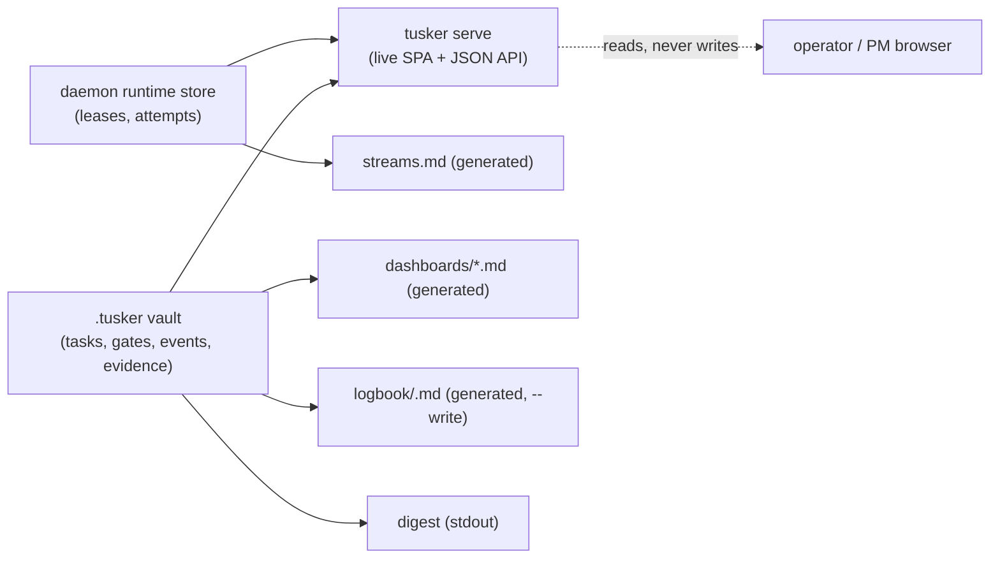

# The observation surface

Tusker has one write path (task contracts, proof, gates) and several **read**
surfaces that answer "what shipped, what does it mean, what needs me, and what is
the machine doing right now?" They fall into two families:

- **Live-served** — `tusker serve` renders a localhost SPA over a fresh snapshot
  of the vault + daemon runtime store. Nothing is written to disk.
- **Generated files** — projection commands write Markdown into `.tusker/`
  (dashboards, streams, logbook, digest) that a human or agent reads as flat
  files (also viewable in Obsidian). These are **generated; do not hand-edit.**

## `tusker serve` — the live control room

`tusker serve [--addr 127.0.0.1:7420] [--vault <path>]` serves an embedded SPA
plus a JSON API, **localhost-only**, over the repo-local vault and the daemon
runtime store. It is multi-project and attention-routed: needs-me first. Each
request loads a fresh project snapshot (`loadSnapshotForRequest`).

Representative API (`cmd/tusker/serve_command.go`, `serve_*.go`):

| Endpoint | Serves |
| --- | --- |
| `GET /api/daemon` · `POST /api/daemon/(start\|stop\|resume\|limits)` | Daemon state + controls. |
| `GET /api/projects` · `/api/summary` · `/api/needs` | Project list, roll-up, "what needs me". |
| `GET /api/runs` · `/api/runs/<task-id>` | Runtime runs / leases. |
| `POST /api/runs/<task-id>/redrive` | Requeue a stalled run (see guard below). |
| `GET /api/epics` · `/api/waves` · `POST /api/waves/<id>/land` | Epics, waves, wave landing. |
| `GET /api/tasks` · `/api/tasks/<id>` · `POST /api/tasks/<id>/(status\|discard\|close\|land)` | Task read + lifecycle actions. |
| `GET /api/gates` · `POST /api/gates/<id>/(satisfy\|waive\|obsolete)` | Human/proof gates. |
| `GET /api/evidence`, `/api/decisions`, `/api/feedback`, `/api/attempts`, `/api/docs`, `/api/roster` | Supporting records + docs. |
| `POST /api/review/batch` | Batch review action (wave-boundary review). |
| `GET /api/stream` | Live event stream. |

### Redrive with an idempotent guard

`POST /api/runs/:taskId/redrive` resets the attempt window and requeues so the
daemon spawns a fresh attempt — but it **refuses synchronously** when a redrive
is meaningless, instead of silently retiring the run behind a stale badge
(`serveRedriveRefusal`, `serve_runs.go`). Refusal cases:

- canonical status `review` → "no execution to redrive; use the review/land lane".
- canonical status `done`/`closed` → "nothing to retry".
- lease already `retry-queued` → already queued; wait or interrupt first.
- process group still alive → interrupt before redrive.

The response always carries a human-readable `reason` — a redrive is never
silent. On success it mirrors `tusker redrive` (`serveRedriveRun`) and records a
supervisor decision (`context_signal: operator_redrive_serve`).

## The SPA (`internal/serve/ui`)

Bun-only (no npm) · Vite · React 19 · TypeScript strict · TanStack Router /
Query / Table / Virtual · Tailwind v4 (CSS-first tokens) · self-hosted serif +
mono fonts · light + dark themes. Markdown/tiptap-friendly for rendering note
bodies. Built with `make ui-build` (`bun run build`) into `dist/`, which the Go
serve package embeds via `go:embed`. Layout: `src/routes` + `src/router.tsx`
shell, `src/features/<screen>` per screen, `src/components/ui` primitives,
`src/lib/api` the backend seam, `src/types/domain.ts` the API contract. See
`internal/serve/ui/README.md`, `FOUNDATION.md`, and `BACKEND-GAPS.md`.

## The stream board (`.tusker/dashboards/streams.md`)

Generated by `tusker streams` / `streams.go` from **runtime leases and
attempts** — a live picture of what each concurrency lane is doing. One row per
run, columns: Lane · Task · Runner · Worktree · Branch (with +ahead/-behind) ·
Owned paths · Heartbeat (with age) · Status · End state. Details:

- **Heartbeats** — freshness from last heartbeat/event/update; `fresh` shows the
  lease state (e.g. `live`), else `stale`/`released`.
- **Hand-run origin tags** — runs that originated from a human hand-run are
  flagged; status renders `… · hand-run` (`runHandRunOrigin`).
- **Landed lanes** — a released, succeeded run finished within 24h shows
  `landed` with its captured end-state (SHA, clean/dirty, gate verdicts, and any
  reported-vs-harness discrepancy count).

Header carries "Generated from runtime leases and attempts. Do not edit."

## Dashboards (`.tusker/dashboards/*.md`)

Generated projections written by `tusker dashboard build` (`v7_state_runtime.go`),
each attention-scoped and marked `tusker:generated`:

| File | Answers |
| --- | --- |
| `agent-ready.md` | Tasks a runnable agent can pick up now (Task · Priority · Next action). |
| `review-queue.md` | Work waiting on review (Task · Wave · Risk · Next action). |
| `human-actions.md` | What needs a human. |
| `active-runs.md` | Currently executing runs (from leases). |
| `ci-waiting.md` | Work blocked on CI. |
| `streams.md` | Lane board (above). |

## The logbook (`v7_logbook_cmd.go`)

`tusker logbook [--date YYYY-MM-DD] [--write]` composes a **PM-language** day
into three plain-language sections — **what shipped**, **what it means** (checks
passed/total, defects, repairs, evidence links), **what needs you**. It is a pure
projection over records Tusker already holds (events, tasks, gates, escalations,
evidence): no proof recomputation, no external calls. Days are **host-local**
(midnight in `time.Local`). Default prints to stdout; `--write` also writes
`.tusker/logbook/<date>.md`; `--json` emits the structured form.

## The digest (`v7_escalation_digest_cmd.go`)

`tusker digest` is the terse **dev/escalation cousin** of the logbook: a board of
what moved since a watermark plus open escalations, with stale-escalation bumps
applied. Where the logbook is narrative and PM-readable, the digest is a compact
operator/dev signal board. Marks a watermark by default; `--json` for structured.

## Surface map

| Surface | Audience | Lives at | Refresh |
| --- | --- | --- | --- |
| serve SPA + JSON API | PM + operator | `tusker serve` (localhost:7420) | Live snapshot per request. |
| streams board | operator | `.tusker/dashboards/streams.md` | Generated by `tusker streams`. |
| agent-ready / review-queue / human-actions / active-runs / ci-waiting | agent + human | `.tusker/dashboards/*.md` | Generated by `tusker dashboard build`. |
| logbook | PM | stdout / `.tusker/logbook/<date>.md` | `tusker logbook [--write]`, host-local day. |
| digest | dev / operator | stdout | `tusker digest`, watermark-based. |

Live vs generated at a glance:

Broader factory context: [../../.tusker/specs/software-factory.md](../../.tusker/specs/software-factory.md).
