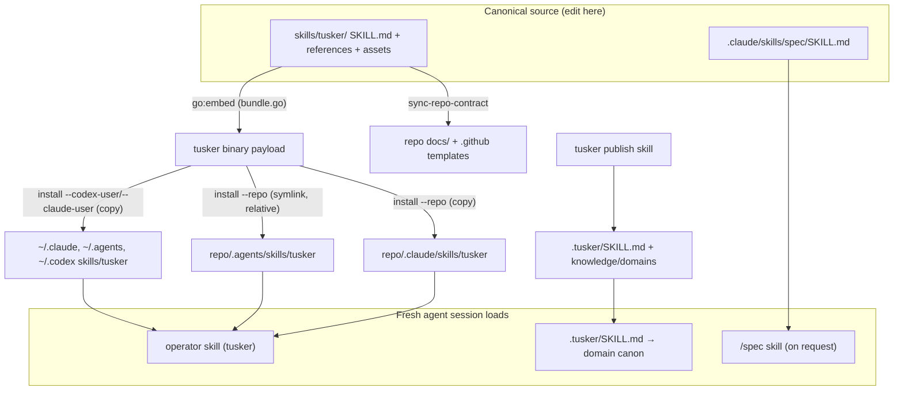

# The Tusker skill system

A "skill" is a folder of Markdown an agent loads on demand: one `SKILL.md`
front-door plus reference and asset files. Tusker ships **one canonical operator
skill** (`skills/tusker/`) and installs materialized copies or symlinks into the
places agents actually look — `~/.claude`, `~/.agents`/`~/.codex`, and a repo's
`.claude/` and `.agents/`. Everything an agent knows about running Tusker work
comes from that skill; everything it knows about *this* repo comes from a
separate generated project-knowledge skill at `.tusker/SKILL.md`.

The golden rule: **there is exactly one editable source per skill, and the
install targets are outputs. Never hand-edit a generated copy.**

## What ships in `skills/tusker/`

The canonical source tree (all under version control, all hand-edited here):

| Path | What it is |
| --- | --- |
| `SKILL.md` | A trigger-complete router: capability check, one-hop mode selection, universal authority boundaries, hard stop, compact loop. |
| `references/PLAN.md` | Planning, delivery review, held import, and Start. |
| `references/WORK.md` | Interactive/dispatched work, review, proof, gates, and human wait. |
| `references/OPERATE.md` | Resident daemon, automation, waves, integration, fleet repair, and recovery. |
| `references/<rare>.md` | Direct one-hop guides for onboarding, Xcode, documentation publication, and Obsidian. Legacy names are compatibility redirects, not active routes. |
| `assets/compatibility.yaml` | Machine-readable binary/workflow/factory/source/materialization compatibility contract. |
| `docs/*.md` | Orchestration runbook, failure classes, operator-intervention, dispatcher pseudocode. |
| `agents/openai.yaml` | Agent manifest for Codex-side registration. |
| `assets/templates/*.md` | Note templates (task, epic, gate, domain, daily, dashboard…). |
| `assets/repo-contract/` | The repo-contract tree copied into a target repo (see below). |
| `assets/snippets/*.snippet` | `AGENTS.md`/`CLAUDE.md` bootstrap-block snippets. |
| `assets/icons/`, `assets/gitignore.recommended` | Branding + recommended vault gitignore. |
| `bundle.go` | Embeds the whole tree (`go:embed`) so the binary can materialize it anywhere. |

The repo-contract asset tree is what a wired repo receives from
`tusker sync-repo-contract`:

- `assets/repo-contract/docs/agent-workflow.md`
- `assets/repo-contract/docs/ai-contribution-policy.md`
- `assets/repo-contract/AGENTS.workflow-snippet.md`

## How installation works

The binary embeds the skill (via `bundle.go` / `skillbundle.PayloadEntries`), so
`install`/`update` never need the source checkout to place a **copy**. Symlink
mode does need a canonical source (`--source` or `TUSKER_SKILL_SOURCE`, else the
repo root is discovered).

Key flags (`cmd/tusker/install.go`):

| Flag | Effect |
| --- | --- |
| `--codex-user` | Install `~/.agents/skills/tusker`. |
| `--claude-user` | Install `~/.claude/skills/tusker`. |
| `--repo <path>` | Install repo-local `<repo>/.agents/skills/tusker` **and** the generated `<repo>/.claude/skills/tusker` compatibility copy; also upserts `AGENTS.md`/`CLAUDE.md` Tusker pointers. |
| `--bin-dir <path>` | Where to symlink the `tusker` binary (default: first writable of `~/.local/bin`, `/opt/homebrew/bin`, `/usr/local/bin`). |
| `--no-bin` | Skip the binary symlink; refresh skills only. |
| `--skill-mode copy\|symlink` | Override the default install mode. |
| `--source <checkout>` | Canonical skill dir for symlink mode. |

**Default mode is context-dependent.** User-home destinations get a **copy**
(self-contained, portable). Repo-local destinations (`.agents`/`.claude` inside
the repo) default to **symlink**. Repo-local symlinks are written **relative**
(`skillSymlinkTarget`): an absolute target only resolves in the checkout that
wrote it and would point at a foreign tree in every git worktree or fresh clone,
so a relative target travels with the tree. Installs outside the source repo keep
the absolute target, since a relative path between unrelated trees is meaningless.

The binary symlink is replaced atomically (staged symlink + `rename`), and
refuses to clobber a release-installed binary whose source and target are the
same file.

### Make targets

| Target | Runs |
| --- | --- |
| `make install-user` | `tusker install --codex-user --claude-user --bin-dir … --force` — binary + both user skills. |
| `make install-repo REPO=/abs/path` | `tusker install --repo <REPO> --bin-dir … --force` — repo-local skills + pointers. |
| `make install-bin` | Binary + refresh already-installed user skills. |
| `make install` | `install-user` + the TuskerBar Mac app. |

Related commands: `tusker update` (refresh binary + existing user skills after a
pull/rebuild), `tusker skill sync` (refresh repo-local generated installs,
symlink-default), `tusker skill bundle` (portable materialized copy for handoff
packets / cloud runners that can't follow symlinks).

## Freshness and provenance

`assets/compatibility.yaml` owns workflow ranges, tracker/wave schemas, the
factory contract, canonical source, materialization schema, and primary guides.
`tusker capabilities --json` binds that contract to installed command/schema
support and the canonical payload with one deterministic compatibility
fingerprint. `SKILL.md` frontmatter intentionally contains only `name` and a
trigger-complete `description`.

Materialized copies and bundles carry `.tusker-skill-provenance.yaml`: it
records the compatibility and canonical-payload fingerprints, portable source
identity, and deterministic installed-payload fingerprint. Payload hashes
exclude the manifest and timestamps, avoiding recursive or machine-specific
hashes.

`tusker skill doctor --package <path> --json`, `tusker setup doctor`, and
`tusker delivery rollout doctor` report `current`, `stale`, `missing`,
`incompatible`, and `locally_modified` installs separately. Legacy frontmatter
metadata is classified as stale and is only a migration adapter. Repairs are
local and offline: `tusker skill sync --repo . --source
<canonical-tusker-checkout>`.
Symlinks are always inspected through their live target; no cached manifest can
make a retargeted symlink look stale. Sync replaces only the managed
`tusker` package destination and never rewrites project knowledge, repo
instructions, secrets, unrelated skills, or plugins.

## What a fresh session discovers

`.tusker/SKILL.md` is the **project-knowledge entry point** — a *generated* V7
project skill (`schema: tusker.project-skill/v7`) that routes an agent to this
repo's domain canon under `.tusker/knowledge/domains/*`. It is loaded *after* the
operator skill, only when repo-specific context is needed. The repo's root
`AGENTS.md`/`CLAUDE.md` carry a managed Tusker pointer block (upserted by install)
that names the operator skill and links to `.tusker/SKILL.md`.

## The repo-local `/spec` skill

`.claude/skills/spec/SKILL.md` is a **repo-local, canonical, hand-edited** skill
(not shipped from `skills/tusker`, not generated). It runs a grill-protocol spec
session: interview the operator one question at a time (recommendation-first;
look up facts, ask only decisions), then produce three-plus artifacts:

1. Canonical spec — `.tusker/specs/<subject>.md` (updated in place, PM-readable top half).
2. Decision log — `.tusker/specs/decisions/<date>-<subject>-grill.md`.
3. Canonical system docs stay true — `docs/system/*.md` updated when locked decisions change documented behavior.
4. Emitted work — `tusker new epic`/`new task` with real dependency edges and `spec_refs`.

See the broader factory context in [../../.tusker/specs/software-factory.md](../../.tusker/specs/software-factory.md).

## Source vs generated — the map

| Location | Source or generated | Edit here? |
| --- | --- | --- |
| `skills/tusker/**` | Canonical source | Yes — the one true copy. |
| `.claude/skills/spec/SKILL.md` | Canonical source (repo-local) | Yes. |
| `~/.claude/skills/tusker`, `~/.agents/skills/tusker`, `~/.codex/skills/tusker` | Generated (copy) | No — rerun install/update. |
| `<repo>/.agents/skills/tusker` | Generated (symlink→source, or copy) | No. |
| `<repo>/.claude/skills/tusker` | Generated (Claude-compat copy) | No. |
| `.tusker/SKILL.md` + `knowledge/domains/**` | Generated project skill | Via `tusker publish skill`, not by hand. |
| `.tusker/_generated/skill-bundle/**` | Generated portable bundle | No. |
| `<repo>/docs/agent-workflow.md`, `docs/ai-contribution-policy.md`, `.github/*` | Generated from repo-contract assets | No — edit the asset, resync. |

## Flow: canonical sources → install targets → fresh session

