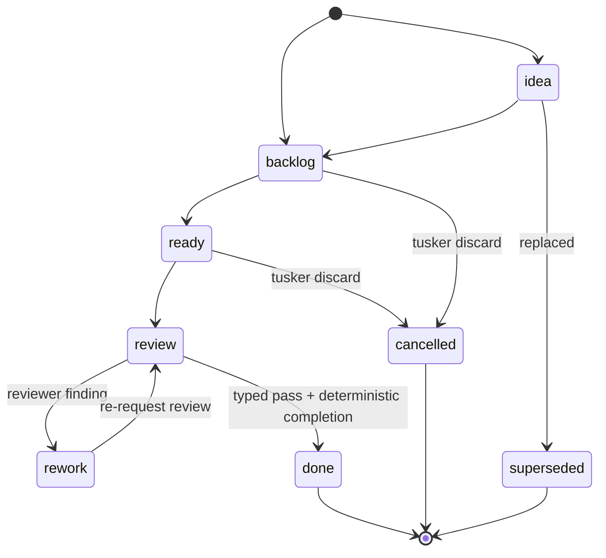

# Tasks and proof (v7 task model)

A Tusker task is a **contract**: one Markdown file with YAML frontmatter (the
machine-readable state) and a body (the human-readable agreement). The contract
says what "done" looks like, carries the proof that it was reached, and moves
through a fixed lifecycle whose transitions the CLI enforces. This page explains
the shape of a task, the fields that drive it, the lifecycle, and how proof
gets a task closed.

The task model exists to serve the factory principles in
[software-factory.md](../../.tusker/specs/software-factory.md): humans own
intent, agents own execution, and the validator is never the author.

The economics of the model are governed by [[gates-over-records]]: every
artifact here must either gate a decision (accept, land, review) or preserve a
human decision. Proof is the smallest row set covering acceptance — one command
row is a complete proof for a small task — and regenerable history (progress
logs, transcripts, narrative evidence) is deliberately not recorded.

## The two-layer body

Every task body leads with a **plain top layer** a former PM can read cold, then
carries an **implementer appendix** only workers open. The template is generated
by `v7TaskBody` in `cmd/tusker/commands_v7.go`:

| Section | Layer | Purpose |
|---|---|---|
| `# ID · Title` | top | Heading |
| `## Intent` | top | Plain sentences: what this is, why it matters, what "done" looks like — no file names, symbols, or commands |
| `## Acceptance` | top | Table of `ID / Outcome / Proof` — observable outcomes, one row per acceptance item |
| `## Non-goals` | top | What is deliberately out of scope |
| `## Implementation notes` | appendix | Builder detail: file map, moving parts, exact commands |
| `## Verification` | appendix | Table of proof rows; each Check starts with `command:` or `manual proof:` |
| `## Evidence` | appendix | Accepted / Pending evidence cards |
| `## Knowledge delta` | appendix | What was learned |

The heading `## Implementation notes` is the split point: everything above it is
the top layer the plain-language lint polices (see below).

## Frontmatter fields that matter

| Field | Meaning |
|---|---|
| `status` | Lifecycle state (see table below) |
| `readiness` | Promotion state; `ready` means promoted for work; `done` set at close |
| `risk` | `low` / `medium` / `high` / `critical` — drives default proof mode and close acceptor |
| `priority` | `p0`–`p3`; p0/p1 count as "demanding" |
| `proof_mode` | `none` / `inline` / `card` / `artifact` / `audit` (see proof modes) |
| `proof_required` | List of required proof kinds (e.g. `focused_test`, `broad_test`) |
| `proof_status` | `pending` / `satisfied` / `waived`; set to `satisfied` at close |
| `evidence_budget` | How many evidence cards the mode expects |
| `dependencies` | Task IDs that must close first (close is blocked otherwise) |
| `spec_refs` | Links back to spec sections; demanding tasks need one to go ready |
| `gates` / `blocks` | Human-gate wiring (see [gates.md](./gates.md)) |

Valid statuses and proof modes are defined in `internal/v7schema/schema.go`.

## Lifecycle

Statuses (`v7schema.TaskStatuses`): `idea`, `backlog`, `ready`, `review`,
`rework`, `done`, `cancelled`, `superseded`. Transitions run through
`statusV7Cmd`, `closeV7Cmd`, and `discardV7Cmd` in
`cmd/tusker/v7_control_cmd.go`. Two moves are **not** allowed via plain status:
`done` (must use `tusker close`) and `cancelled` (must use `tusker discard`), so
close policy and discard handling are never bypassed.

| Status | Meaning |
|---|---|
| `idea` | Raw, unrefined; not yet committed backlog |
| `backlog` | Accepted work, not yet promoted for execution |
| `ready` | Promoted and pickable; contract must be clean (spec link, plain top layer) |
| `review` | Work submitted; awaiting a typed verdict and deterministic completion |
| `rework` | Bounced back to the implementer after a reviewer finding |
| `done` | Materialized by deterministic completion, or explicit human recovery close; terminal |
| `cancelled` | Discarded via `tusker discard`; terminal |
| `superseded` | Replaced by another task; terminal |

Moving to `review` is refused if the acceptance table still holds placeholder
stub items and no explicit waiver is recorded (`statusV7Cmd`).

## Proof

Proof is how a task earns its close. It lives in the `## Verification` table
(inline rows) plus evidence cards, and is summarized by
`computeV7ProofReport`.

### Proof modes

Defaults come from `defaultV7ProofMode`/`defaultV7ProofRequired`/
`defaultV7EvidenceBudget` in `cmd/tusker/v7_proof_cmd.go`. `critical` risk
defaults to `audit`; everything else defaults to `inline`. Set explicitly with
`tusker proof set-mode <id> <mode>`.

| Mode | Evidence-bearing? | Default `proof_required` | Evidence budget |
|---|---|---|---|
| `none` | No | (none) | 0 |
| `inline` | No — verification rows only | `focused_test`, `broad_test` | 0 |
| `card` | Yes | `focused_test`, `broad_test` | 1 |
| `artifact` | Yes | `build`, `manual_smoke`, `screenshot` | 3 |
| `audit` | Yes | `focused_test`, `broad_test`, `independent_review` | 5 |

`inline` proves itself with verification rows in the task body; `card`,
`artifact`, and `audit` additionally require evidence cards (screenshots,
benchmarks, review records) — the artifact-first acceptance the factory spec
calls for.

### Verification rows

Add rows with `tusker verify add <id> --covers A1 --check "command: …" --result …`
(`verifyV7AddCmd`). Valid results (`v7VerificationResults`): `pass`, `fail`,
`blocked`, `skipped`, `waived` (`pending` is the placeholder and is rejected on
add). Each Check must start with `command:` or `manual proof:`. A `blocked`
result requires `--blocked-by <path-or-task>` — `blocked` is a legitimate
external-wait state, not a rejection.

### Close policy by risk

`internal/v7policy/close.go` sets the required acceptor. The default acceptor is
`reviewer_agent`, which `AcceptorAllowed` clears for any actor prefixed
`reviewer:` or `human:` (a `human:` acceptor always satisfies `reviewer_agent`).
Set `required_acceptor: human` for a risk tier in `tusker.yaml` to demand a
`human:` acceptor. `closeV7Cmd` enforces, in order: status is `review`; no open
blocking gate blocks the task; no unfinished dependency; required evidence
present; risk-policy acceptor/evidence/gates (`enforceV7ClosePolicy`);
acceptance/proof complete (`enforceV7AcceptanceClose`). Only then is status set
to `done`, `proof_status` to `satisfied`, and the acceptor recorded.

### One-step accept

`tusker accept <id> --by reviewer:name` (`cmd/tusker/accept_cmd.go`) is the
reviewer's single move for work whose proof is already green: it confirms proof
(never re-runs or re-judges it), moves `review`, then `close`. It **refuses**
when:

- any proof row is non-green (`v7ProofGreenForAccept`), leaving the task open
  with a named reason;
- `--by` is missing or not namespaced `reviewer:`/`human:` (`v7RequireAcceptor`);
- the current status is terminal (`done`/`cancelled`/`superseded`), or any close
  precondition fails — all checked in `v7AcceptPreflight` **before** any write,
  so a refusal never strands the task.

### Reviewer findings auto-return

When a reviewer marks a `## Verification` row `fail` with the current review
attempt's marker (`tusker-review:<attemptID>` in the Notes cell),
`reviewerFindingFromTask` (`cmd/tusker/reviewer_finding.go`) picks it up and
`returnReviewerFindingToImplementer` bounces the task to `rework` with the
finding pasted under a generated `## Reviewer findings` section. Round-gating:
only rows carrying the **current** attempt's marker bounce work, so a stale fail
row from an earlier round is ignored; `blocked` rows never bounce. The write is
crash-safe (finding committed first, status flipped second) and idempotent (a
re-detected finding on a task already in `rework` is a no-op).

### Plain-language lint

`lintV7PlainTopLayer` (`cmd/tusker/v7_plain_top_layer_lint.go`) scans the top
layer (above `## Implementation notes`) for code words — dotted filenames, slash
paths, backticked spans, and genuine camel/Pascal identifiers. Table rows and
fenced code are exempt. It **warns** by default, but **errors** (blocking
promotion) when the task is *demanding* (p0/p1 priority or medium+ risk) and
`readiness` is `ready`. This keeps the PM-readable promise before a hard task
moves forward.
