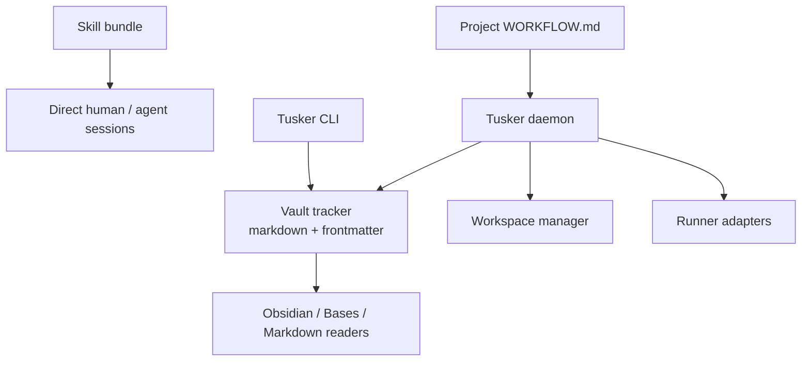

# Spec 00: Product Shape And Operating Modes

## Purpose

Define what Tusker is before the implementation specs start fanning out.

Without this, people will keep talking past each other:

- one person means "a markdown tracker"
- another means "a Symphony-style daemon"
- another means "a reusable skill for direct agent sessions"

That confusion will waste weeks.

## Hard Position

Tusker should be **one binary with three operating modes**, not two products and not one mandatory daemon.

The modes are:

1. `skill` mode
   Human or agent uses the installed Tusker skill directly. No daemon required.
2. `tracker` mode
   The Go CLI manages a vault-backed markdown tracker. Still no daemon required.
3. `orchestration` mode
   The daemon, `WORKFLOW.md`, isolated workspaces, and runner adapters are enabled on top of the same tracker.

## Why One Binary

Two binaries sounds clean until it turns into dumb operational drift.

| Option | Good | Bad |
|---|---|---|
| One binary, multiple modes | One install, one version, one mental model, shared schema | Requires discipline in CLI/package boundaries |
| Two binaries | Cleaner branding on paper | Version skew, duplicate install surface, duplicated config, duplicated docs, duplicated bugs |

Tusker is one system with optional subsystems.

Do not fork it into:

- `tusker-track`
- `tusker-orchestrator`

That split is premature and mostly aesthetic.

## What Tusker Actually Is



The stack has four layers:

| Layer | Required? | Purpose |
|---|---:|---|
| Skill bundle | Optional | Reusable guidance for humans and direct agent sessions |
| Vault tracker | Yes | Canonical durable task data |
| CLI | Yes | Human and script control plane |
| Daemon/orchestration | Optional | Background polling, dispatch, retries, resume, runner lifecycle |

The vault tracker is the center. Everything else hangs off it.

## SQLite Scope

SQLite is optional for Tusker as a product and mandatory for orchestration as an implementation detail.

| Mode | SQLite required? | Why |
|---|---:|---|
| Skill-only | no | no long-running runtime state exists |
| Tracker CLI | no | markdown is enough for durable tracker operations |
| Orchestration | yes | daemon needs crash-proof runtime memory |

Important:

- users should not have to "set up a database" for tracker mode
- daemon mode should create `daemon.db` automatically when first needed
- `daemon.db` lives in the daemon state root, not in the project repo

## Product Principles

- Tracker-first, orchestration-second.
- Markdown is canonical for durable task content and review evidence.
- Runtime process state does **not** belong in markdown.
- Obsidian is the first-class UI, not the only possible UI.
- The skill bundle and `WORKFLOW.md` are separate artifacts with separate jobs.
- Orchestration must be opt-in at the project level.
- Tusker optimizes for trustworthy unattended throughput, not raw agent throughput.
- Every advertised orchestration capability must be enforced or removed from the surface. A fake workspace, ignored cap, or decorative workflow prompt is worse than no feature.

## Source-Of-Truth Split

The design canon now lives in [08-symphony-alignment-and-orchestration-roadmap.md](/developer/specs/08-symphony-alignment-and-orchestration-roadmap/). The short version:

| Concern | Owner |
|---|---|
| Task intent, acceptance criteria, evidence, durable human state | markdown note |
| Leases, attempts, turns, sessions, retry timers, failure class | SQLite runtime store |
| Project runtime policy | `WORKFLOW.md` frontmatter |
| Project-specific agent behavior | `WORKFLOW.md` body |
| Reusable agent norms | skill bundle |
| Human reading and review | Obsidian first |

## Beads Vs Tusker

Beads is excellent at machine-friendly structured tracking. Its own README describes it as a distributed graph issue tracker for AI agents with JSON output, dependency tracking, and hash-based IDs, backed by Dolt. That is powerful, but it is not a human-friendly review surface in the way a markdown vault is. Source: [Beads README](https://github.com/gastownhall/beads/blob/main/README.md).

Tusker should not try to become "Beads, but in markdown". That path ends in a fake database with bad concurrency semantics.

The honest product stance is:

| Concern | Beads-style strength | Tusker strength |
|---|---|---|
| Machine structure | Better | Good enough with schema discipline |
| Concurrency/atomicity | Better | Worse in markdown, must be compensated elsewhere |
| Human readability | Worse | Better |
| Rich review packets, demos, acceptance criteria | Worse | Better |
| Obsidian-native workflows | No | Yes |

So Tusker should win on:

- human readability
- shared human/agent task context
- review evidence
- markdown-native workflows

And it should compensate for markdown's weaknesses with:

- immutable `record_id`
- explicit schema
- daemon-side runtime state
- a workspace manager
- a runner/session layer

## Operating Modes

### Mode 1: Skill-Only

Use case:

- someone is talking to Codex or Claude directly
- they want the agent to create or update vault items correctly
- they do not want a background process

Requirements:

- installed skill bundle
- vault conventions

Not required:

- `WORKFLOW.md`
- daemon
- project registration

### Mode 2: Tracker CLI

Use case:

- teams want a strong markdown task tracker
- they want creation, indexing, state transitions, evidence, and views
- they do not want unattended orchestration

Requirements:

- vault
- Tusker CLI

Optional:

- skill bundle

Not required:

- daemon
- runner adapters
- workspace manager

### Mode 3: Orchestration

Use case:

- teams want background polling and dispatch
- tickets should be picked up automatically
- runners should resume, retry, and react to review/rework

Requirements:

- everything in tracker mode
- `WORKFLOW.md`
- daemon
- SQLite runtime store
- project registration
- workspace manager
- runner adapters

This mode is an overlay, not a separate product.

## CLI Shape

Tracker mode commands stay simple:

```text
tusker init
tusker create
tusker list
tusker show
tusker move
tusker pickup
tusker release
tusker reindex
```

Orchestration commands are explicitly separate:

```text
tusker workflow init
tusker project register
tusker project enable-orchestration
tusker project disable-orchestration
tusker daemon install
tusker daemon start
tusker daemon stop
tusker daemon status
tusker runs
```

That split matters. The user should never feel like they accidentally bought a daemon when they just wanted a tracker.

## Config Ownership

| Concern | Owner |
|---|---|
| Tracker schema and note shape | Vault tracker spec |
| Project runtime policy | `WORKFLOW.md` |
| Global machine state | daemon registry/state directory |
| Reusable agent guidance | skill bundle |

Do not let `_system/config.yaml` continue as an unowned junk drawer.

## Non-Negotiables

- A project can use Tusker with no daemon at all.
- A project can later opt into orchestration without changing tracker format.
- The same ticket files must work in both modes.
- The daemon must never be required for reading or editing tracker data.
- The daemon must never treat markdown files as its live process database.

## Build Order Impact

This spec changes implementation order slightly:

1. tracker model
2. tracker CLI cleanup
3. project `WORKFLOW.md`
4. daemon/registry
5. workspace manager
6. runner/session
7. retry/reconcile polish

The product needs to be useful before the daemon exists.

## Implementation Boundary

Inside the Go codebase, keep this split:

| Package area | Responsibility |
|---|---|
| tracker | parse, validate, load, write vault items |
| cli | user-facing commands |
| workflow | load and validate `WORKFLOW.md` |
| daemon | background scheduling and control plane |
| workspace | isolated per-item working copies |
| runner | Codex/Claude adapters and session normalization |

If those boundaries get blurred, the codebase will get ugly fast.
