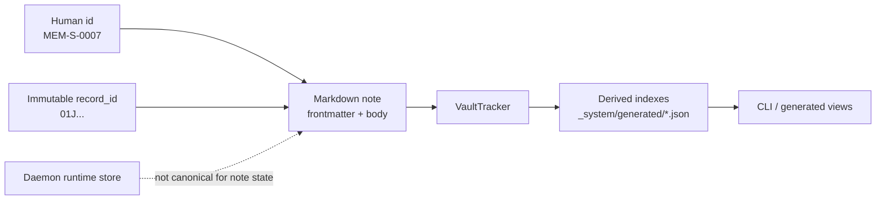

# Spec 01: VaultTracker

Status: Draft

## Decision

Tusker treats the vault as the canonical store for durable task intent, review context, evidence, and human-readable work state.

That does **not** mean the vault stores daemon leases, session heartbeats, retry timers, or in-flight runner state. Those live in the daemon runtime store defined in [03-daemon-and-registry.md](/developer/specs/03-daemon-and-registry/).

This spec owns the canonical note schema and the canonical durable state machine.

## Goals

- Keep Tusker markdown-first and Obsidian-native.
- Make note identity stable across `move`, epic renames, and human ID cleanup.
- Keep filenames and wikilinks human-readable.
- Define one durable state model that both tracker-only mode and orchestration mode use.
- Enforce writer semantics now, before the daemon exists.

## Non-Goals

- No external tracker mirror.
- No daemon lease, heartbeat, PID, session, or retry timer fields in frontmatter.
- No replacement of wikilinks with opaque IDs in note bodies.
- No custom per-project tracker schema forks.
- No pretending markdown can be a safe in-flight runtime database.

## Writer Model

Tusker has three possible writers:

1. humans in Obsidian or a text editor
2. Tusker CLI commands
3. the daemon, but only for durable tracker transitions

Writer rules:

| Rule | Why |
|---|---|
| Generated indexes are caches only | avoid split-brain state |
| Daemon may write only durable note fields defined here | prevents runtime-state leakage into markdown |
| Every mutating write must use optimistic concurrency | avoids clobbering human edits |
| A failed optimistic write must reload, re-evaluate, and retry or abort | no blind overwrite |

Minimum optimistic-concurrency contract:

- read note
- capture content hash or mtime + size
- compute mutation
- write only if the file is unchanged
- if changed, reload and re-run validation before writing again

If Tusker skips this, tracker-first mode will rot the minute orchestration starts.

## Model



## Domain Model

| Entity | Canonical form | Identity | Canonical path |
|---|---|---|---|
| Vault record | managed markdown note | `record_id` | n/a |
| Epic | `type: epic` | `record_id`, `id` | `epics/<EPIC-ID>/index.md` |
| Story | `type: story` | `record_id`, `id` | `epics/<EPIC-ID>/<ID>.md` |
| Bug | `type: bug` | `record_id`, `id` | `epics/<EPIC-ID>/<ID>.md` |
| Doc | `type: doc` | `record_id`, `id` | `epics/<EPIC-ID>/<ID>.md` |

## Identity Rules

### `record_id`

- format: ULID
- scope: vault-wide
- mutability: never changes

### `id`

- human-facing handle
- unique vault-wide among managed notes
- may change on move/rename
- filenames and folder placement derive from `id`, not `record_id`

## Canonical Durable State Machine

This section is the source of truth for tracker state. Other specs may reference it. They do not get to redefine it.

### Story and Bug `status`

| Status | Meaning |
|---|---|
| `intake` | captured, not ready for active execution |
| `active` | approved and being worked, by a human or by orchestration |
| `blocked` | cannot progress due to a real blocker |
| `in_review` | work completed for this revision and awaiting review or attestation |
| `rework` | reviewer requested more work; next execution should start from review feedback |
| `merging` | approved and in landing/merge flow |
| `done` | complete and accepted |
| `cancelled` | intentionally abandoned |

### Story and Bug `review_state`

| Value | Meaning |
|---|---|
| `none` | no open review round |
| `verification_requested` | worker pass finished; verifier must truth-check evidence before human review |
| `requested` | latest revision was verified and is awaiting human review |
| `changes_requested` | reviewer requested rework |
| `approved` | reviewer approved the latest revision |

### Epic `status`

`intake`, `active`, `blocked`, `done`, `cancelled`

### Doc `status`

`draft`, `review`, `approved`, `published`, `archived`

## State Invariants

| Invariant | Rule |
|---|---|
| `done` requires attestation/signoff gates | current Tusker review discipline stays intact |
| `status=done` implies `review_state=approved` for story/bug | done without review is nonsense |
| `status=rework` implies `review_state=changes_requested` | keep review intent explicit |
| `status=in_review` implies `review_state=verification_requested`, `requested`, or `approved` | verification and human review are distinct gates |
| `status=cancelled` is terminal | no silent reuse of cancelled work |

## Frontmatter v2

### Common required fields

| Field | Type | Required | Meaning |
|---|---|---|---|
| `schema_version` | integer | yes | starts at `2` |
| `record_id` | string | yes | immutable primary key |
| `id` | string | yes | human-facing identifier |
| `title` | string | yes | display title |
| `type` | string | yes | `epic`, `story`, `bug`, `doc` |
| `status` | string | yes | durable lifecycle state from this spec |

### Story and bug durable fields

| Field | Type | Required | Meaning |
|---|---|---|---|
| `review_state` | string | yes | `none`, `verification_requested`, `requested`, `changes_requested`, `approved` |
| `work_revision` | integer | yes | increments on human-requested rework or material scope reset |
| `review_requested_at` | RFC3339 string | no | when current review round opened |
| `reviewed_by` | string | no | latest reviewer |
| `reviewed_at` | RFC3339 string | no | latest review verdict time |

### Explicitly non-canonical legacy runtime fields

These fields are legacy and must be removed from canonical notes during migration:

- `dispatch_state`
- `claimed_by`
- `claimed_at`
- `run_attempts`
- `last_attempt_at`
- `failure_class`

### Relation mirrors

Human-friendly links remain. Immutable mirrors are added so the CLI and daemon can resolve stable references.

| Relation | Human field | Immutable field |
|---|---|---|
| work item -> epic | `epic` | `epic_record_id` |
| doc -> story | `story` | `story_record_id` |
| epic -> docs | `docs` | `docs_record_ids` |
| work item -> related | `related` | `related_record_ids` |
| work item -> blocks | `blocks` | `blocks_record_ids` |
| work item -> blocked_by | `blocked_by` | `blocked_by_record_ids` |

## Example Story Frontmatter

```yaml
---
schema_version: 2
record_id: "01JVF1A9R6W8KK7F9N2GG6B7PX"
id: "MEM-S-0007"
title: "Add conflict-aware merge path"
type: "story"
status: "intake"
review_state: "none"
work_revision: 0
epic: "[[MEM]]"
epic_record_id: "01JVF17X3FKB3QQPXX4DJJ2N9N"
related:
  - "[[MEM-S-0002]]"
related_record_ids:
  - "01JVF1BMTW2VEGK55Y8Z3QMN4T"
---
```

## Path Rules

| Type | Canonical path rule |
|---|---|
| epic | `epics/<id>/index.md` |
| story | `epics/<epic.id>/<id>.md` |
| bug | `epics/<epic.id>/<id>.md` |
| doc | `epics/<epic.id>/<id>.md` |

Hard rules:

- `record_id` never appears in filenames
- path mismatches are based on human IDs
- epic rename or story move changes paths and `id`, never `record_id`

## Derived Indexes

Current generated indexes stay derived-only. They must include `record_id`.

Required outputs:

- `_system/generated/epics.index.json`
- `_system/generated/stories.index.json`
- `_system/generated/bugs.index.json`
- `_system/generated/docs.index.json`
- `_system/generated/links.index.json`
- `_system/generated/dashboard.json`
- `_system/generated/records.index.json`

## Tracker Invariants

| Invariant | Why |
|---|---|
| every managed note has `schema_version: 2` and `record_id` | stable identity |
| `record_id` is unique vault-wide | no ambiguous lookups |
| `id` is unique vault-wide among managed notes | Obsidian links stay sane |
| relation human field and `_record_id` mirror resolve to same target | prevent split-brain links |
| generated indexes are caches only | markdown stays canon |
| no canonical note contains live daemon runtime fields | enforce tracker/runtime separation |

## Migration From Current Tusker / Rznapp-Style Vaults

This migration targets the vault shape Tusker already ships today:

- `epics/`
- `_system/generated/`
- current templates under [`skill/assets/templates`](/Users/sarav/Downloads/tusker/skill/assets/templates)
- current frontmatter using `dispatch_state`, `claimed_*`, `run_attempts`, and `failure_class`

### Migration command

Introduce:

```text
tusker migrate-schema --vault <path>
```

### Migration steps

1. scan every managed note
2. add:
   - `schema_version: 2`
   - `record_id`
   - `review_state: none` for story/bug where missing
   - `work_revision: 0` for story/bug where missing
   - immutable relation mirrors
3. preserve existing human `status` values and validate them against the new state set
4. export legacy runtime fields into the daemon runtime store if orchestration is enabled, or into a migration log if it is not
5. remove legacy runtime fields from rewritten frontmatter
6. rebuild indexes with `record_id` everywhere

### Compatibility rules

- read path: v1 notes remain readable during migration
- write path: any note touched by a mutating command is rewritten as v2
- lookup path: CLI commands must accept either `id` or `record_id`
- move path: `move` preserves `record_id` and rewrites only mutable human-facing references

## Concrete Implementation Notes

| Area | File(s) | Required change |
|---|---|---|
| Note creation | `cmd/tusker/commands_create.go` | generate `record_id`, set `schema_version: 2`, initialize `review_state` and `work_revision` |
| Validation | `cmd/tusker/schema.go` | enforce new durable state invariants and reject legacy runtime fields in v2 notes |
| Frontmatter ordering | `cmd/tusker/schema.go`, `cmd/tusker/frontmatter.go` | keep identity and durable state fields near the top |
| Lookup helpers | `cmd/tusker/notes.go` | resolve by `record_id` or `id` |
| Reindexing | `cmd/tusker/commands_index.go` | emit `record_id` in all indexes; add `records.index.json` |
| Move/rename | `cmd/tusker/commands_index.go` | preserve `record_id` while rewriting human references |
| Templates | `skill/assets/templates/*.md` | ship v2 tracker fields, remove legacy runtime fields |
| Tests | `cmd/tusker/smoke_test.go` | cover migration, optimistic-write conflicts, and identity-preserving moves |

## Rejected Alternatives

| Alternative | Why rejected |
|---|---|
| use `id` as the only key forever | breaks on legitimate rename/move |
| put relations only in generated JSON | makes markdown lie |
| store daemon leases in frontmatter | invites write races and stale runtime junk |
| mirror the whole tracker into a hidden DB | wrong center of gravity for Tusker |
