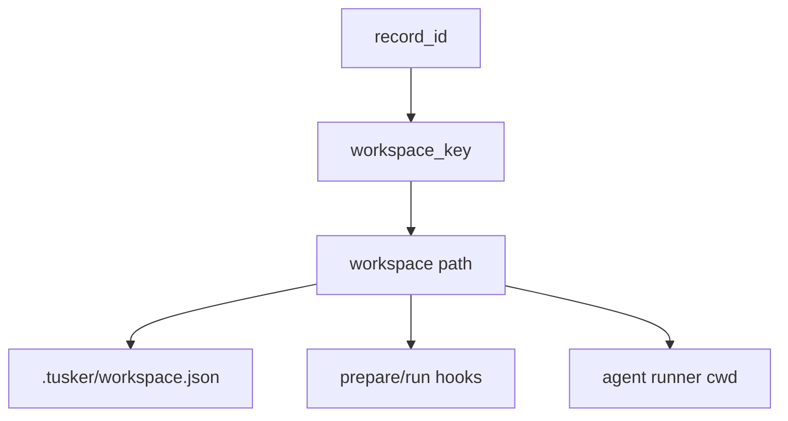

# Spec 04: Workspace Manager

## Purpose

Define deterministic isolated workspaces for daemon-run agent sessions.

This is how Tusker stops one ticket from trashing another.

## Goals

- one isolated workspace per dispatchable item
- deterministic path derivation
- safe reuse across retries and continuations
- configurable preparation and cleanup hooks
- strict cwd and root containment rules

## Non-Goals

- making the main repo checkout itself the execution workspace
- hidden destructive resets on every retry
- requiring Git worktrees for every project

## Workspace Identity

Workspace identity is derived from:

- `project_id`
- `record_id`

Not from mutable human `id`.

### Workspace Key

```text
workspace_key = sanitize(record_id)
```

### Default Path

```text
<state-root>/workspaces/<project_key>/<workspace_key>
```

## Metadata File

Every workspace contains:

```text
.tusker/workspace.json
```

Fields:

| Field | Meaning |
|---|---|
| `project_id` | owning project |
| `record_id` | immutable item identity |
| `item_id` | latest human ID |
| `created_at` | creation timestamp |
| `updated_at` | latest use timestamp |
| `strategy` | `worktree`, `clone`, or `copy` |
| `base_revision` | source revision used for prepare |
| `branch` | active workspace branch |
| `last_session_ref` | latest runner session ref |

## Strategies

### `worktree`

Preferred when the project is a Git repo and the host supports safe worktree use.

Behavior:

- create one worktree per `record_id`
- branch name derived from item ID plus short record suffix
- update metadata after prepare

### `clone`

Use when worktrees are unavailable or intentionally disabled.

Behavior:

- clone repo into workspace root
- preserve clone across retries

### `copy`

Fallback only.

Use for non-Git or weird repositories.

## Lifecycle

### Prepare

1. derive workspace path
2. ensure root containment
3. create or reuse workspace
4. run `after_create` if newly created
5. run project bootstrap / sync logic
6. run `before_run`

### Reuse

Reuse is allowed when:

- same `record_id`
- workspace metadata matches project
- previous run did not mark workspace invalid

### Reset On Rework

If `workspace.reuse_policy == reset_on_rework` and human state becomes `rework`:

- create a fresh branch from latest default branch
- discard prior item-specific branch state
- preserve prior workspace only for inspection until cleanup

This avoids carrying broken or rejected branch state indefinitely.

### Cleanup

Cleanup should happen when:

- item reaches terminal human state and retention window expires
- project is unregistered
- workspace is explicitly reset by operator

Terminal cleanup is not required immediately on `done`. Keeping the workspace for a short retention window is useful.

## Hooks

Hooks come from `WORKFLOW.md`.

Supported hooks:

- `after_create`
- `before_run`
- `after_run`
- `before_remove`

Rules:

- run inside workspace cwd
- enforce timeout
- log start/failure/timeout
- `after_create` and `before_run` are fatal
- `after_run` and `before_remove` are best-effort

## Safety Invariants

1. workspace path must live under configured workspace root
2. runner cwd must equal workspace path
3. workspace key must be sanitized
4. item execution must never happen in the registration repo root
5. workspace manager must not delete paths it did not create/manage

These are not defense-in-depth niceties. They are product correctness. If the daemon prepares a workspace and then launches the runner in the repo root, orchestration is lying about isolation.

Runner launch requirements:

| Value | Rule |
|---|---|
| `cwd` | exactly the prepared workspace path |
| repo root | metadata/env/tool argument only |
| workspace path | must have `<state-root>/workspaces/<project_key>/` prefix |
| metadata | `.tusker/workspace.json` must match `project_id` and `record_id` before reuse |
| cleanup | delete only paths with valid Tusker workspace metadata |

## Resume and Retry Semantics

### Continuation Retry

When the same attempt is being continued after a clean stop:

- reuse workspace
- reuse branch
- reuse metadata

### Failure Retry

When retrying after transient runner failure:

- reuse workspace by default
- preserve branch and local file state
- increment attempt metadata

### Human Rework

When a human changes the item to `rework`:

- if workflow says `reuse`, keep workspace and branch
- if workflow says `reset_on_rework`, create a fresh branch context

## Suggested Internal Types

| Type | Meaning |
|---|---|
| `WorkspaceRef` | stable handle for path and metadata |
| `PrepareResult` | workspace path, created flag, branch, base revision |
| `WorkspaceStrategy` | strategy enum and per-strategy config |

## Go Package and File Plan

Recommended additions under `cmd/tusker/`:

| File | Responsibility |
|---|---|
| `workspace.go` | public workspace manager API |
| `workspace_git.go` | worktree/clone implementation |
| `workspace_hooks.go` | hook execution |
| `workspace_metadata.go` | `.tusker/workspace.json` load/save |
| `workspace_test.go` | containment, reuse, cleanup tests |

Existing files affected:

| File | Change |
|---|---|
| `config.go` | move workspace policy ownership under `WORKFLOW.md` contract |
| `commands_lifecycle.go` | stop pretending release semantics alone are orchestration |

## Diagram


