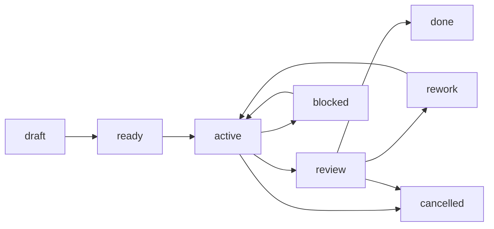

# 06 - Verification, Rework, And Close

V5 uses a simple lifecycle:



## Review

`review` means implementation is ready to verify. A worker or runtime path may move a task to `review` only after meaningful evidence exists.

If `WORKFLOW.md` enables the reviewer lane, `review` can also dispatch one independent agent-review run for the current handoff. That run stays in runtime state as lane `review`; it does not add another task status.

Default reviewer policy:

| Risk | Reviewer behavior |
|---|---|
| `low`, `medium` | agent reviewer may verify and close when all gates pass |
| `high`, `critical` | agent reviewer may advise only; human verification and close are required |

## Verify

`tusker verify <TASK-ID> --by <name>` records:

- `verified_by`
- `verified_at`
- a `Verification log` row

Verification does not close the task.

The configured reviewer actor is blocked from verifying human-required risk tiers.

## Rework

If verification fails, move the task back through:

```bash
tusker status <TASK-ID> rework --reason "what failed"
```

The task returns to `active` when the next pass begins.

## Close

`tusker close <TASK-ID> --by <name>` is the only normal path to `done`.

Close requires:

- task status is `review`
- verification exists
- every `doc_node` is applied, verified no-op, or waived

Close records `closed_by`; the reviewer is `verified_by`. CLI output and the task work log should make both visible.

## Retry

Retry is runtime behavior, not a public lifecycle command. Durable truth remains the task status and work log.
