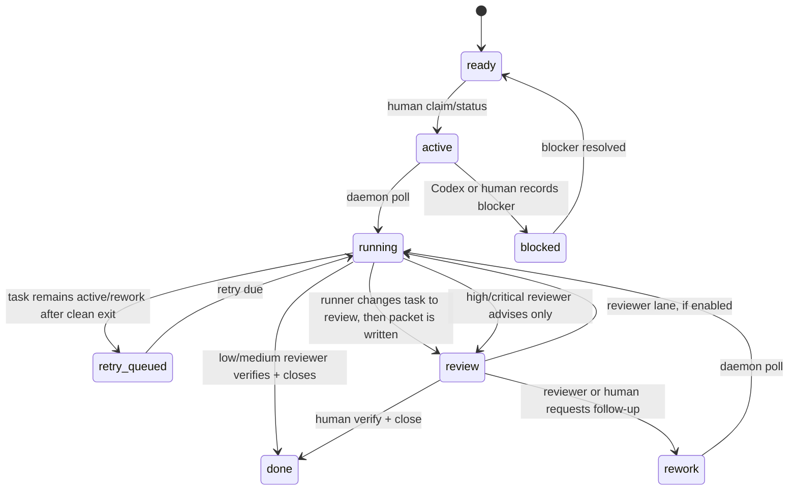

# Runtime state, events, and generated caches

## Scope

Tusker V5 keeps task truth in markdown and runtime truth outside markdown. The current live runner focus is Codex, but the orchestration model is runner-neutral: register a repo/vault, run one daemon tick or the long-lived daemon, and inspect runtime evidence without putting leases or transcripts into task frontmatter.

## State boundary

| State | Location | Examples |
|---|---|---|
| Task truth | task markdown frontmatter/body | `status`, `assignee`, `blocked_by`, `block_reason`, capsule, acceptance, evidence, verification and close summaries |
| Runtime truth | default state root SQLite/files | projects, run leases, attempts, turns, sessions, supervisor decisions, prompt packets, raw logs, event JSONL, status JSON |
| Dashboard snapshot | `tusker/_system/generated/dashboard.json` and `Dashboard.md` generated blocks | counts, stale docs, live-run rows for the registered project |

Do not mirror runtime leases, process ids, session refs, retry timers, token totals, or raw transcript state into task frontmatter.

## Dispatch model

`WORKFLOW.md` defines the runnable tracker states:

```yaml
tracker:
  active_states:
    - active
    - rework
  review_states:
    - review
```

The daemon polling code uses those states. `ready` is intentionally not runnable; it means shaped work that a human or agent may claim. `blocked`, `review`, `done`, and `cancelled` are not dispatch states.

There is one exception: when `reviewer.enabled` is true, `review` can dispatch a separate reviewer lane. That lane is not implementation work and does not add a task status. It uses runtime lane metadata (`execute` vs `review`) so the daemon can run an independent reviewer once for the current review handoff without looping.

Additional conservative gates:

| Gate | Behavior |
|---|---|
| unresolved `blocked_by` | dispatch is skipped and the run row records the blocker reason |
| `risk: critical` | automatic dispatch is blocked |
| state leaves `active`/`rework` while running without completed runner status | the run is released/interrupted rather than continuing against stale tracker truth |
| completed clean run with task in `review` | the daemon reconciles success and writes a review packet |
| clean runner exit while status remains `active`/`rework` | continuation is queued instead of promoting the task |
| reviewer lane for `risk: low`/`medium` | reviewer may run `verify` and `close` if all gates pass |
| reviewer lane for `risk: high`/`critical` | reviewer may advise only; human verification and close are required |

## Current lifecycle



The daemon does not blindly move active tasks to review. The runner prompt asks the selected agent to move the task to `review` when ready. If the task is still `active` or `rework` after a clean exit, the daemon queues continuation. If the runner moves the task to `review` and exits cleanly, the daemon writes the review packet and releases the implementation run as succeeded.

If reviewer policy is enabled, the next poll can start a distinct `review` lane. The reviewer prompt is read from `WORKFLOW.md` frontmatter, uses the configured reviewer actor, and tells the agent to review without editing implementation files. Low/medium tasks may be verified and closed by the configured reviewer. High/critical tasks stay in `review` for a human even when the agent recommends acceptance.

## Runtime records

| Record | Purpose |
|---|---|
| registered project | repo root, vault root, workflow path, enabled flag, health, last poll/error |
| run | current lease state, lane, attempt outcome, active attempt, workspace, session, pid, artifact paths, work revision, retry/error timestamps |
| attempt | immutable-ish execution attempt snapshot with lane, outcome, exit code, artifact paths, pid, start/finish |
| turn | normalized runner turn status, session, token usage, last event/error |
| session | runner session ref, resumability, workspace, revision, current item, last seen/error |
| supervisor decision | continuation/resume/fork/new-revision/stop decisions with reasons and context signals |

Known lease states: `unclaimed`, `claimed`, `running`, `retry_queued`, `interrupted`, `released`.

Known attempt outcomes: `none`, `succeeded`, `blocked`, `failed`, `cancelled`, `abandoned`.

## Operator CLI

Runtime commands are shipped as operator/internal controls:

| Command | Meaning |
|---|---|
| `tusker projects add --repo . --vault ./tusker` | Register this repo/vault for daemon polling. |
| `tusker projects list [--json]` | List registered projects and health. |
| `tusker daemon status [--json]` | Show state root, project count, and active run count. |
| `tusker daemon run [--once]` | Run the polling loop, or one poll tick. |
| `tusker refresh [--quiet] [--json]` | Run one daemon poll tick; useful for smoke tests. |
| `tusker runs inspect <TASK-ID> [--json]` | Inspect run, attempts, turns, sessions, decisions, latest event, token totals, and artifact paths. |
| `tusker runs events <TASK-ID> [--lines <n>] [--json]` | Tail normalized runtime events. |
| `tusker runs logs <TASK-ID> [--lines <n>] [--json]` | Tail raw runner logs. |
| `tusker runs interrupt <TASK-ID> [--json]` | Interrupt a live run. |

Minimal local loop:

```bash
tusker projects add --repo . --vault ./tusker
tusker refresh --quiet
tusker runs inspect <TASK-ID> --json
```

## Review packets

When a clean run reaches a non-active task state, the daemon can write a review packet under `Attachments/<TASK-ID>/review-packet-<attempt>.md` and append packet evidence to the task. The packet records whether the attempt was `execute` or `review`. For low/medium reviewer runs, approval is still expressed through `verified_by` and `closed_by`. For high/critical reviewer runs, the packet is advisory evidence and the human gate remains.
